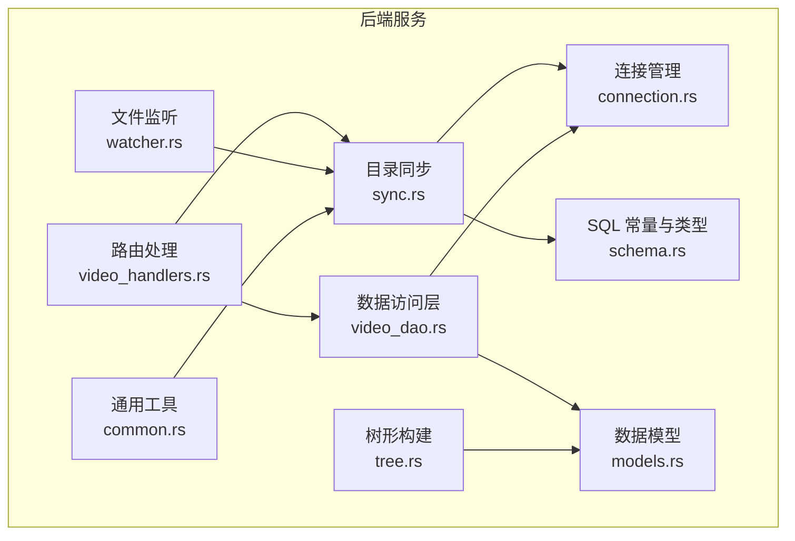
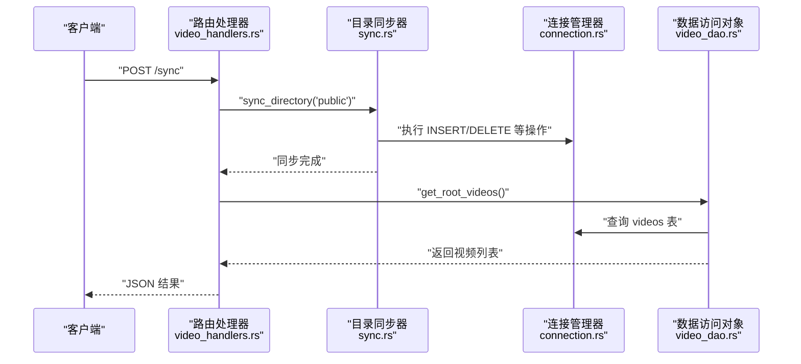
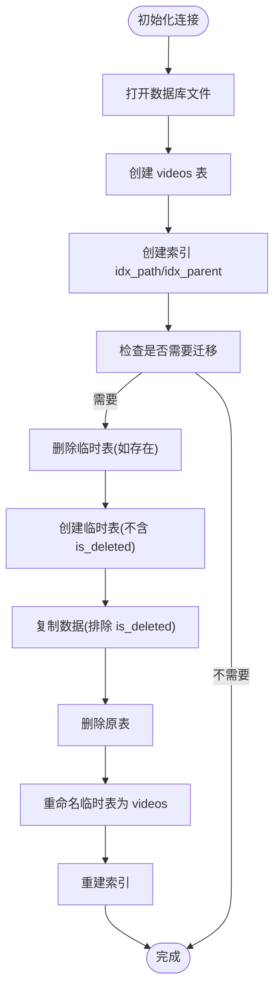
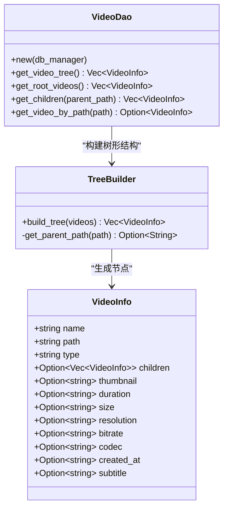
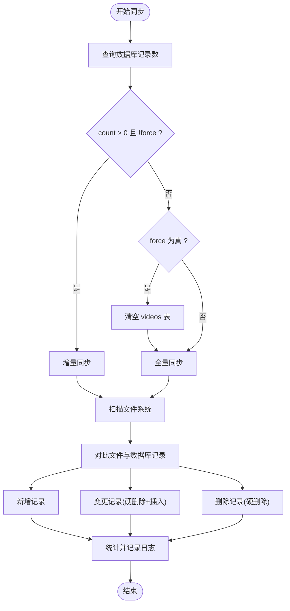
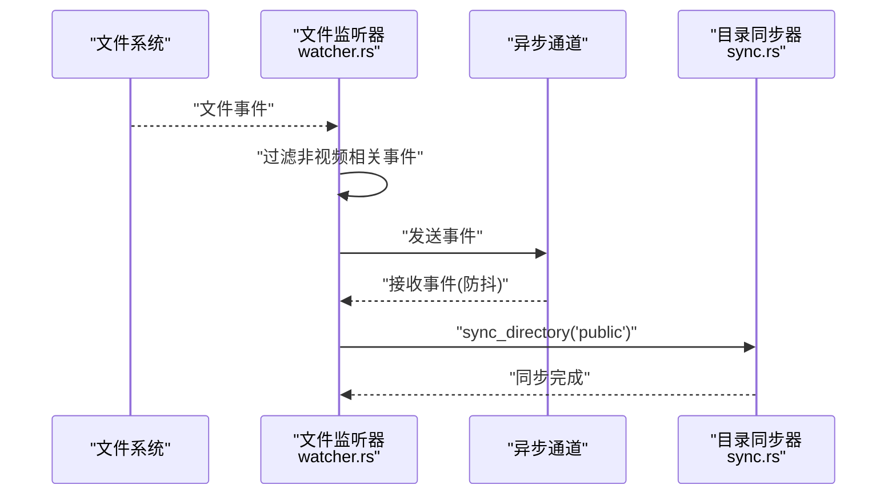
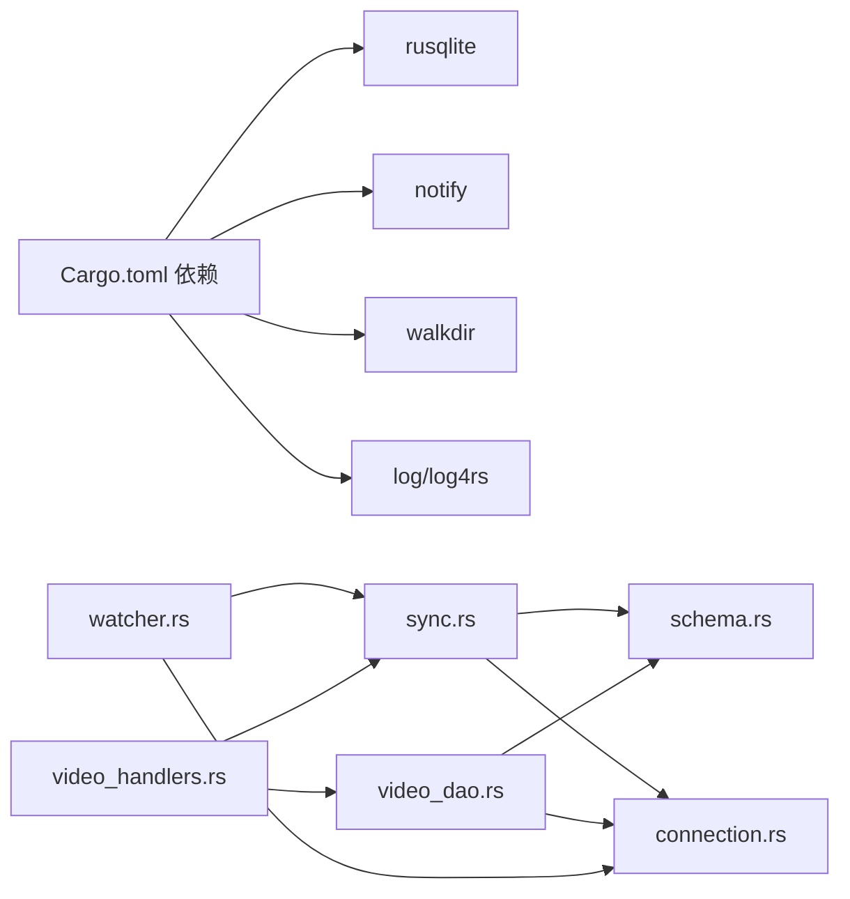

# 数据库问题

<cite>
**本文引用的文件**
- [connection.rs](file://app/server/src/services/db/connection.rs)
- [schema.rs](file://app/server/src/services/db/schema.rs)
- [video_dao.rs](file://app/server/src/services/db/video_dao.rs)
- [sync.rs](file://app/server/src/services/db/sync.rs)
- [tree.rs](file://app/server/src/services/db/tree.rs)
- [watcher.rs](file://app/server/src/services/db/watcher.rs)
- [models.rs](file://app/server/src/models.rs)
- [Cargo.toml](file://app/server/Cargo.toml)
- [.gitignore](file://app/server/.gitignore)
- [video_handlers.rs](file://app/server/src/routes/video_handlers.rs)
- [common.rs](file://app/server/src/utils/common.rs)
</cite>

## 目录
1. [简介](#简介)
2. [项目结构](#项目结构)
3. [核心组件](#核心组件)
4. [架构总览](#架构总览)
5. [详细组件分析](#详细组件分析)
6. [依赖分析](#依赖分析)
7. [性能考虑](#性能考虑)
8. [故障排除指南](#故障排除指南)
9. [结论](#结论)
10. [附录](#附录)

## 简介
本文件聚焦于数据库相关问题的系统化故障排除与运维实践，覆盖 SQLite 数据库连接失败、表结构不匹配、数据读写异常、锁冲突与事务回滚、数据一致性、性能优化（索引、查询计划、存储空间）、备份恢复与迁移升级、版本兼容性，以及监控与预警机制。文档基于仓库中的数据库模块进行深入分析，并结合实际代码路径给出可操作的诊断与修复步骤。

## 项目结构
数据库相关能力集中在后端服务的数据库模块中，围绕“连接管理—DAO—同步—监听—模型”形成闭环；前端 Web 层通过路由触发同步流程，最终落库并返回结果。

图表来源
- [connection.rs](file://app/server/src/services/db/connection.rs#L1-L122)
- [schema.rs](file://app/server/src/services/db/schema.rs#L1-L42)
- [video_dao.rs](file://app/server/src/services/db/video_dao.rs#L1-L146)
- [sync.rs](file://app/server/src/services/db/sync.rs#L1-L413)
- [tree.rs](file://app/server/src/services/db/tree.rs#L1-L78)
- [watcher.rs](file://app/server/src/services/db/watcher.rs#L1-L182)
- [models.rs](file://app/server/src/models.rs#L1-L32)
- [video_handlers.rs](file://app/server/src/routes/video_handlers.rs#L78-L103)
- [common.rs](file://app/server/src/utils/common.rs#L1-L146)

章节来源
- [connection.rs](file://app/server/src/services/db/connection.rs#L1-L122)
- [schema.rs](file://app/server/src/services/db/schema.rs#L1-L42)
- [video_dao.rs](file://app/server/src/services/db/video_dao.rs#L1-L146)
- [sync.rs](file://app/server/src/services/db/sync.rs#L1-L413)
- [tree.rs](file://app/server/src/services/db/tree.rs#L1-L78)
- [watcher.rs](file://app/server/src/services/db/watcher.rs#L1-L182)
- [models.rs](file://app/server/src/models.rs#L1-L32)
- [video_handlers.rs](file://app/server/src/routes/video_handlers.rs#L78-L103)
- [common.rs](file://app/server/src/utils/common.rs#L1-L146)

## 核心组件
- 连接管理器：负责打开数据库、创建表与索引、执行迁移。
- 数据访问对象：封装查询与树形构建逻辑。
- 目录同步器：扫描文件系统，双向同步至数据库。
- 文件监听器：基于事件驱动的自动同步。
- SQL 常量与类型：统一查询语句与类型枚举。
- 数据模型：前后端交互的数据结构。
- 路由处理：对外暴露同步接口，返回结果。

章节来源
- [connection.rs](file://app/server/src/services/db/connection.rs#L1-L122)
- [video_dao.rs](file://app/server/src/services/db/video_dao.rs#L1-L146)
- [sync.rs](file://app/server/src/services/db/sync.rs#L1-L413)
- [watcher.rs](file://app/server/src/services/db/watcher.rs#L1-L182)
- [schema.rs](file://app/server/src/services/db/schema.rs#L1-L42)
- [models.rs](file://app/server/src/models.rs#L1-L32)
- [video_handlers.rs](file://app/server/src/routes/video_handlers.rs#L78-L103)

## 架构总览
以下序列图展示“路由触发同步—数据库更新—查询返回”的典型流程，以及监听器的异步同步路径。

图表来源
- [video_handlers.rs](file://app/server/src/routes/video_handlers.rs#L78-L103)
- [sync.rs](file://app/server/src/services/db/sync.rs#L80-L172)
- [connection.rs](file://app/server/src/services/db/connection.rs#L1-L122)
- [video_dao.rs](file://app/server/src/services/db/video_dao.rs#L52-L79)

## 详细组件分析

### 组件一：连接管理与迁移
- 职责
  - 打开数据库文件并确保表结构存在。
  - 创建必要索引以提升查询性能。
  - 自动检测并执行迁移，兼容旧版本 schema。
- 关键点
  - 表结构包含唯一约束 path，避免重复记录。
  - 迁移流程采用临时表复制再重命名的方式，保证原子性。
  - 迁移后重建索引，确保查询效率。

图表来源
- [connection.rs](file://app/server/src/services/db/connection.rs#L1-L122)

章节来源
- [connection.rs](file://app/server/src/services/db/connection.rs#L1-L122)

### 组件二：数据访问对象与树形构建
- 职责
  - 提供根目录、父子关系查询与树形结构构建。
  - 对 m3u8 类型特殊处理：不返回子节点。
- 关键点
  - 查询语句集中于 schema 模块，便于维护。
  - 树形构建基于 parent_path 与映射关系，支持公共目录根节点识别。

图表来源
- [video_dao.rs](file://app/server/src/services/db/video_dao.rs#L1-L146)
- [tree.rs](file://app/server/src/services/db/tree.rs#L1-L78)
- [models.rs](file://app/server/src/models.rs#L1-L32)

章节来源
- [video_dao.rs](file://app/server/src/services/db/video_dao.rs#L1-L146)
- [tree.rs](file://app/server/src/services/db/tree.rs#L1-L78)
- [models.rs](file://app/server/src/models.rs#L1-L32)

### 组件三：目录同步与变更检测
- 职责
  - 双向同步：文件系统 → 数据库 + 数据库 → 文件系统。
  - 增量/全量同步：根据数据库记录数与 force 参数选择策略。
  - 变更检测：基于 name 与 created_at 字段判断是否需要更新。
  - 删除处理：数据库中缺失的记录进行硬删除。
- 关键点
  - 引入防抖（5 秒）降低频繁同步带来的压力。
  - 对 m3u8 目录特殊处理：合并为 mp4 并记录类型为 m3u8。
  - ts 文件若同目录存在 m3u8，则跳过处理。

图表来源
- [sync.rs](file://app/server/src/services/db/sync.rs#L44-L172)

章节来源
- [sync.rs](file://app/server/src/services/db/sync.rs#L1-L413)

### 组件四：文件监听与自动同步
- 职责
  - 基于 notify 监听文件系统事件，过滤非视频相关事件。
  - 异步通道接收事件，经防抖后触发同步。
  - 支持启动/停止监听与状态查询。
- 关键点
  - 仅对 mp4/m3u8/ts/vtt/srt/jpg/png/gif 等扩展名敏感。
  - 仅对内容变化事件响应，避免元数据抖动。

图表来源
- [watcher.rs](file://app/server/src/services/db/watcher.rs#L1-L182)
- [sync.rs](file://app/server/src/services/db/sync.rs#L80-L172)

章节来源
- [watcher.rs](file://app/server/src/services/db/watcher.rs#L1-L182)
- [sync.rs](file://app/server/src/services/db/sync.rs#L1-L413)

## 依赖分析
- 外部依赖
  - rusqlite：SQLite 驱动，支持特性 bundled。
  - notify：文件系统事件监听。
  - walkdir：目录扫描。
  - log/log4rs：日志记录。
- 内部模块耦合
  - sync 依赖 schema 的查询常量与类型常量。
  - video_dao 依赖 connection 与 schema。
  - watcher 依赖 sync 与 connection。
  - routes 依赖 sync 与 video_dao。

图表来源
- [Cargo.toml](file://app/server/Cargo.toml#L1-L23)
- [sync.rs](file://app/server/src/services/db/sync.rs#L1-L413)
- [schema.rs](file://app/server/src/services/db/schema.rs#L1-L42)
- [connection.rs](file://app/server/src/services/db/connection.rs#L1-L122)
- [video_dao.rs](file://app/server/src/services/db/video_dao.rs#L1-L146)
- [watcher.rs](file://app/server/src/services/db/watcher.rs#L1-L182)
- [video_handlers.rs](file://app/server/src/routes/video_handlers.rs#L78-L103)

章节来源
- [Cargo.toml](file://app/server/Cargo.toml#L1-L23)

## 性能考虑
- 索引优化
  - 已创建 path 与 parent_path 索引，有助于按路径查询与父子关系检索。
  - 建议：对高频过滤字段（如 type、created_at）评估是否需要额外索引；注意写入成本与存储占用。
- 查询计划分析
  - 使用 EXPLAIN QUERY PLAN（SQLite 原生命令）分析慢查询路径；结合日志中的耗时统计定位瓶颈。
- 存储空间管理
  - 定期清理无用缩略图与大文件；利用工具函数格式化大小，辅助容量规划。
- 同步策略
  - 增量同步优先，减少全量扫描；防抖机制降低频繁 I/O。
  - m3u8 合并为 mp4 的处理避免重复存储，节省空间。

章节来源
- [connection.rs](file://app/server/src/services/db/connection.rs#L1-L122)
- [sync.rs](file://app/server/src/services/db/sync.rs#L44-L172)
- [common.rs](file://app/server/src/utils/common.rs#L1-L146)

## 故障排除指南

### 一、数据库连接失败
- 现象
  - 应用启动时报错，无法打开数据库文件或创建表。
- 诊断步骤
  - 检查数据库文件路径是否存在与权限是否正确。
  - 查看 .gitignore 中是否包含数据库文件被忽略（仓库中数据库文件被忽略，需确认部署环境）。
  - 确认 SQLite 版本与 rusqlite 版本兼容。
- 解决方案
  - 在部署环境中显式创建数据库文件并赋予写权限。
  - 若为首次运行，确保连接管理器成功创建表与索引。
  - 如遇权限问题，调整文件系统权限或切换到有权限的目录。

章节来源
- [.gitignore](file://app/server/.gitignore#L1-L5)
- [connection.rs](file://app/server/src/services/db/connection.rs#L1-L122)
- [Cargo.toml](file://app/server/Cargo.toml#L1-L23)

### 二、表结构不匹配
- 现象
  - 启动时报错提示列不存在或类型不匹配。
- 诊断步骤
  - 运行迁移流程，检查是否检测到旧版 is_deleted 列并完成迁移。
  - 确认 schema 中的查询常量与实际表结构一致。
- 解决方案
  - 执行迁移流程，系统会自动创建临时表、复制数据、重命名并重建索引。
  - 若手动修改过表结构，需同步更新 schema 常量与 DAO 查询。

章节来源
- [connection.rs](file://app/server/src/services/db/connection.rs#L50-L121)
- [schema.rs](file://app/server/src/services/db/schema.rs#L1-L42)

### 三、数据读写异常
- 现象
  - 查询结果为空或不一致；插入/删除报错。
- 诊断步骤
  - 检查 path 是否唯一，避免重复插入。
  - 核对插入参数顺序与类型，确保与 schema 常量一致。
  - 关注 m3u8 类型的特殊处理：不会返回子节点。
- 解决方案
  - 使用 DAO 的统一查询接口，避免手写 SQL。
  - 对 m3u8 目录，按目录级聚合显示，不展开子节点。
  - 若出现唯一约束冲突，先删除旧记录再插入新记录。

章节来源
- [schema.rs](file://app/server/src/services/db/schema.rs#L16-L41)
- [video_dao.rs](file://app/server/src/services/db/video_dao.rs#L80-L146)
- [sync.rs](file://app/server/src/services/db/sync.rs#L378-L412)

### 四、数据库锁冲突与事务回滚
- 现象
  - 同步过程中卡顿或报锁冲突；并发写入导致死锁。
- 诊断步骤
  - 观察日志中各阶段耗时，定位锁竞争热点。
  - 检查是否存在长时间持有连接的查询或未提交事务。
- 解决方案
  - 将批量写入拆分为小事务，减少锁持有时间。
  - 使用 WAL 模式（SQLite 原生支持），提升并发写入能力。
  - 控制同步频率与防抖间隔，避免高并发写入。

章节来源
- [sync.rs](file://app/server/src/services/db/sync.rs#L44-L172)

### 五、数据一致性
- 现象
  - 文件系统与数据库不一致；删除文件后数据库未更新。
- 诊断步骤
  - 增量同步时对比数据库记录与文件系统映射，确认删除分支是否执行。
  - 检查 ts 与 m3u8 的组合规则，避免重复或遗漏。
- 解决方案
  - 使用双向同步策略，确保数据库与文件系统双向一致。
  - 对 m3u8 目录，按目录聚合处理，不单独存储 ts 子项。

章节来源
- [sync.rs](file://app/server/src/services/db/sync.rs#L174-L263)
- [sync.rs](file://app/server/src/services/db/sync.rs#L298-L376)

### 六、性能问题
- 现象
  - 查询缓慢、同步耗时过长。
- 诊断步骤
  - 分析日志中的各阶段耗时（扫描、对比、删除、插入）。
  - 使用 EXPLAIN QUERY PLAN 分析慢查询。
- 解决方案
  - 优化索引策略，按实际查询模式调整。
  - 减少不必要的文件扫描，仅处理视频相关扩展名。
  - 合理设置防抖间隔，避免频繁同步。

章节来源
- [sync.rs](file://app/server/src/services/db/sync.rs#L44-L172)

### 七、备份与恢复
- 建议
  - 定期复制数据库文件进行备份；在部署前校验备份可用性。
  - 迁移前先备份，迁移完成后验证数据完整性。
- 操作要点
  - 备份时应确保应用处于低负载或离线状态，避免数据不一致。
  - 恢复时先停机，替换数据库文件，再启动服务并执行一次全量同步。

章节来源
- [connection.rs](file://app/server/src/services/db/connection.rs#L1-L122)

### 八、迁移与版本兼容
- 建议
  - 在每次 schema 变更时编写迁移脚本，兼容旧版本字段。
  - 发布前在测试环境验证迁移流程与数据一致性。
- 操作要点
  - 使用临时表复制数据，避免直接 ALTER 导致锁长时间持有。
  - 迁移完成后重建索引，确保查询性能。

章节来源
- [connection.rs](file://app/server/src/services/db/connection.rs#L50-L121)

### 九、监控与预警
- 建议
  - 记录同步耗时、新增/变更/删除/跳过的统计信息，形成指标。
  - 对异常错误（如扫描失败、同步失败）进行告警。
  - 监控数据库文件大小与磁盘空间，设置阈值预警。
- 实践
  - 日志中已包含关键阶段耗时与统计信息，可据此建立监控面板。
  - 结合文件监听器的状态与事件频率，评估系统健康度。

章节来源
- [sync.rs](file://app/server/src/services/db/sync.rs#L44-L172)
- [watcher.rs](file://app/server/src/services/db/watcher.rs#L1-L182)

## 结论
本项目的数据库模块通过连接管理、DAO、同步与监听实现了稳定的数据采集与查询能力。针对常见问题，建议优先检查连接与表结构、执行迁移、优化索引与同步策略，并建立完善的监控与备份机制。遵循本文提供的诊断与修复步骤，可有效降低数据库相关故障率并提升系统稳定性。

## 附录
- 常用排查清单
  - 数据库文件路径与权限
  - 表结构与索引是否完整
  - 迁移是否成功执行
  - 同步日志与耗时统计
  - 文件监听状态与事件过滤
  - 备份与恢复流程演练