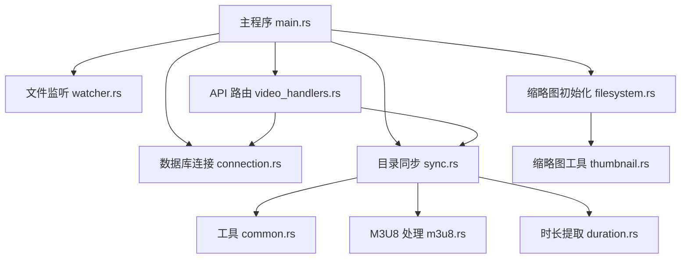
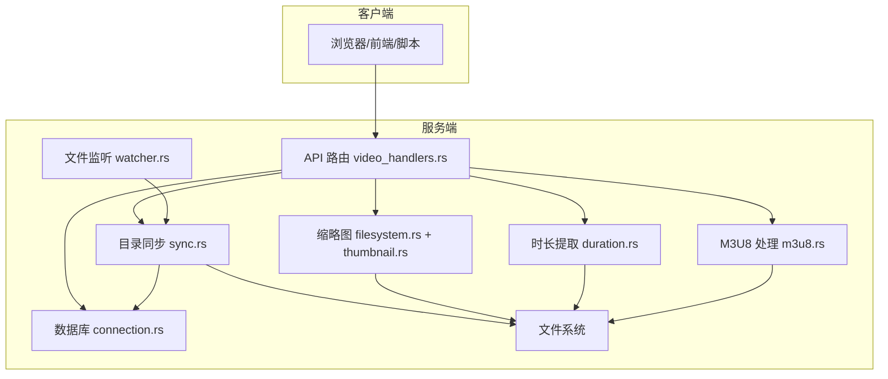
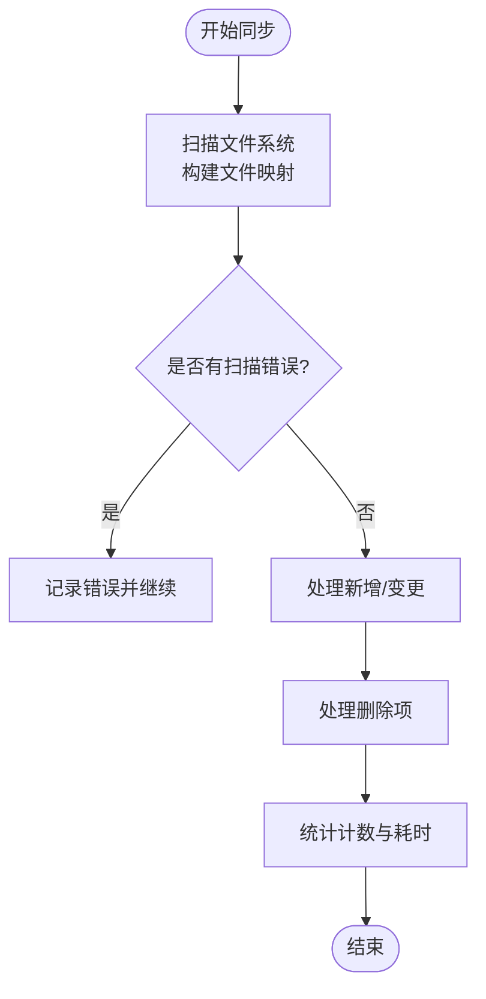
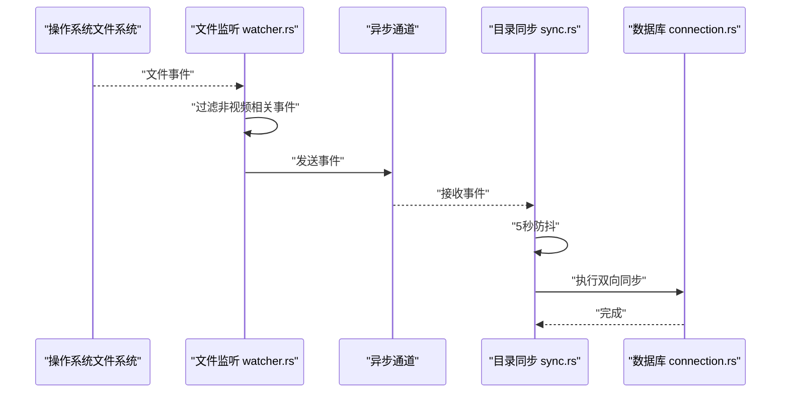
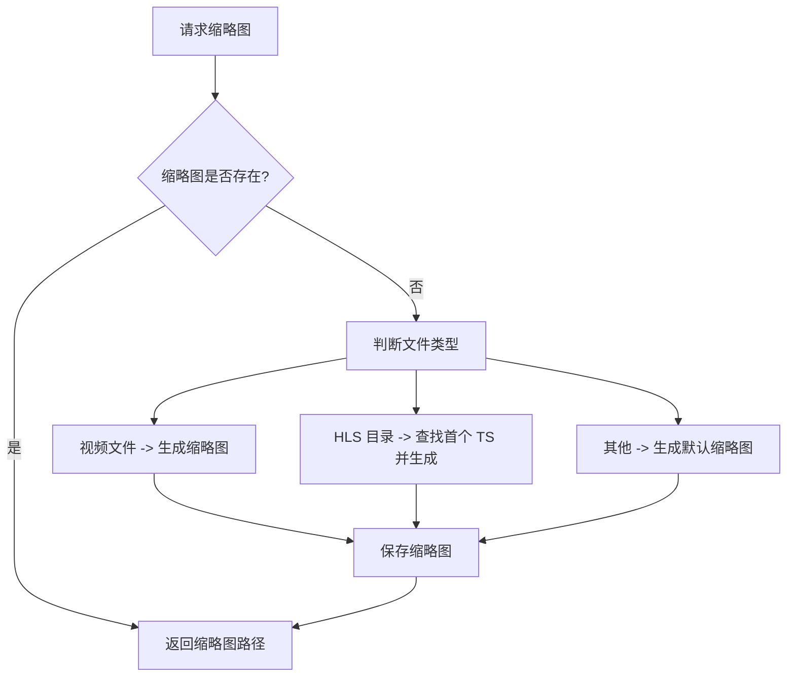
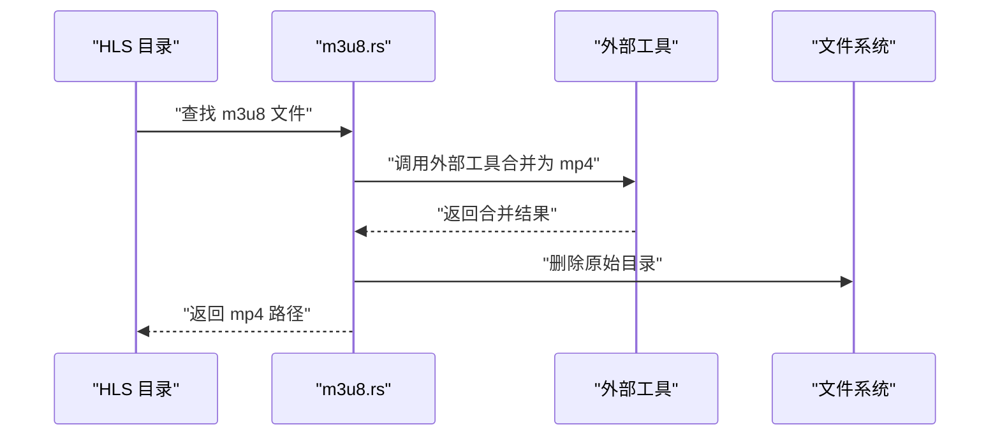
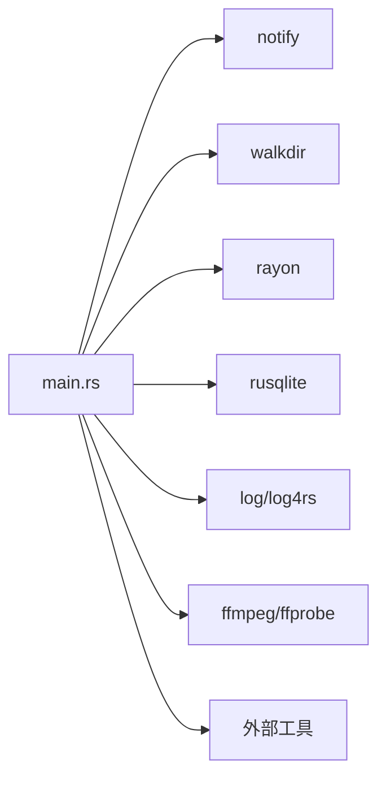

# 文件系统问题

<cite>
**本文引用的文件**
- [app/server/src/main.rs](file://app/server/src/main.rs)
- [app/server/src/services/db/connection.rs](file://app/server/src/services/db/connection.rs)
- [app/server/src/services/db/sync.rs](file://app/server/src/services/db/sync.rs)
- [app/server/src/services/db/watcher.rs](file://app/server/src/services/db/watcher.rs)
- [app/server/src/services/db/tree.rs](file://app/server/src/services/db/tree.rs)
- [app/server/src/services/filesystem.rs](file://app/server/src/services/filesystem.rs)
- [app/server/src/utils/thumbnail.rs](file://app/server/src/utils/thumbnail.rs)
- [app/server/src/utils/common.rs](file://app/server/src/utils/common.rs)
- [app/server/src/utils/m3u8.rs](file://app/server/src/utils/m3u8.rs)
- [app/server/src/utils/duration.rs](file://app/server/src/utils/duration.rs)
- [app/server/src/routers/video_handlers.rs](file://app/server/src/routers/video_handlers.rs)
- [app/server/Cargo.toml](file://app/server/Cargo.toml)
- [README.md](file://README.md)
</cite>

## 目录
1. [简介](#简介)
2. [项目结构](#项目结构)
3. [核心组件](#核心组件)
4. [架构总览](#架构总览)
5. [详细组件分析](#详细组件分析)
6. [依赖分析](#依赖分析)
7. [性能考量](#性能考量)
8. [故障排除指南](#故障排除指南)
9. [结论](#结论)
10. [附录](#附录)

## 简介
本指南聚焦于视频文件系统相关的常见问题与排障策略，覆盖视频扫描失败、权限不足、路径解析错误、文件监控失效、缩略图生成失败、文件损坏检测、大文件处理、磁盘空间监控、文件系统碎片整理、权限配置最佳实践、性能优化与故障预防等运维要点。结合代码库中的目录扫描、数据库同步、文件监听、缩略图与时长提取、M3U8 合并等实现，给出可操作的诊断与修复步骤。

## 项目结构
该服务采用 Rust + Axum 异步架构，核心围绕“文件系统扫描 → 数据库存储 → API 查询/静态服务 → 文件监听自动同步”的闭环展开。关键目录与职责如下：
- app/server/src/main.rs：应用入口，初始化日志、数据库、缩略图目录、文件监听器；注册 API 与静态文件服务。
- app/server/src/services/db：数据库连接与表结构、目录同步、文件监听器、树形构建。
- app/server/src/services/filesystem.rs：缩略图初始化与生成（依赖外部工具）。
- app/server/src/utils：通用工具（大小格式化、创建时间、视频/容器判断、M3U8 处理、时长提取、缩略图生成辅助）。
- app/server/src/routers/video_handlers.rs：API 路由处理器（列出视频、获取详情、手动同步）。
- app/server/Cargo.toml：依赖清单（包含文件监听、SQL、并行、遍历等）。

图表来源
- [app/server/src/main.rs](file://app/server/src/main.rs#L1-L111)
- [app/server/src/services/db/connection.rs](file://app/server/src/services/db/connection.rs#L1-L122)
- [app/server/src/services/db/sync.rs](file://app/server/src/services/db/sync.rs#L1-L413)
- [app/server/src/services/db/watcher.rs](file://app/server/src/services/db/watcher.rs#L1-L182)
- [app/server/src/services/filesystem.rs](file://app/server/src/services/filesystem.rs#L1-L121)
- [app/server/src/utils/common.rs](file://app/server/src/utils/common.rs#L1-L146)
- [app/server/src/utils/m3u8.rs](file://app/server/src/utils/m3u8.rs#L1-L148)
- [app/server/src/utils/duration.rs](file://app/server/src/utils/duration.rs#L1-L66)
- [app/server/src/utils/thumbnail.rs](file://app/server/src/utils/thumbnail.rs#L1-L99)
- [app/server/src/routers/video_handlers.rs](file://app/server/src/routers/video_handlers.rs#L1-L104)

章节来源
- [app/server/src/main.rs](file://app/server/src/main.rs#L1-L111)
- [README.md](file://README.md#L253-L317)

## 核心组件
- 目录同步器：负责扫描 public 目录，构建文件映射，与数据库进行双向同步，处理新增、变更、删除与错误记录。
- 文件监听器：基于文件系统事件触发，对 public 目录进行递归监听，过滤非视频相关事件，执行定时去抖后同步。
- 缩略图系统：初始化缩略图目录，按需生成视频缩略图（依赖外部工具），对 m3u8/HLS 场景生成默认缩略图。
- 元数据提取：文件大小格式化、创建时间提取、视频时长（ffprobe）、M3U8 时长解析。
- API 层：提供视频列表、详情查询、手动同步、监听器启停与状态查询；静态文件服务公开 public 与 thumbnails。

章节来源
- [app/server/src/services/db/sync.rs](file://app/server/src/services/db/sync.rs#L1-L413)
- [app/server/src/services/db/watcher.rs](file://app/server/src/services/db/watcher.rs#L1-L182)
- [app/server/src/services/filesystem.rs](file://app/server/src/services/filesystem.rs#L1-L121)
- [app/server/src/utils/thumbnail.rs](file://app/server/src/utils/thumbnail.rs#L1-L99)
- [app/server/src/utils/duration.rs](file://app/server/src/utils/duration.rs#L1-L66)
- [app/server/src/routers/video_handlers.rs](file://app/server/src/routers/video_handlers.rs#L1-L104)

## 架构总览
系统通过 API 与静态服务对外提供能力，内部以数据库为中心组织视频元数据，文件系统扫描与监听作为数据源，缩略图与时长等增强信息在需要时生成。

图表来源
- [app/server/src/routers/video_handlers.rs](file://app/server/src/routers/video_handlers.rs#L1-L104)
- [app/server/src/services/db/sync.rs](file://app/server/src/services/db/sync.rs#L1-L413)
- [app/server/src/services/db/watcher.rs](file://app/server/src/services/db/watcher.rs#L1-L182)
- [app/server/src/services/db/connection.rs](file://app/server/src/services/db/connection.rs#L1-L122)
- [app/server/src/services/filesystem.rs](file://app/server/src/services/filesystem.rs#L1-L121)
- [app/server/src/utils/thumbnail.rs](file://app/server/src/utils/thumbnail.rs#L1-L99)
- [app/server/src/utils/duration.rs](file://app/server/src/utils/duration.rs#L1-L66)
- [app/server/src/utils/m3u8.rs](file://app/server/src/utils/m3u8.rs#L1-L148)

## 详细组件分析

### 目录扫描与数据库同步
- 扫描策略：使用递归遍历，过滤非视频相关文件与目录，对包含 m3u8 的目录特殊处理，生成目录型记录并尝试合并为 mp4。
- 双向同步：对比数据库记录与文件系统，处理新增、变更（硬删后重建）、删除（硬删），并记录扫描错误。
- 性能特征：扫描阶段记录错误列表，处理阶段按文件粒度进行插入/删除，适合中等规模目录；错误日志有助于定位问题。

图表来源
- [app/server/src/services/db/sync.rs](file://app/server/src/services/db/sync.rs#L198-L263)
- [app/server/src/services/db/sync.rs](file://app/server/src/services/db/sync.rs#L265-L412)

章节来源
- [app/server/src/services/db/sync.rs](file://app/server/src/services/db/sync.rs#L1-L413)
- [app/server/src/utils/common.rs](file://app/server/src/utils/common.rs#L67-L94)

### 文件监听与自动同步
- 监听范围：递归监听 public 目录，过滤非视频相关事件，仅对内容变化触发。
- 去抖策略：接收事件后进行 5 秒防抖，避免频繁同步。
- 同步执行：每次触发调用目录同步逻辑，最终写入数据库。

图表来源
- [app/server/src/services/db/watcher.rs](file://app/server/src/services/db/watcher.rs#L29-L123)
- [app/server/src/services/db/sync.rs](file://app/server/src/services/db/sync.rs#L81-L172)

章节来源
- [app/server/src/services/db/watcher.rs](file://app/server/src/services/db/watcher.rs#L1-L182)

### 缩略图生成与回退策略
- 初始化：首次启动时为无缩略图的视频生成缩略图，使用外部工具生成 JPG。
- 按需生成：访问时若缩略图缺失，按文件类型生成对应缩略图，m3u8 目录优先尝试从 TS 片段生成，否则生成默认图标。
- 回退机制：外部工具失败时生成默认缩略图，保证 UI 可用性。

图表来源
- [app/server/src/utils/thumbnail.rs](file://app/server/src/utils/thumbnail.rs#L1-L99)
- [app/server/src/services/filesystem.rs](file://app/server/src/services/filesystem.rs#L49-L121)

章节来源
- [app/server/src/utils/thumbnail.rs](file://app/server/src/utils/thumbnail.rs#L1-L99)
- [app/server/src/services/filesystem.rs](file://app/server/src/services/filesystem.rs#L1-L121)

### M3U8 合并与目录清理
- 合并策略：在包含 m3u8 的目录中生成同名 mp4，复制流并修复音频格式，随后删除原始目录。
- 目录识别：对包含 m3u8 的目录视为 HLS 目录，生成目录型记录并记录时长。

图表来源
- [app/server/src/utils/m3u8.rs](file://app/server/src/utils/m3u8.rs#L43-L128)

章节来源
- [app/server/src/utils/m3u8.rs](file://app/server/src/utils/m3u8.rs#L1-L148)
- [app/server/src/services/db/sync.rs](file://app/server/src/services/db/sync.rs#L265-L296)

### API 与静态服务
- API：提供视频列表、详情、手动同步、监听器启停与状态查询。
- 静态服务：公开 public 与 thumbnails 目录，便于直接访问媒体与缩略图。

章节来源
- [app/server/src/main.rs](file://app/server/src/main.rs#L56-L109)
- [app/server/src/routers/video_handlers.rs](file://app/server/src/routers/video_handlers.rs#L1-L104)

## 依赖分析
- 文件监听：notify 库提供跨平台文件事件监听。
- 遍历与并行：walkdir 递归遍历，rayon 并行处理缩略图生成。
- SQL：rusqlite 操作本地数据库，建立索引提升查询性能。
- 外部工具：ffmpeg/ffprobe 用于缩略图与时长提取；M3U8 合并依赖外部工具。
- 日志：log 与 log4rs 提供日志输出。

图表来源
- [app/server/Cargo.toml](file://app/server/Cargo.toml#L1-L23)
- [app/server/src/main.rs](file://app/server/src/main.rs#L1-L111)

章节来源
- [app/server/Cargo.toml](file://app/server/Cargo.toml#L1-L23)

## 性能考量
- 目录扫描：对大规模目录建议限制扫描深度或分批处理；利用数据库索引（path、parent_path）减少查询成本。
- 并行缩略图：合理设置 rayon 并行度，避免 CPU/IO 竞争；对磁盘吞吐敏感场景降低并发。
- 监听去抖：5 秒防抖可显著减少同步频率，建议根据业务需求调整。
- 外部工具：ffmpeg/ffprobe 为 CPU 密集型，建议在专用节点或容器中限流。
- 静态服务：生产环境建议配合反向代理/CDN 缓存静态资源。

[本节为通用性能建议，不直接分析具体文件]

## 故障排除指南

### 一、视频文件扫描失败
- 现象
  - API 返回空列表或缺少部分文件。
  - 手动同步接口报错或无效果。
- 诊断步骤
  - 检查 public 目录是否存在与可读权限。
  - 查看扫描错误日志（扫描阶段会记录错误列表）。
  - 确认文件类型是否被识别（仅 mp4/m3u8/ts/vtt/srt/jpg/png/gif 等）。
  - 检查 m3u8 目录是否包含 index.m3u8 且片段存在。
- 处理策略
  - 修正目录权限与符号链接指向。
  - 对于 ts 文件，确认同目录存在 m3u8；如存在应跳过 ts。
  - 使用手动同步接口触发全量同步，观察日志。
  - 若目录过大，分批移动文件并触发同步。

章节来源
- [app/server/src/services/db/sync.rs](file://app/server/src/services/db/sync.rs#L198-L263)
- [app/server/src/utils/common.rs](file://app/server/src/utils/common.rs#L67-L94)
- [app/server/src/utils/m3u8.rs](file://app/server/src/utils/m3u8.rs#L25-L41)

### 二、权限不足
- 现象
  - 无法读取 public/thumbnails 目录或文件。
  - 缩略图生成失败、M3U8 合并失败。
- 诊断步骤
  - 确认运行用户对 public、thumbnails、videos.db 具备读写权限。
  - 检查符号链接目标是否存在且可访问。
  - 确认外部工具（ffmpeg/ffprobe）在 PATH 中且可执行。
- 处理策略
  - 修改目录属组与权限，确保服务账户可读写。
  - 使用绝对路径避免符号链接解析问题。
  - 在容器/沙箱环境中挂载卷并赋予相应权限。

章节来源
- [app/server/src/main.rs](file://app/server/src/main.rs#L31-L47)
- [app/server/src/services/filesystem.rs](file://app/server/src/services/filesystem.rs#L1-L47)
- [app/server/src/utils/m3u8.rs](file://app/server/src/utils/m3u8.rs#L88-L111)

### 三、路径解析错误
- 现象
  - API 返回未找到或路径不匹配。
  - 访问 /public/xxx 报 404。
- 诊断步骤
  - 确认请求路径去除前缀斜杠后拼接到 public 成功。
  - 检查数据库中 path 是否与实际物理路径一致。
  - 确认静态服务 ServeDir 挂载路径正确。
- 处理策略
  - 规范路径输入，避免多余斜杠或大小写差异。
  - 如使用相对路径，确保工作目录正确。
  - 重启服务以刷新静态服务映射。

章节来源
- [app/server/src/routers/video_handlers.rs](file://app/server/src/routers/video_handlers.rs#L30-L70)
- [app/server/src/main.rs](file://app/server/src/main.rs#L82-L90)

### 四、文件监控失效
- 现象
  - 新增/修改文件后数据库未更新。
  - 监听器状态异常或无法启动。
- 诊断步骤
  - 检查监听器是否已启动且处于 watching 状态。
  - 确认监控路径存在且为目录。
  - 查看事件过滤逻辑（仅内容变化触发）。
- 处理策略
  - 先停止再启动监听器，确保无重复实例。
  - 调整防抖间隔或增加日志级别排查事件丢失。
  - 对跨平台兼容性问题，检查底层文件系统事件支持。

章节来源
- [app/server/src/services/db/watcher.rs](file://app/server/src/services/db/watcher.rs#L29-L123)
- [app/server/src/services/db/watcher.rs](file://app/server/src/services/db/watcher.rs#L147-L182)

### 五、缩略图生成失败
- 现象
  - 缩略图缺失或显示默认图标。
  - 访问缩略图路径返回空。
- 诊断步骤
  - 检查缩略图目录是否存在且可写。
  - 确认外部工具可用且有足够磁盘空间。
  - 对 m3u8 目录，确认首个 ts 片段存在。
- 处理策略
  - 手动触发缩略图初始化或按需生成。
  - 降低并发或等待 IO 空闲后再生成。
  - 外部工具失败时回退至默认缩略图。

章节来源
- [app/server/src/services/filesystem.rs](file://app/server/src/services/filesystem.rs#L1-L121)
- [app/server/src/utils/thumbnail.rs](file://app/server/src/utils/thumbnail.rs#L1-L99)

### 六、文件损坏检测
- 现象
  - 视频无法播放或时长解析失败。
  - M3U8 合并失败或片段缺失。
- 诊断步骤
  - 使用 ffprobe 获取时长与格式信息，确认视频有效。
  - 检查 m3u8 文件中每段时长与片段文件是否存在。
- 处理策略
  - 重新下载或修复源文件。
  - 对损坏片段替换或补齐，必要时重新生成索引。

章节来源
- [app/server/src/utils/duration.rs](file://app/server/src/utils/duration.rs#L1-L66)
- [app/server/src/utils/m3u8.rs](file://app/server/src/utils/m3u8.rs#L129-L148)

### 七、大文件处理
- 现象
  - 扫描缓慢、内存占用高、外部工具卡顿。
- 诊断步骤
  - 观察扫描耗时与并发度。
  - 检查磁盘 IO 与 CPU 使用率。
- 处理策略
  - 限制并行度，分批扫描。
  - 使用 SSD 或更高带宽存储。
  - 对超大文件启用懒加载与分段访问。

章节来源
- [app/server/src/services/filesystem.rs](file://app/server/src/services/filesystem.rs#L1-L47)
- [app/server/src/utils/common.rs](file://app/server/src/utils/common.rs#L1-L26)

### 八、磁盘空间监控
- 建议
  - 定期检查 public/thumbnails/videos.db 所在分区剩余空间。
  - 缩略图目录随媒体增长而扩大，建议预留充足空间。
  - 对历史媒体定期归档，释放空间。

章节来源
- [app/server/src/services/filesystem.rs](file://app/server/src/services/filesystem.rs#L1-L47)

### 九、文件系统碎片整理
- 建议
  - 定期对媒体所在卷进行碎片整理（Windows）或文件系统优化（Linux）。
  - 将媒体与数据库文件分离到不同卷，降低碎片影响。

章节来源
- [README.md](file://README.md#L604-L622)

### 十、文件系统权限配置最佳实践
- 读写权限
  - 服务账户对 public、thumbnails、videos.db 具备读写权限。
  - 避免使用 root 权限运行，采用最小权限原则。
- 执行权限
  - 确保外部工具（ffmpeg/ffprobe）具备可执行权限。
- 符号链接处理
  - 避免使用符号链接；如必须使用，确保目标存在且服务账户可访问。
- 目录结构
  - public 为只读静态资源目录，thumbnails 为生成目录，避免手动修改。

章节来源
- [app/server/src/main.rs](file://app/server/src/main.rs#L31-L47)
- [app/server/src/services/filesystem.rs](file://app/server/src/services/filesystem.rs#L1-L47)
- [README.md](file://README.md#L298-L317)

### 十一、性能优化与故障预防
- 性能优化
  - 使用 release 构建与运行。
  - 合理设置 rayon 并行度，避免过度竞争。
  - 对热点目录启用缓存（如目录扫描结果），减少重复 IO。
- 故障预防
  - 定期备份 videos.db。
  - 监控日志与错误计数，及时发现异常。
  - 对大规模媒体采用分层存储与 CDN 加速。

章节来源
- [README.md](file://README.md#L604-L622)
- [app/server/Cargo.toml](file://app/server/Cargo.toml#L1-L23)

## 结论
通过系统化的扫描、监听、缩略图与元数据提取机制，本项目实现了对视频文件系统的自动化管理。针对常见问题，建议从权限、路径、外部工具、监控与性能五个维度入手，结合日志与手动同步手段快速定位并恢复服务。对于大规模部署，应配套磁盘空间与文件系统优化策略，确保长期稳定运行。

## 附录
- 常用 API
  - GET /api/videos：列出第一层视频与目录
  - GET /api/videos/{path}：获取指定路径详情（含子文件）
  - GET /api/sync：手动同步数据库
  - GET /api/watcher/start：启动文件监听
  - GET /api/watcher/stop：停止文件监听
  - GET /api/watcher/status：查看监听状态
- 静态资源
  - /public/{file}：访问媒体文件
  - /thumbnails/{file}：访问缩略图

章节来源
- [app/server/src/main.rs](file://app/server/src/main.rs#L72-L109)
- [README.md](file://README.md#L130-L165)