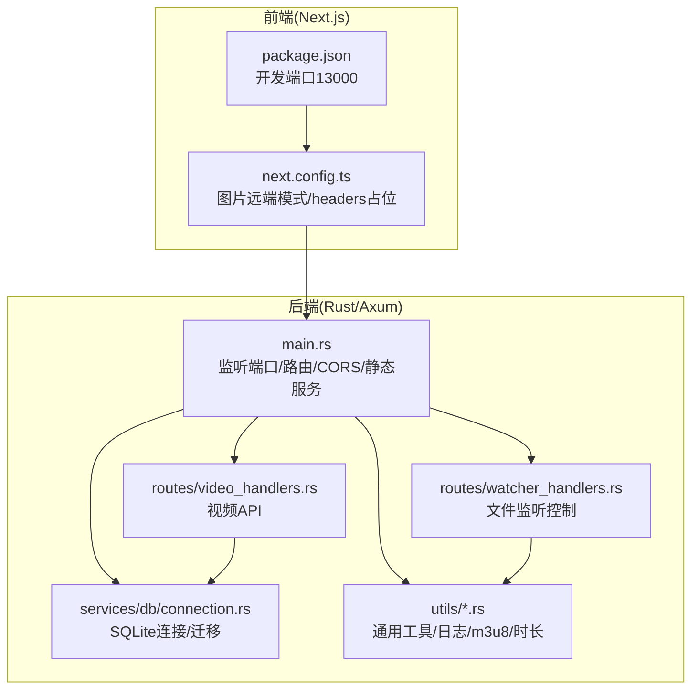
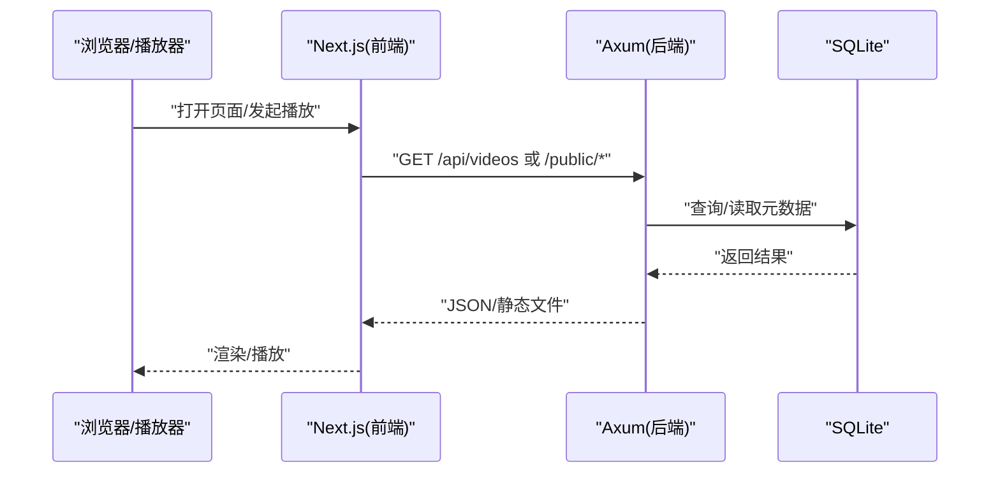
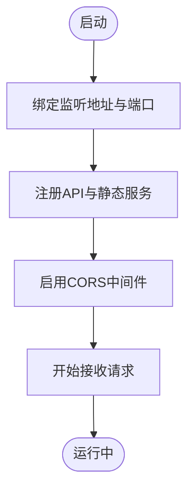
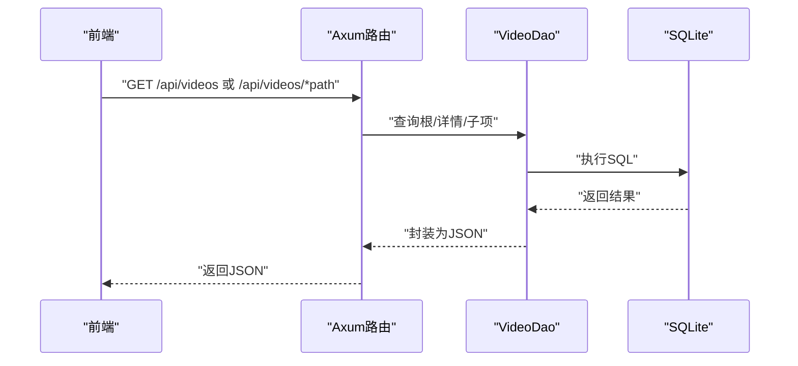
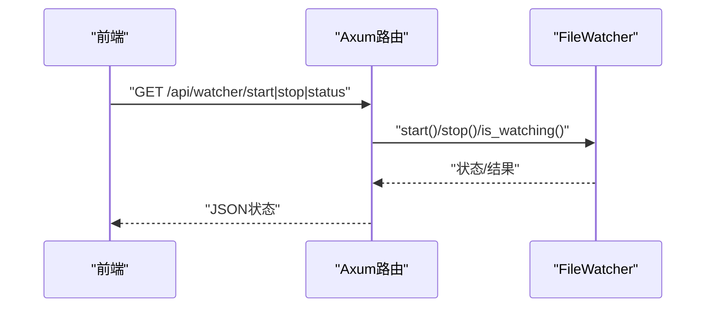
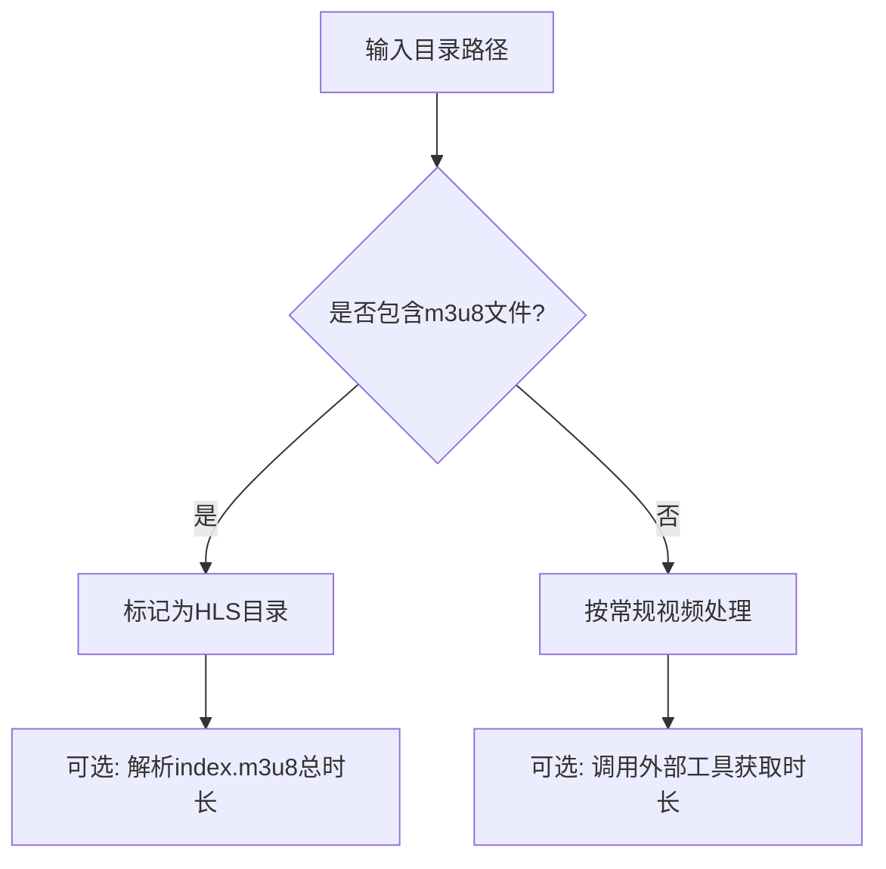
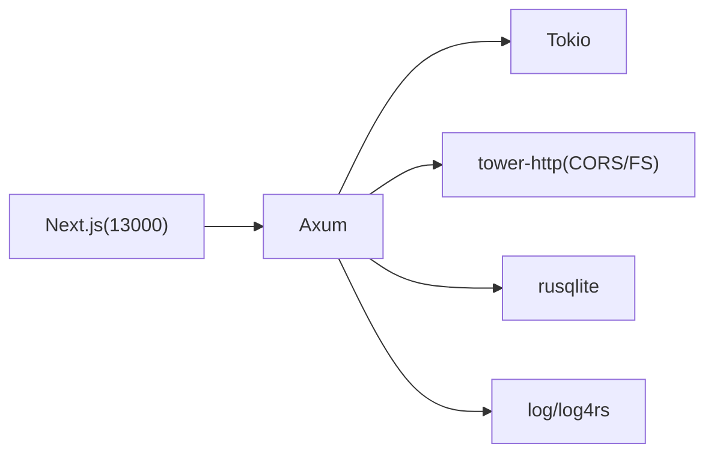

# 网络连接问题

<cite>
**本文引用的文件**
- [app/server/src/main.rs](file://app/server/src/main.rs)
- [app/server/Cargo.toml](file://app/server/Cargo.toml)
- [app/server/src/routes/video_handlers.rs](file://app/server/src/routes/video_handlers.rs)
- [app/server/src/routes/watcher_handlers.rs](file://app/server/src/routes/watcher_handlers.rs)
- [app/server/src/services/db/connection.rs](file://app/server/src/services/db/connection.rs)
- [app/server/src/utils/common.rs](file://app/server/src/utils/common.rs)
- [app/server/src/utils/logger.rs](file://app/server/src/utils/logger.rs)
- [app/server/src/utils/m3u8.rs](file://app/server/src/utils/m3u8.rs)
- [app/server/src/utils/duration.rs](file://app/server/src/utils/duration.rs)
- [app/web/next.config.ts](file://app/web/next.config.ts)
- [app/web/package.json](file://app/web/package.json)
- [README.md](file://README.md)
</cite>

## 目录
1. [简介](#简介)
2. [项目结构](#项目结构)
3. [核心组件](#核心组件)
4. [架构总览](#架构总览)
5. [详细组件分析](#详细组件分析)
6. [依赖关系分析](#依赖关系分析)
7. [性能考量](#性能考量)
8. [故障排除指南](#故障排除指南)
9. [结论](#结论)
10. [附录](#附录)

## 简介
本指南聚焦“网络连接问题”的诊断与解决，结合本仓库中的服务器端、前端与工具链实现，系统讲解如下主题：
- 服务器端口监听与绑定、静态文件服务与CORS跨域配置
- 常见网络错误类型（连接超时、连接拒绝、DNS解析失败等）的定位方法
- 网络连通性测试（curl、浏览器开发者工具、静态资源直连）
- 代理、负载均衡、SSL证书等高级网络配置注意事项
- 不同网络环境下的部署与排障策略

## 项目结构
该仓库包含一个基于 Rust/Axum 的后端服务与一个 Next.js 前端应用，二者通过本地回环或局域网互通。后端负责视频资源的 API 查询、静态文件服务与文件监听；前端负责播放 HLS/MP4、展示媒体库。

图表来源
- [app/server/src/main.rs](file://app/server/src/main.rs#L62-L110)
- [app/server/src/routes/video_handlers.rs](file://app/server/src/routes/video_handlers.rs#L1-L104)
- [app/server/src/routes/watcher_handlers.rs](file://app/server/src/routes/watcher_handlers.rs#L1-L84)
- [app/server/src/services/db/connection.rs](file://app/server/src/services/db/connection.rs#L1-L122)
- [app/server/src/utils/common.rs](file://app/server/src/utils/common.rs#L1-L146)
- [app/web/next.config.ts](file://app/web/next.config.ts#L1-L39)
- [app/web/package.json](file://app/web/package.json#L1-L74)

章节来源
- [README.md](file://README.md#L130-L164)
- [app/server/src/main.rs](file://app/server/src/main.rs#L62-L110)
- [app/web/next.config.ts](file://app/web/next.config.ts#L1-L39)
- [app/web/package.json](file://app/web/package.json#L1-L20)

## 核心组件
- 服务器监听与路由
  - 监听地址与端口：默认绑定到所有接口与固定端口，提供 REST API 与静态文件服务。
  - CORS：默认允许所有来源、常用方法与头部。
  - 静态服务：公开 public 与 thumbnails 目录，分别映射到 /public 与 /thumbnails 前缀。
- 视频 API
  - 列表与详情：从数据库查询视频信息，支持目录/子项返回。
  - 同步：手动触发目录与数据库同步。
- 文件监听器
  - 启停与状态查询，用于自动同步媒体库。
- 数据库
  - SQLite 连接、表结构与索引、迁移逻辑。
- 工具与日志
  - m3u8/时长解析、通用文件过滤、日志输出与滚动文件配置。

章节来源
- [app/server/src/main.rs](file://app/server/src/main.rs#L62-L110)
- [app/server/src/routes/video_handlers.rs](file://app/server/src/routes/video_handlers.rs#L1-L104)
- [app/server/src/routes/watcher_handlers.rs](file://app/server/src/routes/watcher_handlers.rs#L1-L84)
- [app/server/src/services/db/connection.rs](file://app/server/src/services/db/connection.rs#L1-L122)
- [app/server/src/utils/common.rs](file://app/server/src/utils/common.rs#L1-L146)
- [app/server/src/utils/logger.rs](file://app/server/src/utils/logger.rs#L65-L99)

## 架构总览
后端以 Axum 为核心，通过中间件启用 CORS，挂载路由与静态服务；前端 Next.js 通过本地开发端口提供页面与播放能力。两者通过本地回环或局域网互通。

图表来源
- [app/server/src/main.rs](file://app/server/src/main.rs#L72-L90)
- [app/server/src/routes/video_handlers.rs](file://app/server/src/routes/video_handlers.rs#L1-L104)
- [app/server/src/services/db/connection.rs](file://app/server/src/services/db/connection.rs#L1-L47)

## 详细组件分析

### 组件A：服务器监听与静态服务
- 监听与绑定
  - 固定监听地址与端口，绑定 TCP 监听器后启动服务。
- 路由与静态服务
  - 注册 API 路由与静态目录服务，分别映射到 /public 与 /thumbnails。
- CORS
  - 允许所有来源、常见方法与头部，便于前端直连。

图表来源
- [app/server/src/main.rs](file://app/server/src/main.rs#L92-L110)
- [app/server/src/main.rs](file://app/server/src/main.rs#L72-L90)

章节来源
- [app/server/src/main.rs](file://app/server/src/main.rs#L62-L110)

### 组件B：视频 API 与数据库交互
- 列表与详情
  - 从数据库查询根目录视频与子项，目录类型自动展开子节点。
- 同步
  - 手动触发目录扫描与数据库更新，返回计数与状态。
- 错误处理
  - 数据库错误映射为标准 HTTP 状态码与错误响应。

图表来源
- [app/server/src/routes/video_handlers.rs](file://app/server/src/routes/video_handlers.rs#L1-L104)
- [app/server/src/services/db/connection.rs](file://app/server/src/services/db/connection.rs#L1-L47)

章节来源
- [app/server/src/routes/video_handlers.rs](file://app/server/src/routes/video_handlers.rs#L1-L104)
- [app/server/src/services/db/connection.rs](file://app/server/src/services/db/connection.rs#L1-L122)

### 组件C：文件监听器控制
- 启动/停止/状态查询
  - 通过 API 控制监听器生命周期，避免重复启动与错误处理。
- 与数据库同步
  - 监听器可配合目录扫描与数据库更新，保持媒体库一致。

图表来源
- [app/server/src/routes/watcher_handlers.rs](file://app/server/src/routes/watcher_handlers.rs#L1-L84)

章节来源
- [app/server/src/routes/watcher_handlers.rs](file://app/server/src/routes/watcher_handlers.rs#L1-L84)

### 组件D：m3u8/HLS 相关工具
- m3u8 文件识别与目录检查
  - 快速判断目录是否包含 m3u8，辅助区分 HLS 目录与普通视频目录。
- 时长解析
  - 通过外部工具解析视频时长，或解析 m3u8 计算总时长，用于元数据展示。

图表来源
- [app/server/src/utils/m3u8.rs](file://app/server/src/utils/m3u8.rs#L1-L45)
- [app/server/src/utils/duration.rs](file://app/server/src/utils/duration.rs#L1-L43)

章节来源
- [app/server/src/utils/m3u8.rs](file://app/server/src/utils/m3u8.rs#L1-L45)
- [app/server/src/utils/duration.rs](file://app/server/src/utils/duration.rs#L1-L43)

## 依赖关系分析
- 后端依赖
  - 框架与运行时：Axum、Tokio
  - HTTP 中间件：tower-http（含 CORS、FS）
  - 数据库：rusqlite
  - 工具：walkdir、notify、log/log4rs、regex、chrono、rayon
- 前端依赖
  - Next.js、React、Tailwind、hls.js 等
  - 开发端口：13000

图表来源
- [app/server/Cargo.toml](file://app/server/Cargo.toml#L1-L23)
- [app/web/package.json](file://app/web/package.json#L1-L74)

章节来源
- [app/server/Cargo.toml](file://app/server/Cargo.toml#L1-L23)
- [app/web/package.json](file://app/web/package.json#L1-L20)

## 性能考量
- 异步与并发
  - 基于 Tokio/Axum 的异步模型，适合高并发请求。
- 静态文件服务
  - 通过内置静态服务提供 public/thumbnails，减少额外反向代理开销。
- 数据库与索引
  - 建立索引以加速查询；迁移逻辑保证结构一致性。
- 日志与可观测性
  - 控制台与滚动文件日志，便于定位性能瓶颈与异常。

章节来源
- [app/server/src/main.rs](file://app/server/src/main.rs#L62-L110)
- [app/server/src/services/db/connection.rs](file://app/server/src/services/db/connection.rs#L1-L47)
- [app/server/src/utils/logger.rs](file://app/server/src/utils/logger.rs#L65-L99)

## 故障排除指南

### 一、服务器端口监听与防火墙
- 现象
  - 本地无法访问、浏览器提示连接超时或拒绝。
- 诊断步骤
  - 确认监听地址与端口：检查绑定地址与端口是否符合预期。
  - 本地连通性：使用 curl 或浏览器访问健康检查与 API 端点。
  - 防火墙/杀软：确认端口未被拦截；必要时放行端口。
  - 权限：确保对 public/thumbnails 目录有读取权限。
- 处理建议
  - 修改监听端口或地址时需重新编译并验证。
  - 生产环境建议使用 systemd 或进程守护，配合日志轮转。

章节来源
- [app/server/src/main.rs](file://app/server/src/main.rs#L92-L110)
- [README.md](file://README.md#L130-L164)

### 二、CORS 跨域访问
- 现象
  - 前端跨域请求被浏览器阻止，出现跨域错误。
- 诊断步骤
  - 检查后端 CORS 配置：默认允许所有来源、方法与头部。
  - 前端请求头：确认是否携带了后端允许的自定义头部。
- 处理建议
  - 生产环境建议限制来源、方法与头部，避免全开放。
  - 若前端部署在不同端口/域名，需在后端明确允许相应来源。

章节来源
- [app/server/src/main.rs](file://app/server/src/main.rs#L62-L71)

### 三、常见网络错误类型与定位
- 连接超时
  - 可能原因：后端未监听、防火墙阻断、DNS 解析慢。
  - 排查：使用 curl 指定超时参数验证；检查监听端口；查看日志。
- 连接被拒绝
  - 可能原因：端口未绑定、进程未启动、被杀软拦截。
  - 排查：确认进程 PID、端口占用情况；查看启动日志。
- DNS 解析失败
  - 可能原因：本地 DNS 不可用、hosts 配置错误。
  - 排查：更换 DNS、检查 hosts；使用 IP 直连验证。

章节来源
- [app/server/src/utils/logger.rs](file://app/server/src/utils/logger.rs#L65-L99)

### 四、网络连通性测试
- curl 验证
  - API：获取视频列表与详情，确认返回 JSON。
  - 静态资源：下载 public 下的视频或 thumbnails 下的缩略图。
- 浏览器开发者工具
  - Network 标签：观察请求/响应状态码、CORS 头、时延。
  - Console 标签：查看错误与警告。
- 静态直连
  - 直接访问 /public/* 与 /thumbnails/*，验证静态服务可用性。

章节来源
- [README.md](file://README.md#L130-L164)

### 五、代理、负载均衡与 SSL
- 代理/反向代理
  - 建议在生产环境前置 Nginx/Traefik，统一入口、压缩与缓存。
  - 注意透传真实客户端 IP 与协议升级（WebSocket/HTTP/2）。
- 负载均衡
  - 多实例部署时，注意共享存储与数据库一致性；避免状态粘滞。
- SSL 证书
  - 使用 Let’s Encrypt 自动签发；确保证书链完整与到期提醒。
  - 前端若仅本地开发，可使用自签名证书进行测试，但生产务必正规 CA。

[本节为通用实践说明，不直接分析具体文件]

### 六、不同网络环境下的部署与排障
- 本地开发
  - 后端默认监听在本地回环或所有接口；前端开发端口 13000。
  - 若跨设备访问，需调整监听地址或使用内网 IP。
- 局域网/家庭网络
  - 确认路由器端口转发与 DMZ 设置（如需外网访问）。
  - 防火墙放行端口，避免杀软拦截。
- 生产/云环境
  - 使用 systemd 或容器编排；开启日志轮转与健康检查。
  - 使用反向代理统一管理证书与缓存；CDN 加速静态资源。

章节来源
- [app/server/src/main.rs](file://app/server/src/main.rs#L92-L110)
- [app/web/package.json](file://app/web/package.json#L1-L10)
- [README.md](file://README.md#L101-L128)

## 结论
本项目的网络层面以 Axum 的异步能力为基础，结合内置 CORS 与静态服务，满足本地与局域网场景下的视频服务需求。针对网络连接问题，建议优先核对监听与端口、CORS 配置、静态资源直连与日志输出，再逐步排查防火墙、DNS 与代理/负载均衡等更复杂的网络拓扑。生产环境应强化来源限制、证书与缓存策略，并完善监控与日志轮转。

## 附录

### A. 关键端点与静态路径
- API
  - GET /api/videos：根目录视频列表
  - GET /api/videos/*path：指定路径详情（含子项）
  - GET /api/sync：手动同步数据库
  - GET /api/watcher/start|stop|status：文件监听器控制
- 静态资源
  - /public/*：public 目录下的视频/文件
  - /thumbnails/*：缩略图目录

章节来源
- [app/server/src/main.rs](file://app/server/src/main.rs#L72-L90)
- [app/server/src/routes/video_handlers.rs](file://app/server/src/routes/video_handlers.rs#L1-L104)
- [app/server/src/routes/watcher_handlers.rs](file://app/server/src/routes/watcher_handlers.rs#L1-L84)

### B. 前端开发端口与图片远端模式
- 开发端口：13000
- 图片远端模式：示例中配置了特定主机与端口的远程图片模式，便于联调

章节来源
- [app/web/package.json](file://app/web/package.json#L1-L10)
- [app/web/next.config.ts](file://app/web/next.config.ts#L1-L39)