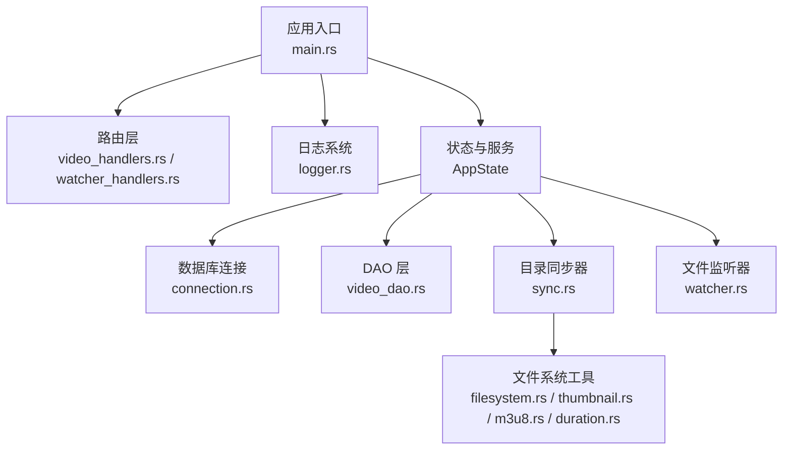
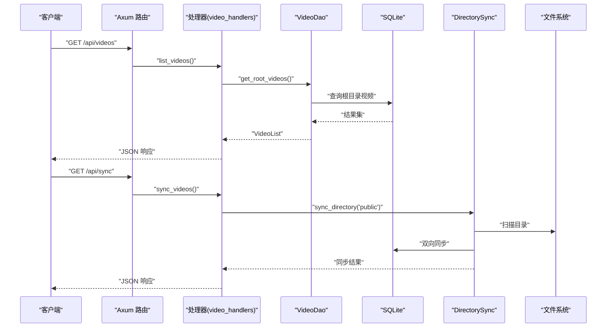
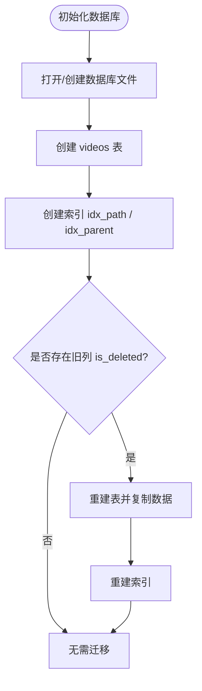
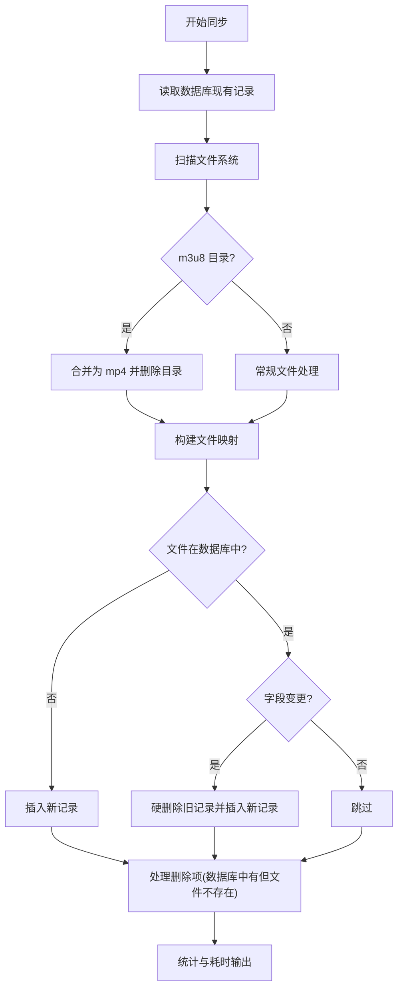
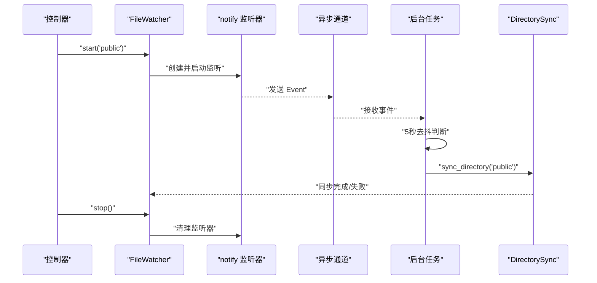
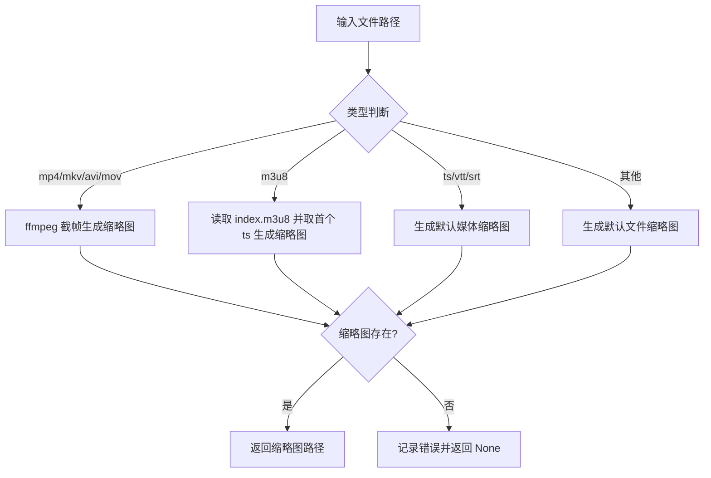
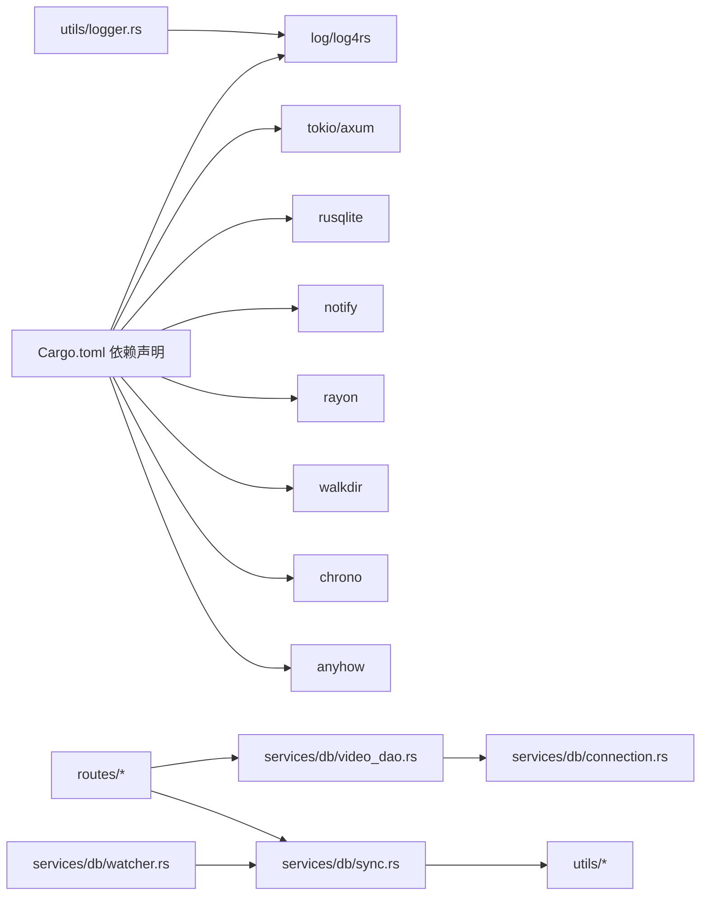

# 运行时错误

<cite>
**本文引用的文件**
- [app/server/src/main.rs](file://app/server/src/main.rs)
- [app/server/src/utils/logger.rs](file://app/server/src/utils/logger.rs)
- [app/server/src/services/db/connection.rs](file://app/server/src/services/db/connection.rs)
- [app/server/src/services/db/video_dao.rs](file://app/server/src/services/db/video_dao.rs)
- [app/server/src/services/db/sync.rs](file://app/server/src/services/db/sync.rs)
- [app/server/src/services/db/watcher.rs](file://app/server/src/services/db/watcher.rs)
- [app/server/src/routes/video_handlers.rs](file://app/server/src/routes/video_handlers.rs)
- [app/server/src/routes/watcher_handlers.rs](file://app/server/src/routes/watcher_handlers.rs)
- [app/server/src/services/filesystem.rs](file://app/server/src/services/filesystem.rs)
- [app/server/src/utils/thumbnail.rs](file://app/server/src/utils/thumbnail.rs)
- [app/server/src/utils/m3u8.rs](file://app/server/src/utils/m3u8.rs)
- [app/server/src/utils/duration.rs](file://app/server/src/utils/duration.rs)
- [app/server/Cargo.toml](file://app/server/Cargo.toml)
</cite>

## 目录
1. [简介](#简介)
2. [项目结构](#项目结构)
3. [核心组件](#核心组件)
4. [架构总览](#架构总览)
5. [详细组件分析](#详细组件分析)
6. [依赖关系分析](#依赖关系分析)
7. [性能考量](#性能考量)
8. [故障排除指南](#故障排除指南)
9. [结论](#结论)
10. [附录](#附录)

## 简介
本文件面向服务器运行期的故障排查，覆盖文件系统访问错误、数据库连接异常、API 调用失败、FFmpeg/ffprobe 依赖缺失、并发与资源泄漏、内存与磁盘压力等问题。文档基于实际代码实现，提供日志解读方法、错误码参考、定位流程与恢复策略，帮助快速定位并解决问题。

## 项目结构
后端采用 Rust + Axum + Tokio，核心模块包括：
- 应用入口与路由：负责启动、CORS、静态文件服务与 API 路由注册
- 日志系统：控制台与滚动文件日志，彩色输出与时间戳
- 数据层：SQLite(rusqlite) + 自定义 DAO/同步器
- 文件系统与媒体处理：缩略图生成、m3u8 合并、时长解析
- 文件监听器：基于 notify 的文件变更监听与去抖同步

图表来源
- [app/server/src/main.rs](file://app/server/src/main.rs#L1-L111)
- [app/server/src/routes/video_handlers.rs](file://app/server/src/routes/video_handlers.rs#L1-L104)
- [app/server/src/routes/watcher_handlers.rs](file://app/server/src/routes/watcher_handlers.rs#L1-L84)
- [app/server/src/utils/logger.rs](file://app/server/src/utils/logger.rs#L1-L100)
- [app/server/src/services/db/connection.rs](file://app/server/src/services/db/connection.rs#L1-L122)
- [app/server/src/services/db/video_dao.rs](file://app/server/src/services/db/video_dao.rs#L1-L146)
- [app/server/src/services/db/sync.rs](file://app/server/src/services/db/sync.rs#L1-L413)
- [app/server/src/services/db/watcher.rs](file://app/server/src/services/db/watcher.rs#L1-L182)
- [app/server/src/services/filesystem.rs](file://app/server/src/services/filesystem.rs#L1-L121)
- [app/server/src/utils/thumbnail.rs](file://app/server/src/utils/thumbnail.rs#L1-L99)
- [app/server/src/utils/m3u8.rs](file://app/server/src/utils/m3u8.rs#L1-L148)
- [app/server/src/utils/duration.rs](file://app/server/src/utils/duration.rs#L1-L66)

章节来源
- [app/server/src/main.rs](file://app/server/src/main.rs#L1-L111)

## 核心组件
- 应用状态 AppState：封装数据库管理器与文件监听器的共享状态，使用互斥锁保护并发访问
- 数据库 VideoDbManager：负责连接、表初始化、索引与迁移
- DAO VideoDao：提供根目录查询、按路径查询、父子关系查询
- 目录同步 DirectorySync：扫描文件系统与数据库双向同步，支持 m3u8 目录特殊处理
- 文件监听器 FileWatcher：基于 notify 的递归监听，过滤非视频相关事件，5 秒去抖
- 缩略图与媒体工具：ffmpeg/ffprobe 依赖、默认缩略图生成、m3u8 合并、时长解析
- 日志系统：log4rs 控制台与滚动文件输出，彩色分级显示

章节来源
- [app/server/src/main.rs](file://app/server/src/main.rs#L21-L61)
- [app/server/src/services/db/connection.rs](file://app/server/src/services/db/connection.rs#L1-L122)
- [app/server/src/services/db/video_dao.rs](file://app/server/src/services/db/video_dao.rs#L1-L146)
- [app/server/src/services/db/sync.rs](file://app/server/src/services/db/sync.rs#L1-L413)
- [app/server/src/services/db/watcher.rs](file://app/server/src/services/db/watcher.rs#L1-L182)
- [app/server/src/services/filesystem.rs](file://app/server/src/services/filesystem.rs#L1-L121)
- [app/server/src/utils/logger.rs](file://app/server/src/utils/logger.rs#L1-L100)

## 架构总览
服务器启动后初始化日志、数据库、缩略图目录与监听器；路由层通过 State 访问 AppState，DAO 层访问数据库，同步器与监听器负责文件系统与数据库一致性，媒体工具链处理缩略图与时长。

图表来源
- [app/server/src/routes/video_handlers.rs](file://app/server/src/routes/video_handlers.rs#L1-L104)
- [app/server/src/services/db/video_dao.rs](file://app/server/src/services/db/video_dao.rs#L52-L79)
- [app/server/src/services/db/sync.rs](file://app/server/src/services/db/sync.rs#L82-L172)

## 详细组件分析

### 数据库连接与迁移
- 连接初始化：打开 SQLite 文件并创建 videos 表与索引
- 迁移逻辑：检测旧列并重建表，保留数据，重建索引
- 异常传播：rusqlite Result 向上抛出，路由层捕获并返回 500

图表来源
- [app/server/src/services/db/connection.rs](file://app/server/src/services/db/connection.rs#L12-L47)
- [app/server/src/services/db/connection.rs](file://app/server/src/services/db/connection.rs#L50-L122)

章节来源
- [app/server/src/services/db/connection.rs](file://app/server/src/services/db/connection.rs#L1-L122)
- [app/server/src/routes/video_handlers.rs](file://app/server/src/routes/video_handlers.rs#L19-L28)

### 目录同步与双向一致性
- 初始化策略：若数据库已有记录且非强制模式，执行增量同步；否则清空后全量同步
- 扫描与过滤：walkdir 递归扫描，过滤非视频/容器文件与 m3u8 目录
- m3u8 目录处理：合并为 mp4 并删除原目录，失败时记录错误
- 变更判定：仅比较 name 与 created_at，避免不必要的写入
- 错误收集：扫描阶段将错误累积并在日志中输出

图表来源
- [app/server/src/services/db/sync.rs](file://app/server/src/services/db/sync.rs#L44-L79)
- [app/server/src/services/db/sync.rs](file://app/server/src/services/db/sync.rs#L86-L172)
- [app/server/src/services/db/sync.rs](file://app/server/src/services/db/sync.rs#L199-L263)
- [app/server/src/utils/m3u8.rs](file://app/server/src/utils/m3u8.rs#L44-L128)

章节来源
- [app/server/src/services/db/sync.rs](file://app/server/src/services/db/sync.rs#L1-L413)
- [app/server/src/utils/m3u8.rs](file://app/server/src/utils/m3u8.rs#L1-L148)

### 文件监听器与去抖同步
- 启停控制：检查运行状态，避免重复启动；停止时清理监听器与通道
- 事件过滤：仅对视频相关路径与内容变更事件响应
- 去抖策略：5 秒内重复事件忽略，降低同步频率
- 错误处理：监听器创建/启动失败返回字符串错误，日志打印

图表来源
- [app/server/src/services/db/watcher.rs](file://app/server/src/services/db/watcher.rs#L29-L123)
- [app/server/src/services/db/watcher.rs](file://app/server/src/services/db/watcher.rs#L125-L182)

章节来源
- [app/server/src/services/db/watcher.rs](file://app/server/src/services/db/watcher.rs#L1-L182)

### 缩略图生成与媒体工具链
- 生成策略：根据文件类型选择 ffmpeg/ffprobe 或默认 SVG 图标
- m3u8 目录：优先从 index.m3u8 第一个 ts 片段生成缩略图
- 容错：ffmpeg/ffprobe 失败时回退到默认缩略图，并记录错误
- 性能：缩略图生成与目录创建使用并行与去重逻辑

图表来源
- [app/server/src/utils/thumbnail.rs](file://app/server/src/utils/thumbnail.rs#L1-L99)
- [app/server/src/services/filesystem.rs](file://app/server/src/services/filesystem.rs#L49-L121)
- [app/server/src/utils/m3u8.rs](file://app/server/src/utils/m3u8.rs#L44-L128)
- [app/server/src/utils/duration.rs](file://app/server/src/utils/duration.rs#L1-L66)

章节来源
- [app/server/src/utils/thumbnail.rs](file://app/server/src/utils/thumbnail.rs#L1-L99)
- [app/server/src/services/filesystem.rs](file://app/server/src/services/filesystem.rs#L1-L121)
- [app/server/src/utils/m3u8.rs](file://app/server/src/utils/m3u8.rs#L1-L148)
- [app/server/src/utils/duration.rs](file://app/server/src/utils/duration.rs#L1-L66)

## 依赖关系分析
- 运行时依赖：log、log4rs、tokio、axum、rusqlite、notify、rayon、walkdir、chrono、anyhow
- 关键耦合：路由层依赖 DAO；DAO 依赖数据库连接；同步器依赖文件系统工具；监听器依赖同步器；缩略图依赖 ffmpeg/ffprobe

图表来源
- [app/server/Cargo.toml](file://app/server/Cargo.toml#L1-L23)
- [app/server/src/routes/video_handlers.rs](file://app/server/src/routes/video_handlers.rs#L1-L104)
- [app/server/src/services/db/video_dao.rs](file://app/server/src/services/db/video_dao.rs#L1-L146)
- [app/server/src/services/db/connection.rs](file://app/server/src/services/db/connection.rs#L1-L122)
- [app/server/src/services/db/sync.rs](file://app/server/src/services/db/sync.rs#L1-L413)
- [app/server/src/services/db/watcher.rs](file://app/server/src/services/db/watcher.rs#L1-L182)
- [app/server/src/utils/logger.rs](file://app/server/src/utils/logger.rs#L1-L100)

章节来源
- [app/server/Cargo.toml](file://app/server/Cargo.toml#L1-L23)

## 性能考量
- 并发与锁：AppState 内部使用互斥锁保护数据库与监听器访问，建议减少持有锁的时间，避免阻塞
- 扫描与 IO：walkdir 与 fs 操作较多，建议限制扫描深度或使用缓存；m3u8 合并与 ffmpeg/ffprobe 为 CPU/IO 密集，建议限流与去抖
- 日志级别：生产环境建议使用 Info 级别，避免过多 Trace/Debug 影响性能
- 索引优化：数据库已建立索引，确保查询效率；避免在高频路径上执行全表扫描

[本节为通用指导，无需特定文件引用]

## 故障排除指南

### 一、日志与错误码参考
- 日志级别与输出
  - 控制台与文件双输出，彩色分级显示，包含时间戳与目标模块
  - 默认级别：Info；可通过配置调整
- 常见错误码与含义
  - 500 内部错误：数据库查询失败、同步失败、监听器启动失败
  - 404 未找到：请求路径不在数据库中
- 日志解读要点
  - 关注 ERROR/WARN/DEBUG/TRACE 等关键字
  - 结合时间戳定位问题发生时段
  - 识别 ffmpeg/ffprobe 执行失败、文件不存在、权限不足等上下文

章节来源
- [app/server/src/utils/logger.rs](file://app/server/src/utils/logger.rs#L65-L99)
- [app/server/src/routes/video_handlers.rs](file://app/server/src/routes/video_handlers.rs#L19-L28)
- [app/server/src/routes/watcher_handlers.rs](file://app/server/src/routes/watcher_handlers.rs#L31-L41)

### 二、文件系统访问错误
- 症状
  - 目录不存在：初始化/扫描阶段报错
  - 权限不足：读取/写入失败
  - 路径不匹配：缩略图生成失败
- 排查步骤
  - 确认 DATA_SOURCE_DIR/public/thumbnails 目录存在且可读写
  - 检查缩略图生成路径与 public 相对路径映射
  - 使用 fs::metadata/exists 判断文件状态
- 常见原因
  - 路径拼接错误、权限不足、磁盘空间不足
- 恢复策略
  - 修正目录权限与所有权
  - 清理磁盘空间或调整日志轮转策略
  - 重启服务以重新初始化目录

章节来源
- [app/server/src/main.rs](file://app/server/src/main.rs#L31-L47)
- [app/server/src/services/filesystem.rs](file://app/server/src/services/filesystem.rs#L1-L47)
- [app/server/src/utils/thumbnail.rs](file://app/server/src/utils/thumbnail.rs#L12-L38)

### 三、数据库连接异常
- 症状
  - 初始化失败：数据库文件损坏或权限不足
  - 查询失败：SQL 语法错误或锁竞争
- 排查步骤
  - 检查 videos.db 是否可读写
  - 查看迁移日志，确认索引重建是否成功
  - 使用 sqlite3 工具验证表结构与索引
- 常见原因
  - 文件被占用、权限不足、磁盘只读
- 恢复策略
  - 关闭其他进程释放文件句柄
  - 修复权限或更换目录
  - 重新初始化数据库并执行增量同步

章节来源
- [app/server/src/services/db/connection.rs](file://app/server/src/services/db/connection.rs#L12-L47)
- [app/server/src/services/db/connection.rs](file://app/server/src/services/db/connection.rs#L50-L122)
- [app/server/src/services/db/sync.rs](file://app/server/src/services/db/sync.rs#L44-L79)

### 四、API 调用失败
- 症状
  - /api/videos 返回 500
  - /api/sync 返回 500
  - /api/watcher/* 返回 500 或 404
- 排查步骤
  - 检查路由映射与 State 访问
  - DAO 查询是否抛出异常
  - 同步器是否成功执行
- 常见原因
  - 数据库异常、锁竞争、路径错误
- 恢复策略
  - 重试请求，必要时手动触发 /api/sync
  - 检查监听器状态并重启

章节来源
- [app/server/src/routes/video_handlers.rs](file://app/server/src/routes/video_handlers.rs#L1-L104)
- [app/server/src/routes/watcher_handlers.rs](file://app/server/src/routes/watcher_handlers.rs#L1-L84)

### 五、FFmpeg/ffprobe 依赖问题
- 症状
  - 缩略图生成失败、默认缩略图回退
  - m3u8 合并失败、删除目录失败
- 排查步骤
  - 在 shell 中直接执行 ffmpeg/ffprobe 命令验证安装
  - 检查命令参数与输入输出路径
- 常见原因
  - 未安装 ffmpeg/ffprobe、路径不在 PATH、权限不足
- 恢复策略
  - 安装并配置 ffmpeg/ffprobe
  - 调整命令参数或使用绝对路径
  - 降级到默认缩略图策略

章节来源
- [app/server/src/services/filesystem.rs](file://app/server/src/services/filesystem.rs#L49-L121)
- [app/server/src/utils/m3u8.rs](file://app/server/src/utils/m3u8.rs#L88-L128)
- [app/server/src/utils/duration.rs](file://app/server/src/utils/duration.rs#L1-L30)

### 六、并发访问冲突与锁竞争
- 症状
  - 路由处理缓慢或超时
  - 同步器与监听器互相阻塞
- 排查步骤
  - 检查 AppState 中 Mutex 的持有范围
  - 观察日志中长时间持锁的操作
- 常见原因
  - 长时间持有锁、死锁风险、热点竞争
- 恢复策略
  - 缩短锁持有时间，拆分业务逻辑
  - 使用更细粒度的锁或无锁数据结构
  - 引入队列与后台任务解耦

章节来源
- [app/server/src/main.rs](file://app/server/src/main.rs#L21-L61)
- [app/server/src/services/db/watcher.rs](file://app/server/src/services/db/watcher.rs#L55-L88)

### 七、内存溢出与文件句柄泄露
- 症状
  - 进程内存持续增长、CPU 占用高
  - 文件描述符耗尽导致 IO 失败
- 排查步骤
  - 监控进程内存与 FD 数量
  - 检查缩略图生成与 m3u8 合并的循环
  - 关注 rayon 并行任务规模
- 常见原因
  - 无限递归扫描、未关闭的文件句柄、大量并发任务
- 恢复策略
  - 限制扫描深度与并行度
  - 及时释放资源与关闭句柄
  - 引入资源配额与超时控制

章节来源
- [app/server/src/services/db/sync.rs](file://app/server/src/services/db/sync.rs#L199-L263)
- [app/server/src/services/filesystem.rs](file://app/server/src/services/filesystem.rs#L1-L47)

### 八、错误恢复策略与稳定性保障
- 自动恢复
  - 监听器失败时返回错误并允许再次启动
  - 同步失败时记录错误并允许下次重试
- 稳定性保障
  - 5 秒去抖避免频繁同步
  - 仅对视频相关路径与内容变更事件响应
  - 日志分级与滚动，避免日志风暴
- 最佳实践
  - 生产环境使用 Info 级别日志
  - 为关键路径增加超时与重试
  - 定期巡检数据库与文件系统状态

章节来源
- [app/server/src/services/db/watcher.rs](file://app/server/src/services/db/watcher.rs#L55-L88)
- [app/server/src/utils/logger.rs](file://app/server/src/utils/logger.rs#L65-L99)

## 结论
通过规范的日志体系、健壮的数据库与文件系统处理、合理的并发与去抖策略，系统能够在多数运行时错误中保持稳定。建议在生产环境中加强资源监控、限制并发规模、完善容错与回退机制，并定期演练故障恢复流程。

[本节为总结性内容，无需特定文件引用]

## 附录

### A. 常见错误定位清单
- 日志级别：确认当前级别与输出位置
- 数据库：检查连接、索引、迁移日志
- 文件系统：校验目录权限、磁盘空间、路径映射
- 媒体工具：验证 ffmpeg/ffprobe 可用性与命令参数
- 并发：缩短锁持有时间，避免热点竞争

[本节为通用指导，无需特定文件引用]