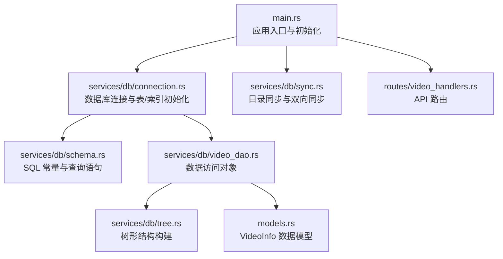
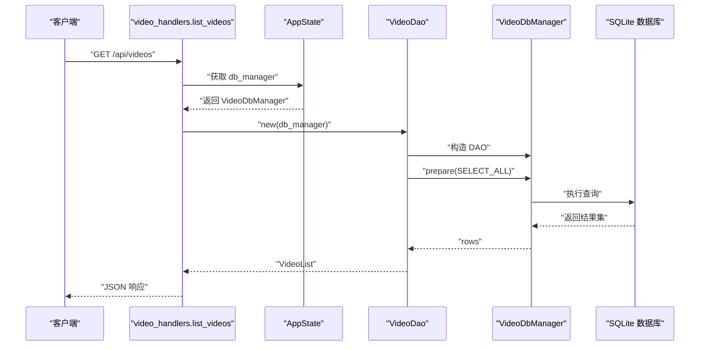
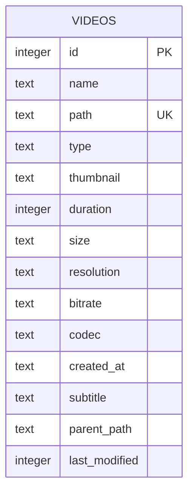
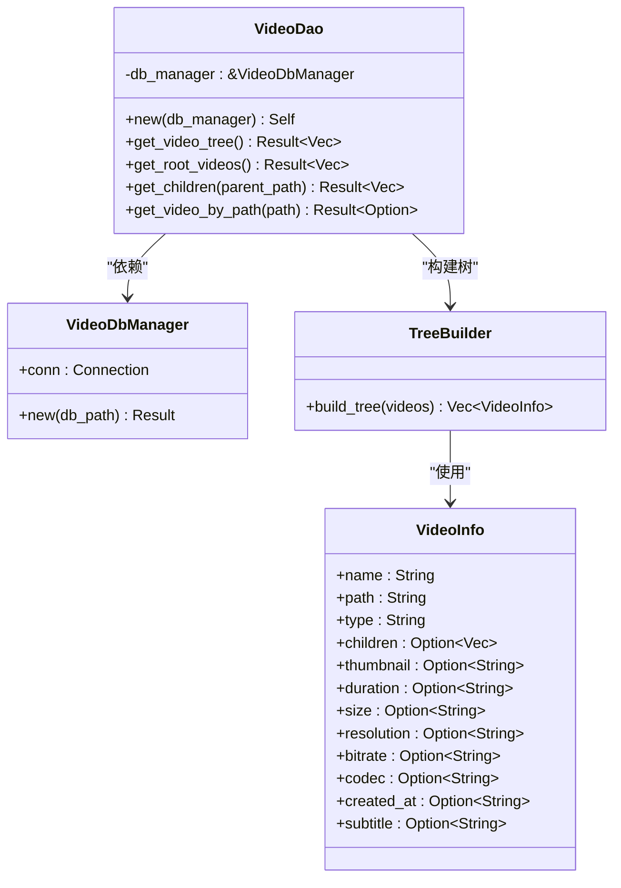
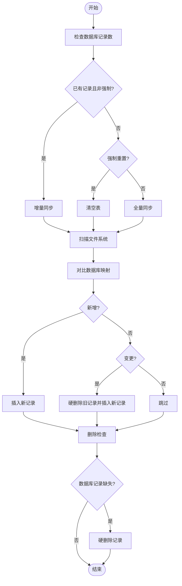
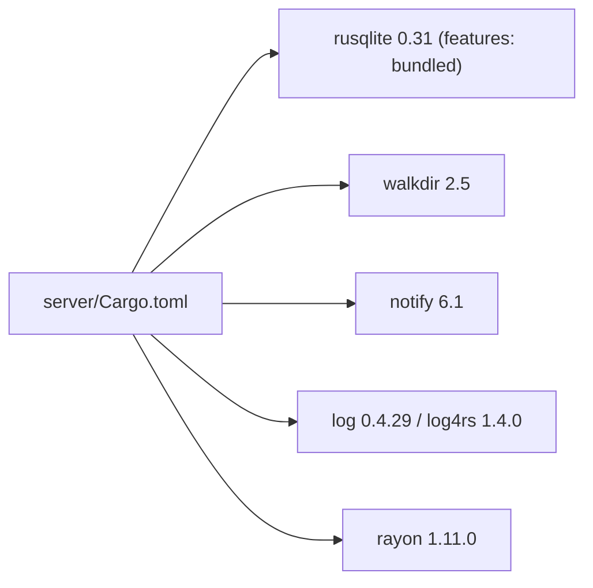

# 数据库设计

<cite>
**本文引用的文件**
- [main.rs](file://app/server/src/main.rs)
- [routes/video_handlers.rs](file://app/server/src/routes/video_handlers.rs)
- [services/db/connection.rs](file://app/server/src/services/db/connection.rs)
- [services/db/schema.rs](file://app/server/src/services/db/schema.rs)
- [services/db/video_dao.rs](file://app/server/src/services/db/video_dao.rs)
- [services/db/sync.rs](file://app/server/src/services/db/sync.rs)
- [services/db/tree.rs](file://app/server/src/services/db/tree.rs)
- [models.rs](file://app/server/src/models.rs)
- [Cargo.toml](file://app/server/Cargo.toml)
</cite>

## 目录
1. [简介](#简介)
2. [项目结构](#项目结构)
3. [核心组件](#核心组件)
4. [架构总览](#架构总览)
5. [详细组件分析](#详细组件分析)
6. [依赖分析](#依赖分析)
7. [性能考虑](#性能考虑)
8. [故障排查指南](#故障排查指南)
9. [结论](#结论)
10. [附录](#附录)

## 简介
本文件系统采用 SQLite 作为本地嵌入式数据库，结合 Rust 的 rusqlite 库实现视频元数据的持久化与管理。数据库负责：
- 存储视频文件与目录的元信息（名称、路径、类型、缩略图、时长、大小、分辨率、码率、编码格式、创建时间、字幕、父路径、最后修改时间等）
- 提供 CRUD 与树形结构查询能力
- 支持目录级双向同步（文件系统与数据库），并具备迁移与索引优化
- 通过 DAO 层封装数据访问逻辑，配合路由层对外提供 API

SQLite 的选择基于以下原因：
- 轻量、零配置、跨平台、可靠性高
- 适合本项目的小规模数据与本地部署场景
- 与 Rust 生态（rusqlite）集成良好，便于开发与维护

## 项目结构
数据库相关代码集中在 app/server/src/services/db 目录，围绕“连接管理—查询常量—DAO—同步—树构建”分层组织；应用入口负责初始化数据库与启动同步，并通过路由暴露 API。

图表来源
- [main.rs](file://app/server/src/main.rs#L1-L111)
- [services/db/connection.rs](file://app/server/src/services/db/connection.rs#L1-L122)
- [services/db/schema.rs](file://app/server/src/services/db/schema.rs#L1-L42)
- [services/db/video_dao.rs](file://app/server/src/services/db/video_dao.rs#L1-L146)
- [services/db/sync.rs](file://app/server/src/services/db/sync.rs#L1-L413)
- [services/db/tree.rs](file://app/server/src/services/db/tree.rs#L1-L78)
- [routes/video_handlers.rs](file://app/server/src/routes/video_handlers.rs#L1-L104)
- [models.rs](file://app/server/src/models.rs#L1-L32)

章节来源
- [main.rs](file://app/server/src/main.rs#L1-L111)
- [services/db/connection.rs](file://app/server/src/services/db/connection.rs#L1-L122)
- [services/db/schema.rs](file://app/server/src/services/db/schema.rs#L1-L42)
- [services/db/video_dao.rs](file://app/server/src/services/db/video_dao.rs#L1-L146)
- [services/db/sync.rs](file://app/server/src/services/db/sync.rs#L1-L413)
- [services/db/tree.rs](file://app/server/src/services/db/tree.rs#L1-L78)
- [routes/video_handlers.rs](file://app/server/src/routes/video_handlers.rs#L1-L104)
- [models.rs](file://app/server/src/models.rs#L1-L32)

## 核心组件
- 数据库连接管理器：负责打开数据库、创建表与索引、执行迁移
- 查询常量模块：集中定义常用 SQL 语句，便于维护与复用
- DAO 层：封装 CRUD 与树形查询逻辑
- 同步器：实现文件系统与数据库的双向同步
- 树构建器：将扁平数据构造成层次化树形结构
- 数据模型：VideoInfo 结构体，用于序列化与 API 返回

章节来源
- [services/db/connection.rs](file://app/server/src/services/db/connection.rs#L1-L122)
- [services/db/schema.rs](file://app/server/src/services/db/schema.rs#L1-L42)
- [services/db/video_dao.rs](file://app/server/src/services/db/video_dao.rs#L1-L146)
- [services/db/sync.rs](file://app/server/src/services/db/sync.rs#L1-L413)
- [services/db/tree.rs](file://app/server/src/services/db/tree.rs#L1-L78)
- [models.rs](file://app/server/src/models.rs#L1-L32)

## 架构总览
下面的序列图展示了“列出根视频”这一典型流程的数据流与调用链。

图表来源
- [routes/video_handlers.rs](file://app/server/src/routes/video_handlers.rs#L1-L28)
- [services/db/video_dao.rs](file://app/server/src/services/db/video_dao.rs#L1-L79)
- [services/db/connection.rs](file://app/server/src/services/db/connection.rs#L1-L47)
- [services/db/schema.rs](file://app/server/src/services/db/schema.rs#L1-L42)

## 详细组件分析

### 数据模型与表结构
- 表名：videos
- 字段与约束（来自建表语句与默认值）：
  - id：整型主键，自增
  - name：文本，非空
  - path：文本，唯一且非空
  - type：文本，非空（视频类型枚举）
  - thumbnail：文本（可选）
  - duration：整型（可选）
  - size：文本（可选）
  - resolution：文本（可选）
  - bitrate：文本（可选）
  - codec：文本（可选）
  - created_at：文本（可选）
  - subtitle：文本（可选）
  - parent_path：文本（可选）
  - last_modified：整型，非空，默认 0
- 索引：
  - idx_path：对 path 建立唯一索引
  - idx_parent：对 parent_path 建立普通索引
- 迁移：
  - 自动检测旧版 is_deleted 列并安全迁移至新表结构，重建索引

图表来源
- [services/db/connection.rs](file://app/server/src/services/db/connection.rs#L16-L41)

章节来源
- [services/db/connection.rs](file://app/server/src/services/db/connection.rs#L16-L41)
- [services/db/connection.rs](file://app/server/src/services/db/connection.rs#L44-L121)

### 查询常量与 SQL 设计
- 常量位置：schema.rs
- 关键查询：
  - 插入新记录：INSERT_NEW（包含 name、path、type、parent_path、thumbnail、size、created_at、subtitle、last_modified、duration）
  - 总数查询：SELECT_ALL_COUNT
  - 全量查询（排序）：SELECT_ALL（按 type DESC, name ASC）
  - 全量查询（完整字段）：SELECT_ALL_FULL
  - 按父路径查询：SELECT_BY_PARENT（带排序）
  - 按路径查询：SELECT_BY_PATH
  - 按路径查询类型：SELECT_TYPE_BY_PATH

章节来源
- [services/db/schema.rs](file://app/server/src/services/db/schema.rs#L1-L42)

### 数据访问对象（DAO）与 CRUD
- VideoDao 提供：
  - get_video_tree：获取全部视频并构建树形结构
  - get_root_videos：获取 public 根目录下的视频
  - get_children：根据父路径获取子项；对 m3u8 类型返回空（目录不单独存储）
  - get_video_by_path：按路径获取单条记录
- 事务管理：
  - 当前 DAO 未显式开启事务；所有写操作在单条语句内执行，读取使用 prepare/query_map
  - 若需批量写入或强一致性，可在上层调用处包裹事务（建议）

图表来源
- [services/db/video_dao.rs](file://app/server/src/services/db/video_dao.rs#L1-L146)
- [services/db/tree.rs](file://app/server/src/services/db/tree.rs#L1-L78)
- [models.rs](file://app/server/src/models.rs#L1-L32)

章节来源
- [services/db/video_dao.rs](file://app/server/src/services/db/video_dao.rs#L1-L146)
- [services/db/tree.rs](file://app/server/src/services/db/tree.rs#L1-L78)
- [models.rs](file://app/server/src/models.rs#L1-L32)

### 目录同步与双向同步
- 初始化策略：
  - 若数据库已有记录且未强制重置，则执行增量同步
  - 否则可选择强制清空后全量同步
- 双向同步流程：
  1) 从数据库加载当前记录，构建 path->FileInfo 映射
  2) 扫描文件系统，过滤视频/容器/字幕/图片等类型，特殊处理 m3u8 目录
  3) 新增：数据库不存在则插入
  4) 变更：比较 name 与 created_at，变化则硬删除旧记录并插入新记录
  5) 删除：数据库记录对应文件不存在则硬删除
  6) 统计与日志输出
- 写入策略：
  - 使用 INSERT_NEW 批量写入
  - 删除使用 DELETE BY path

图表来源
- [services/db/sync.rs](file://app/server/src/services/db/sync.rs#L43-L172)
- [services/db/sync.rs](file://app/server/src/services/db/sync.rs#L174-L263)
- [services/db/sync.rs](file://app/server/src/services/db/sync.rs#L265-L413)

章节来源
- [services/db/sync.rs](file://app/server/src/services/db/sync.rs#L43-L172)
- [services/db/sync.rs](file://app/server/src/services/db/sync.rs#L174-L263)
- [services/db/sync.rs](file://app/server/src/services/db/sync.rs#L265-L413)

### 迁移策略
- 版本检测：通过 PRAGMA table_info(videos) 检测是否存在 is_deleted 列
- 迁移步骤：
  1) 删除可能存在的临时表
  2) 创建不含 is_deleted 的临时表
  3) 将原表数据复制到临时表（排除 is_deleted）
  4) 删除原表
  5) 重命名临时表为 videos
  6) 重建索引 idx_path 与 idx_parent
- 日志：迁移开始/完成提示

章节来源
- [services/db/connection.rs](file://app/server/src/services/db/connection.rs#L44-L121)

### 索引策略与查询优化
- 已建立：
  - idx_path：加速按 path 查询与去重
  - idx_parent：加速按父路径查询
- 建议优化：
  - 对 last_modified 建立索引，支持按时间排序与增量同步
  - 对 type 建立索引，提升排序与筛选效率
  - 对 created_at 建立索引，支持按创建时间排序
- 查询建议：
  - 使用 prepared statement（已实现）
  - 在高频过滤字段上保持索引
  - 控制返回字段数量，避免 SELECT *

章节来源
- [services/db/connection.rs](file://app/server/src/services/db/connection.rs#L36-L41)
- [services/db/schema.rs](file://app/server/src/services/db/schema.rs#L1-L42)

### 事务管理
- 现状：DAO 与同步器未显式开启事务，写入为单条语句执行
- 建议：
  - 批量写入（如全量同步）可在外层开启事务，失败回滚
  - 并发写入时使用锁或连接池，避免竞态
  - 对于高并发场景，考虑 WAL 模式与合适的 PRAGMA 设置

章节来源
- [services/db/video_dao.rs](file://app/server/src/services/db/video_dao.rs#L1-L146)
- [services/db/sync.rs](file://app/server/src/services/db/sync.rs#L1-L413)

### 备份与恢复
- 备份：
  - 直接复制 SQLite 文件（videos.db）即可完成物理备份
  - 建议定期自动备份，结合外部存储
- 恢复：
  - 停止服务后替换数据库文件，重启服务
  - 恢复后可执行一次全量同步确保一致性
- 迁移：
  - 旧版本 is_deleted 列会自动迁移，无需手动干预

章节来源
- [services/db/connection.rs](file://app/server/src/services/db/connection.rs#L44-L121)

### 性能监控与日志
- 同步过程中的关键阶段已打点日志（查询耗时、扫描耗时、处理变更耗时、删除耗时、总耗时）
- 建议：
  - 引入指标采集（如 Prometheus）记录同步耗时、新增/变更/删除计数
  - 对慢查询进行 EXPLAIN QUERY PLAN 分析
  - 监控数据库文件大小与索引碎片情况

章节来源
- [services/db/sync.rs](file://app/server/src/services/db/sync.rs#L43-L79)
- [services/db/sync.rs](file://app/server/src/services/db/sync.rs#L116-L169)

## 依赖分析
- 外部依赖（rusqlite）：
  - 版本：0.31
  - 特性：bundled（将 SQLite C 库打包进二进制）
- 其他关键依赖：
  - walkdir：文件系统扫描
  - notify：文件监听（用于自动同步）
  - log/log4rs：日志
  - rayon：并行计算（可选用于加速扫描）

图表来源
- [Cargo.toml](file://app/server/Cargo.toml#L1-L23)

章节来源
- [Cargo.toml](file://app/server/Cargo.toml#L1-L23)

## 性能考虑
- I/O 优化：
  - 使用 prepared statements 降低解析开销
  - 批量写入时合并为单事务，减少磁盘刷写次数
- 索引优化：
  - 为高频过滤与排序字段建立索引
  - 定期分析表统计信息（ANALYZE），帮助查询优化器
- 并发与锁：
  - SQLite 默认串行化写入，可通过 WAL 模式提升并发读写
  - 控制同时打开的连接数，避免锁竞争
- 缓存与预热：
  - 对热点查询结果进行内存缓存（如根目录列表）
  - 启动时预热常用索引

## 故障排查指南
- 数据库初始化失败：
  - 检查数据库文件权限与路径
  - 查看迁移日志（是否检测到旧版本）
- 同步异常：
  - 查看扫描错误日志（目录不可访问、权限不足等）
  - 检查文件类型识别与 m3u8 目录处理逻辑
- 查询缓慢：
  - 检查是否命中索引（EXPLAIN QUERY PLAN）
  - 调整排序字段与过滤条件
- API 返回空或 404：
  - 确认 path 是否正确（public 前缀）
  - 确认数据库是否已同步

章节来源
- [services/db/connection.rs](file://app/server/src/services/db/connection.rs#L44-L121)
- [services/db/sync.rs](file://app/server/src/services/db/sync.rs#L101-L115)
- [routes/video_handlers.rs](file://app/server/src/routes/video_handlers.rs#L30-L70)

## 结论
本数据库设计以 SQLite 为核心，结合 rusqlite 实现了轻量、可靠、易维护的视频元数据存储方案。通过 DAO 抽象与目录同步机制，实现了从文件系统到数据库的双向一致性。建议后续引入事务、WAL 模式、索引优化与监控指标，进一步提升性能与可观测性。

## 附录

### 实际 SQL 示例（路径引用）
- 创建表与索引
  - [CREATE TABLE IF NOT EXISTS videos ...](file://app/server/src/services/db/connection.rs#L16-L41)
- 插入新记录
  - [INSERT NEW](file://app/server/src/services/db/schema.rs#L18-L20)
- 查询总数
  - [COUNT(*)](file://app/server/src/services/db/schema.rs#L22-L22)
- 查询全部（排序）
  - [SELECT ALL](file://app/server/src/services/db/schema.rs#L24-L26)
- 查询全部（完整字段）
  - [SELECT ALL FULL](file://app/server/src/services/db/schema.rs#L28-L29)
- 按父路径查询（排序）
  - [SELECT BY PARENT](file://app/server/src/services/db/schema.rs#L31-L34)
- 按路径查询
  - [SELECT BY PATH](file://app/server/src/services/db/schema.rs#L36-L38)
- 按路径查询类型
  - [SELECT TYPE BY PATH](file://app/server/src/services/db/schema.rs#L40-L40)
- 删除记录
  - [DELETE BY PATH](file://app/server/src/services/db/sync.rs#L405-L411)

### 最佳实践
- 使用 prepared statements 与参数绑定，避免 SQL 注入
- 对高频查询字段建立索引，定期维护统计信息
- 批量写入时使用事务，保证原子性
- 启动时执行一次全量同步，确保数据库与文件系统一致
- 定期备份数据库文件，保留多个历史快照
- 对日志进行分级与轮转，避免磁盘占用过大