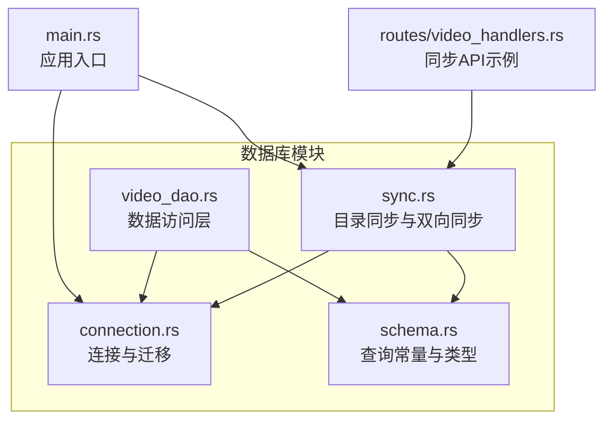
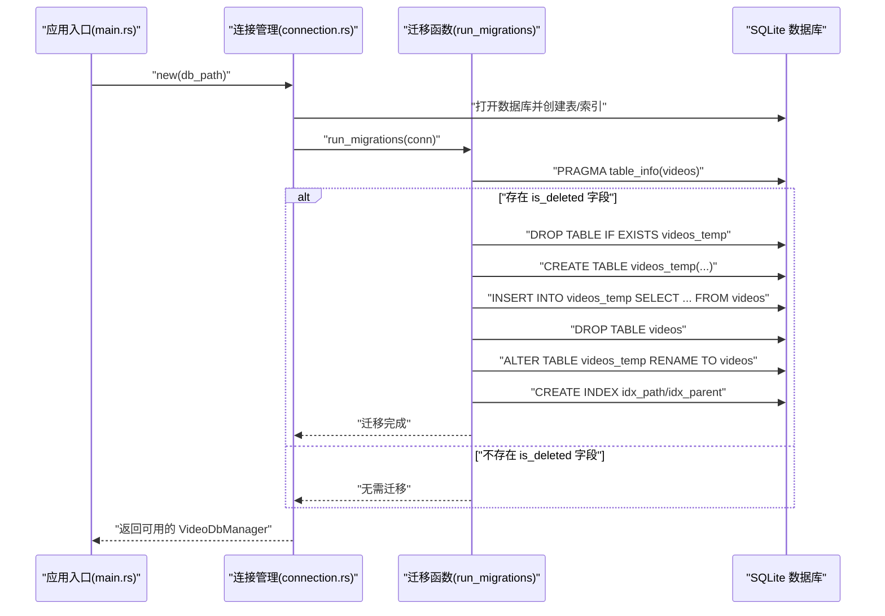
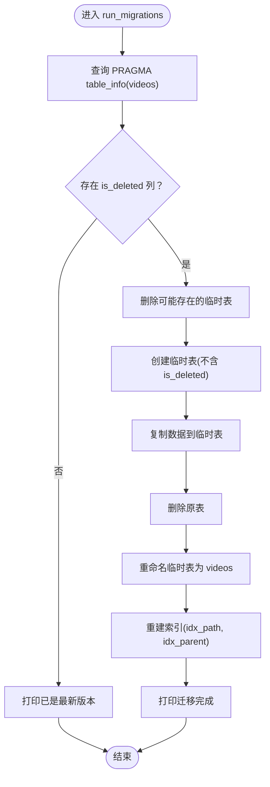
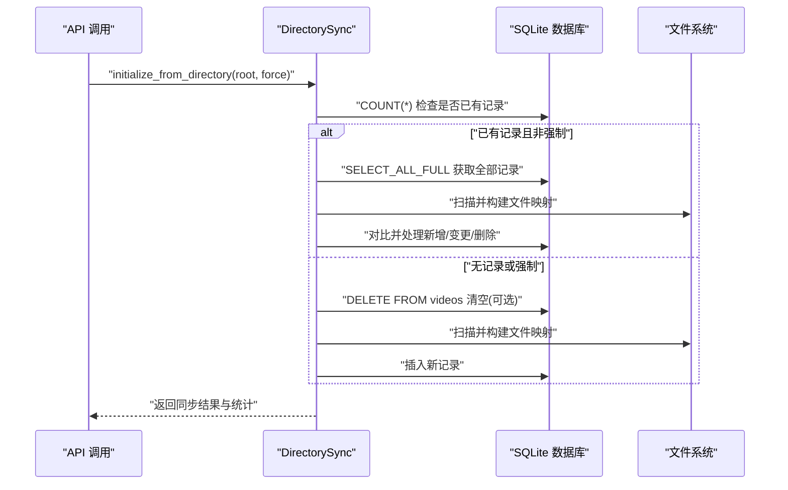
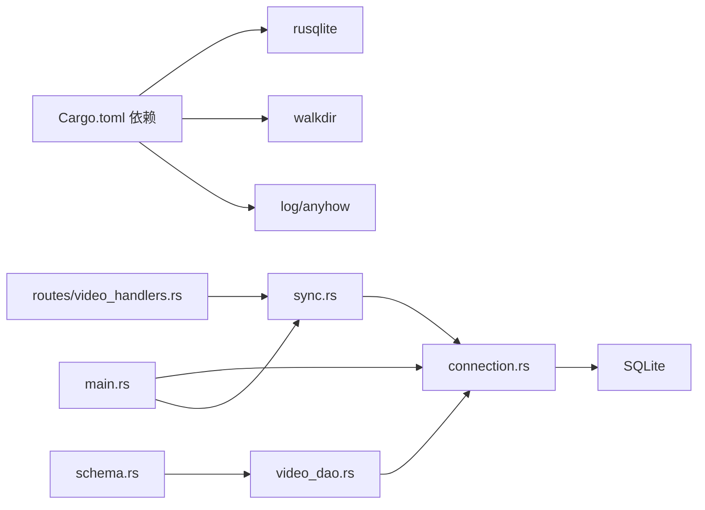

# 数据库迁移

<cite>
**本文引用的文件**
- [app/server/src/services/db/connection.rs](file://app/server/src/services/db/connection.rs)
- [app/server/src/services/db/schema.rs](file://app/server/src/services/db/schema.rs)
- [app/server/src/services/db/sync.rs](file://app/server/src/services/db/sync.rs)
- [app/server/src/services/db/video_dao.rs](file://app/server/src/services/db/video_dao.rs)
- [app/server/src/main.rs](file://app/server/src/main.rs)
- [app/server/Cargo.toml](file://app/server/Cargo.toml)
- [app/server/src/routes/video_handlers.rs](file://app/server/src/routes/video_handlers.rs)
</cite>

## 目录
1. [简介](#简介)
2. [项目结构](#项目结构)
3. [核心组件](#核心组件)
4. [架构总览](#架构总览)
5. [详细组件分析](#详细组件分析)
6. [依赖关系分析](#依赖关系分析)
7. [性能考量](#性能考量)
8. [故障排查指南](#故障排查指南)
9. [结论](#结论)
10. [附录](#附录)

## 简介
本文件围绕数据库迁移机制进行系统性说明，重点覆盖以下内容：
- run_migrations 函数的实现逻辑：版本检测、表结构变更、数据迁移流程
- 从旧版本向新版本的平滑升级策略
- 迁移过程中的数据保护措施与回滚机制
- 迁移脚本的编写规范与测试方法
- 实际迁移场景与故障处理方案

该仓库采用 SQLite 作为本地数据库，使用 rusqlite 进行数据库访问；迁移逻辑在应用启动时自动执行，确保数据库结构与当前代码兼容。

## 项目结构
数据库相关代码集中在后端服务的数据库模块中，主要文件如下：
- 连接与迁移：connection.rs
- 表结构与查询常量：schema.rs
- 数据访问层：video_dao.rs
- 目录同步与双向同步：sync.rs
- 应用入口与初始化：main.rs
- 依赖声明：Cargo.toml
- API 路由示例：routes/video_handlers.rs

图表来源
- [app/server/src/services/db/connection.rs](file://app/server/src/services/db/connection.rs#L1-L121)
- [app/server/src/services/db/schema.rs](file://app/server/src/services/db/schema.rs#L1-L42)
- [app/server/src/services/db/video_dao.rs](file://app/server/src/services/db/video_dao.rs#L1-L146)
- [app/server/src/services/db/sync.rs](file://app/server/src/services/db/sync.rs#L1-L413)
- [app/server/src/main.rs](file://app/server/src/main.rs#L1-L111)
- [app/server/src/routes/video_handlers.rs](file://app/server/src/routes/video_handlers.rs#L78-L103)

章节来源
- [app/server/src/services/db/connection.rs](file://app/server/src/services/db/connection.rs#L1-L121)
- [app/server/src/services/db/schema.rs](file://app/server/src/services/db/schema.rs#L1-L42)
- [app/server/src/services/db/sync.rs](file://app/server/src/services/db/sync.rs#L1-L413)
- [app/server/src/services/db/video_dao.rs](file://app/server/src/services/db/video_dao.rs#L1-L146)
- [app/server/src/main.rs](file://app/server/src/main.rs#L1-L111)
- [app/server/src/routes/video_handlers.rs](file://app/server/src/routes/video_handlers.rs#L78-L103)

## 核心组件
- 数据库连接管理器：负责打开数据库、创建表结构、建立索引，并在初始化时触发迁移
- 迁移函数：检测旧版字段，通过“临时表”方式安全地去除旧字段并重建索引
- 数据访问层：封装查询与聚合逻辑，面向上层业务使用
- 目录同步器：实现文件系统与数据库的双向同步，支持增量与全量模式
- 应用入口：初始化日志、数据库、文件监听器，并提供同步 API

章节来源
- [app/server/src/services/db/connection.rs](file://app/server/src/services/db/connection.rs#L1-L121)
- [app/server/src/services/db/video_dao.rs](file://app/server/src/services/db/video_dao.rs#L1-L146)
- [app/server/src/services/db/sync.rs](file://app/server/src/services/db/sync.rs#L1-L413)
- [app/server/src/main.rs](file://app/server/src/main.rs#L1-L111)

## 架构总览
数据库迁移在应用启动阶段自动执行，确保数据库结构与当前代码一致。迁移流程与目录同步共同构成数据一致性保障体系。

图表来源
- [app/server/src/main.rs](file://app/server/src/main.rs#L35-L47)
- [app/server/src/services/db/connection.rs](file://app/server/src/services/db/connection.rs#L12-L47)
- [app/server/src/services/db/connection.rs](file://app/server/src/services/db/connection.rs#L50-L121)

## 详细组件分析

### 迁移函数 run_migrations 的实现逻辑
- 版本检测
  - 通过 PRAGMA table_info(videos) 查询表结构，逐行检查列名是否包含 is_deleted
  - 若存在该列，判定为旧版本，进入迁移流程；否则直接提示已是最新版本
- 表结构变更
  - 采用“临时表”策略：先创建不含 is_deleted 的新表结构，再复制数据，最后替换原表并重建索引
  - 新表结构包含 id、name、path、type、thumbnail、duration、size、resolution、bitrate、codec、created_at、subtitle、parent_path、last_modified 等字段
- 数据迁移流程
  - 步骤一：清理残留临时表（若上次迁移失败）
  - 步骤二：创建临时表并复制数据（排除 is_deleted）
  - 步骤三：删除原表
  - 步骤四：将临时表重命名为 videos
  - 步骤五：重建 path 与 parent_path 索引
- 平滑升级策略
  - 通过临时表避免直接 ALTER TABLE 导致的锁竞争与数据丢失风险
  - 在替换表前后保持索引一致，保证查询性能不受影响
- 数据保护与回滚
  - 当前实现未显式开启事务或写 WAL 日志；但通过 DROP/CREATE/RENAME 的原子性操作，以及先复制再删除的顺序，降低数据丢失概率
  - 建议在生产环境中增加显式事务包裹与备份策略（见“故障排查指南”）

图表来源
- [app/server/src/services/db/connection.rs](file://app/server/src/services/db/connection.rs#L50-L121)

章节来源
- [app/server/src/services/db/connection.rs](file://app/server/src/services/db/connection.rs#L50-L121)

### 目录同步与双向同步
- 初始化策略
  - 若数据库已有记录且未强制重新初始化，则执行增量同步
  - 若数据库为空或强制重新初始化，则清空现有数据并执行全量同步
- 双向同步流程
  - 从数据库读取全部记录，构建文件映射
  - 扫描文件系统，过滤有效条目，生成文件信息
  - 比较文件与数据库记录，处理新增、变更（硬删除旧记录并插入新记录）、删除（硬删除）
  - 统计新增、变更、删除、跳过的数量与错误数
- 关键字段对比
  - 仅对比 name 与 created_at，path 为唯一标识
- 数据保护
  - 硬删除采用精确匹配 path 的 DELETE，避免误删
  - 增量同步减少不必要的写入，降低并发冲突

图表来源
- [app/server/src/services/db/sync.rs](file://app/server/src/services/db/sync.rs#L44-L166)
- [app/server/src/routes/video_handlers.rs](file://app/server/src/routes/video_handlers.rs#L78-L103)

章节来源
- [app/server/src/services/db/sync.rs](file://app/server/src/services/db/sync.rs#L44-L166)
- [app/server/src/routes/video_handlers.rs](file://app/server/src/routes/video_handlers.rs#L78-L103)

### 数据访问层与查询常量
- 查询常量集中定义，便于维护与复用
- DAO 层封装了树形结构构建、根目录查询、父子关系查询、按路径查询等功能
- 与同步器配合，支撑前端展示与导航

章节来源
- [app/server/src/services/db/schema.rs](file://app/server/src/services/db/schema.rs#L1-L42)
- [app/server/src/services/db/video_dao.rs](file://app/server/src/services/db/video_dao.rs#L1-L146)

## 依赖关系分析
- 运行时依赖
  - rusqlite：SQLite 访问与事务支持
  - walkdir：文件系统遍历
  - log/anyhow：日志与错误处理
- 组件耦合
  - connection.rs 与 sync.rs、video_dao.rs 通过 VideoDbManager 协作
  - schema.rs 为查询常量提供统一来源
  - main.rs 负责应用生命周期与初始化顺序

图表来源
- [app/server/Cargo.toml](file://app/server/Cargo.toml#L1-L23)
- [app/server/src/services/db/connection.rs](file://app/server/src/services/db/connection.rs#L1-L121)
- [app/server/src/services/db/sync.rs](file://app/server/src/services/db/sync.rs#L1-L413)
- [app/server/src/services/db/video_dao.rs](file://app/server/src/services/db/video_dao.rs#L1-L146)
- [app/server/src/main.rs](file://app/server/src/main.rs#L1-L111)
- [app/server/src/routes/video_handlers.rs](file://app/server/src/routes/video_handlers.rs#L78-L103)

章节来源
- [app/server/Cargo.toml](file://app/server/Cargo.toml#L1-L23)
- [app/server/src/services/db/connection.rs](file://app/server/src/services/db/connection.rs#L1-L121)
- [app/server/src/services/db/sync.rs](file://app/server/src/services/db/sync.rs#L1-L413)
- [app/server/src/services/db/video_dao.rs](file://app/server/src/services/db/video_dao.rs#L1-L146)
- [app/server/src/main.rs](file://app/server/src/main.rs#L1-L111)
- [app/server/src/routes/video_handlers.rs](file://app/server/src/routes/video_handlers.rs#L78-L103)

## 性能考量
- 索引优化
  - 在 path 与 parent_path 上建立索引，提升查询与分组效率
- 批量操作
  - 同步过程中尽量减少重复查询，使用内存映射缓存数据库记录
- I/O 优化
  - 文件扫描采用 walkdir，限制深度与过滤无效条目
- 日志与监控
  - 同步过程记录各阶段耗时与统计信息，便于定位性能瓶颈

章节来源
- [app/server/src/services/db/connection.rs](file://app/server/src/services/db/connection.rs#L36-L41)
- [app/server/src/services/db/sync.rs](file://app/server/src/services/db/sync.rs#L95-L168)

## 故障排查指南
- 迁移失败或中断
  - 现象：应用启动时报错或迁移未完成
  - 排查：确认数据库文件权限、磁盘空间；检查是否存在残留临时表
  - 建议：在生产环境增加显式事务包裹与备份策略；迁移前备份数据库文件
- 数据不一致
  - 现象：同步后数据库与文件系统不一致
  - 排查：查看同步统计与错误日志；确认文件系统权限与路径配置
  - 建议：使用强制重新初始化选项清理异常数据；必要时手动修复
- 回滚机制
  - 当前实现未提供自动回滚；建议在迁移前备份数据库文件
  - 如需回滚，可将备份恢复至迁移前状态
- API 调用问题
  - 现象：同步接口返回错误
  - 排查：检查日志输出与错误响应；确认 DATA_SOURCE_DIR 配置正确

章节来源
- [app/server/src/services/db/connection.rs](file://app/server/src/services/db/connection.rs#L50-L121)
- [app/server/src/services/db/sync.rs](file://app/server/src/services/db/sync.rs#L44-L166)
- [app/server/src/routes/video_handlers.rs](file://app/server/src/routes/video_handlers.rs#L78-L103)

## 结论
本项目通过“临时表”策略实现了对旧版数据库结构的安全迁移，确保在升级过程中最小化数据风险。配合目录同步与双向同步机制，系统能够在运行时维持数据库与文件系统的高一致性。建议在生产环境中进一步完善事务与备份策略，以增强迁移与运行时的可靠性。

## 附录

### 迁移脚本编写规范
- 版本检测
  - 使用 PRAGMA table_info(videos) 检测目标列是否存在
  - 仅在检测到旧字段时执行迁移
- 结构变更
  - 采用临时表复制数据的方式，避免直接 ALTER TABLE
  - 明确列出新表字段清单，确保与当前代码一致
- 数据保护
  - 迁移前删除残留临时表
  - 迁移完成后重建索引
- 回滚与备份
  - 迁移前备份数据库文件
  - 迁移失败时使用备份恢复
- 测试方法
  - 准备旧版数据库样本（含 is_deleted 字段）
  - 执行迁移并验证表结构与数据完整性
  - 验证查询与同步功能正常

章节来源
- [app/server/src/services/db/connection.rs](file://app/server/src/services/db/connection.rs#L50-L121)
- [app/server/src/services/db/schema.rs](file://app/server/src/services/db/schema.rs#L1-L42)