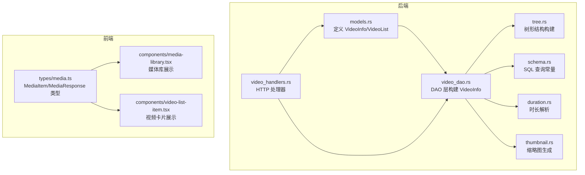
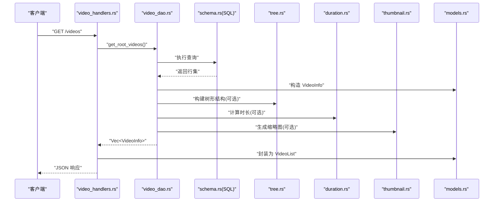
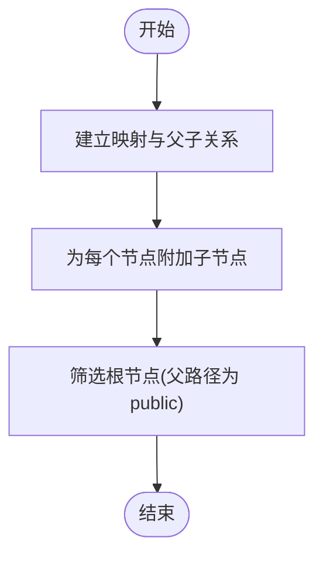
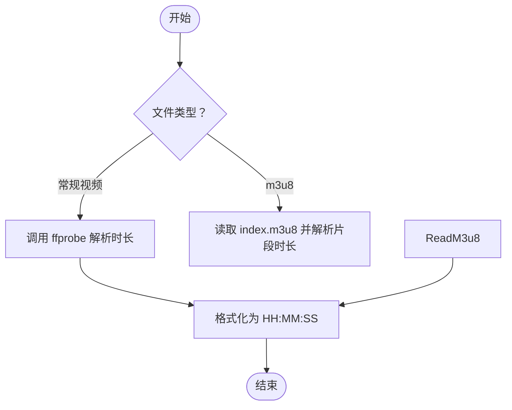
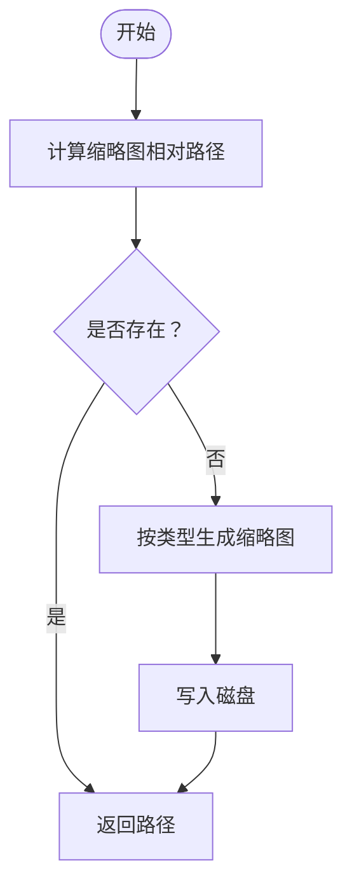

# 数据模型

<cite>
**本文引用的文件**
- [models.rs](file://app/server/src/models.rs)
- [video_dao.rs](file://app/server/src/services/db/video_dao.rs)
- [schema.rs](file://app/server/src/services/db/schema.rs)
- [tree.rs](file://app/server/src/services/db/tree.rs)
- [duration.rs](file://app/server/src/utils/duration.rs)
- [thumbnail.rs](file://app/server/src/utils/thumbnail.rs)
- [video_handlers.rs](file://app/server/src/routes/video_handlers.rs)
- [media.ts](file://app/web/types/media.ts)
- [media-library.tsx](file://app/web/components/media-library.tsx)
- [video-list-item.tsx](file://app/web/components/video-list-item.tsx)
- [Cargo.toml](file://app/server/Cargo.toml)
- [package.json](file://app/web/package.json)
</cite>

## 目录
1. [简介](#简介)
2. [项目结构](#项目结构)
3. [核心组件](#核心组件)
4. [架构概览](#架构概览)
5. [详细组件分析](#详细组件分析)
6. [依赖分析](#依赖分析)
7. [性能考虑](#性能考虑)
8. [故障排查指南](#故障排查指南)
9. [结论](#结论)
10. [附录](#附录)

## 简介
本文件系统采用 Rust 后端与 Next.js 前端的混合架构，数据模型围绕 VideoInfo 实体展开，并通过 VideoList 包装器进行统一输出。VideoInfo 用于承载媒体资源的元数据与层级关系，支持可选字段的 JSON 序列化控制；VideoList 则作为顶层响应容器，便于前端统一消费。本文档将系统性地说明：
- VideoInfo 的字段定义、数据类型、约束与业务含义
- VideoList 的设计目的与使用场景
- JSON 序列化与反序列化的实现细节
- 数据验证规则、默认值与字段转换逻辑
- 实际使用示例与最佳实践

## 项目结构
后端模型与服务位于 app/server/src 下，前端类型与组件位于 app/web 下。整体关系如下：

图表来源
- [models.rs](file://app/server/src/models.rs#L1-L31)
- [video_dao.rs](file://app/server/src/services/db/video_dao.rs#L1-L146)
- [tree.rs](file://app/server/src/services/db/tree.rs#L1-L78)
- [duration.rs](file://app/server/src/utils/duration.rs#L1-L66)
- [thumbnail.rs](file://app/server/src/utils/thumbnail.rs#L1-L99)
- [video_handlers.rs](file://app/server/src/routes/video_handlers.rs#L1-L104)
- [schema.rs](file://app/server/src/services/db/schema.rs#L1-L42)
- [media.ts](file://app/web/types/media.ts#L1-L20)
- [media-library.tsx](file://app/web/components/media-library.tsx#L1-L120)
- [video-list-item.tsx](file://app/web/components/video-list-item.tsx#L1-L93)

章节来源
- [models.rs](file://app/server/src/models.rs#L1-L31)
- [video_dao.rs](file://app/server/src/services/db/video_dao.rs#L1-L146)
- [schema.rs](file://app/server/src/services/db/schema.rs#L1-L42)
- [video_handlers.rs](file://app/server/src/routes/video_handlers.rs#L1-L104)
- [media.ts](file://app/web/types/media.ts#L1-L20)

## 核心组件
本节聚焦数据模型的核心结构与职责边界。

- VideoInfo：后端序列化输出的媒体资源实体，包含基础元数据、可选扩展属性以及 children 字段以表达层级关系。
- VideoList：顶层响应容器，封装一组 VideoInfo，便于前端统一渲染。

章节来源
- [models.rs](file://app/server/src/models.rs#L1-L31)

## 架构概览
下图展示了从数据库到 HTTP 响应再到前端消费的全链路：

图表来源
- [video_handlers.rs](file://app/server/src/routes/video_handlers.rs#L1-L104)
- [video_dao.rs](file://app/server/src/services/db/video_dao.rs#L1-L146)
- [schema.rs](file://app/server/src/services/db/schema.rs#L1-L42)
- [tree.rs](file://app/server/src/services/db/tree.rs#L1-L78)
- [duration.rs](file://app/server/src/utils/duration.rs#L1-L66)
- [thumbnail.rs](file://app/server/src/utils/thumbnail.rs#L1-L99)
- [models.rs](file://app/server/src/models.rs#L1-L31)

## 详细组件分析

### VideoInfo 实体
VideoInfo 是后端 JSON 序列化的核心载体，其字段定义、类型与业务含义如下：

- 字段与类型
  - name: 字符串，媒体项名称
  - path: 字符串，媒体项在文件系统中的绝对或相对路径
  - type: 字符串，媒体类型标识，如 mp4、m3u8、ts、subtitle、image、unknown
  - children: 可选数组，VideoInfo 的子节点集合，用于表达目录/分片层级
  - thumbnail: 可选字符串，缩略图 URL 或相对路径
  - duration: 可选字符串，时长文本（格式通常为 HH:MM:SS）
  - size: 可选字符串，文件大小描述（如 1.2G）
  - resolution: 可选字符串，分辨率描述（如 1920x1080）
  - bitrate: 可选字符串，比特率描述（如 8Mbps）
  - codec: 可选字符串，编解码器信息
  - created_at: 可选字符串，创建时间（ISO 风格字符串）
  - subtitle: 可选字符串，字幕文件路径

- 约束与默认行为
  - 所有可选字段在 JSON 输出时遵循 skip_serializing_if 条件，当值为 None 时不参与序列化，从而保持响应精简。
  - type 字段由数据库 schema 中的常量定义，确保类型枚举的一致性。
  - children 字段仅在目录或 m3u8 类型时填充，用于树形展示。

- 业务含义
  - name/path/type 组合唯一标识一个媒体项，用于前端渲染与路由匹配。
  - children 支持目录树的懒加载与层级展示，避免一次性传输大量数据。
  - thumbnail/duration/size/resolution/bitrate/codec/created_at/ subtitle 提供丰富的媒体信息，提升用户体验。

- 字段转换与生成
  - 时长与缩略图通过工具模块动态生成或解析，随后注入到 VideoInfo 的对应字段。
  - 对于 m3u8 类型，children 为空，因为其子片段不单独存储在数据库中。

- JSON 序列化细节
  - 使用 serde::Serialize 自动派生序列化能力，skip_serializing_if 控制空值字段的输出。
  - 前端类型 MediaItem 与 VideoInfo 字段基本对齐，但前端期望 duration 为数字（秒），后端当前输出为字符串，需注意前后端约定与转换。

章节来源
- [models.rs](file://app/server/src/models.rs#L1-L31)
- [schema.rs](file://app/server/src/services/db/schema.rs#L1-L42)
- [duration.rs](file://app/server/src/utils/duration.rs#L1-L66)
- [thumbnail.rs](file://app/server/src/utils/thumbnail.rs#L1-L99)
- [video_dao.rs](file://app/server/src/services/db/video_dao.rs#L1-L146)
- [tree.rs](file://app/server/src/services/db/tree.rs#L1-L78)
- [media.ts](file://app/web/types/media.ts#L1-L20)

### VideoList 包装器
- 设计目的
  - 将一组 VideoInfo 封装为统一的响应结构，便于前端按页或按树形结构消费。
  - 与后端 JSON 序列化机制配合，保证顶层键名一致且可预测。

- 使用场景
  - 列出根目录媒体项（公共目录）时，直接返回 VideoList。
  - 前端请求某目录详情时，若该目录为目录或 m3u8，后端会将子项填充到 children 并返回 VideoInfo。

- 与处理器的关系
  - 列表接口直接构造 VideoList 并返回 JSON。
  - 详情接口根据 type 决定是否补充 children。

章节来源
- [models.rs](file://app/server/src/models.rs#L28-L31)
- [video_handlers.rs](file://app/server/src/routes/video_handlers.rs#L1-L104)
- [video_dao.rs](file://app/server/src/services/db/video_dao.rs#L1-L146)

### JSON 序列化与反序列化
- 序列化
  - VideoInfo 通过 derive(Serialize) 自动序列化，可选字段按 skip_serializing_if 条件跳过。
  - VideoList 仅包含 videos 字段，作为顶层数组容器。

- 反序列化
  - 当前后端未显式定义反序列化结构，主要通过数据库查询与工具函数生成数据，再序列化输出。
  - 前端类型 MediaItem 与 VideoInfo 字段对齐，但前端期望 duration 为 number，后端输出为 string，建议在接口层做转换或约定统一。

- 前后端类型映射
  - 前端类型定义位于 app/web/types/media.ts，包含 MediaItem 与 MediaResponse。
  - 前端组件 media-library.tsx 与 video-list-item.tsx 消费 MediaItem，展示缩略图、时长、分辨率等信息。

章节来源
- [models.rs](file://app/server/src/models.rs#L1-L31)
- [media.ts](file://app/web/types/media.ts#L1-L20)
- [media-library.tsx](file://app/web/components/media-library.tsx#L1-L120)
- [video-list-item.tsx](file://app/web/components/video-list-item.tsx#L1-L93)

### 数据验证规则与默认值
- 类型校验
  - type 字段来自数据库 schema 常量，确保取值范围有限且稳定。
  - children 仅在目录或 m3u8 类型时填充，避免错误层级结构。

- 默认值策略
  - 可选字段默认 None，序列化时自动省略，减少冗余。
  - 对于 m3u8 类型，children 固定为空，表示子片段不单独存储。

- 字段转换
  - 时长：duration 由 ffprobe 或 m3u8 解析生成，格式为 HH:MM:SS 字符串。
  - 缩略图：thumbnail 由工具模块生成并返回相对路径，前端拼接访问地址。

章节来源
- [schema.rs](file://app/server/src/services/db/schema.rs#L1-L42)
- [video_dao.rs](file://app/server/src/services/db/video_dao.rs#L1-L146)
- [duration.rs](file://app/server/src/utils/duration.rs#L1-L66)
- [thumbnail.rs](file://app/server/src/utils/thumbnail.rs#L1-L99)

### 处理流程与算法
- 树形构建流程
  - 从扁平列表构建树：先建立映射与父子关系，再逐项附加子节点，最后筛选根节点。
  - 根节点判断依据父路径是否为 public 目录。

图表来源
- [tree.rs](file://app/server/src/services/db/tree.rs#L1-L78)

- 时长解析流程
  - 对常规视频：调用 ffprobe 获取时长，转换为 HH:MM:SS。
  - 对 m3u8：读取 index.m3u8，累加 #EXTINF 行的时长，转换为 HH:MM:SS。

图表来源
- [duration.rs](file://app/server/src/utils/duration.rs#L1-L66)

- 缩略图生成流程
  - 计算缩略图相对路径，若不存在则按类型生成：视频文件直接生成，m3u8 优先从 index.m3u8 中提取首个 ts 片段，否则回退默认图标。

图表来源
- [thumbnail.rs](file://app/server/src/utils/thumbnail.rs#L1-L99)

## 依赖分析
- 后端依赖
  - serde/serde_json：提供 JSON 序列化与通用 JSON 结构支持
  - rusqlite：SQLite 访问与查询
  - notify/walkdir：文件系统监控与扫描
  - rayon/regex/chrono/log/log4rs/anyhow：并发、正则、时间、日志与错误处理
  - tokio/axum/tower-http：异步运行时与 HTTP 服务器栈

- 前端依赖
  - next/react 等：页面框架与组件生态
  - lucide-react：图标库
  - hls.js：HLS 播放支持

章节来源
- [Cargo.toml](file://app/server/Cargo.toml#L1-L23)
- [package.json](file://app/web/package.json#L1-L74)

## 性能考虑
- 数据库查询
  - 使用索引与合适的 WHERE 条件（如按 parent_path 查询）减少扫描范围。
  - 排序策略（type DESC, name ASC）有助于前端稳定展示顺序。

- 树形构建
  - O(n) 映射与父子关系追踪，O(n) 附加子节点，整体线性复杂度。
  - 避免重复构建，必要时缓存中间结果。

- 工具函数
  - 时长解析与缩略图生成涉及外部命令与文件 IO，建议：
    - 异步执行与超时控制
    - 结果缓存与增量更新
    - 错误重试与降级策略（如默认缩略图）

- 前端渲染
  - 使用虚拟滚动与懒加载图片，减少首屏压力
  - 对高频交互（过滤、排序）进行防抖

## 故障排查指南
- 时长解析失败
  - 现象：duration 为 None
  - 排查：确认 ffprobe 是否可用、输入路径是否存在、权限是否足够
  - 参考：[duration.rs](file://app/server/src/utils/duration.rs#L1-L66)

- 缩略图生成失败
  - 现象：thumbnail 为 None
  - 排查：确认 thumbnails 目录可写、目标文件存在、m3u8 中是否存在有效 ts 片段
  - 参考：[thumbnail.rs](file://app/server/src/utils/thumbnail.rs#L1-L99)

- 数据库查询异常
  - 现象：HTTP 500
  - 排查：检查 SQL 语句、表结构、连接状态
  - 参考：[schema.rs](file://app/server/src/services/db/schema.rs#L1-L42)

- 前后端字段不一致
  - 现象：前端显示时长为 NaN
  - 排查：确认后端输出 duration 为字符串，前端是否将其转换为数字
  - 参考：[models.rs](file://app/server/src/models.rs#L1-L31)，[media.ts](file://app/web/types/media.ts#L1-L20)

章节来源
- [duration.rs](file://app/server/src/utils/duration.rs#L1-L66)
- [thumbnail.rs](file://app/server/src/utils/thumbnail.rs#L1-L99)
- [schema.rs](file://app/server/src/services/db/schema.rs#L1-L42)
- [models.rs](file://app/server/src/models.rs#L1-L31)
- [media.ts](file://app/web/types/media.ts#L1-L20)

## 结论
VideoInfo 与 VideoList 构成了本项目的媒体数据模型基石。通过可选字段的 JSON 序列化控制、树形结构构建与工具函数的动态生成，系统实现了高效、灵活且可扩展的媒体资源展示能力。建议在后续迭代中：
- 明确前后端字段类型约定（尤其是 duration 的数值化）
- 引入更严格的输入校验与默认值策略
- 优化工具函数的缓存与容错机制
- 增强错误日志与可观测性

## 附录

### 字段对照与最佳实践
- 字段对照
  - 后端 VideoInfo 与前端 MediaItem 字段基本对齐，建议在接口层统一转换（如将 duration 从字符串转为 number）。
- 最佳实践
  - 使用 VideoList 作为顶层响应容器，便于前端统一处理
  - 对 children 的懒加载与按需渲染，降低初始负载
  - 对外部命令与文件 IO 的调用增加超时与重试
  - 对缩略图与时长生成进行缓存，避免重复计算

章节来源
- [models.rs](file://app/server/src/models.rs#L1-L31)
- [media.ts](file://app/web/types/media.ts#L1-L20)
- [video-list-item.tsx](file://app/web/components/video-list-item.tsx#L1-L93)
- [media-library.tsx](file://app/web/components/media-library.tsx#L1-L120)