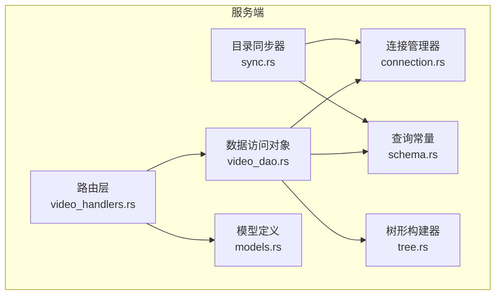
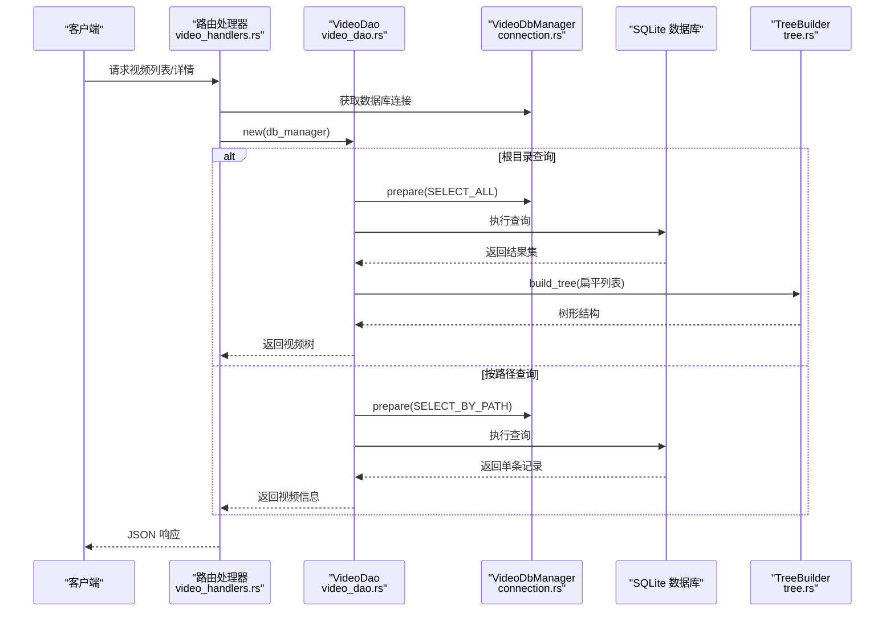
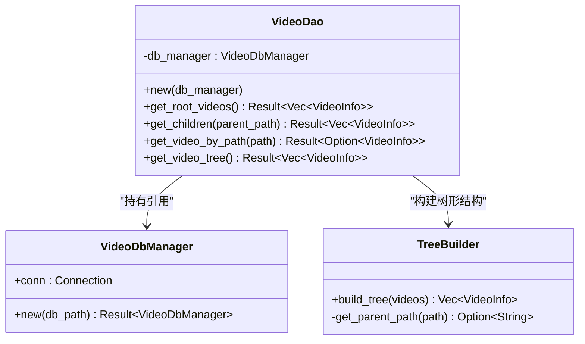
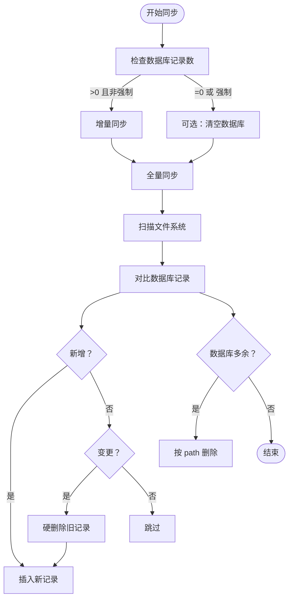
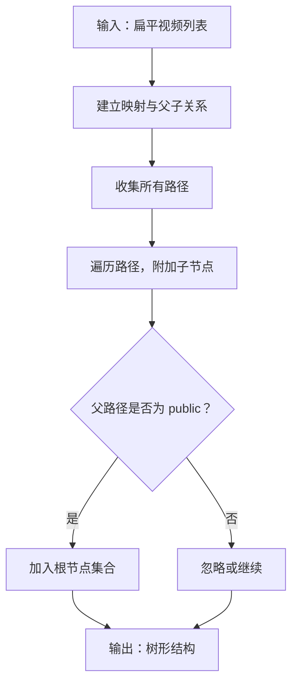
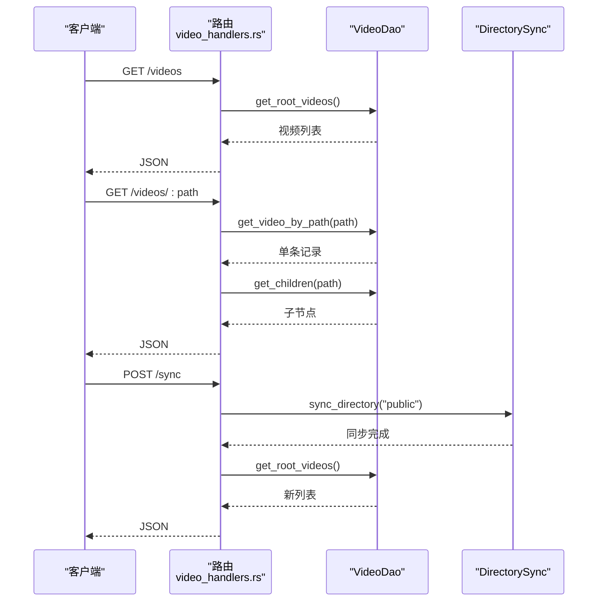
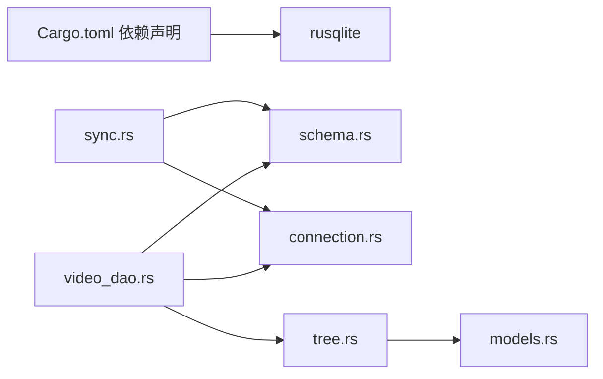

# 数据访问对象

<cite>
**本文引用的文件**
- [video_dao.rs](file://app/server/src/services/db/video_dao.rs)
- [connection.rs](file://app/server/src/services/db/connection.rs)
- [schema.rs](file://app/server/src/services/db/schema.rs)
- [tree.rs](file://app/server/src/services/db/tree.rs)
- [sync.rs](file://app/server/src/services/db/sync.rs)
- [models.rs](file://app/server/src/models.rs)
- [video_handlers.rs](file://app/server/src/routes/video_handlers.rs)
- [Cargo.toml](file://app/server/Cargo.toml)
</cite>

## 目录
1. [简介](#简介)
2. [项目结构](#项目结构)
3. [核心组件](#核心组件)
4. [架构总览](#架构总览)
5. [详细组件分析](#详细组件分析)
6. [依赖分析](#依赖分析)
7. [性能考虑](#性能考虑)
8. [故障排查指南](#故障排查指南)
9. [结论](#结论)
10. [附录](#附录)

## 简介
本文件围绕视频数据访问对象 VideoDao 的实现进行深入文档化，重点覆盖其 CRUD 操作（当前实现以查询为主）、事务管理机制与错误处理策略、查询优化技术（参数绑定、批量操作、结果集处理）、DAO 接口设计原则与使用模式，并提供实际调用示例与性能优化建议。由于当前仓库中 VideoDao 的实现主要聚焦于查询能力，本文将基于现有代码对“插入、查询、更新、删除”的 SQL 语句与流程进行系统梳理，并结合同步模块中的更新/删除实现说明整体数据流。

## 项目结构
该服务端采用 Rust + SQLite（rusqlite）实现，数据库层位于 app/server/src/services/db 下，包含连接管理、查询常量、DAO 实现、树形结构构建以及目录同步等功能模块；模型定义位于 app/server/src/models.rs；HTTP 路由位于 app/server/src/routes/video_handlers.rs；数据库依赖在 app/server/Cargo.toml 中声明。

图表来源
- [video_dao.rs](file://app/server/src/services/db/video_dao.rs#L1-L146)
- [connection.rs](file://app/server/src/services/db/connection.rs#L1-L122)
- [schema.rs](file://app/server/src/services/db/schema.rs#L1-L42)
- [tree.rs](file://app/server/src/services/db/tree.rs#L1-L78)
- [sync.rs](file://app/server/src/services/db/sync.rs#L1-L413)
- [models.rs](file://app/server/src/models.rs#L1-L32)
- [video_handlers.rs](file://app/server/src/routes/video_handlers.rs#L1-L104)

章节来源
- [video_dao.rs](file://app/server/src/services/db/video_dao.rs#L1-L146)
- [connection.rs](file://app/server/src/services/db/connection.rs#L1-L122)
- [schema.rs](file://app/server/src/services/db/schema.rs#L1-L42)
- [tree.rs](file://app/server/src/services/db/tree.rs#L1-L78)
- [sync.rs](file://app/server/src/services/db/sync.rs#L1-L413)
- [models.rs](file://app/server/src/models.rs#L1-L32)
- [video_handlers.rs](file://app/server/src/routes/video_handlers.rs#L1-L104)
- [Cargo.toml](file://app/server/Cargo.toml#L1-L22)

## 核心组件
- VideoDbManager：负责打开/初始化 SQLite 连接、创建表结构与索引、执行数据库迁移。
- VideoDao：封装视频数据的查询操作（根目录视频、子节点、按路径查询、树形重建），当前未直接暴露插入/更新/删除方法。
- DirectorySync：负责文件系统与数据库的双向同步，内部实现插入、硬删除等写操作。
- 查询常量 queries：集中定义 SQL 语句，便于维护与复用。
- TreeBuilder：将扁平的视频列表转换为树形结构，支持按 parent_path 关系构建层级。
- VideoInfo：序列化模型，承载视频信息字段。

章节来源
- [connection.rs](file://app/server/src/services/db/connection.rs#L1-L122)
- [video_dao.rs](file://app/server/src/services/db/video_dao.rs#L1-L146)
- [schema.rs](file://app/server/src/services/db/schema.rs#L1-L42)
- [tree.rs](file://app/server/src/services/db/tree.rs#L1-L78)
- [models.rs](file://app/server/src/models.rs#L1-L32)

## 架构总览
VideoDao 通过 VideoDbManager 获取底层 Connection，使用 schema.rs 中的查询常量执行 SQL。目录同步器 DirectorySync 在写操作场景中使用相同查询常量执行插入与删除。树形构建器 TreeBuilder 将查询结果转换为树形结构，供上层路由使用。

图表来源
- [video_handlers.rs](file://app/server/src/routes/video_handlers.rs#L1-L104)
- [video_dao.rs](file://app/server/src/services/db/video_dao.rs#L1-L146)
- [connection.rs](file://app/server/src/services/db/connection.rs#L1-L122)
- [tree.rs](file://app/server/src/services/db/tree.rs#L1-L78)

## 详细组件分析

### VideoDao 组件分析
VideoDao 当前实现集中在查询能力：
- get_root_videos：按父路径为 public 的视频集合进行查询，返回顶层视频列表。
- get_children：根据父路径查询子节点；若父节点类型为 m3u8，则返回空集合（文件不单独存储）。
- get_video_by_path：按唯一路径查询单条记录。
- get_video_tree：查询全部记录并交由 TreeBuilder 构建树形结构。

图表来源
- [video_dao.rs](file://app/server/src/services/db/video_dao.rs#L1-L146)
- [connection.rs](file://app/server/src/services/db/connection.rs#L1-L122)
- [tree.rs](file://app/server/src/services/db/tree.rs#L1-L78)

章节来源
- [video_dao.rs](file://app/server/src/services/db/video_dao.rs#L1-L146)

### 查询常量与 SQL 语句
schema.rs 中集中定义了查询常量，便于统一维护与复用：
- INSERT_NEW：插入新视频记录，字段顺序与 DirectorySync 中的插入参数一一对应。
- SELECT_ALL：查询全部视频，按类型降序、名称升序排序。
- SELECT_ALL_FULL：查询全部视频完整信息（不排序）。
- SELECT_BY_PARENT：按父路径查询，按类型降序、名称升序排序。
- SELECT_BY_PATH：按路径查询单条记录。
- SELECT_TYPE_BY_PATH：按路径查询类型，用于判断是否为 m3u8。

章节来源
- [schema.rs](file://app/server/src/services/db/schema.rs#L1-L42)

### 目录同步器与写操作
DirectorySync 在双向同步过程中实现写操作：
- initialize_from_directory：根据是否已有记录决定全量或增量同步；支持强制重新初始化。
- bidirectional_sync：扫描文件系统与数据库，处理新增、变更、删除三类场景。
- insert_new_record：使用 INSERT_NEW 执行插入，参数绑定字段包括 name、path、type、parent_path、thumbnail、size、created_at、subtitle、last_modified、duration。
- hard_delete_record：按 path 删除记录。

图表来源
- [sync.rs](file://app/server/src/services/db/sync.rs#L44-L171)
- [schema.rs](file://app/server/src/services/db/schema.rs#L1-L42)

章节来源
- [sync.rs](file://app/server/src/services/db/sync.rs#L44-L171)
- [schema.rs](file://app/server/src/services/db/schema.rs#L1-L42)

### 树形结构构建
TreeBuilder 将扁平的 VideoInfo 列表转换为树形结构：
- 第一遍：建立路径到 VideoInfo 的映射，并记录父子关系。
- 第二遍：为每个节点附加子节点，筛选根节点（父路径为 public）。
- get_parent_path：从路径解析父路径，用于构建父子映射。

图表来源
- [tree.rs](file://app/server/src/services/db/tree.rs#L1-L78)

章节来源
- [tree.rs](file://app/server/src/services/db/tree.rs#L1-L78)

### 路由层使用示例
- list_videos：获取根目录视频列表，内部通过 VideoDao::get_root_videos 实现。
- get_video_details：按路径查询视频详情，若为目录或 m3u8 类型则补充子节点。
- sync_videos：触发目录同步后，重新查询根目录视频列表返回给前端。

图表来源
- [video_handlers.rs](file://app/server/src/routes/video_handlers.rs#L1-L104)
- [video_dao.rs](file://app/server/src/services/db/video_dao.rs#L1-L146)
- [sync.rs](file://app/server/src/services/db/sync.rs#L82-L171)

章节来源
- [video_handlers.rs](file://app/server/src/routes/video_handlers.rs#L1-L104)
- [video_dao.rs](file://app/server/src/services/db/video_dao.rs#L1-L146)
- [sync.rs](file://app/server/src/services/db/sync.rs#L82-L171)

## 依赖分析
- 外部依赖：rusqlite（SQLite 驱动），版本在 Cargo.toml 中声明。
- 内部依赖：schema.rs 提供 SQL 常量；video_dao.rs 依赖 connection.rs 与 schema.rs；tree.rs 依赖 models.rs；sync.rs 同时依赖 connection.rs 与 schema.rs。

图表来源
- [Cargo.toml](file://app/server/Cargo.toml#L1-L22)
- [schema.rs](file://app/server/src/services/db/schema.rs#L1-L42)
- [video_dao.rs](file://app/server/src/services/db/video_dao.rs#L1-L146)
- [connection.rs](file://app/server/src/services/db/connection.rs#L1-L122)
- [tree.rs](file://app/server/src/services/db/tree.rs#L1-L78)
- [sync.rs](file://app/server/src/services/db/sync.rs#L1-L413)
- [models.rs](file://app/server/src/models.rs#L1-L32)

章节来源
- [Cargo.toml](file://app/server/Cargo.toml#L1-L22)
- [schema.rs](file://app/server/src/services/db/schema.rs#L1-L42)
- [video_dao.rs](file://app/server/src/services/db/video_dao.rs#L1-L146)
- [connection.rs](file://app/server/src/services/db/connection.rs#L1-L122)
- [tree.rs](file://app/server/src/services/db/tree.rs#L1-L78)
- [sync.rs](file://app/server/src/services/db/sync.rs#L1-L413)
- [models.rs](file://app/server/src/models.rs#L1-L32)

## 性能考虑
- 索引优化：connection.rs 中为 path 与 parent_path 建立索引，有助于加速按路径与父子关系的查询。
- 查询排序：schema.rs 中 SELECT_ALL 与 SELECT_BY_PARENT 使用 ORDER BY type DESC, name ASC，有利于稳定展示顺序。
- 结果集处理：video_dao.rs 使用 query_map 将行映射为 VideoInfo，避免手动逐列读取，减少样板代码与潜在错误。
- 参数绑定：schema.rs 的查询常量与 sync.rs 的插入参数均采用占位符绑定，降低 SQL 注入风险并提升执行计划复用率。
- 批量操作：当前未见显式批量插入/更新逻辑；DirectorySync 在同步过程中按文件逐条处理，若需大规模写入可考虑事务包裹与批量写入策略（见“事务管理”章节建议）。
- 缓存与去重：TreeBuilder 在构建树时使用哈希映射与子节点列表，时间复杂度 O(n)，适合中等规模数据。

章节来源
- [connection.rs](file://app/server/src/services/db/connection.rs#L36-L41)
- [schema.rs](file://app/server/src/services/db/schema.rs#L1-L42)
- [video_dao.rs](file://app/server/src/services/db/video_dao.rs#L1-L146)
- [sync.rs](file://app/server/src/services/db/sync.rs#L116-L171)

## 故障排查指南
- 路由层错误处理：video_handlers.rs 对数据库错误进行捕获并返回 HTTP 500，同时携带错误信息；找不到路径时返回 404。
- 数据库迁移：connection.rs 在初始化时执行迁移，自动清理旧列并重建索引，避免历史版本兼容问题。
- 同步过程日志：sync.rs 在各阶段打印耗时与统计信息，便于定位性能瓶颈与异常点。
- 常见问题定位：
  - 查询不到数据：确认 path 是否正确、是否已同步至数据库。
  - m3u8 目录无子节点：get_children 对 m3u8 类型返回空集合属预期行为。
  - 性能问题：检查索引是否生效、查询是否带排序、是否频繁重复查询。

章节来源
- [video_handlers.rs](file://app/server/src/routes/video_handlers.rs#L1-L104)
- [connection.rs](file://app/server/src/services/db/connection.rs#L50-L121)
- [sync.rs](file://app/server/src/services/db/sync.rs#L44-L171)

## 结论
当前仓库的 VideoDao 主要聚焦于查询能力，配合 schema.rs 的查询常量与 connection.rs 的索引策略，能够高效地支持视频列表与树形结构的构建。写操作通过 DirectorySync 实现，采用硬删除与插入替换的方式保证一致性。未来可在 VideoDao 中增加插入、更新、删除方法，并引入事务管理与批量操作以进一步提升性能与可靠性。

## 附录

### DAO 接口设计原则与使用模式
- 设计原则
  - 单一职责：VideoDao 仅负责视频数据的查询，写操作由 DirectorySync 承担，保持关注点分离。
  - 明确边界：通过 schema.rs 集中管理 SQL，避免分散硬编码。
  - 参数绑定：始终使用占位符绑定参数，确保安全与可维护性。
  - 结果映射：使用 query_map 将行映射为模型对象，减少样板代码。
- 使用模式
  - 路由层通过 State 获取数据库连接，构造 VideoDao 并调用相应查询方法。
  - 对于树形结构需求，先查询扁平列表，再交由 TreeBuilder 构建。
  - 对于写操作，调用 DirectorySync 的同步方法，内部会处理插入与删除。

章节来源
- [video_dao.rs](file://app/server/src/services/db/video_dao.rs#L1-L146)
- [schema.rs](file://app/server/src/services/db/schema.rs#L1-L42)
- [tree.rs](file://app/server/src/services/db/tree.rs#L1-L78)
- [video_handlers.rs](file://app/server/src/routes/video_handlers.rs#L1-L104)

### 实际调用示例（路径指引）
- 获取根目录视频列表
  - 路由：[list_videos](file://app/server/src/routes/video_handlers.rs#L15-L28)
  - DAO 方法：[get_root_videos](file://app/server/src/services/db/video_dao.rs#L52-L79)
- 获取指定路径视频详情与子节点
  - 路由：[get_video_details](file://app/server/src/routes/video_handlers.rs#L31-L70)
  - DAO 方法：[get_video_by_path](file://app/server/src/services/db/video_dao.rs#L122-L144)、[get_children](file://app/server/src/services/db/video_dao.rs#L82-L119)
- 触发数据库同步
  - 路由：[sync_videos](file://app/server/src/routes/video_handlers.rs#L72-L103)
  - 同步器：[initialize_from_directory](file://app/server/src/services/db/sync.rs#L44-L79)、[bidirectional_sync](file://app/server/src/services/db/sync.rs#L86-L171)

章节来源
- [video_handlers.rs](file://app/server/src/routes/video_handlers.rs#L15-L103)
- [video_dao.rs](file://app/server/src/services/db/video_dao.rs#L52-L144)
- [sync.rs](file://app/server/src/services/db/sync.rs#L44-L171)

### 事务管理与错误处理策略（建议）
- 事务管理
  - 在批量写入场景（如大规模导入/同步）建议使用事务包裹，减少多次提交带来的开销与一致性风险。
  - 可参考 rusqlite 的事务 API，在写操作前后开启/提交事务。
- 错误处理
  - 路由层统一捕获数据库错误并返回标准 HTTP 状态码与错误信息。
  - DAO 层保持 Result 返回类型，上层根据业务语义决定是否转换为 HTTP 响应。
  - 对于并发访问，注意数据库连接的互斥访问（当前路由层通过锁获取连接，可按需调整为更细粒度的并发控制）。

章节来源
- [video_handlers.rs](file://app/server/src/routes/video_handlers.rs#L1-L104)
- [Cargo.toml](file://app/server/Cargo.toml#L1-L22)