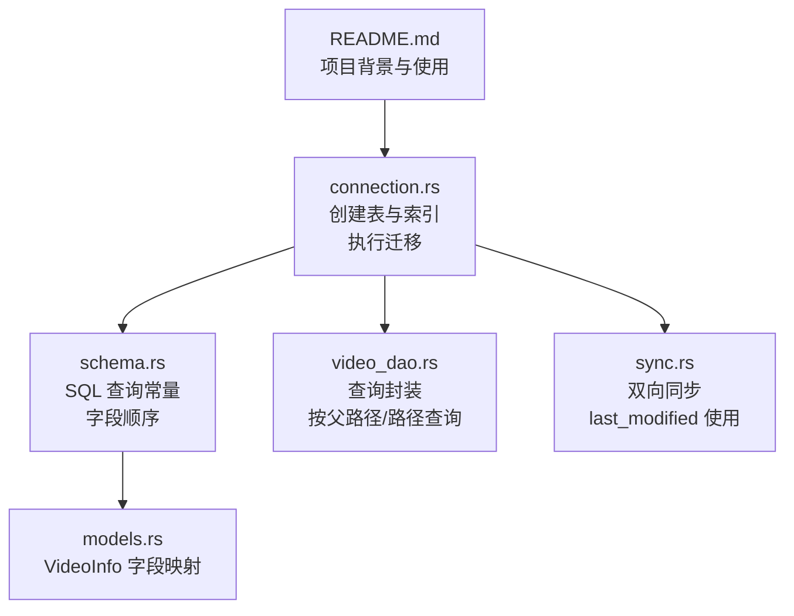
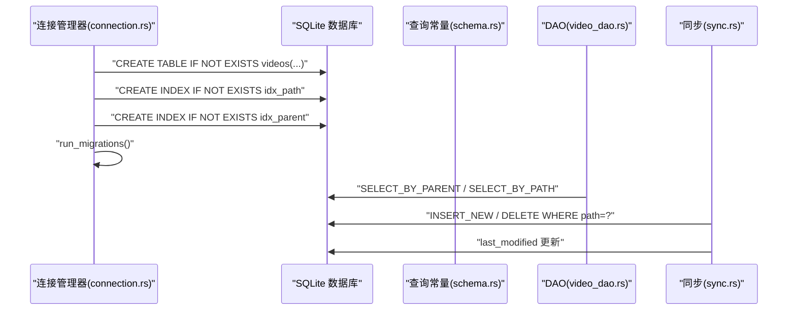
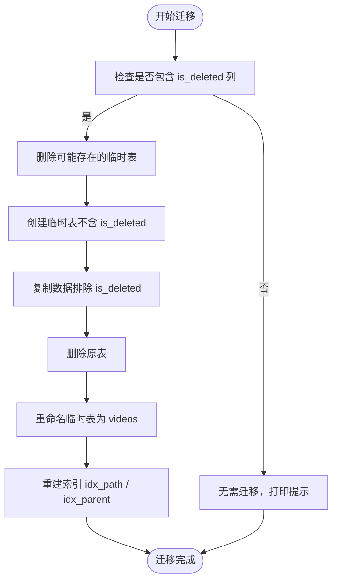
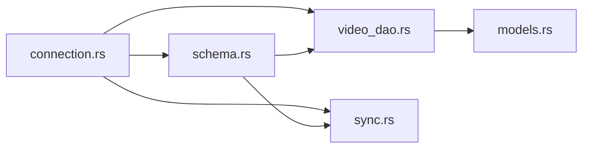

# 表结构设计

<cite>
**本文引用的文件**
- [connection.rs](file://app/server/src/services/db/connection.rs)
- [schema.rs](file://app/server/src/services/db/schema.rs)
- [video_dao.rs](file://app/server/src/services/db/video_dao.rs)
- [sync.rs](file://app/server/src/services/db/sync.rs)
- [models.rs](file://app/server/src/models.rs)
- [README.md](file://README.md)
</cite>

## 目录
1. [引言](#引言)
2. [项目结构](#项目结构)
3. [核心组件](#核心组件)
4. [架构总览](#架构总览)
5. [详细组件分析](#详细组件分析)
6. [依赖分析](#依赖分析)
7. [性能考量](#性能考量)
8. [故障排查指南](#故障排查指南)
9. [结论](#结论)
10. [附录](#附录)

## 引言
本文件聚焦于数据库表“videos”的结构设计与演进，涵盖主键、唯一约束、索引策略、外键关系、字段设计考虑（如 path 的唯一性、last_modified 的时间戳设计）、索引作用与性能影响，以及表结构演进历史与版本兼容性说明，并提供实际的 SQL 创建语句与修改建议。内容严格依据仓库中的数据库初始化、查询与迁移逻辑进行归纳总结。

## 项目结构
围绕数据库表结构的关键文件组织如下：
- 数据库连接与表初始化：connection.rs
- SQL 查询常量与字段顺序：schema.rs
- DAO 层封装查询与业务调用：video_dao.rs
- 双向同步与 last_modified 使用：sync.rs
- 前端模型映射：models.rs
- 项目说明与使用背景：README.md

图表来源
- [connection.rs](file://app/server/src/services/db/connection.rs#L1-L121)
- [schema.rs](file://app/server/src/services/db/schema.rs#L1-L41)
- [video_dao.rs](file://app/server/src/services/db/video_dao.rs#L1-L146)
- [sync.rs](file://app/server/src/services/db/sync.rs#L1-L200)
- [models.rs](file://app/server/src/models.rs#L1-L32)
- [README.md](file://README.md#L1-L513)

章节来源
- [connection.rs](file://app/server/src/services/db/connection.rs#L1-L121)
- [schema.rs](file://app/server/src/services/db/schema.rs#L1-L41)
- [video_dao.rs](file://app/server/src/services/db/video_dao.rs#L1-L146)
- [sync.rs](file://app/server/src/services/db/sync.rs#L1-L200)
- [models.rs](file://app/server/src/models.rs#L1-L32)
- [README.md](file://README.md#L1-L513)

## 核心组件
- 数据库连接与表初始化：负责创建 videos 表、索引，以及执行迁移逻辑。
- SQL 查询常量：定义插入与查询语句，明确字段顺序与用途。
- DAO 层：封装按父路径与路径的查询，支撑目录树构建与子节点查询。
- 同步器：负责文件系统与数据库的双向同步，使用 last_modified 字段判断变更。
- 模型映射：VideoInfo 字段与数据库列一一对应，便于序列化输出。

章节来源
- [connection.rs](file://app/server/src/services/db/connection.rs#L1-L121)
- [schema.rs](file://app/server/src/services/db/schema.rs#L1-L41)
- [video_dao.rs](file://app/server/src/services/db/video_dao.rs#L1-L146)
- [sync.rs](file://app/server/src/services/db/sync.rs#L1-L200)
- [models.rs](file://app/server/src/models.rs#L1-L32)

## 架构总览
videos 表的创建、索引与迁移由连接管理器统一处理；DAO 层通过查询常量访问表；同步器在双向同步中使用 last_modified 字段；最终通过模型映射对外提供 JSON 结果。

图表来源
- [connection.rs](file://app/server/src/services/db/connection.rs#L1-L121)
- [schema.rs](file://app/server/src/services/db/schema.rs#L1-L41)
- [video_dao.rs](file://app/server/src/services/db/video_dao.rs#L1-L146)
- [sync.rs](file://app/server/src/services/db/sync.rs#L1-L200)

## 详细组件分析

### videos 表结构定义
- 表名：videos
- 主键：id（自增整数）
- 唯一约束：path（保证同一路径只有一条记录）
- 索引：idx_path（path）、idx_parent（parent_path）
- 字段设计要点：
  - path：唯一标识视频文件或目录的路径字符串，用于快速定位与去重。
  - last_modified：整型时间戳（秒级），用于双向同步时判断变更。
  - parent_path：用于构建目录树与按父路径查询。
  - type：视频类型（如 mp4、m3u8、ts、subtitle、image、unknown）。
  - 元数据：duration、size、resolution、bitrate、codec、created_at、subtitle 等。
- 外键关系：未定义显式外键约束（无 FK 约束）。

章节来源
- [connection.rs](file://app/server/src/services/db/connection.rs#L16-L41)
- [schema.rs](file://app/server/src/services/db/schema.rs#L16-L41)
- [video_dao.rs](file://app/server/src/services/db/video_dao.rs#L51-L119)
- [sync.rs](file://app/server/src/services/db/sync.rs#L386-L411)
- [models.rs](file://app/server/src/models.rs#L1-L32)

### 字段设计考虑
- path 的唯一性：通过唯一约束确保同一物理路径仅对应一条记录，避免重复扫描与冗余数据。
- last_modified 的时间戳设计：采用整型秒级时间戳，便于比较与同步判断；DAO 层在按路径查询时也使用该字段参与判断。
- parent_path 的设计：用于目录树构建与按父路径查询，配合 idx_parent 索引提升查询效率。
- created_at：字符串形式存储创建时间，便于人类可读与序列化输出。
- 元数据字段：duration、size、resolution、bitrate、codec、subtitle 等，用于前端展示与播放器配置。

章节来源
- [connection.rs](file://app/server/src/services/db/connection.rs#L16-L41)
- [schema.rs](file://app/server/src/services/db/schema.rs#L16-L41)
- [video_dao.rs](file://app/server/src/services/db/video_dao.rs#L51-L119)
- [sync.rs](file://app/server/src/services/db/sync.rs#L386-L411)
- [models.rs](file://app/server/src/models.rs#L1-L32)

### 索引策略与性能影响
- idx_path（path）：用于按路径精确查找，如按路径获取视频详情、删除记录等，显著降低全表扫描成本。
- idx_parent（parent_path）：用于按父路径查询子节点，如根目录或某目录下的视频列表，提升目录树构建与分页查询性能。
- 性能影响：
  - 查询密集场景（频繁按路径或父路径查询）下，索引可显著减少 IO 与 CPU 开销。
  - 写入密集场景（大量新增/删除）下，索引会带来额外写入开销，但整体收益通常大于成本。
  - 建议：在生产环境中保持索引；若数据量极大且查询模式固定，可评估复合索引或分区策略（需结合实际查询模式）。

章节来源
- [connection.rs](file://app/server/src/services/db/connection.rs#L36-L41)
- [schema.rs](file://app/server/src/services/db/schema.rs#L30-L41)
- [video_dao.rs](file://app/server/src/services/db/video_dao.rs#L51-L119)

### 外键关系
- 未定义显式外键约束。parent_path 字段用于表示父子关系，但未通过外键约束强制一致性。
- 若未来需要强一致的层级关系，可考虑：
  - 在 parent_path 上建立唯一性约束（与 path 协同）。
  - 引入层级枚举或路径层级字段，便于更严格的约束与查询优化。
- 当前实现通过业务逻辑（DAO 层按父路径查询）与索引共同保证查询正确性。

章节来源
- [connection.rs](file://app/server/src/services/db/connection.rs#L16-L41)
- [video_dao.rs](file://app/server/src/services/db/video_dao.rs#L51-L119)

### 表结构演进历史与版本兼容性
- 历史演进：
  - 旧版本存在 is_deleted 列，新版本已移除该列。
  - 迁移流程：检测表结构 -> 创建临时表（不含 is_deleted）-> 复制数据 -> 删除原表 -> 重命名临时表 -> 重建索引。
- 版本兼容性：
  - 迁移逻辑具备幂等性：若检测到新结构则跳过迁移，避免重复执行。
  - 新增字段（如 last_modified）默认值为 0，确保旧数据在迁移后也能正常工作。
- 建议：
  - 未来新增字段应提供默认值或迁移脚本，避免破坏既有数据。
  - 对于删除字段，应先迁移至临时表再替换，确保数据安全。

图表来源
- [connection.rs](file://app/server/src/services/db/connection.rs#L50-L121)

章节来源
- [connection.rs](file://app/server/src/services/db/connection.rs#L50-L121)

### 实际 SQL 创建语句与修改建议
- 创建表（videos）：
  - 主键：id（自增）
  - 唯一约束：path
  - 索引：idx_path(path)、idx_parent(parent_path)
  - 字段：name、path、type、thumbnail、duration、size、resolution、bitrate、codec、created_at、subtitle、parent_path、last_modified
- 修改建议：
  - 若需要强一致的层级关系，可考虑在 parent_path 上增加唯一性约束（与 path 协同）。
  - 若查询模式包含“按类型+父路径”组合，可评估创建复合索引（如 idx_type_parent(type,parent_path)）。
  - 若需要支持软删除，可恢复 is_deleted 列并在查询中加入过滤条件，同时保留迁移逻辑。

章节来源
- [connection.rs](file://app/server/src/services/db/connection.rs#L16-L41)
- [schema.rs](file://app/server/src/services/db/schema.rs#L16-L41)

## 依赖分析
- 组件耦合：
  - connection.rs 是核心入口，负责表结构与索引初始化及迁移。
  - schema.rs 提供查询常量与字段顺序，DAO 层与同步器均依赖其常量。
  - video_dao.rs 依赖 schema.rs 的查询常量，实现按父路径与路径的查询。
  - sync.rs 依赖 schema.rs 的查询常量与 connection.rs 的连接，负责双向同步与 last_modified 更新。
- 外部依赖：
  - SQLite（rusqlite）用于本地数据库存储。
  - 无外部 ORM，采用原生 SQL 与查询常量，便于控制字段顺序与性能。

图表来源
- [connection.rs](file://app/server/src/services/db/connection.rs#L1-L121)
- [schema.rs](file://app/server/src/services/db/schema.rs#L1-L41)
- [video_dao.rs](file://app/server/src/services/db/video_dao.rs#L1-L146)
- [sync.rs](file://app/server/src/services/db/sync.rs#L1-L200)
- [models.rs](file://app/server/src/models.rs#L1-L32)

章节来源
- [connection.rs](file://app/server/src/services/db/connection.rs#L1-L121)
- [schema.rs](file://app/server/src/services/db/schema.rs#L1-L41)
- [video_dao.rs](file://app/server/src/services/db/video_dao.rs#L1-L146)
- [sync.rs](file://app/server/src/services/db/sync.rs#L1-L200)
- [models.rs](file://app/server/src/models.rs#L1-L32)

## 性能考量
- 索引选择：
  - idx_path 适合按路径精确查找，如详情查询与删除。
  - idx_parent 适合按父路径查询，如目录树构建与分页。
- 写入性能：
  - 频繁新增/删除会增加索引维护成本，建议批量写入或在低峰期执行大规模变更。
- 查询优化：
  - 若存在“按类型+父路径”组合查询，可评估复合索引。
  - 对于大数据量，可考虑分页与限制返回字段，减少网络与序列化开销。
- 时间戳字段：
  - last_modified 采用整型秒级时间戳，便于比较与同步，建议保持统一时间源（如系统时间）。

章节来源
- [connection.rs](file://app/server/src/services/db/connection.rs#L36-L41)
- [schema.rs](file://app/server/src/services/db/schema.rs#L30-L41)
- [sync.rs](file://app/server/src/services/db/sync.rs#L386-L411)

## 故障排查指南
- 数据库迁移失败：
  - 现象：迁移过程抛错或索引未重建。
  - 排查：确认临时表是否残留；检查 PRAGMA table_info 是否包含 is_deleted；重新执行迁移逻辑。
- 查询异常：
  - 现象：按路径或父路径查询结果为空。
  - 排查：确认 path 与 parent_path 是否正确；确认索引是否存在；核对查询常量字段顺序。
- 同步不生效：
  - 现象：文件变更未反映到数据库。
  - 排查：确认 last_modified 是否更新；检查 is_record_changed 判断逻辑；确认双向同步流程是否执行。

章节来源
- [connection.rs](file://app/server/src/services/db/connection.rs#L50-L121)
- [schema.rs](file://app/server/src/services/db/schema.rs#L16-L41)
- [video_dao.rs](file://app/server/src/services/db/video_dao.rs#L51-L119)
- [sync.rs](file://app/server/src/services/db/sync.rs#L116-L171)

## 结论
videos 表采用简洁而实用的结构设计：以 path 为唯一键确保数据一致性，配合 last_modified 实现高效的双向同步；通过 idx_path 与 idx_parent 索引满足常见查询需求。迁移逻辑保障了版本演进的平滑过渡。未来可根据查询模式与数据规模进一步优化索引与字段设计，以获得更佳的性能与可维护性。

## 附录
- 项目背景与使用：README.md 提供了项目简介、功能特性与使用说明，有助于理解 videos 表在整体系统中的角色与数据流向。

章节来源
- [README.md](file://README.md#L1-L513)