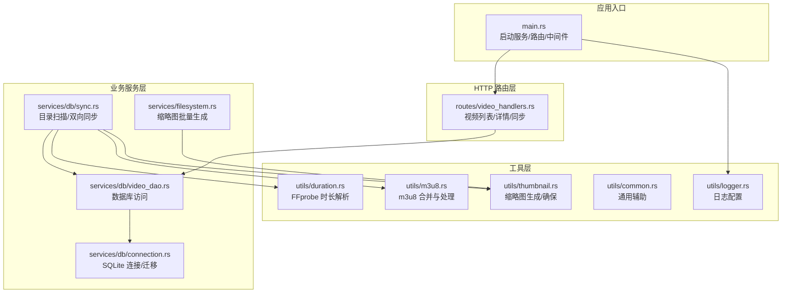
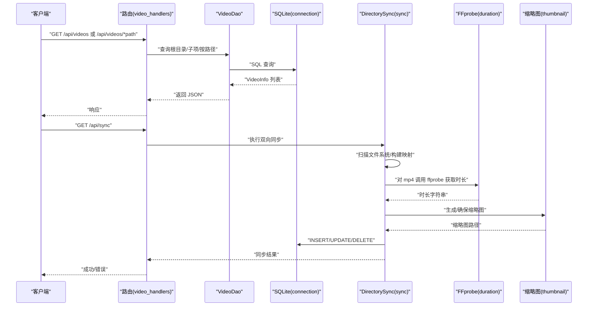
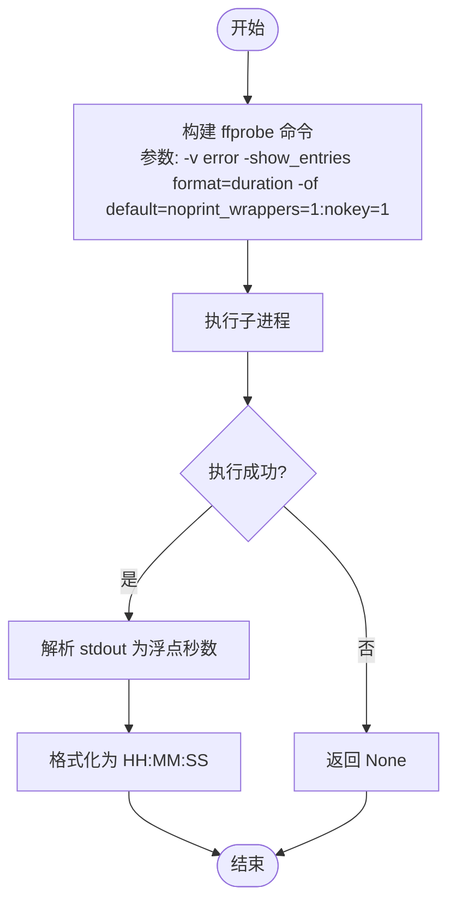
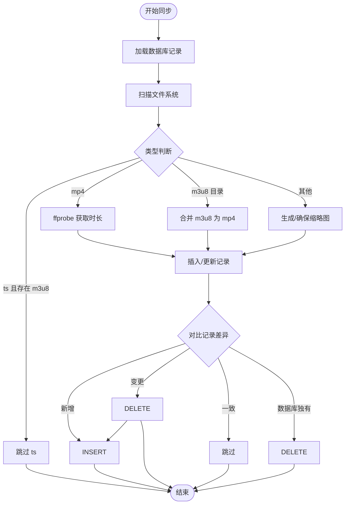
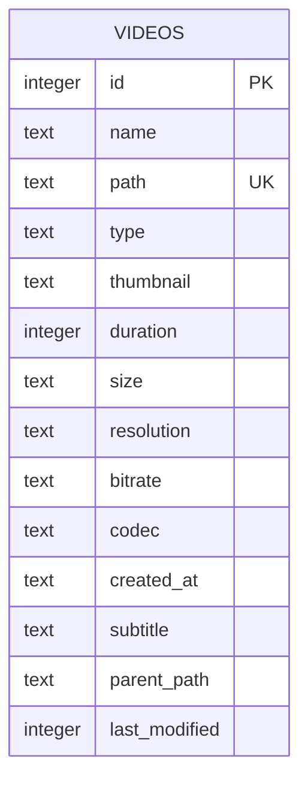
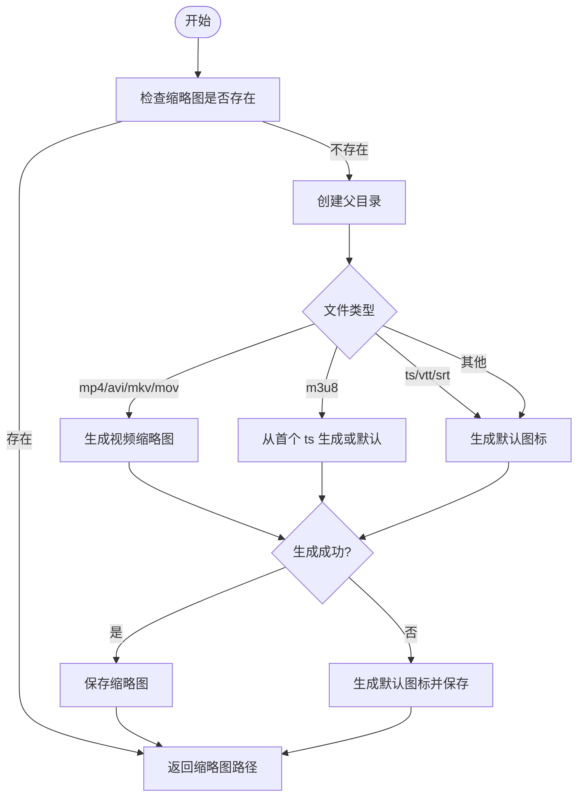
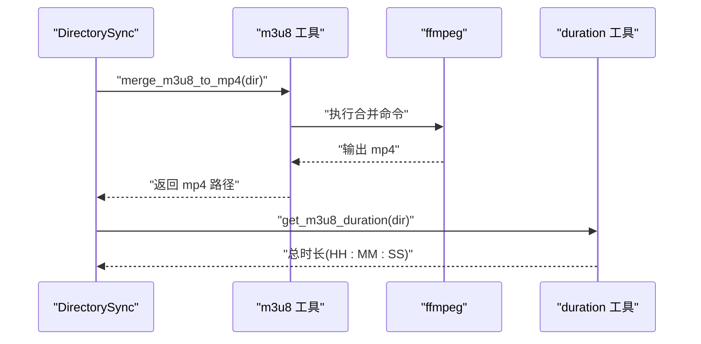
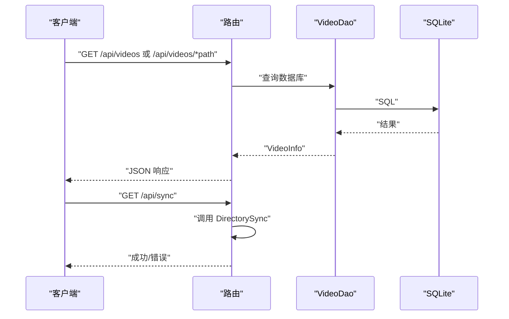
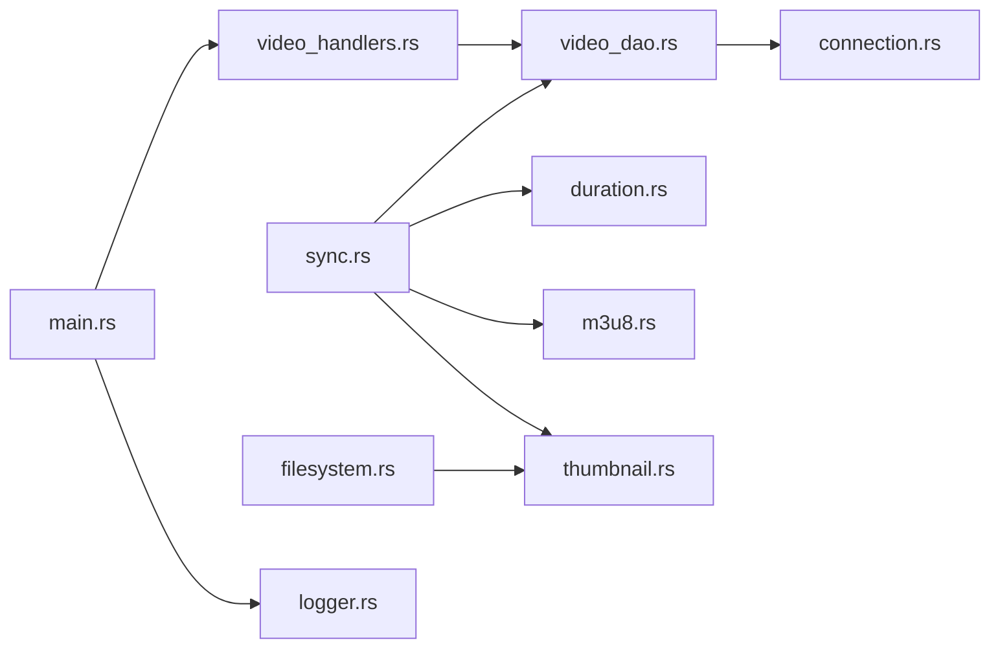

# 文件元数据提取

<cite>
**本文引用的文件**
- [main.rs](file://app/server/src/main.rs)
- [models.rs](file://app/server/src/models.rs)
- [video_handlers.rs](file://app/server/src/routes/video_handlers.rs)
- [video_dao.rs](file://app/server/src/services/db/video_dao.rs)
- [sync.rs](file://app/server/src/services/db/sync.rs)
- [connection.rs](file://app/server/src/services/db/connection.rs)
- [duration.rs](file://app/server/src/utils/duration.rs)
- [m3u8.rs](file://app/server/src/utils/m3u8.rs)
- [thumbnail.rs](file://app/server/src/utils/thumbnail.rs)
- [filesystem.rs](file://app/server/src/services/filesystem.rs)
- [common.rs](file://app/server/src/utils/common.rs)
- [logger.rs](file://app/server/src/utils/logger.rs)
</cite>

## 目录
1. [简介](#简介)
2. [项目结构](#项目结构)
3. [核心组件](#核心组件)
4. [架构总览](#架构总览)
5. [详细组件分析](#详细组件分析)
6. [依赖关系分析](#依赖关系分析)
7. [性能考量](#性能考量)
8. [故障排查指南](#故障排查指南)
9. [结论](#结论)
10. [附录](#附录)

## 简介
本文件聚焦于“文件元数据提取”的实现与使用，涵盖以下方面：
- 媒体文件元数据的提取方法：视频时长、分辨率、帧率、比特率、编解码器等字段的采集与呈现。
- FFprobe 工具的使用与命令行参数配置，用于解析视频时长与基础信息。
- 元数据缓存机制与更新策略：基于文件系统变更的增量同步与记录级比对。
- 文件格式兼容性处理：对 mp4、m3u8/ts 直播切片、字幕、图片等格式的差异化处理。
- 错误处理与健壮性：对工具调用失败、文件系统异常、FFmpeg/FFprobe 缺失等情况的降级与告警。
- 元数据验证与清理：对重复记录、缺失缩略图、无效路径进行清理与修正。
- 性能优化与批量处理：并行生成缩略图、按需解析时长、减少 IO 与进程开销。

## 项目结构
后端采用 Rust + Axum，数据库使用 SQLite，通过目录扫描与双向同步将文件系统与数据库保持一致；前端通过 Next.js 提供媒体库展示与播放页。

图表来源
- [main.rs](file://app/server/src/main.rs#L1-L111)
- [video_handlers.rs](file://app/server/src/routes/video_handlers.rs#L1-L104)
- [sync.rs](file://app/server/src/services/db/sync.rs#L1-L413)
- [video_dao.rs](file://app/server/src/services/db/video_dao.rs#L1-L146)
- [connection.rs](file://app/server/src/services/db/connection.rs#L1-L122)
- [duration.rs](file://app/server/src/utils/duration.rs#L1-L66)
- [m3u8.rs](file://app/server/src/utils/m3u8.rs#L1-L148)
- [thumbnail.rs](file://app/server/src/utils/thumbnail.rs#L1-L99)
- [filesystem.rs](file://app/server/src/services/filesystem.rs#L1-L121)
- [common.rs](file://app/server/src/utils/common.rs#L1-L146)
- [logger.rs](file://app/server/src/utils/logger.rs#L1-L100)

章节来源
- [main.rs](file://app/server/src/main.rs#L1-L111)
- [models.rs](file://app/server/src/models.rs#L1-L32)

## 核心组件
- 应用状态与路由
  - 应用状态包含数据库管理器与文件监听器，统一对外暴露 API。
  - 路由提供视频列表、详情、手动同步、文件监听器启停与状态查询。
- 数据模型
  - VideoInfo 字段覆盖名称、路径、类型、缩略图、时长、大小、分辨率、比特率、编解码器、创建时间、字幕等。
- 数据访问层
  - VideoDao 提供根目录查询、父子关系查询、按路径查询等，直接映射 VideoInfo。
- 目录同步器
  - 双向同步：文件系统 → 数据库 + 数据库 → 文件系统；支持增量与全量模式。
  - 扫描阶段：遍历目录，识别 mp4、m3u8、ts、字幕、图片等类型，并生成缩略图与时长。
- 工具模块
  - FFprobe 时长解析：仅对 mp4 执行，返回“时:分:秒”字符串。
  - m3u8 合并：将目录内 m3u8 合并为 mp4 并删除原始目录。
  - 缩略图生成：按类型选择视频帧截图或默认图标，并确保缩略图存在。
  - 通用辅助：文件大小格式化、创建时间格式化、目录/文件类型判断、无缩略图文件筛选。

章节来源
- [models.rs](file://app/server/src/models.rs#L1-L32)
- [video_handlers.rs](file://app/server/src/routes/video_handlers.rs#L1-L104)
- [video_dao.rs](file://app/server/src/services/db/video_dao.rs#L1-L146)
- [sync.rs](file://app/server/src/services/db/sync.rs#L1-L413)
- [duration.rs](file://app/server/src/utils/duration.rs#L1-L66)
- [m3u8.rs](file://app/server/src/utils/m3u8.rs#L1-L148)
- [thumbnail.rs](file://app/server/src/utils/thumbnail.rs#L1-L99)
- [filesystem.rs](file://app/server/src/services/filesystem.rs#L1-L121)
- [common.rs](file://app/server/src/utils/common.rs#L1-L146)

## 架构总览
后端服务启动后，初始化日志、缩略图目录、数据库，并注册路由。请求到达后，路由层委托 DAO 查询数据库，DAO 从 SQLite 读取 VideoInfo 结构；同步流程由 DirectorySync 扫描文件系统，结合工具模块生成缩略图与时长，并写入数据库。

图表来源
- [video_handlers.rs](file://app/server/src/routes/video_handlers.rs#L1-L104)
- [video_dao.rs](file://app/server/src/services/db/video_dao.rs#L1-L146)
- [connection.rs](file://app/server/src/services/db/connection.rs#L1-L122)
- [sync.rs](file://app/server/src/services/db/sync.rs#L1-L413)
- [duration.rs](file://app/server/src/utils/duration.rs#L1-L66)
- [thumbnail.rs](file://app/server/src/utils/thumbnail.rs#L1-L99)

## 详细组件分析

### FFprobe 时长解析与命令行参数
- 调用方式：通过子进程调用 ffprobe，传入错误级别、显示条目、输出格式等参数。
- 关键参数
  - -v error：仅输出错误信息，避免冗余日志。
  - -show_entries format=duration：仅提取时长字段。
  - -of default=noprint_wrappers=1:nokey=1：以纯数值输出，便于解析。
- 解析逻辑：将标准输出转为浮点秒数，再格式化为“时:分:秒”字符串。
- 调用时机：仅对 mp4 文件执行，m3u8 目录使用 m3u8 解析逻辑计算总时长。

图表来源
- [duration.rs](file://app/server/src/utils/duration.rs#L1-L66)

章节来源
- [duration.rs](file://app/server/src/utils/duration.rs#L1-L66)

### 目录同步与元数据采集流程
- 双向同步步骤
  - 读取数据库现有记录，构建路径到记录的映射。
  - 扫描文件系统，识别类型（mp4/m3u8/ts/字幕/图片），生成缩略图与时长。
  - 对比记录差异，决定新增、变更（硬删除旧记录后插入新记录）、跳过或删除。
- m3u8 目录处理
  - 合并为 mp4 并删除原始目录，同时生成缩略图。
  - 时长通过解析 index.m3u8 的片段时长累加得到。
- ts 文件过滤
  - 若同目录存在 m3u8，则跳过 ts 文件，避免重复处理。

图表来源
- [sync.rs](file://app/server/src/services/db/sync.rs#L1-L413)
- [m3u8.rs](file://app/server/src/utils/m3u8.rs#L1-L148)
- [duration.rs](file://app/server/src/utils/duration.rs#L1-L66)
- [thumbnail.rs](file://app/server/src/utils/thumbnail.rs#L1-L99)

章节来源
- [sync.rs](file://app/server/src/services/db/sync.rs#L1-L413)
- [m3u8.rs](file://app/server/src/utils/m3u8.rs#L1-L148)
- [thumbnail.rs](file://app/server/src/utils/thumbnail.rs#L1-L99)

### 数据模型与字段映射
- VideoInfo 字段
  - 名称、路径、类型、缩略图、时长、大小、分辨率、比特率、编解码器、创建时间、字幕。
- DAO 映射
  - VideoDao 将数据库行映射为 VideoInfo，支持树形重建与父子查询。
- 数据库表结构
  - 包含 name、path（唯一）、type、thumbnail、duration（整数秒）、size、resolution、bitrate、codec、created_at、subtitle、parent_path、last_modified 等列，并建立索引提升查询性能。

图表来源
- [connection.rs](file://app/server/src/services/db/connection.rs#L1-L122)
- [video_dao.rs](file://app/server/src/services/db/video_dao.rs#L1-L146)
- [models.rs](file://app/server/src/models.rs#L1-L32)

章节来源
- [models.rs](file://app/server/src/models.rs#L1-L32)
- [video_dao.rs](file://app/server/src/services/db/video_dao.rs#L1-L146)
- [connection.rs](file://app/server/src/services/db/connection.rs#L1-L122)

### 缩略图生成与缓存策略
- 生成策略
  - 对 mp4/avi/mkv/mov 等视频类型：从第 1 秒抓取一帧生成 jpg。
  - 对 m3u8：优先从目录首个 ts 片段生成；若不可用则生成默认图标。
  - 对 ts/vtt/srt：生成默认图标。
  - 其他类型：生成通用默认图标。
- 确保存在
  - 若缩略图不存在则生成；若生成失败则回退默认图标。
- 批量生成
  - 启动时对“源目录中无缩略图”的文件进行并行生成，显著降低首次访问延迟。

图表来源
- [thumbnail.rs](file://app/server/src/utils/thumbnail.rs#L1-L99)
- [filesystem.rs](file://app/server/src/services/filesystem.rs#L1-L121)

章节来源
- [thumbnail.rs](file://app/server/src/utils/thumbnail.rs#L1-L99)
- [filesystem.rs](file://app/server/src/services/filesystem.rs#L1-L121)

### m3u8 合并与时长计算
- 合并策略
  - 使用 ffmpeg 将 m3u8 目录合并为 mp4，复制流并修复音频封装。
  - 成功后删除原始目录，确保后续统一走 mp4 时长解析。
- 时长计算
  - 对 m3u8 目录：解析 index.m3u8，累加片段时长得到总时长。
  - 对 mp4：使用 ffprobe 获取时长。

图表来源
- [m3u8.rs](file://app/server/src/utils/m3u8.rs#L1-L148)
- [duration.rs](file://app/server/src/utils/duration.rs#L1-L66)

章节来源
- [m3u8.rs](file://app/server/src/utils/m3u8.rs#L1-L148)
- [duration.rs](file://app/server/src/utils/duration.rs#L1-L66)

### API 交互与错误处理
- 列表与详情
  - 通过 VideoDao 查询数据库，返回 VideoInfo 结构；目录类型支持返回子项。
- 手动同步
  - 触发 DirectorySync 执行双向同步，返回成功计数或错误信息。
- 错误处理
  - 数据库错误返回 500；路径未找到返回 404；工具调用失败记录日志并降级。

图表来源
- [video_handlers.rs](file://app/server/src/routes/video_handlers.rs#L1-L104)
- [video_dao.rs](file://app/server/src/services/db/video_dao.rs#L1-L146)
- [connection.rs](file://app/server/src/services/db/connection.rs#L1-L122)

章节来源
- [video_handlers.rs](file://app/server/src/routes/video_handlers.rs#L1-L104)
- [video_dao.rs](file://app/server/src/services/db/video_dao.rs#L1-L146)

## 依赖关系分析
- 组件耦合
  - 路由依赖 DAO；DAO 依赖数据库连接；同步器依赖工具模块与 DAO。
  - 工具模块之间低耦合：时长、m3u8、缩略图各自独立。
- 外部依赖
  - FFprobe/FFmpeg：用于时长解析与媒体处理。
  - SQLite：轻量持久化，配合索引提升查询性能。
  - Rayon：并行生成缩略图。
- 潜在循环依赖
  - 未发现循环导入；模块职责清晰。

图表来源
- [video_handlers.rs](file://app/server/src/routes/video_handlers.rs#L1-L104)
- [video_dao.rs](file://app/server/src/services/db/video_dao.rs#L1-L146)
- [connection.rs](file://app/server/src/services/db/connection.rs#L1-L122)
- [sync.rs](file://app/server/src/services/db/sync.rs#L1-L413)
- [duration.rs](file://app/server/src/utils/duration.rs#L1-L66)
- [m3u8.rs](file://app/server/src/utils/m3u8.rs#L1-L148)
- [thumbnail.rs](file://app/server/src/utils/thumbnail.rs#L1-L99)
- [filesystem.rs](file://app/server/src/services/filesystem.rs#L1-L121)
- [main.rs](file://app/server/src/main.rs#L1-L111)
- [logger.rs](file://app/server/src/utils/logger.rs#L1-L100)

章节来源
- [main.rs](file://app/server/src/main.rs#L1-L111)
- [sync.rs](file://app/server/src/services/db/sync.rs#L1-L413)

## 性能考量
- 并行处理
  - 缩略图批量生成使用并行迭代器，显著缩短启动时长。
- 减少进程开销
  - 仅对 mp4 执行 ffprobe；m3u8 目录合并为 mp4 后统一走 mp4 时长解析。
- I/O 优化
  - 数据库建立索引（path、parent_path），减少查询成本。
  - 增量同步：仅对比差异，避免全量扫描与写入。
- 日志与监控
  - 关键步骤记录耗时，便于定位瓶颈。

章节来源
- [filesystem.rs](file://app/server/src/services/filesystem.rs#L1-L121)
- [connection.rs](file://app/server/src/services/db/connection.rs#L1-L122)
- [sync.rs](file://app/server/src/services/db/sync.rs#L1-L413)

## 故障排查指南
- FFprobe/FFmpeg 未安装或不可用
  - 现象：时长解析失败、缩略图生成失败。
  - 排查：确认系统 PATH 中存在 ffprobe/ffmpeg；查看日志输出。
  - 降级：时长字段为空；缩略图回退默认图标。
- m3u8 合并失败
  - 现象：目录未被删除，返回错误信息。
  - 排查：检查 index.m3u8 是否有效、网络/磁盘权限、ffmpeg 参数。
- 文件系统访问异常
  - 现象：扫描阶段出现“无法访问条目”错误。
  - 排查：检查目录权限、磁盘空间、符号链接。
- 数据库迁移与索引
  - 现象：旧版本数据库存在 is_deleted 列。
  - 处理：自动迁移至新表结构并重建索引。
- 日志配置
  - 使用 log4rs 输出到控制台与滚动文件，便于定位问题。

章节来源
- [duration.rs](file://app/server/src/utils/duration.rs#L1-L66)
- [m3u8.rs](file://app/server/src/utils/m3u8.rs#L1-L148)
- [thumbnail.rs](file://app/server/src/utils/thumbnail.rs#L1-L99)
- [connection.rs](file://app/server/src/services/db/connection.rs#L1-L122)
- [logger.rs](file://app/server/src/utils/logger.rs#L1-L100)

## 结论
本项目通过“目录扫描 + 双向同步 + 工具链集成”的方式，实现了对媒体文件元数据的自动化采集与持久化。FFprobe 用于 mp4 时长解析，m3u8 合并与片段解析提供统一时长口径，缩略图并行生成保障了用户体验。数据库索引与增量同步降低了性能开销，日志与错误处理提升了稳定性。未来可在以下方向进一步优化：
- 引入更细粒度的缓存（如基于文件修改时间的 TTL）。
- 扩展分辨率、帧率、比特率等字段的采集与入库。
- 对 ts 流进行更深入的探测，补充更多元数据。

## 附录
- API 端点
  - GET /api/videos：列出根目录视频。
  - GET /api/videos/*path：获取指定路径详情（含子项）。
  - GET /api/sync：手动触发数据库同步。
  - GET /api/watcher/start、/api/watcher/stop、/api/watcher/status：文件监听器控制与状态查询。
- 字段说明
  - duration：视频时长（秒，mp4 时可用；m3u8 目录通过片段时长累加）。
  - resolution：分辨率（预留，当前未采集）。
  - size：文件大小（字符串格式）。
  - bitrate：比特率（预留，当前未采集）。
  - codec：编解码器（预留，当前未采集）。

章节来源
- [main.rs](file://app/server/src/main.rs#L1-L111)
- [models.rs](file://app/server/src/models.rs#L1-L32)