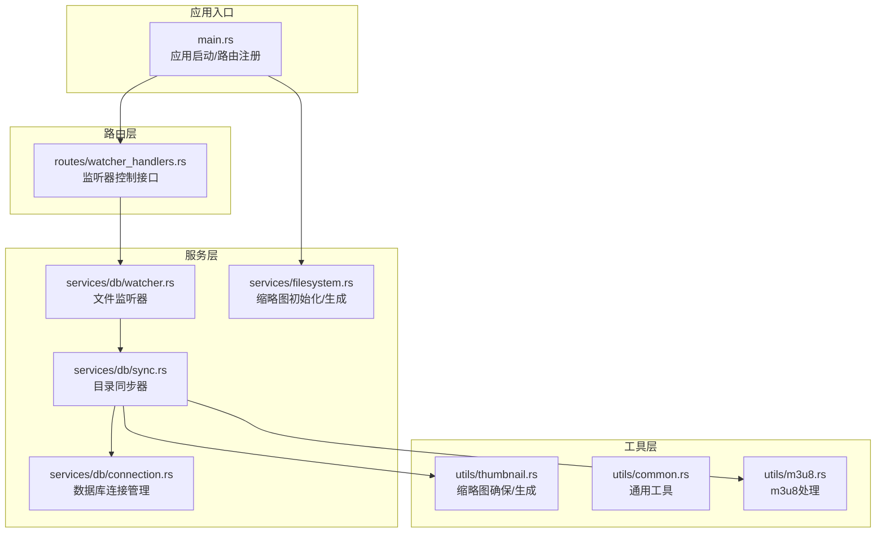
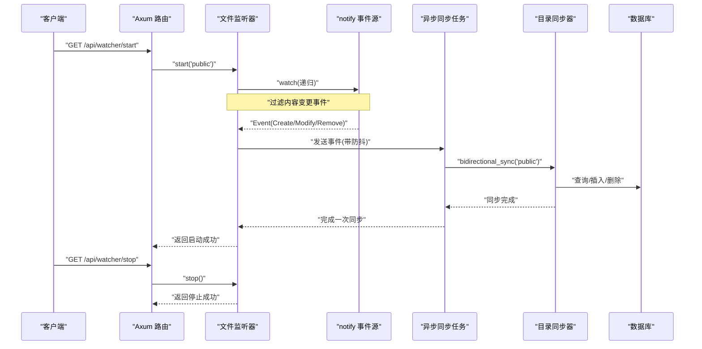
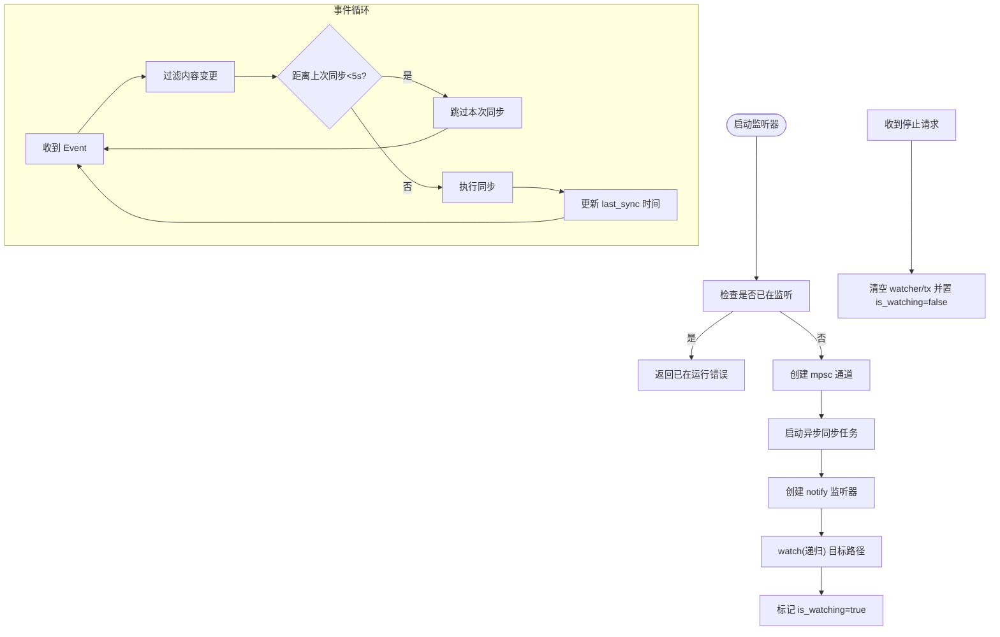
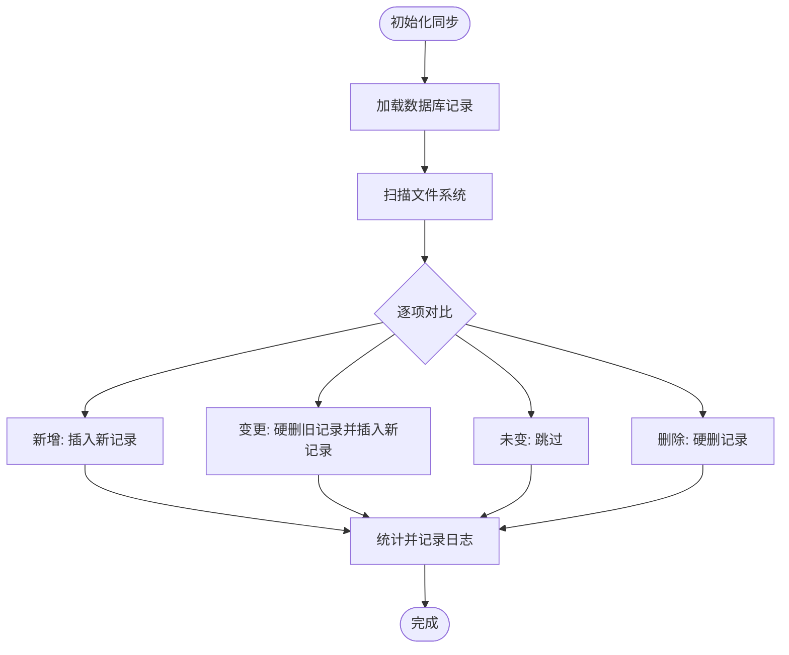
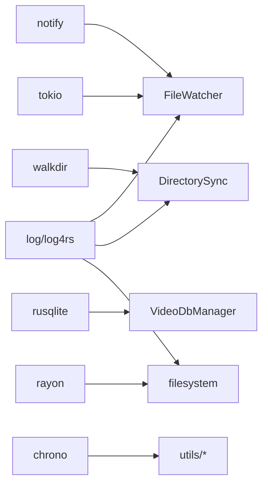

# 文件监控服务

<cite>
**本文引用的文件**
- [main.rs](file://app/server/src/main.rs)
- [watcher.rs](file://app/server/src/services/db/watcher.rs)
- [sync.rs](file://app/server/src/services/db/sync.rs)
- [filesystem.rs](file://app/server/src/services/filesystem.rs)
- [thumbnail.rs](file://app/server/src/utils/thumbnail.rs)
- [common.rs](file://app/server/src/utils/common.rs)
- [m3u8.rs](file://app/server/src/utils/m3u8.rs)
- [connection.rs](file://app/server/src/services/db/connection.rs)
- [watcher_handlers.rs](file://app/server/src/routes/watcher_handlers.rs)
- [Cargo.toml](file://app/server/Cargo.toml)
- [models.rs](file://app/server/src/models.rs)
</cite>

## 目录
1. [简介](#简介)
2. [项目结构](#项目结构)
3. [核心组件](#核心组件)
4. [架构总览](#架构总览)
5. [详细组件分析](#详细组件分析)
6. [依赖关系分析](#依赖关系分析)
7. [性能考虑](#性能考虑)
8. [故障排除指南](#故障排除指南)
9. [结论](#结论)
10. [附录](#附录)

## 简介
本文件监控服务基于 Rust 的 notify 库实现文件系统事件监听，并通过 Tokio 异步通道将事件传递给数据库同步器，实现“文件变更 → 防抖聚合 → 自动同步”的实时同步流程。系统支持：
- 文件系统事件过滤（仅关注内容变更）
- 防抖策略（降低频繁同步开销）
- 增量双向同步（新增/变更/删除）
- m3u8 目录合并与缩略图生成
- REST 接口控制监听器启停与状态查询

## 项目结构
后端采用模块化组织：
- 路由层：提供监听器启停与状态查询接口
- 服务层：文件监听器、数据库连接与目录同步
- 工具层：缩略图生成、m3u8 处理、通用工具
- 主程序：应用启动、静态资源服务、CORS 配置

**图表来源**
- [main.rs](file://app/server/src/main.rs#L1-L111)
- [watcher_handlers.rs](file://app/server/src/routes/watcher_handlers.rs#L1-L84)
- [watcher.rs](file://app/server/src/services/db/watcher.rs#L1-L182)
- [sync.rs](file://app/server/src/services/db/sync.rs#L1-L413)
- [connection.rs](file://app/server/src/services/db/connection.rs#L1-L122)
- [filesystem.rs](file://app/server/src/services/filesystem.rs#L1-L121)
- [thumbnail.rs](file://app/server/src/utils/thumbnail.rs#L1-L99)
- [common.rs](file://app/server/src/utils/common.rs#L1-L146)
- [m3u8.rs](file://app/server/src/utils/m3u8.rs#L1-L148)

**章节来源**
- [main.rs](file://app/server/src/main.rs#L1-L111)
- [Cargo.toml](file://app/server/Cargo.toml#L1-L23)

## 核心组件
- 文件监听器：封装 notify 的 RecommendedWatcher，过滤非内容变更事件，使用 Tokio mpsc 通道与异步同步任务通信，内置 5 秒防抖。
- 目录同步器：扫描目标目录，构建文件映射，对比数据库记录，执行新增/变更/删除的硬删除+重建策略，支持 m3u8 目录合并与缩略图生成。
- 数据库连接管理：负责表结构初始化、索引创建与迁移。
- 缩略图与 m3u8 工具：确保缩略图存在、生成默认缩略图、合并 m3u8 为 mp4 并清理目录。
- 路由接口：提供 /api/watcher/start、/api/watcher/stop、/api/watcher/status。

**章节来源**
- [watcher.rs](file://app/server/src/services/db/watcher.rs#L1-L182)
- [sync.rs](file://app/server/src/services/db/sync.rs#L1-L413)
- [connection.rs](file://app/server/src/services/db/connection.rs#L1-L122)
- [filesystem.rs](file://app/server/src/services/filesystem.rs#L1-L121)
- [thumbnail.rs](file://app/server/src/utils/thumbnail.rs#L1-L99)
- [m3u8.rs](file://app/server/src/utils/m3u8.rs#L1-L148)
- [watcher_handlers.rs](file://app/server/src/routes/watcher_handlers.rs#L1-L84)

## 架构总览
文件监控服务的整体交互流程如下：

**图表来源**
- [watcher_handlers.rs](file://app/server/src/routes/watcher_handlers.rs#L1-L84)
- [watcher.rs](file://app/server/src/services/db/watcher.rs#L1-L182)
- [sync.rs](file://app/server/src/services/db/sync.rs#L1-L413)
- [connection.rs](file://app/server/src/services/db/connection.rs#L1-L122)

## 详细组件分析

### 文件监听器（Notify 事件处理机制）
- 事件过滤：仅接受 Create/Modify/Remove 类型事件；对路径进行视频相关性判断，目录与常见媒体扩展名均视为相关。
- 防抖策略：异步接收事件后，若距离上次同步不足 5 秒则跳过，避免频繁触发同步。
- 同步执行：每次满足防抖条件时，锁定数据库管理器，构造目录同步器并执行同步。
- 状态管理：is_watching 标志位用于标记运行状态，stop() 会清空内部句柄并置标志为 false。

**图表来源**
- [watcher.rs](file://app/server/src/services/db/watcher.rs#L1-L182)

**章节来源**
- [watcher.rs](file://app/server/src/services/db/watcher.rs#L1-L182)

### 目录同步器（文件变更检测与处理策略）
- 双向同步流程：
  1) 读取数据库现有记录，构建 path→记录 映射；
  2) 递归扫描目标目录，过滤视频相关项，构建 path→文件信息 映射；
  3) 新增：数据库无记录则插入新记录；
  4) 变更：存在记录但关键字段变化则硬删除旧记录并插入新记录；
  5) 删除：数据库记录不在文件系统中则硬删除。
- 关键字段判定：仅比较名称与创建时间，若一致则跳过。
- m3u8 目录特殊处理：定位目录内 m3u8 文件，合并为 mp4，输出至 public 下同名 .mp4，随后删除该目录。
- 缩略图生成：确保缩略图存在，不存在则按文件类型生成，必要时回退默认图标。

**图表来源**
- [sync.rs](file://app/server/src/services/db/sync.rs#L1-L413)
- [m3u8.rs](file://app/server/src/utils/m3u8.rs#L1-L148)
- [thumbnail.rs](file://app/server/src/utils/thumbnail.rs#L1-L99)

**章节来源**
- [sync.rs](file://app/server/src/services/db/sync.rs#L1-L413)
- [m3u8.rs](file://app/server/src/utils/m3u8.rs#L1-L148)
- [thumbnail.rs](file://app/server/src/utils/thumbnail.rs#L1-L99)

### 数据库连接与迁移
- 表结构：videos 表包含名称、路径、类型、缩略图、时长、大小、分辨率、码率、编解码、创建时间、字幕、父路径等字段，并建立 path 与 parent_path 索引。
- 迁移：检测旧版 is_deleted 字段并执行表重建与索引重建，保证兼容性。

**章节来源**
- [connection.rs](file://app/server/src/services/db/connection.rs#L1-L122)

### 缩略图生成与 m3u8 合并
- 缩略图生成：根据文件类型选择不同策略，视频直接提取帧生成，m3u8 尝试从目录 ts 片段生成，否则生成默认图标。
- m3u8 合并：定位目录下 m3u8 文件，调用外部工具合并为 mp4，输出到 public 目录并删除原始目录。

**章节来源**
- [filesystem.rs](file://app/server/src/services/filesystem.rs#L1-L121)
- [thumbnail.rs](file://app/server/src/utils/thumbnail.rs#L1-L99)
- [m3u8.rs](file://app/server/src/utils/m3u8.rs#L1-L148)

### 路由与状态管理
- 启动：校验状态后调用监听器 start，返回运行中状态。
- 停止：校验状态后调用 stop，返回已停止状态。
- 状态查询：返回当前运行状态与提示信息。

**章节来源**
- [watcher_handlers.rs](file://app/server/src/routes/watcher_handlers.rs#L1-L84)
- [main.rs](file://app/server/src/main.rs#L1-L111)

## 依赖关系分析
- 外部库：
  - notify：文件系统事件监听
  - tokio：异步运行时与 mpsc 通道
  - walkdir：递归遍历目录
  - rusqlite：SQLite 数据库访问
  - rayon：并行处理缩略图
  - chrono/log/log4rs：时间与日志
- 内部模块耦合：
  - 路由层依赖监听器
  - 监听器依赖同步器与数据库管理器
  - 同步器依赖工具层（缩略图、m3u8、通用工具）

**图表来源**
- [Cargo.toml](file://app/server/Cargo.toml#L1-L23)
- [watcher.rs](file://app/server/src/services/db/watcher.rs#L1-L182)
- [sync.rs](file://app/server/src/services/db/sync.rs#L1-L413)
- [connection.rs](file://app/server/src/services/db/connection.rs#L1-L122)
- [filesystem.rs](file://app/server/src/services/filesystem.rs#L1-L121)

**章节来源**
- [Cargo.toml](file://app/server/Cargo.toml#L1-L23)

## 性能考虑
- 事件过滤与防抖：仅处理内容变更事件，并以 5 秒防抖降低同步频率，适合高并发写入场景。
- 并行缩略图生成：使用并行迭代器批量生成缩略图，缩短初始化耗时。
- 数据库索引：对 path 与 parent_path 建立索引，提升查询效率。
- I/O 优化：m3u8 合并采用直通复制策略，减少转码开销。
- 建议：
  - 根据磁盘与网络状况调整防抖间隔
  - 控制缩略图生成并发度，避免 CPU/IO 抖动
  - 对超大目录启用更严格的过滤规则，减少扫描范围
  - 定期维护日志滚动，避免磁盘占用过高

[本节为通用性能建议，不直接分析具体文件]

## 故障排除指南
- 启动失败（路径不存在）：确认监控路径存在且可访问。
- 监听器已在运行：先调用停止接口再启动。
- 同步失败：查看日志中数据库操作与文件系统访问错误，检查权限与磁盘空间。
- 缩略图生成失败：检查外部工具可用性与输入文件有效性，系统会回退默认图标。
- m3u8 合并失败：检查目录内 m3u8 文件完整性与外部工具可用性，确认输出路径权限。
- 日志定位：应用启动时会输出可用接口列表与状态提示，结合日志文件定位问题。

**章节来源**
- [watcher.rs](file://app/server/src/services/db/watcher.rs#L1-L182)
- [sync.rs](file://app/server/src/services/db/sync.rs#L1-L413)
- [filesystem.rs](file://app/server/src/services/filesystem.rs#L1-L121)
- [m3u8.rs](file://app/server/src/utils/m3u8.rs#L1-L148)
- [main.rs](file://app/server/src/main.rs#L1-L111)

## 结论
该文件监控服务通过 notify 事件驱动与异步同步任务，实现了对媒体目录的高效实时同步。其设计要点包括：
- 精准的事件过滤与防抖策略
- 增量双向同步与 m3u8 目录合并
- 可控的缩略图生成与回退机制
- 明确的启停与状态查询接口
配合合理的性能调优与日志监控，可在生产环境中稳定运行。

[本节为总结性内容，不直接分析具体文件]

## 附录
- API 端点
  - GET /api/watcher/start：启动文件监听器
  - GET /api/watcher/stop：停止文件监听器
  - GET /api/watcher/status：获取监听器状态
- 监控路径
  - 默认监控 public 目录，可通过环境变量配置数据源目录
- 数据模型
  - 视频信息结构体包含名称、路径、类型、缩略图、时长、大小、分辨率、码率、编解码、创建时间、字幕等字段

**章节来源**
- [watcher_handlers.rs](file://app/server/src/routes/watcher_handlers.rs#L1-L84)
- [main.rs](file://app/server/src/main.rs#L1-L111)
- [models.rs](file://app/server/src/models.rs#L1-L32)