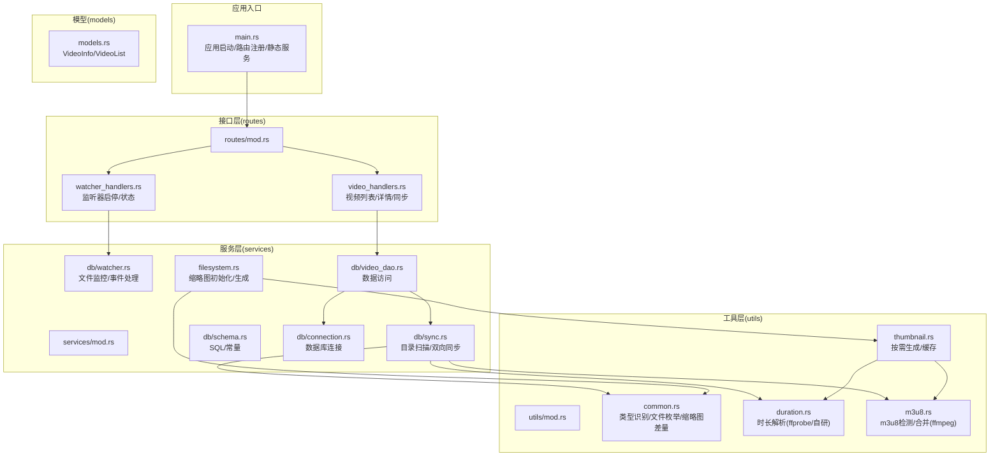
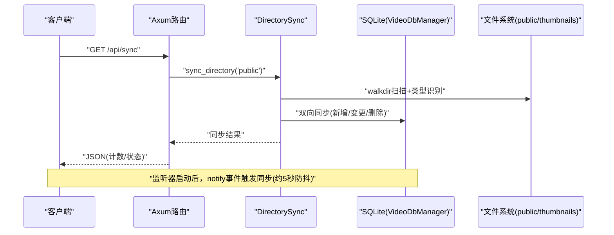
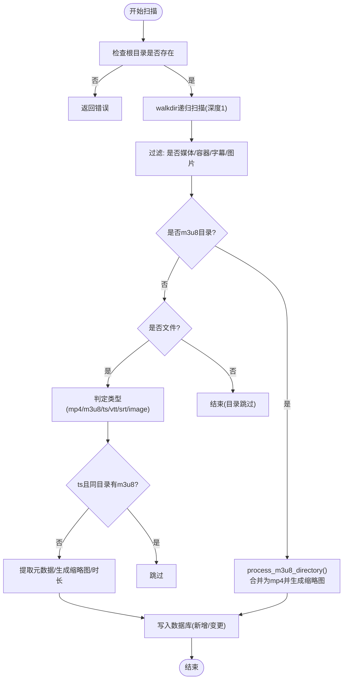
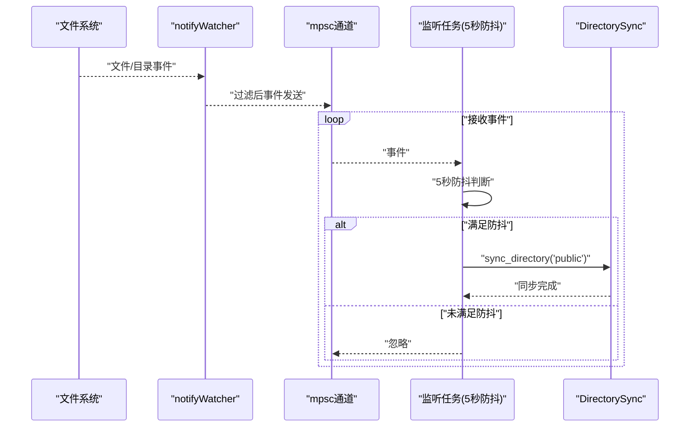
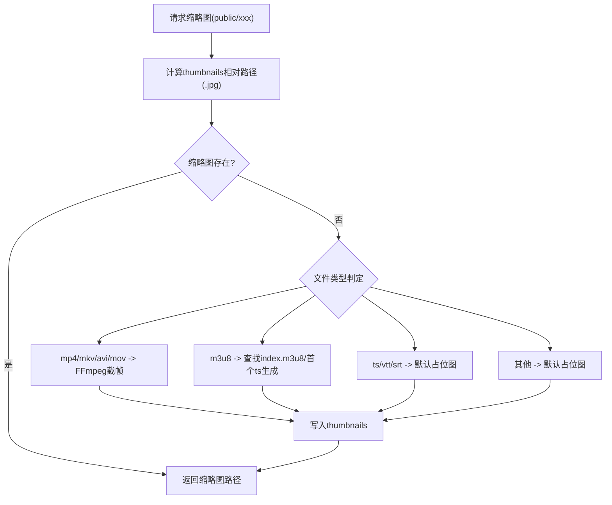
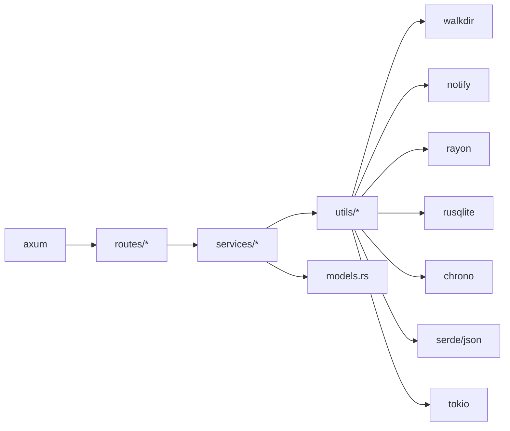

# 文件系统管理

<cite>
**本文引用的文件**
- [app/server/src/main.rs](file://app/server/src/main.rs)
- [app/server/src/services/mod.rs](file://app/server/src/services/mod.rs)
- [app/server/src/services/db/mod.rs](file://app/server/src/services/db/mod.rs)
- [app/server/src/services/db/sync.rs](file://app/server/src/services/db/sync.rs)
- [app/server/src/services/db/watcher.rs](file://app/server/src/services/db/watcher.rs)
- [app/server/src/services/db/connection.rs](file://app/server/src/services/db/connection.rs)
- [app/server/src/services/db/video_dao.rs](file://app/server/src/services/db/video_dao.rs)
- [app/server/src/services/db/schema.rs](file://app/server/src/services/db/schema.rs)
- [app/server/src/services/filesystem.rs](file://app/server/src/services/filesystem.rs)
- [app/server/src/utils/mod.rs](file://app/server/src/utils/mod.rs)
- [app/server/src/utils/common.rs](file://app/server/src/utils/common.rs)
- [app/server/src/utils/duration.rs](file://app/server/src/utils/duration.rs)
- [app/server/src/utils/m3u8.rs](file://app/server/src/utils/m3u8.rs)
- [app/server/src/utils/thumbnail.rs](file://app/server/src/utils/thumbnail.rs)
- [app/server/src/routes/mod.rs](file://app/server/src/routes/mod.rs)
- [app/server/src/routes/video_handlers.rs](file://app/server/src/routes/video_handlers.rs)
- [app/server/src/routes/watcher_handlers.rs](file://app/server/src/routes/watcher_handlers.rs)
- [app/server/src/models.rs](file://app/server/src/models.rs)
- [app/server/Cargo.toml](file://app/server/Cargo.toml)
</cite>

## 目录
1. [简介](#简介)
2. [项目结构](#项目结构)
3. [核心组件](#核心组件)
4. [架构总览](#架构总览)
5. [详细组件分析](#详细组件分析)
6. [依赖关系分析](#依赖关系分析)
7. [性能考虑](#性能考虑)
8. [故障排除指南](#故障排除指南)
9. [结论](#结论)
10. [附录](#附录)

## 简介
本文件系统管理方案围绕“目录扫描、文件监控、缩略图生成、元数据提取与缓存”四大能力展开，目标是实现媒体资源的自动化发现、持久化与实时同步。系统采用 Rust + Axum + SQLite + FFmpeg/FFprobe 的技术栈，结合 walkdir 递归扫描、notify 实时事件、Rayon 并行处理与缩略图缓存目录，形成从文件系统到数据库再到前端展示的完整闭环。

## 项目结构
后端服务位于 app/server，按领域拆分为 routes、services、utils、models 四个层次：
- routes：HTTP 接口层，提供视频列表、详情、手动同步、监听器启停与状态查询等 API
- services：业务服务层，包含数据库管理、目录同步、文件监听、缩略图初始化等
- utils：通用工具与算法，涵盖文件类型识别、时长解析、m3u8 处理、缩略图生成等
- models：序列化模型，用于 API 响应

图表来源
- [app/server/src/main.rs](file://app/server/src/main.rs#L1-L111)
- [app/server/src/routes/mod.rs](file://app/server/src/routes/mod.rs#L1-L6)
- [app/server/src/routes/video_handlers.rs](file://app/server/src/routes/video_handlers.rs#L1-L104)
- [app/server/src/routes/watcher_handlers.rs](file://app/server/src/routes/watcher_handlers.rs#L1-L84)
- [app/server/src/services/mod.rs](file://app/server/src/services/mod.rs#L1-L6)
- [app/server/src/services/db/sync.rs](file://app/server/src/services/db/sync.rs#L1-L413)
- [app/server/src/services/db/watcher.rs](file://app/server/src/services/db/watcher.rs#L1-L182)
- [app/server/src/services/filesystem.rs](file://app/server/src/services/filesystem.rs#L1-L121)
- [app/server/src/utils/mod.rs](file://app/server/src/utils/mod.rs#L1-L14)
- [app/server/src/utils/common.rs](file://app/server/src/utils/common.rs#L1-L146)
- [app/server/src/utils/duration.rs](file://app/server/src/utils/duration.rs#L1-L66)
- [app/server/src/utils/m3u8.rs](file://app/server/src/utils/m3u8.rs#L1-L148)
- [app/server/src/utils/thumbnail.rs](file://app/server/src/utils/thumbnail.rs#L1-L99)
- [app/server/src/models.rs](file://app/server/src/models.rs#L1-L32)

章节来源
- [app/server/src/main.rs](file://app/server/src/main.rs#L1-L111)
- [app/server/src/routes/mod.rs](file://app/server/src/routes/mod.rs#L1-L6)
- [app/server/src/services/mod.rs](file://app/server/src/services/mod.rs#L1-L6)
- [app/server/src/utils/mod.rs](file://app/server/src/utils/mod.rs#L1-L14)

## 核心组件
- 目录扫描与双向同步：基于 walkdir 递归扫描，结合数据库记录进行新增/变更/删除的全量与增量同步，支持 m3u8 目录合并与缩略图生成
- 文件监控与实时同步：基于 notify 的事件监听，过滤非内容变更与非媒体相关路径，采用 5 秒防抖窗口聚合事件，触发同步
- 缩略图生成与缓存：按需生成策略，将 public 目录下的媒体映射到 thumbnails 目录，支持默认占位图与 FFmpeg 生成
- 元数据提取：通过 ffprobe 获取视频时长；对 m3u8 自研解析总时长；文件大小与创建时间格式化
- API 与静态服务：Axum 提供 REST 接口，同时挂载 public 与 thumbnails 为静态资源目录

章节来源
- [app/server/src/services/db/sync.rs](file://app/server/src/services/db/sync.rs#L1-L413)
- [app/server/src/services/db/watcher.rs](file://app/server/src/services/db/watcher.rs#L1-L182)
- [app/server/src/services/filesystem.rs](file://app/server/src/services/filesystem.rs#L1-L121)
- [app/server/src/utils/thumbnail.rs](file://app/server/src/utils/thumbnail.rs#L1-L99)
- [app/server/src/utils/duration.rs](file://app/server/src/utils/duration.rs#L1-L66)
- [app/server/src/routes/video_handlers.rs](file://app/server/src/routes/video_handlers.rs#L1-L104)
- [app/server/src/routes/watcher_handlers.rs](file://app/server/src/routes/watcher_handlers.rs#L1-L84)

## 架构总览
系统采用“事件驱动 + 定时批处理”的混合策略：notify 事件负责实时增量同步，API 触发的手动同步保证一致性；数据库作为权威数据源，文件系统作为输入源。

图表来源
- [app/server/src/routes/video_handlers.rs](file://app/server/src/routes/video_handlers.rs#L72-L104)
- [app/server/src/services/db/sync.rs](file://app/server/src/services/db/sync.rs#L81-L172)
- [app/server/src/services/db/connection.rs](file://app/server/src/services/db/connection.rs)

## 详细组件分析

### 目录扫描机制与递归遍历策略
- 递归扫描：使用 walkdir 对根目录进行递归遍历，最大深度配置为 1 层，减少 IO 压力
- 类型识别：通过 is_video_or_container 判定是否为视频/容器/字幕/图片等，过滤非媒体文件
- m3u8 目录特殊处理：若目录包含 m3u8 文件，优先将其作为目录型媒体处理，并尝试合并为 mp4
- 文件元数据：提取创建时间、大小、缩略图路径、时长（mp4）、字幕路径（vtt/srt）
- 双向同步：先拉取数据库全部记录，再对比文件系统，分别处理新增、变更、删除三类场景

图表来源
- [app/server/src/services/db/sync.rs](file://app/server/src/services/db/sync.rs#L198-L376)
- [app/server/src/utils/common.rs](file://app/server/src/utils/common.rs#L67-L94)
- [app/server/src/utils/m3u8.rs](file://app/server/src/utils/m3u8.rs#L43-L128)
- [app/server/src/utils/duration.rs](file://app/server/src/utils/duration.rs#L1-L66)

章节来源
- [app/server/src/services/db/sync.rs](file://app/server/src/services/db/sync.rs#L198-L376)
- [app/server/src/utils/common.rs](file://app/server/src/utils/common.rs#L67-L94)
- [app/server/src/utils/m3u8.rs](file://app/server/src/utils/m3u8.rs#L43-L128)
- [app/server/src/utils/duration.rs](file://app/server/src/utils/duration.rs#L1-L66)

### 文件监控服务工作流程（Notify 事件处理与实时同步）
- 事件监听：使用 notify 的 RecommendedWatcher，递归监听 public 目录，配置轮询间隔
- 事件过滤：仅接受 Create/Modify/Remove 事件，且路径为视频相关类型或目录
- 防抖策略：5 秒内重复事件被合并，避免频繁同步
- 同步执行：每次事件触发后，串行调用 DirectorySync.sync_directory，确保一致性
- 状态管理：is_watching 标识当前监听状态，支持启停与查询

图表来源
- [app/server/src/services/db/watcher.rs](file://app/server/src/services/db/watcher.rs#L29-L145)
- [app/server/src/services/db/sync.rs](file://app/server/src/services/db/sync.rs#L81-L172)

章节来源
- [app/server/src/services/db/watcher.rs](file://app/server/src/services/db/watcher.rs#L1-L182)

### 缩略图生成功能（FFmpeg 集成与图像处理流程）
- 初始化：首次启动时，扫描源目录中无缩略图的媒体，批量并行生成
- 按需生成：当请求某媒体缩略图时，若不存在则按类型生成：mp4/mkv/avi/mov 走 FFmpeg 截帧；m3u8 优先尝试从目录首个 ts 片段生成；其他媒体生成默认占位图
- 默认占位图：通过 FFmpeg 将临时 SVG 转换为 JPG，作为兜底
- 缓存策略：public 下的相对路径映射到 thumbnails 下同名 jpg，不存在即生成，存在则直接返回

图表来源
- [app/server/src/services/filesystem.rs](file://app/server/src/services/filesystem.rs#L1-L121)
- [app/server/src/utils/thumbnail.rs](file://app/server/src/utils/thumbnail.rs#L1-L99)
- [app/server/src/utils/m3u8.rs](file://app/server/src/utils/m3u8.rs#L1-L148)

章节来源
- [app/server/src/services/filesystem.rs](file://app/server/src/services/filesystem.rs#L1-L121)
- [app/server/src/utils/thumbnail.rs](file://app/server/src/utils/thumbnail.rs#L1-L99)

### 文件类型识别算法与元数据提取
- 类型识别：is_video_or_container 综合目录内是否存在 m3u8 或 mp4，以及文件扩展名是否属于 mp4/m3u8/ts/vtt/srt/jpg/png/gif
- m3u8 目录识别：has_m3u8_file 仅在目录内存在 m3u8 文件时视为有效目录
- 元数据提取：
  - 文件大小：format_size
  - 创建时间：get_systemtime_created（转换为北京时间字符串）
  - 时长：mp4 使用 ffprobe；m3u8 自研解析 index.m3u8 中的 #EXTINF 行累加
- 字幕：当文件类型为 vtt/srt 时，记录其路径

章节来源
- [app/server/src/utils/common.rs](file://app/server/src/utils/common.rs#L67-L94)
- [app/server/src/utils/common.rs](file://app/server/src/utils/common.rs#L1-L66)
- [app/server/src/utils/duration.rs](file://app/server/src/utils/duration.rs#L1-L66)
- [app/server/src/utils/m3u8.rs](file://app/server/src/utils/m3u8.rs#L1-L148)

### 缓存策略
- 缩略图缓存：public 目录下的媒体文件与 thumbnails 目录一一对应，按需生成，避免重复计算
- 初始化预热：启动时扫描源目录与缩略图目录的差集，批量并行生成，缩短首次访问延迟
- 数据库缓存：VideoDao 查询结果由 SQLite 承载，API 层按需读取，避免重复扫描

章节来源
- [app/server/src/services/filesystem.rs](file://app/server/src/services/filesystem.rs#L1-L121)
- [app/server/src/utils/common.rs](file://app/server/src/utils/common.rs#L123-L146)
- [app/server/src/services/db/video_dao.rs](file://app/server/src/services/db/video_dao.rs)

## 依赖关系分析
- 外部库：
  - notify：文件系统事件监听
  - walkdir：递归遍历
  - rayon：并行迭代
  - rusqlite：SQLite 访问
  - chrono：时间格式化
  - serde/serde_json：序列化
  - tokio/axum/tower-http：异步 Web 框架与中间件
- 内部模块耦合：
  - routes 依赖 services 与 models
  - services.db.* 依赖 utils.* 与 models
  - utils.* 互相解耦，通过公共入口导出

图表来源
- [app/server/Cargo.toml](file://app/server/Cargo.toml#L1-L23)
- [app/server/src/main.rs](file://app/server/src/main.rs#L1-L111)
- [app/server/src/routes/mod.rs](file://app/server/src/routes/mod.rs#L1-L6)
- [app/server/src/services/mod.rs](file://app/server/src/services/mod.rs#L1-L6)
- [app/server/src/utils/mod.rs](file://app/server/src/utils/mod.rs#L1-L14)

章节来源
- [app/server/Cargo.toml](file://app/server/Cargo.toml#L1-L23)

## 性能考虑
- 并行化
  - 缩略图初始化阶段使用 Rayon 并行处理，显著降低冷启动时间
  - 目录扫描阶段对每个文件的元数据与缩略图生成采用串行，避免磁盘争用
- 防抖与批处理
  - 文件监控使用 5 秒防抖，合并高频事件，减少数据库压力
  - 手动同步接口用于一次性修复不一致
- I/O 优化
  - walkdir 限制最大深度为 1，减少深层目录扫描开销
  - m3u8 目录合并采用 ffmpeg 直拷贝流，避免重编码
- 缓存命中
  - 按需生成缩略图，避免重复生成；初始化阶段预热可提升首屏体验

章节来源
- [app/server/src/services/filesystem.rs](file://app/server/src/services/filesystem.rs#L1-L121)
- [app/server/src/services/db/watcher.rs](file://app/server/src/services/db/watcher.rs#L54-L88)
- [app/server/src/utils/m3u8.rs](file://app/server/src/utils/m3u8.rs#L82-L128)

## 故障排除指南
- FFmpeg/FFprobe 未安装或不可用
  - 现象：缩略图生成失败、默认占位图出现、时长解析失败
  - 处理：安装 FFmpeg/FFprobe 并确保命令可在 PATH 中找到
- 监听器无法启动
  - 现象：启动监听器报错或立即停止
  - 处理：确认 public 目录存在；检查权限；查看日志中“创建监听器失败/开始监听失败”
- 同步不生效
  - 现象：新增/删除媒体后数据库未更新
  - 处理：调用 /api/sync 手动同步；确认监听器状态；检查 is_video_or_container 过滤逻辑
- m3u8 目录未合并
  - 现象：目录仍保留，未生成 mp4
  - 处理：确认目录包含合法 m3u8；检查合并过程日志；必要时手动清理并重试
- 缩略图缺失
  - 现象：媒体列表缺少缩略图
  - 处理：等待按需生成；或重启服务触发初始化预热；检查 thumbnails 目录权限

章节来源
- [app/server/src/services/db/watcher.rs](file://app/server/src/services/db/watcher.rs#L29-L145)
- [app/server/src/services/filesystem.rs](file://app/server/src/services/filesystem.rs#L49-L121)
- [app/server/src/utils/m3u8.rs](file://app/server/src/utils/m3u8.rs#L43-L128)
- [app/server/src/utils/duration.rs](file://app/server/src/utils/duration.rs#L1-L66)

## 结论
该文件系统管理方案通过“扫描 + 监控 + 生成 + 缓存”的组合拳，实现了媒体资源的自动化发现与持久化。walkdir 与 notify 分别承担离线全量与在线增量职责，FFmpeg/FFprobe 提供可靠的媒体处理能力，SQLite 保障数据一致性。建议在生产环境配合定时全量同步与健康检查，进一步提升稳定性与可观测性。

## 附录
- API 端点
  - GET /api/videos：列出根目录媒体
  - GET /api/videos/*path：获取指定路径详情（含子项）
  - GET /api/sync：手动同步数据库
  - GET /api/watcher/start：启动文件监听器
  - GET /api/watcher/stop：停止文件监听器
  - GET /api/watcher/status：查询监听器状态
- 静态资源
  - /public：媒体文件
  - /thumbnails：缩略图文件

章节来源
- [app/server/src/main.rs](file://app/server/src/main.rs#L72-L110)
- [app/server/src/routes/video_handlers.rs](file://app/server/src/routes/video_handlers.rs#L1-L104)
- [app/server/src/routes/watcher_handlers.rs](file://app/server/src/routes/watcher_handlers.rs#L1-L84)