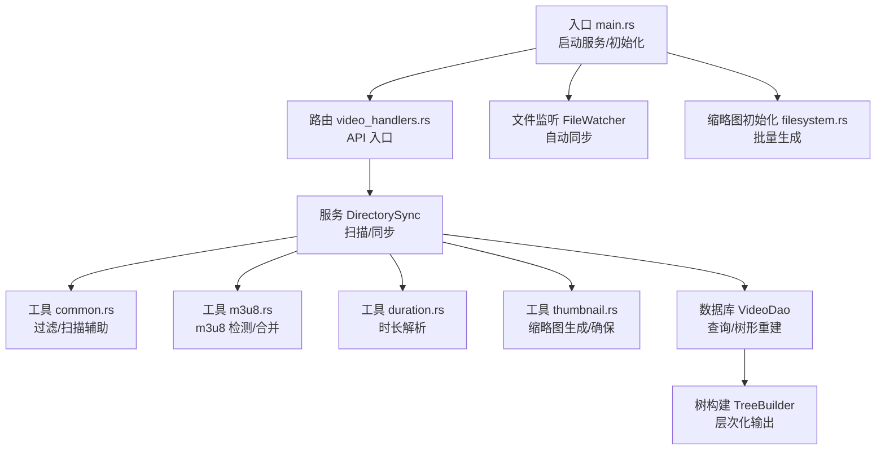
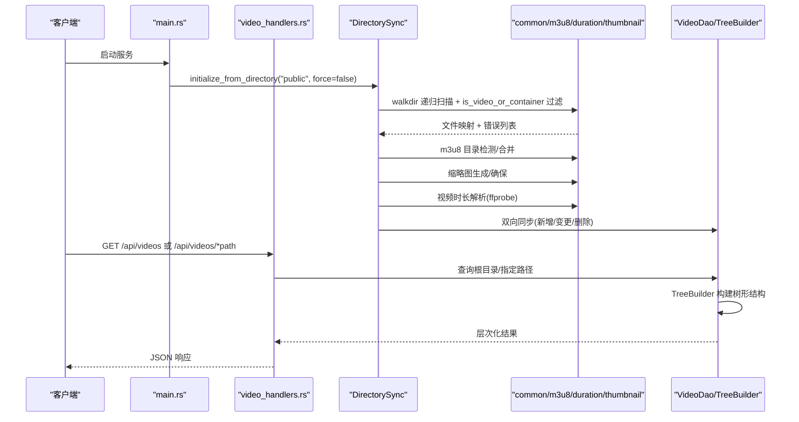
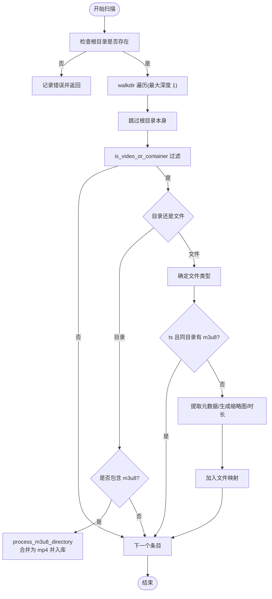
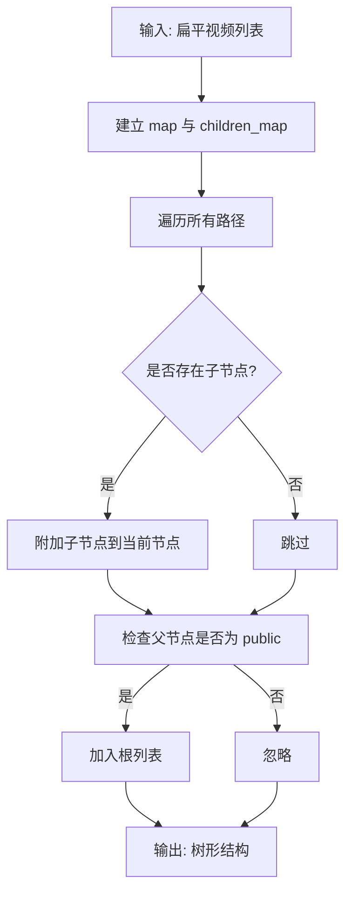
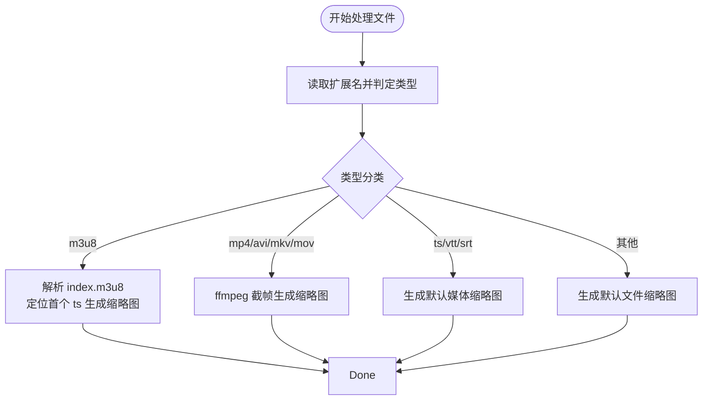
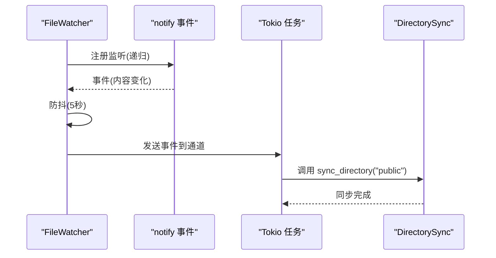
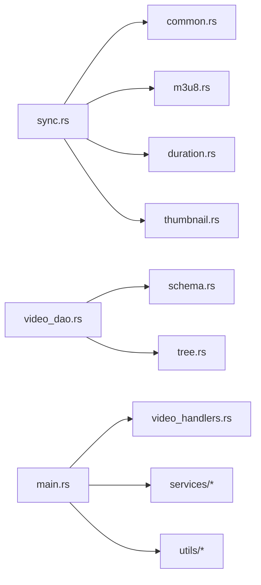

# 目录扫描机制

<cite>
**本文引用的文件**
- [main.rs](file://app/server/src/main.rs)
- [filesystem.rs](file://app/server/src/services/filesystem.rs)
- [tree.rs](file://app/server/src/services/db/tree.rs)
- [duration.rs](file://app/server/src/utils/duration.rs)
- [thumbnail.rs](file://app/server/src/utils/thumbnail.rs)
- [video_dao.rs](file://app/server/src/services/db/video_dao.rs)
- [sync.rs](file://app/server/src/services/db/sync.rs)
- [watcher.rs](file://app/server/src/services/db/watcher.rs)
- [video_handlers.rs](file://app/server/src/routes/video_handlers.rs)
- [Cargo.toml](file://app/server/Cargo.toml)
- [common.rs](file://app/server/src/utils/common.rs)
- [m3u8.rs](file://app/server/src/utils/m3u8.rs)
- [models.rs](file://app/server/src/models.rs)
- [schema.rs](file://app/server/src/services/db/schema.rs)
</cite>

## 目录
1. [简介](#简介)
2. [项目结构](#项目结构)
3. [核心组件](#核心组件)
4. [架构总览](#架构总览)
5. [详细组件分析](#详细组件分析)
6. [依赖关系分析](#依赖关系分析)
7. [性能考虑](#性能考虑)
8. [故障排查指南](#故障排查指南)
9. [结论](#结论)
10. [附录](#附录)

## 简介
本文件系统性地文档化了视频目录扫描机制，涵盖以下方面：
- walkdir 库的使用与递归遍历策略
- 目录树构建算法与文件过滤逻辑
- 文件类型识别与视频格式检测
- 元数据提取方法（时长、尺寸、创建时间等）
- 并行处理策略与性能优化（Rayon 与 Tokio）
- 目录扫描配置项与错误处理机制
- 实际使用模式与最佳实践

## 项目结构
后端采用 Rust + Axum，核心扫描流程位于服务层，配合工具模块与数据库层协同工作。主要涉及以下模块：
- 入口与路由：应用启动、API 路由与静态资源服务
- 数据库层：视频信息持久化、树形结构重建
- 工具层：文件系统辅助、m3u8 处理、缩略图生成、时长解析
- 服务层：目录扫描、文件监听与自动同步

图表来源
- [main.rs](file://app/server/src/main.rs#L27-L110)
- [video_handlers.rs](file://app/server/src/routes/video_handlers.rs#L1-L104)
- [sync.rs](file://app/server/src/services/db/sync.rs#L1-L413)
- [common.rs](file://app/server/src/utils/common.rs#L67-L146)
- [m3u8.rs](file://app/server/src/utils/m3u8.rs#L1-L148)
- [duration.rs](file://app/server/src/utils/duration.rs#L1-L66)
- [thumbnail.rs](file://app/server/src/utils/thumbnail.rs#L1-L99)
- [video_dao.rs](file://app/server/src/services/db/video_dao.rs#L1-L146)
- [tree.rs](file://app/server/src/services/db/tree.rs#L1-L78)
- [filesystem.rs](file://app/server/src/services/filesystem.rs#L1-L121)
- [watcher.rs](file://app/server/src/services/db/watcher.rs#L1-L182)

章节来源
- [main.rs](file://app/server/src/main.rs#L27-L110)
- [Cargo.toml](file://app/server/Cargo.toml#L1-L23)

## 核心组件
- 目录同步器 DirectorySync：负责扫描文件系统、构建文件映射、与数据库进行双向同步，并处理 m3u8 目录的特殊逻辑。
- 文件监听器 FileWatcher：基于 notify 的文件系统事件监听器，结合防抖策略触发自动同步。
- 数据访问对象 VideoDao：封装数据库查询，支持根目录查询、按路径查询、按父路径查询与树形重建。
- 树构建器 TreeBuilder：将扁平的视频记录转换为层次化的树形结构。
- 工具模块：
  - common.rs：文件过滤、目录内是否存在视频判断、创建时间格式化、批量文件扫描辅助。
  - m3u8.rs：m3u8 文件检测、目录合并为 mp4、查找 m3u8 文件。
  - duration.rs：基于 ffprobe 的视频时长解析；m3u8 目录总时长解析。
  - thumbnail.rs：根据文件类型生成缩略图，确保缩略图存在。
  - filesystem.rs：缩略图目录初始化与批量生成。

章节来源
- [sync.rs](file://app/server/src/services/db/sync.rs#L1-L413)
- [watcher.rs](file://app/server/src/services/db/watcher.rs#L1-L182)
- [video_dao.rs](file://app/server/src/services/db/video_dao.rs#L1-L146)
- [tree.rs](file://app/server/src/services/db/tree.rs#L1-L78)
- [common.rs](file://app/server/src/utils/common.rs#L1-L146)
- [m3u8.rs](file://app/server/src/utils/m3u8.rs#L1-L148)
- [duration.rs](file://app/server/src/utils/duration.rs#L1-L66)
- [thumbnail.rs](file://app/server/src/utils/thumbnail.rs#L1-L99)
- [filesystem.rs](file://app/server/src/services/filesystem.rs#L1-L121)

## 架构总览
目录扫描的整体流程如下：
- 应用启动时，从环境变量读取数据源目录，默认 public；初始化缩略图目录；加载数据库并从指定目录初始化/增量同步。
- 提供 API 接口列出视频、获取详情、手动同步数据库。
- 文件监听器可选启用，监控数据源目录变化，经防抖后触发同步。
- 扫描阶段使用 walkdir 递归遍历，结合 common.rs 的过滤逻辑筛选视频相关文件；m3u8 目录被特殊处理并合并为 mp4。
- 元数据提取通过 duration.rs 与 m3u8.rs；缩略图通过 thumbnail.rs 与 filesystem.rs 生成。
- 最终通过 VideoDao 查询数据库并由 TreeBuilder 构建树形结构返回。

图表来源
- [main.rs](file://app/server/src/main.rs#L27-L110)
- [video_handlers.rs](file://app/server/src/routes/video_handlers.rs#L1-L104)
- [sync.rs](file://app/server/src/services/db/sync.rs#L43-L172)
- [common.rs](file://app/server/src/utils/common.rs#L67-L146)
- [m3u8.rs](file://app/server/src/utils/m3u8.rs#L1-L148)
- [duration.rs](file://app/server/src/utils/duration.rs#L1-L66)
- [thumbnail.rs](file://app/server/src/utils/thumbnail.rs#L1-L99)
- [video_dao.rs](file://app/server/src/services/db/video_dao.rs#L1-L146)
- [tree.rs](file://app/server/src/services/db/tree.rs#L1-L78)

## 详细组件分析

### 目录扫描与递归遍历（walkdir）
- 递归策略：使用 walkdir::WalkDir 遍历根目录，当前实现为“最大深度 1”的浅层扫描，用于快速筛选候选目录与文件。
- 过滤逻辑：通过 is_video_or_container 判断是否为视频相关条目，该函数会：
  - 目录：若包含 m3u8 或存在 mp4 文件则视为视频相关
  - 文件：排除 ts 且同目录存在 m3u8 的情况；允许 mp4、m3u8、ts、vtt、srt、图片等
- m3u8 目录特殊处理：当目录包含 m3u8 文件时，不直接扫描其内部文件，而是调用 process_m3u8_directory，合并为 mp4 并返回目录级信息。

图表来源
- [sync.rs](file://app/server/src/services/db/sync.rs#L200-L263)
- [common.rs](file://app/server/src/utils/common.rs#L67-L94)
- [m3u8.rs](file://app/server/src/utils/m3u8.rs#L1-L148)

章节来源
- [sync.rs](file://app/server/src/services/db/sync.rs#L200-L263)
- [common.rs](file://app/server/src/utils/common.rs#L67-L94)

### 目录树构建算法
- 输入：数据库查询得到的扁平视频列表（包含 name、path、type、thumbnail、duration、size、resolution、bitrate、codec、created_at、subtitle、parent_path）。
- 步骤：
  1) 建立 path -> VideoInfo 映射与 parent -> children 列表映射
  2) 遍历所有路径，为每个节点附加其子节点（若存在）
  3) 以 public 为根目录，收集顶层根节点作为树的根列表
- 输出：层次化的 VideoInfo 树，支持 children 字段嵌套。

图表来源
- [tree.rs](file://app/server/src/services/db/tree.rs#L1-L78)
- [video_dao.rs](file://app/server/src/services/db/video_dao.rs#L1-L79)

章节来源
- [tree.rs](file://app/server/src/services/db/tree.rs#L1-L78)
- [video_dao.rs](file://app/server/src/services/db/video_dao.rs#L1-L79)

### 文件类型识别与元数据提取
- 类型识别：
  - mp4、m3u8、ts、vtt/srt、图片（jpg/png/gif）、未知
  - ts 若同目录存在 m3u8 则跳过
- 元数据提取：
  - 尺寸：format_size
  - 创建时间：get_systemtime_created
  - 时长：
    - mp4：使用 ffprobe 解析
    - m3u8：解析 index.m3u8 中的 #EXTINF 行累加时长
  - 缩略图：
    - mp4/avi/mkv/mov：调用 ffmpeg 截帧生成
    - m3u8：优先从目录中首个 ts 片段生成；否则生成默认缩略图
    - ts/vtt/srt：生成默认媒体缩略图
    - 其他：生成默认文件缩略图
- 批量缩略图生成：filesystem.rs 使用 Rayon 并行迭代，ffmpeg 生成缩略图，失败回退默认图标。

图表来源
- [thumbnail.rs](file://app/server/src/utils/thumbnail.rs#L1-L99)
- [duration.rs](file://app/server/src/utils/duration.rs#L1-L66)
- [m3u8.rs](file://app/server/src/utils/m3u8.rs#L1-L148)
- [filesystem.rs](file://app/server/src/services/filesystem.rs#L1-L121)

章节来源
- [thumbnail.rs](file://app/server/src/utils/thumbnail.rs#L1-L99)
- [duration.rs](file://app/server/src/utils/duration.rs#L1-L66)
- [m3u8.rs](file://app/server/src/utils/m3u8.rs#L1-L148)
- [filesystem.rs](file://app/server/src/services/filesystem.rs#L1-L121)

### 并行处理策略与性能优化
- Rayon 并行：filesystem.rs 在批量生成缩略图时使用 par_iter 并行迭代，显著提升大规模缩略图生成效率。
- Tokio 异步：FileWatcher 使用 tokio::spawn 异步处理事件队列，配合 mpsc 通道解耦监听与同步任务。
- 防抖策略：FileWatcher 内置 5 秒防抖，避免频繁同步导致的性能抖动。
- I/O 优化：
  - walkdir 限制最大深度为 1，减少不必要的深层遍历
  - m3u8 合并使用 ffmpeg 直通复制（不重新编码），降低 CPU 开销
- 内存管理：
  - 使用 HashMap 存储文件映射，避免重复扫描
  - 仅在必要时读取文件内容（如 m3u8 解析）

图表来源
- [watcher.rs](file://app/server/src/services/db/watcher.rs#L1-L182)
- [sync.rs](file://app/server/src/services/db/sync.rs#L86-L172)

章节来源
- [filesystem.rs](file://app/server/src/services/filesystem.rs#L1-L121)
- [watcher.rs](file://app/server/src/services/db/watcher.rs#L1-L182)

### 目录扫描配置与错误处理
- 配置项：
  - DATA_SOURCE_DIR：数据源目录，默认 "public"
  - 监听开关：/api/watcher/start、/api/watcher/stop、/api/watcher/status
  - 手动同步：/api/sync
- 错误处理：
  - 扫描阶段：对不可访问条目记录错误并继续
  - m3u8 目录：处理失败记录错误并跳过
  - 缩略图：ffmpeg 失败回退默认图标
  - 时长解析：ffprobe 失败返回 None
  - 数据库：查询异常转换为 HTTP 500 并返回错误信息

章节来源
- [main.rs](file://app/server/src/main.rs#L31-L47)
- [video_handlers.rs](file://app/server/src/routes/video_handlers.rs#L72-L104)
- [sync.rs](file://app/server/src/services/db/sync.rs#L200-L263)
- [thumbnail.rs](file://app/server/src/utils/thumbnail.rs#L1-L99)
- [duration.rs](file://app/server/src/utils/duration.rs#L1-L66)

## 依赖关系分析
- 外部库：
  - walkdir：文件系统遍历
  - notify：文件系统事件监听
  - rayon：并行迭代
  - tokio：异步运行时
  - rusqlite：SQLite 数据库
  - serde/serde_json：序列化
  - log/log4rs：日志
- 内部模块依赖：
  - sync.rs 依赖 common.rs、m3u8.rs、duration.rs、thumbnail.rs
  - video_dao.rs 依赖 schema.rs 与 tree.rs
  - main.rs 依赖 routes、services、utils

图表来源
- [sync.rs](file://app/server/src/services/db/sync.rs#L1-L413)
- [video_dao.rs](file://app/server/src/services/db/video_dao.rs#L1-L146)
- [main.rs](file://app/server/src/main.rs#L27-L110)

章节来源
- [Cargo.toml](file://app/server/Cargo.toml#L1-L23)

## 性能考虑
- 遍历深度控制：当前实现 max_depth=1，适合大目录场景；如需更细粒度控制，可在工具层增加参数化配置。
- 并行策略：缩略图生成使用 Rayon 并行；建议在高核 CPU 场景下保持并行，注意磁盘 IO 争用。
- 防抖与批处理：文件监听器 5 秒防抖，避免频繁同步；可依据业务需求调整。
- 元数据提取：m3u8 合并采用直通复制，避免重编码；时长解析仅对 mp4 执行，ts 依赖目录索引。
- 数据库写入：双向同步采用“新增/变更硬删除再插入”的策略，保证一致性；建议在高频写入场景下评估事务批量提交。

## 故障排查指南
- 无法生成缩略图：
  - 检查 ffmpeg 是否安装并可用
  - 查看日志中 ffmpeg 错误与默认缩略图回退
- 时长解析失败：
  - 确认 ffprobe 可用；仅 mp4 支持解析
  - m3u8 目录需存在 index.m3u8 且格式正确
- 目录扫描无结果：
  - 确认 DATA_SOURCE_DIR 设置正确
  - 检查 is_video_or_container 过滤条件（ts 与 m3u8 的组合）
- 自动同步无效：
  - 确认监听器已启动且路径存在
  - 检查防抖间隔与事件过滤（仅内容变化触发）

章节来源
- [filesystem.rs](file://app/server/src/services/filesystem.rs#L1-L121)
- [thumbnail.rs](file://app/server/src/utils/thumbnail.rs#L1-L99)
- [duration.rs](file://app/server/src/utils/duration.rs#L1-L66)
- [watcher.rs](file://app/server/src/services/db/watcher.rs#L1-L182)

## 结论
该目录扫描机制通过 walkdir 的浅层遍历与自定义过滤逻辑，结合 m3u8 目录的特殊处理，实现了对视频资源的高效发现与元数据提取。借助 Rayon 的并行处理与 Tokio 的异步监听，系统在大规模目录下仍能保持良好性能。数据库层的树形重建与 API 层的查询封装，使得前端能够以层次化结构展示媒体库。

## 附录
- 关键模型与查询：
  - VideoInfo：包含 name、path、type、children、thumbnail、duration、size、resolution、bitrate、codec、created_at、subtitle
  - 查询常量：INSERT_NEW、SELECT_ALL、SELECT_BY_PARENT、SELECT_BY_PATH、SELECT_TYPE_BY_PATH
- 使用模式示例（路径引用）：
  - 初始化与同步：[main.rs](file://app/server/src/main.rs#L31-L47)
  - 手动同步 API：[video_handlers.rs](file://app/server/src/routes/video_handlers.rs#L72-L104)
  - 目录扫描与过滤：[sync.rs](file://app/server/src/services/db/sync.rs#L200-L263)、[common.rs](file://app/server/src/utils/common.rs#L67-L94)
  - m3u8 合并与检测：[m3u8.rs](file://app/server/src/utils/m3u8.rs#L1-L148)
  - 时长解析：[duration.rs](file://app/server/src/utils/duration.rs#L1-L66)
  - 缩略图生成与并行：[thumbnail.rs](file://app/server/src/utils/thumbnail.rs#L1-L99)、[filesystem.rs](file://app/server/src/services/filesystem.rs#L1-L121)
  - 树形重建：[tree.rs](file://app/server/src/services/db/tree.rs#L1-L78)、[video_dao.rs](file://app/server/src/services/db/video_dao.rs#L1-L146)
  - 文件监听与防抖：[watcher.rs](file://app/server/src/services/db/watcher.rs#L1-L182)
  - 数据库查询常量：[schema.rs](file://app/server/src/services/db/schema.rs#L1-L42)