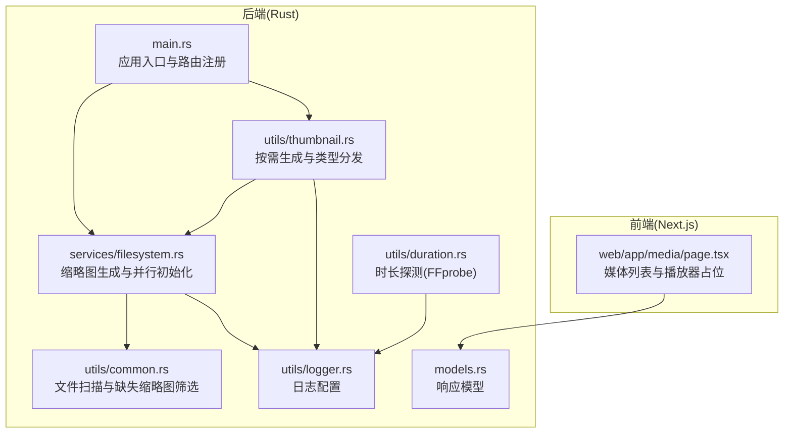
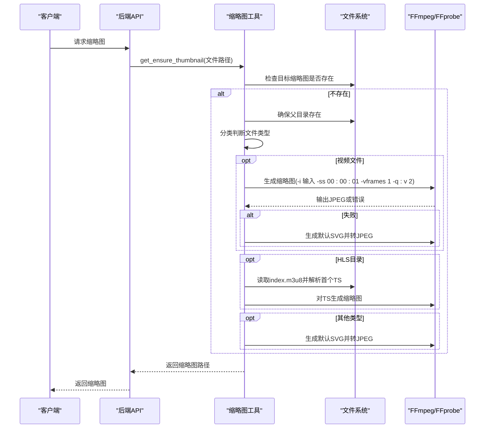
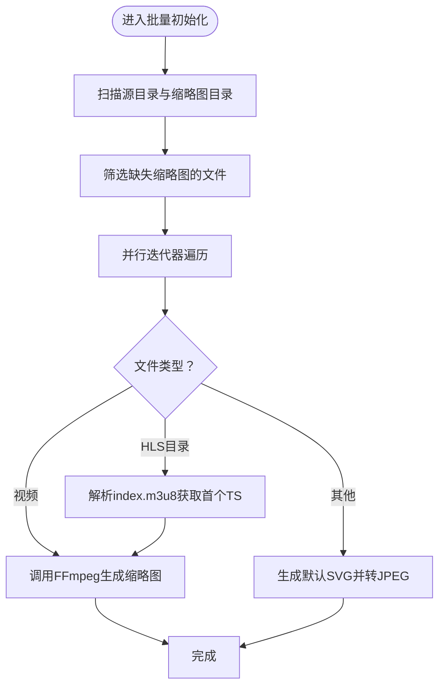
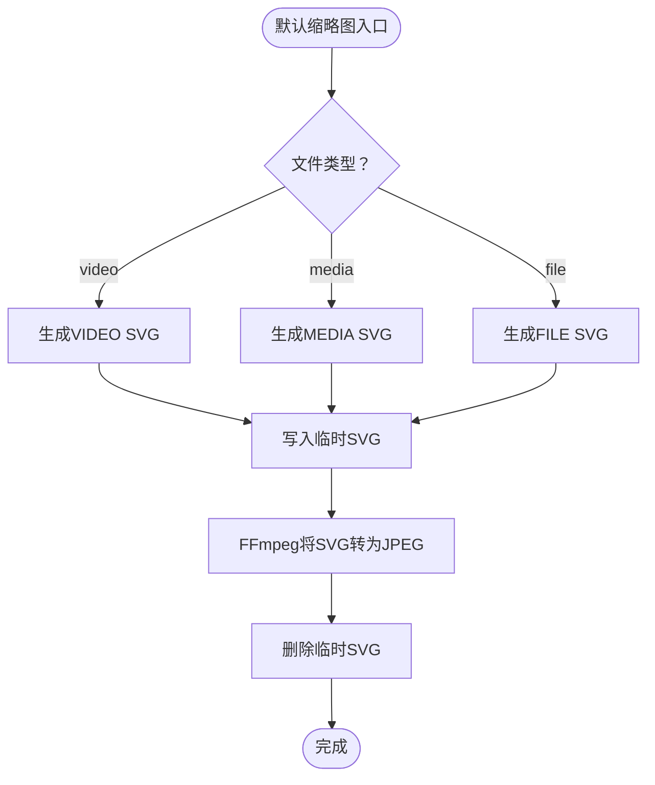
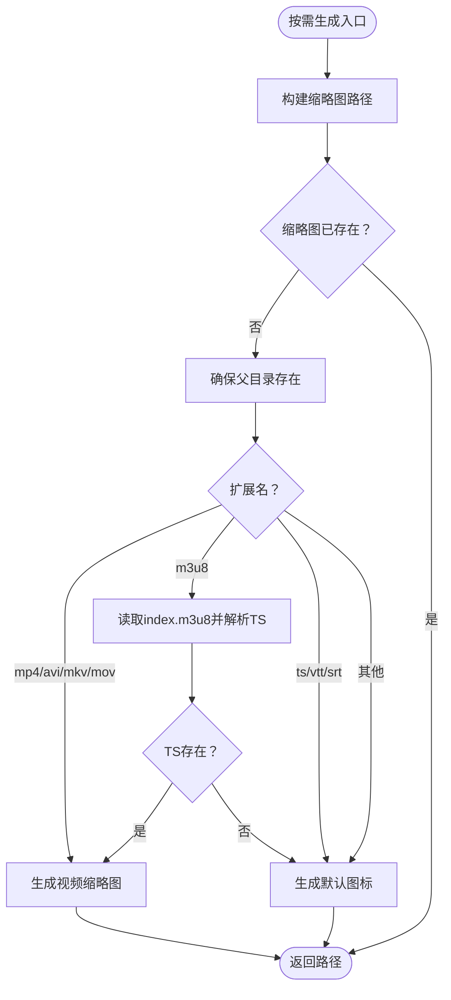
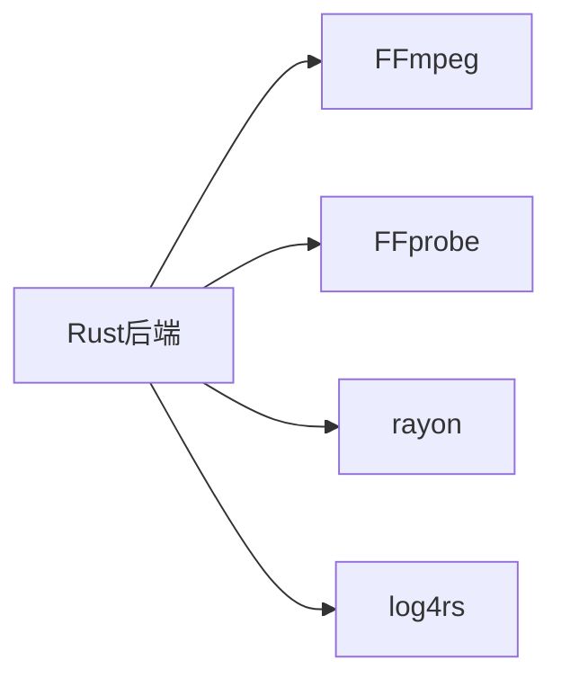

# 缩略图生成

<cite>
**本文引用的文件**
- [app/server/src/main.rs](file://app/server/src/main.rs)
- [app/server/src/services/mod.rs](file://app/server/src/services/mod.rs)
- [app/server/src/services/filesystem.rs](file://app/server/src/services/filesystem.rs)
- [app/server/src/utils/thumbnail.rs](file://app/server/src/utils/thumbnail.rs)
- [app/server/src/utils/common.rs](file://app/server/src/utils/common.rs)
- [app/server/src/utils/duration.rs](file://app/server/src/utils/duration.rs)
- [app/server/src/utils/logger.rs](file://app/server/src/utils/logger.rs)
- [app/server/src/models.rs](file://app/server/src/models.rs)
- [app/web/app/media/page.tsx](file://app/web/app/media/page.tsx)
- [app/server/Cargo.toml](file://app/server/Cargo.toml)
</cite>

## 目录
1. [简介](#简介)
2. [项目结构](#项目结构)
3. [核心组件](#核心组件)
4. [架构总览](#架构总览)
5. [详细组件分析](#详细组件分析)
6. [依赖关系分析](#依赖关系分析)
7. [性能考量](#性能考量)
8. [故障排查指南](#故障排查指南)
9. [结论](#结论)
10. [附录](#附录)

## 简介
本文件面向缩略图生成系统，系统通过 FFmpeg 集成与图像处理流程，结合默认缩略图生成与 SVG 转换机制，实现对多种媒体类型的缩略图生成；同时提供并行生成优化、资源管理、缓存与存储策略，以及完善的故障处理与回退机制。本文档既覆盖技术实现细节，也兼顾非技术读者的理解需求。

## 项目结构
后端采用 Rust + Axum，前端采用 Next.js。缩略图相关逻辑集中在后端服务模块与工具模块中，前端负责展示与交互。

图表来源
- [app/server/src/main.rs](file://app/server/src/main.rs#L1-L111)
- [app/server/src/services/filesystem.rs](file://app/server/src/services/filesystem.rs#L1-L121)
- [app/server/src/utils/thumbnail.rs](file://app/server/src/utils/thumbnail.rs#L1-L99)
- [app/server/src/utils/common.rs](file://app/server/src/utils/common.rs#L1-L146)
- [app/server/src/utils/duration.rs](file://app/server/src/utils/duration.rs#L1-L43)
- [app/server/src/utils/logger.rs](file://app/server/src/utils/logger.rs#L1-L100)
- [app/server/src/models.rs](file://app/server/src/models.rs#L1-L32)
- [app/web/app/media/page.tsx](file://app/web/app/media/page.tsx#L1-L147)

章节来源
- [app/server/src/main.rs](file://app/server/src/main.rs#L1-L111)
- [app/server/Cargo.toml](file://app/server/Cargo.toml#L1-L23)

## 核心组件
- 应用入口与路由
  - 初始化日志、数据库、文件监听器，挂载静态文件服务与 API 路由，暴露缩略图目录访问。
- 缩略图生成服务
  - 提供批量初始化与单文件按需生成能力，内部调用 FFmpeg 生成 JPEG 缩略图，并在失败时回退到默认 SVG 图标。
- 工具模块
  - 文件扫描与缺失缩略图筛选，按类型分发生成策略，时长探测使用 FFprobe。
- 日志与模型
  - 统一日志配置，响应模型包含缩略图、时长、分辨率等字段。

章节来源
- [app/server/src/main.rs](file://app/server/src/main.rs#L1-L111)
- [app/server/src/services/filesystem.rs](file://app/server/src/services/filesystem.rs#L1-L121)
- [app/server/src/utils/thumbnail.rs](file://app/server/src/utils/thumbnail.rs#L1-L99)
- [app/server/src/utils/common.rs](file://app/server/src/utils/common.rs#L1-L146)
- [app/server/src/utils/duration.rs](file://app/server/src/utils/duration.rs#L1-L43)
- [app/server/src/utils/logger.rs](file://app/server/src/utils/logger.rs#L1-L100)
- [app/server/src/models.rs](file://app/server/src/models.rs#L1-L32)

## 架构总览
系统围绕“按需生成 + 批量预生成”的双通道运行模式：
- 批量预生成：启动时扫描源目录，使用并行迭代器为缺失缩略图的文件生成 JPEG。
- 按需生成：请求访问缩略图时，若不存在则即时生成并缓存。
- 回退机制：FFmpeg 失败或不可用时，生成默认 SVG 并转换为 JPEG。

图表来源
- [app/server/src/utils/thumbnail.rs](file://app/server/src/utils/thumbnail.rs#L1-L99)
- [app/server/src/services/filesystem.rs](file://app/server/src/services/filesystem.rs#L1-L121)

## 详细组件分析

### 组件A：缩略图生成服务（批量与按需）
- 批量初始化
  - 通过扫描源目录与缩略图目录，筛选出缺少对应缩略图的文件集合，使用并行迭代器逐个生成 JPEG。
  - 并行策略：基于 rayon 的并行迭代器，提升大规模文件处理效率。
- 按需生成
  - 依据请求的媒体路径，计算对应的缩略图路径，若不存在则创建父目录并生成。
  - 类型分发：对常见视频格式直接生成；对 HLS 目录优先解析 index.m3u8 获取首个 TS 片段再生成；其他类型生成默认图标。
- FFmpeg 参数
  - 视频生成：-i 输入 -ss 00:00:01 -vframes 1 -q:v 2 -y 输出。
  - 默认图标生成：先写入临时 SVG，再用 -i SVG -y 输出 JPEG，最后清理临时文件。
- 错误回退
  - FFmpeg 执行失败或输出不存在时，回退到默认 SVG 图标生成流程。

图表来源
- [app/server/src/services/filesystem.rs](file://app/server/src/services/filesystem.rs#L1-L121)
- [app/server/src/utils/common.rs](file://app/server/src/utils/common.rs#L123-L146)

章节来源
- [app/server/src/services/filesystem.rs](file://app/server/src/services/filesystem.rs#L1-L121)
- [app/server/src/utils/thumbnail.rs](file://app/server/src/utils/thumbnail.rs#L1-L99)
- [app/server/src/utils/common.rs](file://app/server/src/utils/common.rs#L123-L146)

### 组件B：默认缩略图生成与SVG转换
- 默认图标策略
  - 根据文件类型生成不同颜色块与文字的 SVG，默认包含“VIDEO”、“MEDIA”、“FILE”三类。
- SVG到JPG转换
  - 写入临时 SVG 文件，调用 FFmpeg 将其转换为 JPEG，随后删除临时文件。
- 质量控制
  - 默认尺寸固定，SVG 内容固定宽高，确保一致的视觉呈现与体积控制。

图表来源
- [app/server/src/services/filesystem.rs](file://app/server/src/services/filesystem.rs#L80-L121)

章节来源
- [app/server/src/services/filesystem.rs](file://app/server/src/services/filesystem.rs#L80-L121)

### 组件C：按需生成与类型分发
- 路径映射
  - 将 public 下的媒体路径映射到 thumbnails 目录下同名同级的 jpg 文件。
- 类型判定
  - 常见视频：直接生成。
  - HLS 目录：读取 index.m3u8，定位首个 TS 片段，再生成缩略图；若解析失败或 TS 不存在，回退默认图标。
  - 其他类型：生成默认图标。
- 性能与缓存
  - 生成后即缓存至磁盘，后续请求直接命中，避免重复生成。

图表来源
- [app/server/src/utils/thumbnail.rs](file://app/server/src/utils/thumbnail.rs#L1-L99)

章节来源
- [app/server/src/utils/thumbnail.rs](file://app/server/src/utils/thumbnail.rs#L1-L99)

### 组件D：并行缩略图生成优化与资源管理
- 并行策略
  - 使用 rayon 的并行迭代器对“缺失缩略图集合”进行 for_each 并行处理，显著缩短初始化时间。
- 资源管理
  - 并行创建目录时，确保父目录存在性检查与创建操作的安全性；对临时 SVG 文件及时清理，避免磁盘占用。
- 日志与可观测性
  - 关键步骤记录耗时与结果，便于定位性能瓶颈与异常。

章节来源
- [app/server/src/services/filesystem.rs](file://app/server/src/services/filesystem.rs#L1-L121)
- [app/server/src/utils/logger.rs](file://app/server/src/utils/logger.rs#L1-L100)
- [app/server/Cargo.toml](file://app/server/Cargo.toml#L1-L23)

### 组件E：时长探测与质量控制策略
- 时长探测
  - 使用 ffprobe 获取视频时长，解析输出字符串为秒数并格式化为 HH:MM:SS 字符串，用于前端展示与统计。
- 质量控制
  - 视频缩略图生成采用固定帧与时域偏移策略（起始约1秒），并通过图像质量参数控制 JPEG 压缩质量，兼顾清晰度与体积。
- HLS场景
  - 优先从 TS 片段生成缩略图，保证代表性；若 TS 不可用则回退默认图标。

章节来源
- [app/server/src/utils/duration.rs](file://app/server/src/utils/duration.rs#L1-L43)
- [app/server/src/services/filesystem.rs](file://app/server/src/services/filesystem.rs#L50-L78)
- [app/server/src/utils/thumbnail.rs](file://app/server/src/utils/thumbnail.rs#L47-L75)

## 依赖关系分析
- 外部工具
  - FFmpeg：用于从视频或 SVG 生成 JPEG 缩略图。
  - FFprobe：用于提取视频时长。
- 并行库
  - rayon：提供并行迭代器，加速批量缩略图生成。
- 日志
  - log4rs：控制台与滚动文件输出，便于运维与排障。

图表来源
- [app/server/Cargo.toml](file://app/server/Cargo.toml#L1-L23)
- [app/server/src/services/filesystem.rs](file://app/server/src/services/filesystem.rs#L1-L121)
- [app/server/src/utils/duration.rs](file://app/server/src/utils/duration.rs#L1-L43)

章节来源
- [app/server/Cargo.toml](file://app/server/Cargo.toml#L1-L23)

## 性能考量
- 并行生成
  - 使用 rayon 并行处理缺失缩略图集合，建议根据 CPU 核心数与 I/O 带宽合理设置任务粒度，避免过多并发导致磁盘争用。
- I/O 优化
  - 批量初始化时尽量减少目录创建次数，确保父目录一次性创建；生成完成后立即缓存，避免重复计算。
- FFmpeg 参数
  - 固定起始时间与单帧输出，降低解码开销；质量参数适中，兼顾清晰度与体积。
- 前端展示
  - 前端媒体页提供缩略图占位与类型标识，有助于用户感知加载状态与媒体类型。

章节来源
- [app/server/src/services/filesystem.rs](file://app/server/src/services/filesystem.rs#L1-L121)
- [app/web/app/media/page.tsx](file://app/web/app/media/page.tsx#L1-L147)

## 故障排查指南
- FFmpeg 不可用
  - 现象：生成失败并触发默认图标回退。
  - 排查：确认系统已安装 FFmpeg 并加入 PATH；检查权限与磁盘空间。
- HLS 目录无 TS 或 index.m3u8 异常
  - 现象：按需生成时回退默认图标。
  - 排查：确认 HLS 目录结构完整，index.m3u8 可读且包含有效 TS 行；TS 文件存在且可访问。
- 权限与路径问题
  - 现象：无法创建缩略图目录或写入文件。
  - 排查：检查运行用户权限与工作目录；确保 public 与 thumbnails 目录可读写。
- 日志定位
  - 使用日志输出的耗时与错误信息定位具体环节，必要时提高日志级别。

章节来源
- [app/server/src/services/filesystem.rs](file://app/server/src/services/filesystem.rs#L50-L121)
- [app/server/src/utils/thumbnail.rs](file://app/server/src/utils/thumbnail.rs#L1-L99)
- [app/server/src/utils/logger.rs](file://app/server/src/utils/logger.rs#L1-L100)

## 结论
该缩略图生成系统通过“批量预生成 + 按需生成”的组合策略，结合 FFmpeg 的高效图像处理与默认 SVG 回退机制，实现了对多类型媒体的稳定缩略图产出。并行化与资源管理优化提升了整体吞吐，日志体系保障了可观测性与可维护性。建议在生产环境中配合监控与告警，持续评估并调整并行度与质量参数，以获得最佳性能与用户体验。

## 附录
- 命令行参数要点
  - 视频缩略图：输入文件、起始时间偏移、帧数限制、图像质量、输出文件。
  - 默认图标：输入 SVG、输出 JPEG。
- 数据模型字段
  - 响应模型包含缩略图、时长、分辨率、比特率、编码信息、创建时间等，便于前端展示与统计。

章节来源
- [app/server/src/services/filesystem.rs](file://app/server/src/services/filesystem.rs#L50-L121)
- [app/server/src/models.rs](file://app/server/src/models.rs#L1-L32)