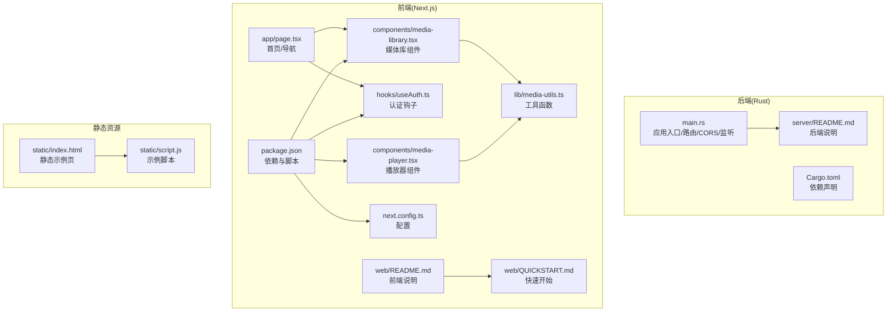
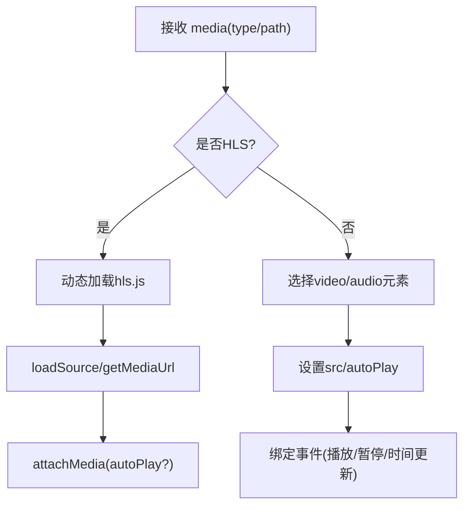

# 文档

<cite>
**本文引用的文件**
- [main.rs](file://app/server/src/main.rs)
- [Cargo.toml](file://app/server/Cargo.toml)
- [server_README.md](file://app/server/README.md)
- [web_README.md](file://app/web/README.md)
- [QUICKSTART.md](file://app/web/QUICKSTART.md)
- [next.config.ts](file://app/web/next.config.ts)
- [media-utils.ts](file://app/web/lib/media-utils.ts)
- [media-player.tsx](file://app/web/components/media-player.tsx)
- [media-library.tsx](file://app/web/components/media-library.tsx)
- [useAuth.ts](file://app/web/hooks/useAuth.ts)
- [page.tsx](file://app/web/app/page.tsx)
- [index.html](file://app/server/static/index.html)
- [script.js](file://app/server/static/script.js)
</cite>

## 目录
1. [引言](#引言)
2. [项目结构](#项目结构)
3. [核心组件](#核心组件)
4. [架构总览](#架构总览)
5. [详细组件分析](#详细组件分析)
6. [依赖关系分析](#依赖关系分析)
7. [性能考量](#性能考量)
8. [故障排查指南](#故障排查指南)
9. [结论](#结论)
10. [附录](#附录)

## 引言
本项目是一个多语言协作的视频媒体系统，包含：
- Rust + Axum 后端服务器，负责视频文件扫描、元数据组织、REST API 提供、静态文件服务与文件监听；
- Python M3U8 下载模块，支持多线程、断点续传、JSON 批量任务与多种配置模板；
- Next.js 前端应用，提供媒体库浏览与播放体验。

系统目标是实现高性能、易用的视频文件服务与下载能力，支持 MP4、M3U8/HLS、TS 等常见格式，并提供缩略图与字幕辅助。

## 项目结构
整体采用“多子项目”布局：后端（Rust）、下载器（Python）、前端（Next.js）。各子项目职责清晰，通过 API 与静态资源协同工作。

图表来源
- [main.rs](file://app/server/src/main.rs#L1-L111)
- [Cargo.toml](file://app/server/Cargo.toml#L1-L23)
- [server_README.md](file://app/server/README.md#L1-L313)
- [web_README.md](file://app/web/README.md#L1-L246)
- [QUICKSTART.md](file://app/web/QUICKSTART.md#L1-L313)
- [next.config.ts](file://app/web/next.config.ts#L1-L39)
- [media-utils.ts](file://app/web/lib/media-utils.ts#L1-L43)
- [media-player.tsx](file://app/web/components/media-player.tsx#L1-L322)
- [media-library.tsx](file://app/web/components/media-library.tsx#L1-L120)
- [useAuth.ts](file://app/web/hooks/useAuth.ts#L1-L62)
- [page.tsx](file://app/web/app/page.tsx#L1-L143)
- [index.html](file://app/server/static/index.html#L1-L26)
- [script.js](file://app/server/static/script.js#L1-L67)

章节来源
- [main.rs](file://app/server/src/main.rs#L1-L111)
- [Cargo.toml](file://app/server/Cargo.toml#L1-L23)
- [server_README.md](file://app/server/README.md#L1-L313)
- [web_README.md](file://app/web/README.md#L1-L246)
- [QUICKSTART.md](file://app/web/QUICKSTART.md#L1-L313)
- [next.config.ts](file://app/web/next.config.ts#L1-L39)
- [media-utils.ts](file://app/web/lib/media-utils.ts#L1-L43)
- [media-player.tsx](file://app/web/components/media-player.tsx#L1-L322)
- [media-library.tsx](file://app/web/components/media-library.tsx#L1-L120)
- [useAuth.ts](file://app/web/hooks/useAuth.ts#L1-L62)
- [page.tsx](file://app/web/app/page.tsx#L1-L143)
- [index.html](file://app/server/static/index.html#L1-L26)
- [script.js](file://app/server/static/script.js#L1-L67)

## 核心组件
- 后端服务器
  - 应用状态与中间件：统一状态、CORS、静态文件服务、监听端口与日志。
  - 路由与端点：视频列表、详情、手动同步、文件监听器启停与状态查询。
  - 数据模型：VideoInfo/VideoList，承载名称、路径、类型、缩略图、时长、尺寸、分辨率、码率、编解码、创建时间、字幕等。
  - 数据访问：VideoDao 提供根目录视频、指定路径子节点、按路径查询等。
- 下载器
  - M3U8Downloader：主流程封装，解析 m3u8、批量下载 TS、合并输出、清理临时文件、状态记录。
  - DownloadManager：线程池并发下载、重试机制、进度统计、信号中断、合并与清理。
  - CLI：参数解析、模板配置、交互模式、Dry-run、URL 校验与规范化。
- 前端
  - 首页：导航至视频库，引导认证流程。
  - 媒体库：按类型过滤（全部/视频/音频/流媒体），展示缩略图、类型标签、大小与分辨率等。
  - 播放器：自动识别媒体类型，HLS 使用 hls.js，其他格式使用原生 HTML5 媒体元素。

章节来源
- [main.rs](file://app/server/src/main.rs#L21-L111)
- [server_README.md](file://app/server/README.md#L1-L313)
- [web_README.md](file://app/web/README.md#L1-L246)
- [media-utils.ts](file://app/web/lib/media-utils.ts#L1-L43)
- [media-player.tsx](file://app/web/components/media-player.tsx#L1-L322)
- [media-library.tsx](file://app/web/components/media-library.tsx#L1-L120)
- [useAuth.ts](file://app/web/hooks/useAuth.ts#L1-L62)
- [page.tsx](file://app/web/app/page.tsx#L1-L143)

## 架构总览
系统采用“后端 API + 下载器 + 前端 UI”的分层架构。后端负责目录扫描与数据库持久化，提供 REST API；下载器作为独立工具，支持命令行与编程调用；前端通过 API 获取媒体列表并渲染。

图表来源
- [main.rs](file://app/server/src/main.rs#L72-L111)
- [server_README.md](file://app/server/README.md#L1-L313)
- [web_README.md](file://app/web/README.md#L1-L246)

## 详细组件分析

### 后端组件分析

#### 数据模型与序列化
- VideoInfo 字段覆盖基础信息、可选元数据与子节点，便于树形结构返回。
- VideoList 包含 videos 数组，作为列表响应载体。

图表来源
- [server_README.md](file://app/server/README.md#L122-L140)

章节来源
- [server_README.md](file://app/server/README.md#L122-L140)

#### 路由与端点
- 列表与详情：/api/videos 与 /api/videos/*path 返回目录树或指定路径详情。
- 同步与监听：/api/sync 手动触发数据库同步；/api/watcher/start|stop|status 控制文件监听器。
- 静态服务：/public 与 /thumbnails 提供媒体与缩略图访问。

图表来源
- [main.rs](file://app/server/src/main.rs#L72-L111)
- [server_README.md](file://app/server/README.md#L35-L110)

章节来源
- [main.rs](file://app/server/src/main.rs#L72-L111)
- [server_README.md](file://app/server/README.md#L35-L110)

#### 数据访问层
- VideoDao 提供：
  - 根目录视频列表
  - 指定父路径的子节点
  - 按路径精确查询
  - m3u8 类型特殊处理（返回空子节点）

图表来源
- [server_README.md](file://app/server/README.md#L110-L180)

章节来源
- [server_README.md](file://app/server/README.md#L110-L180)

#### 输出目录与环境变量
- 数据源目录
  - 通过环境变量 DATA_SOURCE_DIR 指定，默认 public。
  - 缩略图目录 thumbnails 与数据源目录配合使用。
- 监听与端口
  - 默认监听 0.0.0.0:3003，CORS 允许所有来源。
- 静态文件服务
  - /public 对应数据源目录
  - /thumbnails 对应 thumbnails 目录

章节来源
- [main.rs](file://app/server/src/main.rs#L31-L37)
- [main.rs](file://app/server/src/main.rs#L92-L110)
- [server_README.md](file://app/server/README.md#L141-L170)

### 下载器组件分析

#### 下载流程与并发
- M3U8Downloader 主流程：解析 m3u8 → 过滤已下载 → 并发下载 TS → 合并 → 清理 → 记录状态。
- DownloadManager 使用线程池并发下载，带指数退避重试、进度统计、信号中断、临时目录清理。

图表来源
- [server_README.md](file://app/server/README.md#L257-L313)

章节来源
- [server_README.md](file://app/server/README.md#L257-L313)

#### CLI 参数与交互
- 支持模板（fast/stable/low_bandwidth）、自定义线程数、重试、超时、请求头、输出/临时目录、禁用 SSL/进度/日志、Dry-run、交互模式。
- 交互模式提供友好提示与确认流程。

章节来源
- [server_README.md](file://app/server/README.md#L257-L313)

### 前端组件分析

#### 首页与导航
- 首页展示欢迎信息与功能特性，点击“浏览视频库”根据认证状态跳转至视频页或触发认证。

图表来源
- [page.tsx](file://app/web/app/page.tsx#L1-L143)
- [useAuth.ts](file://app/web/hooks/useAuth.ts#L1-L62)

章节来源
- [page.tsx](file://app/web/app/page.tsx#L1-L143)
- [useAuth.ts](file://app/web/hooks/useAuth.ts#L1-L62)

#### 媒体库组件
- 支持按类型过滤（全部/视频/音频/流媒体），展示图标、类型标签、大小与分辨率等信息，点击项触发选择回调。

图表来源
- [media-library.tsx](file://app/web/components/media-library.tsx#L1-L120)
- [media-utils.ts](file://app/web/lib/media-utils.ts#L1-L43)

章节来源
- [media-library.tsx](file://app/web/components/media-library.tsx#L1-L120)
- [media-utils.ts](file://app/web/lib/media-utils.ts#L1-L43)

#### 播放器组件
- 自动识别媒体类型，HLS 使用 hls.js，其他格式使用原生 HTML5 媒体元素。
- 支持播放/暂停、音量、进度、全屏、下载等常用功能。

图表来源
- [media-player.tsx](file://app/web/components/media-player.tsx#L1-L322)

章节来源
- [media-player.tsx](file://app/web/components/media-player.tsx#L1-L322)

#### 环境变量与集成验证
- API 地址
  - NEXT_PUBLIC_API_URL：默认 http://localhost:3000，可在 .env.local 中配置。
- CORS 与图片访问
  - next.config.ts 中配置了 images.remotePatterns，允许访问后端 192.168.1.5:3000 的 /public/** 资源。
- 验证步骤
  - 启动后端（默认 0.0.0.0:3003，若需 3000 端口请在后端修改监听端口或前端调整 API 地址）。
  - 启动前端（默认 13000 端口），访问 /videos 获取媒体列表。
  - 若访问不到静态资源，请在 .env.local 中将 NEXT_PUBLIC_API_URL 指向后端实际地址。

章节来源
- [web_README.md](file://app/web/README.md#L59-L129)
- [web_README.md](file://app/web/README.md#L179-L184)
- [next.config.ts](file://app/web/next.config.ts#L1-L39)
- [main.rs](file://app/server/src/main.rs#L92-L110)

## 依赖关系分析
- 后端依赖
  - Axum/Tokio 提供异步 HTTP 服务与运行时；
  - Tower-HTTP 提供 CORS、静态文件服务；
  - Rusqlite 管理 SQLite；
  - WalkDir、Notify、Rayon 等用于目录扫描、文件监控与并行处理；
  - Regex、Chrono、log/log4rs 提供正则、时间与日志能力。
- 下载器依赖
  - requests/tqdm 提供网络请求与进度条；
  - CLI 通过脚本入口注册命令行工具。
- 前端依赖
  - Next.js、React、Radix UI、Tailwind、Hls.js 等构建现代 Web 应用。

图表来源
- [Cargo.toml](file://app/server/Cargo.toml#L1-L23)
- [web_README.md](file://app/web/README.md#L1-L246)

章节来源
- [Cargo.toml](file://app/server/Cargo.toml#L1-L23)
- [web_README.md](file://app/web/README.md#L1-L246)

## 性能考量
- 后端
  - 异步运行时与中间件减少阻塞，适合高并发访问。
  - 目录扫描与数据库查询分离，可结合缓存策略优化大规模媒体库。
  - 文件监听器默认关闭，避免不必要的 I/O 开销。
- 下载器
  - 线程池并发与指数退避重试平衡吞吐与稳定性。
  - 分块下载与缓冲合并避免内存峰值。
  - 临时目录清理降低磁盘占用。
- 前端
  - 按需渲染与类型过滤减少 DOM 压力。
  - HLS 播放器在浏览器侧解码，减轻服务器压力。

## 故障排查指南
- 后端
  - 端口占用：修改监听地址或释放端口。
  - 数据库初始化失败：检查数据库文件权限与路径。
  - CORS 问题：确认已启用并允许来源。
- 下载器
  - SSL 验证失败：可临时禁用（仅调试）。
  - 网络不稳定：增大重试次数与延迟，或切换稳定模板。
  - 权限不足：确保输出目录与临时目录可写。
- 前端
  - 路由跳转：确认认证状态与路由守卫逻辑。
  - 播放异常：检查 HLS 支持与网络连通性。
  - 静态资源跨域：在 .env.local 中配置 NEXT_PUBLIC_API_URL 指向后端地址；或在 next.config.ts 中调整 images.remotePatterns。

章节来源
- [main.rs](file://app/server/src/main.rs#L92-L111)
- [web_README.md](file://app/web/README.md#L179-L184)
- [next.config.ts](file://app/web/next.config.ts#L1-L39)

## 结论
该系统通过 Rust/Axum 的高性能后端、Python 的专业下载器与 Next.js 的现代化前端，形成完整的视频媒体解决方案。其模块化设计便于扩展与维护，适合个人媒体库与在线播放场景。

## 附录
- 快速启动与使用请参阅项目总说明文档中的安装、配置与使用章节。
- 更多下载器使用示例与高级功能请参考下载器文档与示例文件。

章节来源
- [server_README.md](file://app/server/README.md#L141-L170)
- [web_README.md](file://app/web/README.md#L109-L148)