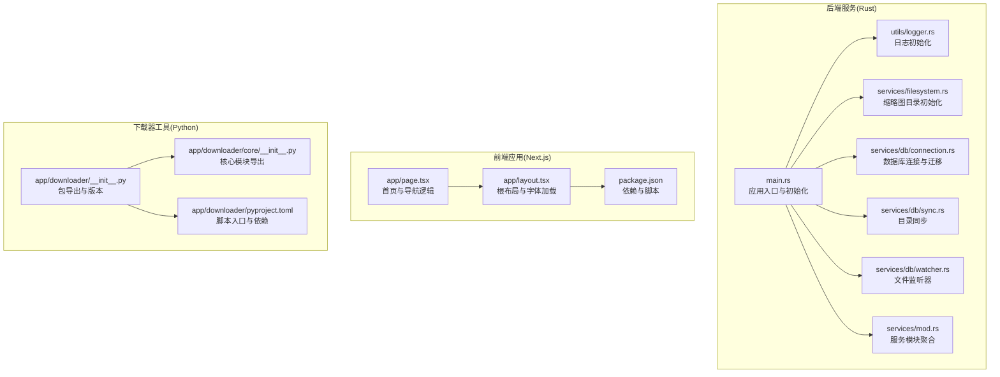
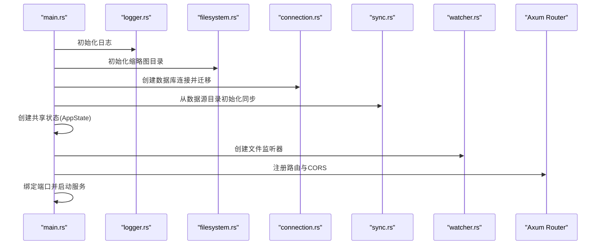
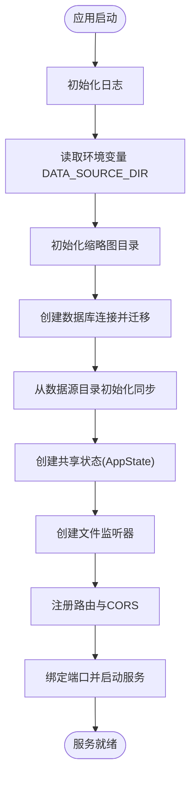
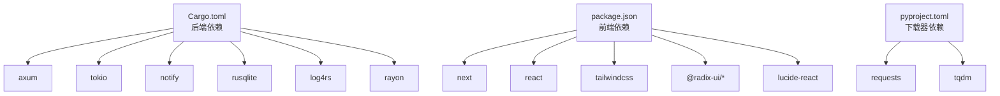

# 模块初始化

<cite>
**本文引用的文件**
- [app/downloader/__init__.py](file://app/downloader/__init__.py)
- [app/downloader/core/__init__.py](file://app/downloader/core/__init__.py)
- [app/downloader/pyproject.toml](file://app/downloader/pyproject.toml)
- [app/server/src/main.rs](file://app/server/src/main.rs)
- [app/server/src/services/mod.rs](file://app/server/src/services/mod.rs)
- [app/server/src/utils/logger.rs](file://app/server/src/utils/logger.rs)
- [app/server/src/services/db/connection.rs](file://app/server/src/services/db/connection.rs)
- [app/server/src/services/db/sync.rs](file://app/server/src/services/db/sync.rs)
- [app/server/src/services/db/watcher.rs](file://app/server/src/services/db/watcher.rs)
- [app/server/src/services/filesystem.rs](file://app/server/src/services/filesystem.rs)
- [app/server/Cargo.toml](file://app/server/Cargo.toml)
- [app/web/app/layout.tsx](file://app/web/app/layout.tsx)
- [app/web/app/page.tsx](file://app/web/app/page.tsx)
- [app/web/package.json](file://app/web/package.json)
</cite>

## 目录
1. [简介](#简介)
2. [项目结构](#项目结构)
3. [核心组件](#核心组件)
4. [架构总览](#架构总览)
5. [详细组件分析](#详细组件分析)
6. [依赖关系分析](#依赖关系分析)
7. [性能考虑](#性能考虑)
8. [故障排查指南](#故障排查指南)
9. [结论](#结论)
10. [附录](#附录)

## 简介
本文件聚焦于该仓库中的“模块初始化”主题，覆盖后端 Rust 服务的启动与初始化流程、前端 Next.js 应用的布局与页面初始化、以及 Python 下载器包的导出与入口脚本。文档通过分层视角解释各模块如何在启动阶段完成自身初始化，并提供可视化图示帮助理解初始化顺序与依赖关系。

## 项目结构
该项目由三个主要部分组成：
- 后端服务（Rust + Axum）：负责视频数据的数据库初始化、缩略图目录初始化、文件监听与 API 路由注册。
- 前端应用（Next.js）：负责页面布局、字体加载与首页引导逻辑。
- 下载器工具（Python 包）：提供命令行入口与高级 CLI，封装下载器核心能力并通过包导出暴露给外部使用。

图表来源
- [app/server/src/main.rs](file://app/server/src/main.rs#L1-L111)
- [app/server/src/utils/logger.rs](file://app/server/src/utils/logger.rs#L1-L100)
- [app/server/src/services/filesystem.rs](file://app/server/src/services/filesystem.rs#L1-L121)
- [app/server/src/services/db/connection.rs](file://app/server/src/services/db/connection.rs#L1-L122)
- [app/server/src/services/db/sync.rs](file://app/server/src/services/db/sync.rs#L1-L413)
- [app/server/src/services/db/watcher.rs](file://app/server/src/services/db/watcher.rs#L1-L182)
- [app/server/src/services/mod.rs](file://app/server/src/services/mod.rs#L1-L6)
- [app/web/app/layout.tsx](file://app/web/app/layout.tsx#L1-L35)
- [app/web/app/page.tsx](file://app/web/app/page.tsx#L1-L143)
- [app/web/package.json](file://app/web/package.json#L1-L74)
- [app/downloader/__init__.py](file://app/downloader/__init__.py#L1-L49)
- [app/downloader/core/__init__.py](file://app/downloader/core/__init__.py#L1-L51)
- [app/downloader/pyproject.toml](file://app/downloader/pyproject.toml#L1-L17)

章节来源
- [app/server/src/main.rs](file://app/server/src/main.rs#L1-L111)
- [app/web/app/layout.tsx](file://app/web/app/layout.tsx#L1-L35)
- [app/web/app/page.tsx](file://app/web/app/page.tsx#L1-L143)
- [app/downloader/__init__.py](file://app/downloader/__init__.py#L1-L49)

## 核心组件
- 后端应用入口与初始化：负责日志初始化、缩略图目录初始化、数据库连接与目录同步、文件监听器创建、CORS 配置与路由注册。
- 日志系统：基于 log4rs 的控制台与滚动文件输出，彩色编码与时间戳。
- 文件系统与缩略图：根据数据源目录生成缩略图目录与缩略图，必要时回退到默认图标。
- 数据库管理：建立视频表、索引与迁移逻辑，保证兼容旧版本。
- 目录同步：扫描文件系统与数据库双向同步，处理新增、变更与删除。
- 文件监听器：基于 notify 的文件系统事件监听，配合防抖策略触发同步。
- 前端根布局与首页：Next.js 根布局与首页组件，包含导航与认证引导。
- Python 下载器包：通过 __all__ 导出核心类与工具，pyproject.toml 定义命令行入口。

章节来源
- [app/server/src/main.rs](file://app/server/src/main.rs#L1-L111)
- [app/server/src/utils/logger.rs](file://app/server/src/utils/logger.rs#L1-L100)
- [app/server/src/services/filesystem.rs](file://app/server/src/services/filesystem.rs#L1-L121)
- [app/server/src/services/db/connection.rs](file://app/server/src/services/db/connection.rs#L1-L122)
- [app/server/src/services/db/sync.rs](file://app/server/src/services/db/sync.rs#L1-L413)
- [app/server/src/services/db/watcher.rs](file://app/server/src/services/db/watcher.rs#L1-L182)
- [app/web/app/layout.tsx](file://app/web/app/layout.tsx#L1-L35)
- [app/web/app/page.tsx](file://app/web/app/page.tsx#L1-L143)
- [app/downloader/__init__.py](file://app/downloader/__init__.py#L1-L49)
- [app/downloader/core/__init__.py](file://app/downloader/core/__init__.py#L1-L51)
- [app/downloader/pyproject.toml](file://app/downloader/pyproject.toml#L1-L17)

## 架构总览
后端服务启动时的初始化顺序如下：
1. 初始化日志系统。
2. 读取环境变量确定数据源目录，默认 public。
3. 初始化缩略图目录并批量生成缩略图。
4. 建立数据库连接，创建表与索引，并执行迁移。
5. 基于数据源目录进行一次目录同步（可增量或全量）。
6. 创建共享状态（数据库管理器与文件监听器）。
7. 注册路由与中间件（CORS、静态文件服务）。
8. 启动 HTTP 服务器。

图表来源
- [app/server/src/main.rs](file://app/server/src/main.rs#L1-L111)
- [app/server/src/utils/logger.rs](file://app/server/src/utils/logger.rs#L1-L100)
- [app/server/src/services/filesystem.rs](file://app/server/src/services/filesystem.rs#L1-L121)
- [app/server/src/services/db/connection.rs](file://app/server/src/services/db/connection.rs#L1-L122)
- [app/server/src/services/db/sync.rs](file://app/server/src/services/db/sync.rs#L1-L413)
- [app/server/src/services/db/watcher.rs](file://app/server/src/services/db/watcher.rs#L1-L182)

## 详细组件分析

### 后端应用入口与初始化流程
- 日志初始化：在应用启动时调用日志初始化函数，配置控制台与滚动文件输出，设置日志级别。
- 缩略图目录初始化：创建 thumbnails 目录，扫描无缩略图的媒体文件，使用 ffmpeg 生成缩略图；若失败则生成默认图标。
- 数据库初始化：打开 SQLite 数据库，创建 videos 表与索引，并执行迁移逻辑以兼容旧版本。
- 目录同步：根据数据源目录进行双向同步，区分新增、变更与删除，支持强制重新初始化。
- 文件监听器：基于 notify 监听文件系统事件，使用通道与防抖策略减少频繁同步。
- 路由与中间件：注册 API 路由与静态文件服务，启用 CORS 并注入共享状态。

图表来源
- [app/server/src/main.rs](file://app/server/src/main.rs#L1-L111)
- [app/server/src/utils/logger.rs](file://app/server/src/utils/logger.rs#L1-L100)
- [app/server/src/services/filesystem.rs](file://app/server/src/services/filesystem.rs#L1-L121)
- [app/server/src/services/db/connection.rs](file://app/server/src/services/db/connection.rs#L1-L122)
- [app/server/src/services/db/sync.rs](file://app/server/src/services/db/sync.rs#L1-L413)
- [app/server/src/services/db/watcher.rs](file://app/server/src/services/db/watcher.rs#L1-L182)

章节来源
- [app/server/src/main.rs](file://app/server/src/main.rs#L1-L111)
- [app/server/src/utils/logger.rs](file://app/server/src/utils/logger.rs#L1-L100)
- [app/server/src/services/filesystem.rs](file://app/server/src/services/filesystem.rs#L1-L121)
- [app/server/src/services/db/connection.rs](file://app/server/src/services/db/connection.rs#L1-L122)
- [app/server/src/services/db/sync.rs](file://app/server/src/services/db/sync.rs#L1-L413)
- [app/server/src/services/db/watcher.rs](file://app/server/src/services/db/watcher.rs#L1-L182)

### 日志系统初始化
- 控制台输出：使用 PatternEncoder 输出带时间戳与级别的日志。
- 文件滚动：按大小触发滚动，保留固定数量的历史文件。
- 彩色编码：根据日志级别输出不同颜色，便于终端阅读。
- 初始化入口：通过 init_logger 函数一次性配置 log4rs。

章节来源
- [app/server/src/utils/logger.rs](file://app/server/src/utils/logger.rs#L1-L100)

### 缩略图目录初始化与生成
- 目录创建：若不存在则创建 thumbnails 目录。
- 扫描与过滤：统计无缩略图的文件集合，按需生成缩略图。
- 生成策略：优先使用 ffmpeg 截取首帧；失败时生成默认 SVG 图标并转换为 JPG。
- 性能：使用并行处理加速缩略图生成。

章节来源
- [app/server/src/services/filesystem.rs](file://app/server/src/services/filesystem.rs#L1-L121)

### 数据库连接与迁移
- 连接与建表：打开数据库文件，创建 videos 表与索引。
- 迁移逻辑：检测旧列并重建表结构，保持数据一致性。
- 索引维护：在迁移后重建索引以提升查询性能。

章节来源
- [app/server/src/services/db/connection.rs](file://app/server/src/services/db/connection.rs#L1-L122)

### 目录同步（双向）
- 增量与全量：根据数据库是否为空决定全量或增量同步；支持强制重新初始化。
- 双向策略：文件系统 -> 数据库（新增/变更），数据库 -> 文件系统（删除）。
- 类型识别：对 mp4、m3u8、ts、字幕与图片等类型分别处理。
- m3u8 目录：合并处理并生成对应记录。
- 性能：记录各阶段耗时，便于诊断与优化。

章节来源
- [app/server/src/services/db/sync.rs](file://app/server/src/services/db/sync.rs#L1-L413)

### 文件监听器
- 事件捕获：基于 notify 监听指定路径的递归事件。
- 防抖策略：设定时间间隔，避免频繁触发同步。
- 内容过滤：仅对视频相关类型与目录变化进行响应。
- 同步执行：在监听协程中调用目录同步逻辑。

章节来源
- [app/server/src/services/db/watcher.rs](file://app/server/src/services/db/watcher.rs#L1-L182)

### 前端根布局与首页
- 根布局：定义全局样式、字体加载与元数据。
- 首页：展示导航、功能特性与认证引导逻辑。
- 依赖与脚本：Next.js 版本与开发/构建/启动脚本。

章节来源
- [app/web/app/layout.tsx](file://app/web/app/layout.tsx#L1-L35)
- [app/web/app/page.tsx](file://app/web/app/page.tsx#L1-L143)
- [app/web/package.json](file://app/web/package.json#L1-L74)

### Python 下载器包导出与脚本入口
- 包导出：通过 __all__ 明确对外公开的类与工具。
- 核心模块导出：核心模块同样提供统一导出，便于按需导入。
- 命令行入口：pyproject.toml 定义 m3u8-cli 与 m3u8-advanced-cli 两个脚本入口。

章节来源
- [app/downloader/__init__.py](file://app/downloader/__init__.py#L1-L49)
- [app/downloader/core/__init__.py](file://app/downloader/core/__init__.py#L1-L51)
- [app/downloader/pyproject.toml](file://app/downloader/pyproject.toml#L1-L17)

## 依赖关系分析
- 后端依赖：Axum、Tokio、notify、rusqlite、log4rs、rayon 等，支撑 Web 服务、文件监听、数据库与并行处理。
- 前端依赖：Next.js、React、TailwindCSS、Radix UI、Lucide 等，支撑页面渲染与 UI 组件。
- 下载器依赖：requests、tqdm，支撑网络请求与进度显示。

图表来源
- [app/server/Cargo.toml](file://app/server/Cargo.toml#L1-L23)
- [app/web/package.json](file://app/web/package.json#L1-L74)
- [app/downloader/pyproject.toml](file://app/downloader/pyproject.toml#L1-L17)

章节来源
- [app/server/Cargo.toml](file://app/server/Cargo.toml#L1-L23)
- [app/web/package.json](file://app/web/package.json#L1-L74)
- [app/downloader/pyproject.toml](file://app/downloader/pyproject.toml#L1-L17)

## 性能考虑
- 缩略图生成：使用并行迭代器加速处理，注意磁盘 IO 与 ffmpeg 调用开销。
- 数据库索引：在建表与迁移后重建索引，提升查询效率。
- 目录同步：记录各阶段耗时，定位瓶颈；对大目录采用增量同步。
- 文件监听：设置防抖时间，避免频繁同步导致的性能抖动。
- 日志滚动：按大小滚动，避免单文件过大影响写入性能。

## 故障排查指南
- 缩略图生成失败：确认 ffmpeg 是否可用；若失败会回退到默认图标。
- 数据库迁移异常：检查旧表结构与权限；迁移过程会重建表与索引。
- 文件监听未生效：确认监听路径存在且具备读取权限；检查 is_content_change 过滤逻辑。
- CORS 问题：确认已启用 CORS 中间件并允许相应方法与头。
- 首页导航：若未登录，点击“浏览视频库”将触发认证流程。

章节来源
- [app/server/src/services/filesystem.rs](file://app/server/src/services/filesystem.rs#L1-L121)
- [app/server/src/services/db/connection.rs](file://app/server/src/services/db/connection.rs#L1-L122)
- [app/server/src/services/db/watcher.rs](file://app/server/src/services/db/watcher.rs#L1-L182)
- [app/server/src/main.rs](file://app/server/src/main.rs#L1-L111)
- [app/web/app/page.tsx](file://app/web/app/page.tsx#L1-L143)

## 结论
该仓库在启动阶段通过清晰的初始化顺序实现了后端服务、前端应用与下载器工具的模块化集成。后端以日志、数据库、缩略图与同步为核心初始化步骤，前端以布局与页面逻辑为主，下载器以包导出与脚本入口为核心。整体结构层次分明，初始化流程可追溯，适合进一步扩展与维护。

## 附录
- 关键初始化位置参考：
  - 后端入口与初始化：[app/server/src/main.rs](file://app/server/src/main.rs#L1-L111)
  - 日志初始化：[app/server/src/utils/logger.rs](file://app/server/src/utils/logger.rs#L1-L100)
  - 缩略图初始化与生成：[app/server/src/services/filesystem.rs](file://app/server/src/services/filesystem.rs#L1-L121)
  - 数据库连接与迁移：[app/server/src/services/db/connection.rs](file://app/server/src/services/db/connection.rs#L1-L122)
  - 目录同步：[app/server/src/services/db/sync.rs](file://app/server/src/services/db/sync.rs#L1-L413)
  - 文件监听器：[app/server/src/services/db/watcher.rs](file://app/server/src/services/db/watcher.rs#L1-L182)
  - 前端根布局与首页：[app/web/app/layout.tsx](file://app/web/app/layout.tsx#L1-L35), [app/web/app/page.tsx](file://app/web/app/page.tsx#L1-L143)
  - 下载器包导出与脚本入口：[app/downloader/__init__.py](file://app/downloader/__init__.py#L1-L49), [app/downloader/core/__init__.py](file://app/downloader/core/__init__.py#L1-L51), [app/downloader/pyproject.toml](file://app/downloader/pyproject.toml#L1-L17)