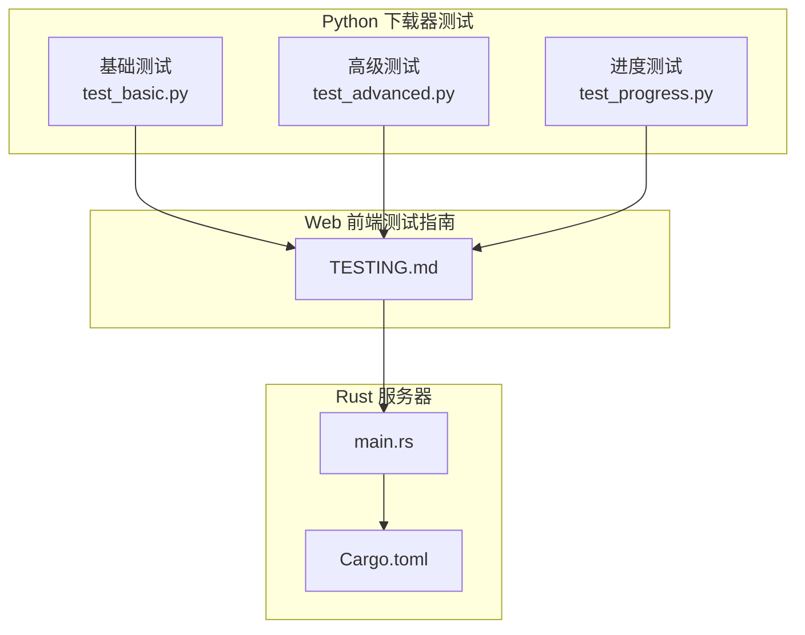
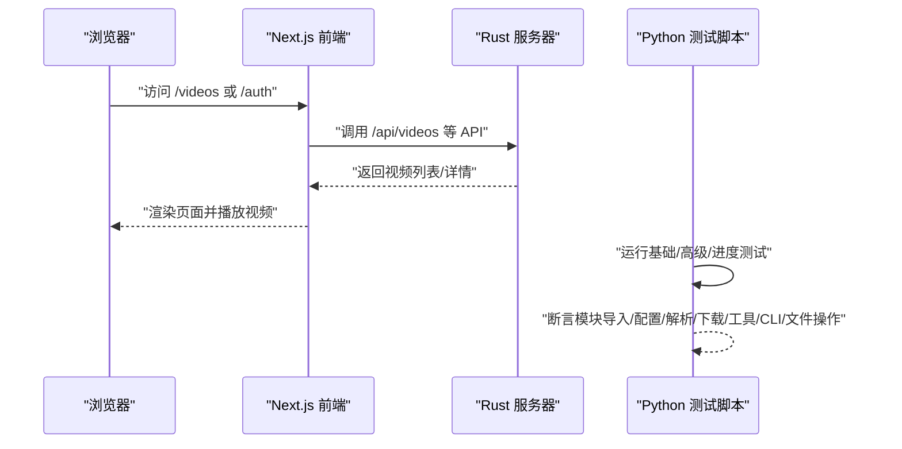
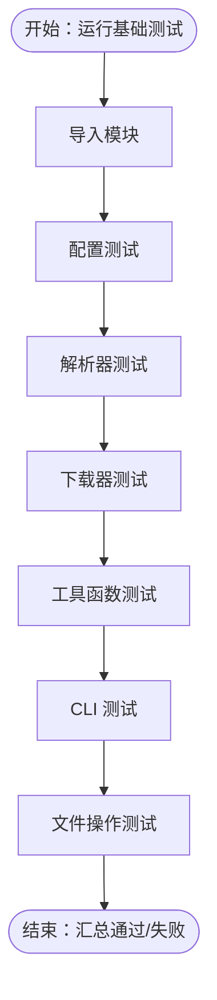
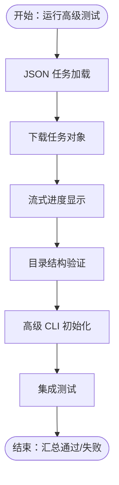
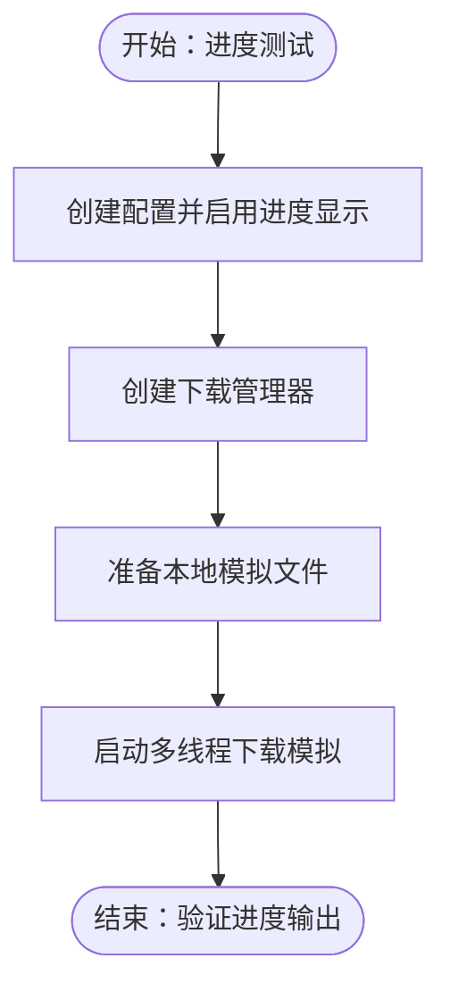
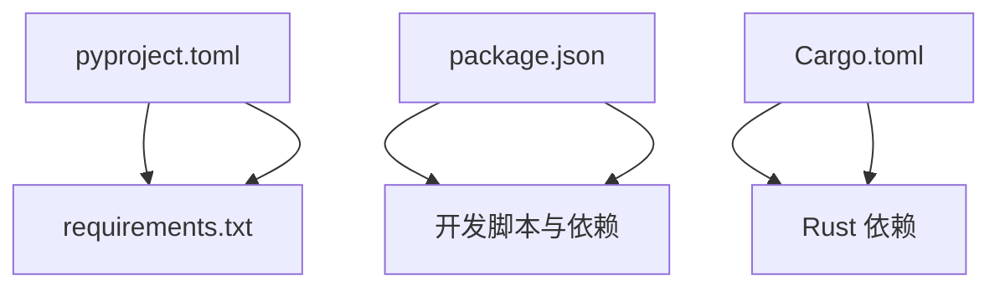

# 测试

<cite>
**本文引用的文件**
- [app/downloader/tests/__init__.py](file://app/downloader/tests/__init__.py)
- [app/downloader/tests/test_basic.py](file://app/downloader/tests/test_basic.py)
- [app/downloader/tests/test_advanced.py](file://app/downloader/tests/test_advanced.py)
- [app/downloader/tests/test_progress.py](file://app/downloader/tests/test_progress.py)
- [app/downloader/pyproject.toml](file://app/downloader/pyproject.toml)
- [app/downloader/requirements.txt](file://app/downloader/requirements.txt)
- [app/web/TESTING.md](file://app/web/TESTING.md)
- [app/web/package.json](file://app/web/package.json)
- [app/server/src/main.rs](file://app/server/src/main.rs)
- [app/server/Cargo.toml](file://app/server/Cargo.toml)
</cite>

## 目录
1. [引言](#引言)
2. [项目结构](#项目结构)
3. [核心组件](#核心组件)
4. [架构总览](#架构总览)
5. [详细组件分析](#详细组件分析)
6. [依赖分析](#依赖分析)
7. [性能考虑](#性能考虑)
8. [故障排查指南](#故障排查指南)
9. [结论](#结论)
10. [附录](#附录)

## 引言
本文件聚焦于仓库中的测试相关内容，覆盖 Python 下载器模块的基础与高级功能测试、进度显示测试，以及 Web 前端与 Rust 后端的测试与验证指南。文档旨在帮助开发者与测试人员理解各模块的测试范围、执行方式与常见问题定位方法。

## 项目结构
测试相关的主要位置如下：
- Python 下载器测试：位于 app/downloader/tests，包含基础功能、高级功能与进度显示测试脚本
- Web 前端测试指南：位于 app/web/TESTING.md，提供密码验证与视频播放交互的测试步骤
- Rust 服务器：位于 app/server，包含 API 路由、服务与工具模块；测试可通过 API 行为验证
- 依赖与构建配置：位于 app/downloader/pyproject.toml、app/downloader/requirements.txt、app/web/package.json

图表来源
- [app/downloader/tests/test_basic.py](file://app/downloader/tests/test_basic.py#L1-L260)
- [app/downloader/tests/test_advanced.py](file://app/downloader/tests/test_advanced.py#L1-L262)
- [app/downloader/tests/test_progress.py](file://app/downloader/tests/test_progress.py#L1-L57)
- [app/web/TESTING.md](file://app/web/TESTING.md#L1-L261)
- [app/server/src/main.rs](file://app/server/src/main.rs#L1-L111)
- [app/server/Cargo.toml](file://app/server/Cargo.toml#L1-L23)

章节来源
- [app/downloader/tests/__init__.py](file://app/downloader/tests/__init__.py#L1-L5)
- [app/downloader/tests/test_basic.py](file://app/downloader/tests/test_basic.py#L1-L260)
- [app/downloader/tests/test_advanced.py](file://app/downloader/tests/test_advanced.py#L1-L262)
- [app/downloader/tests/test_progress.py](file://app/downloader/tests/test_progress.py#L1-L57)
- [app/web/TESTING.md](file://app/web/TESTING.md#L1-L261)
- [app/server/src/main.rs](file://app/server/src/main.rs#L1-L111)
- [app/server/Cargo.toml](file://app/server/Cargo.toml#L1-L23)

## 核心组件
- Python 下载器测试套件
  - 基础测试：覆盖模块导入、配置、解析器、下载器、工具函数、CLI 与文件操作
  - 高级测试：覆盖 JSON 任务加载、下载任务对象、流式进度显示、目录结构、高级 CLI 与集成测试
  - 进度测试：演示多线程下载时的进度显示行为
- Web 前端测试指南：提供密码验证与视频播放交互的端到端测试步骤
- Rust 服务器：提供视频列表、详情、手动同步、文件监听器控制等 API，可作为测试目标

章节来源
- [app/downloader/tests/test_basic.py](file://app/downloader/tests/test_basic.py#L1-L260)
- [app/downloader/tests/test_advanced.py](file://app/downloader/tests/test_advanced.py#L1-L262)
- [app/downloader/tests/test_progress.py](file://app/downloader/tests/test_progress.py#L1-L57)
- [app/web/TESTING.md](file://app/web/TESTING.md#L1-L261)
- [app/server/src/main.rs](file://app/server/src/main.rs#L1-L111)

## 架构总览
下图展示了测试相关的端到端流程：前端通过浏览器访问 Web 应用，Web 应用调用 Rust 服务器 API 获取视频资源；同时，Python 下载器测试脚本验证下载器核心能力。

图表来源
- [app/web/TESTING.md](file://app/web/TESTING.md#L1-L261)
- [app/server/src/main.rs](file://app/server/src/main.rs#L72-L109)
- [app/downloader/tests/test_basic.py](file://app/downloader/tests/test_basic.py#L1-L260)
- [app/downloader/tests/test_advanced.py](file://app/downloader/tests/test_advanced.py#L1-L262)
- [app/downloader/tests/test_progress.py](file://app/downloader/tests/test_progress.py#L1-L57)

## 详细组件分析

### Python 下载器基础测试
- 测试范围
  - 模块导入：验证核心模块可正常导入
  - 配置：验证配置模板与转换
  - 解析器：验证 URL 验证、SSL 校验、URL 处理
  - 下载器：验证重试机制、下载管理器初始化
  - 工具函数：验证 URL 处理、文件大小与时间格式化、M3U8 内容校验
  - CLI：验证初始化与参数解析
  - 文件操作：验证临时目录与文件读写
- 关键断言点
  - 配置模板对比（如并发线程数、重试次数）
  - URL 处理与域名提取
  - 重试处理器在失败场景的行为
  - 文件大小与时间格式化输出
  - 参数解析结果与临时文件读写一致性

图表来源
- [app/downloader/tests/test_basic.py](file://app/downloader/tests/test_basic.py#L1-L260)

章节来源
- [app/downloader/tests/test_basic.py](file://app/downloader/tests/test_basic.py#L1-L260)

### Python 下载器高级测试
- 测试范围
  - JSON 任务加载：从临时 JSON 文件加载任务并断言字段
  - 下载任务对象：断言任务属性与序列化
  - 流式进度显示：模拟进度更新输出
  - 目录结构：创建/清理临时目录与文件
  - 高级 CLI：验证可导入与初始化
  - 集成测试：验证配置模板驱动的高级下载器初始化
- 关键断言点
  - JSON 数据结构与字段完整性
  - 任务对象状态与参数传递
  - 进度输出格式与频率
  - 临时目录清理后的状态
  - 高级下载器内部组件初始化

图表来源
- [app/downloader/tests/test_advanced.py](file://app/downloader/tests/test_advanced.py#L1-L262)

章节来源
- [app/downloader/tests/test_advanced.py](file://app/downloader/tests/test_advanced.py#L1-L262)

### Python 下载器进度测试
- 测试范围
  - 多线程下载场景下的进度显示行为
  - 通过本地文件模拟下载队列，验证线程数与进度输出
- 关键断言点
  - 线程数配置与进度输出一致性
  - 已存在文件与待下载文件数量统计

图表来源
- [app/downloader/tests/test_progress.py](file://app/downloader/tests/test_progress.py#L1-L57)

章节来源
- [app/downloader/tests/test_progress.py](file://app/downloader/tests/test_progress.py#L1-L57)

### Web 前端测试指南
- 测试范围
  - 密码验证：首次访问、错误密码、正确密码、授权保持、会话失效、首页按钮
  - 视频播放交互：单击切换控制栏、拖动调整进度（含方向与边界）、单击与拖动区分、控制栏行为、加载与错误状态
  - 兼容性：PC 端鼠标操作、移动设备测试建议、横屏模式
  - 性能：拖动流畅性、控制栏切换性能
  - 已知问题与注意事项：安全性、浏览器兼容性、视频服务器要求
- 开发者调试指南
  - 查看与清除授权状态
  - 修改密码与禁用验证

章节来源
- [app/web/TESTING.md](file://app/web/TESTING.md#L1-L261)

### Rust 服务器测试要点
- API 能力
  - 视频列表与详情查询
  - 手动同步数据库
  - 文件监听器启停与状态查询
  - 静态文件服务（public 与 thumbnails）
- CORS 与日志
  - CORS 允许所有来源
  - 日志初始化与端口绑定
- 测试建议
  - 使用 Web 测试指南中的步骤调用对应 API
  - 验证返回数据结构与状态码
  - 结合前端页面验证资源可用性

章节来源
- [app/server/src/main.rs](file://app/server/src/main.rs#L72-L109)
- [app/server/Cargo.toml](file://app/server/Cargo.toml#L1-L23)

## 依赖分析
- Python 下载器
  - 构建与脚本入口：pyproject.toml
  - 运行时依赖：requests、tqdm
- Web 前端
  - Next.js 开发与运行脚本、依赖与类型定义
- Rust 服务器
  - 依赖栈：axum、tokio、tower-http、serde、rusqlite、rayon 等

图表来源
- [app/downloader/pyproject.toml](file://app/downloader/pyproject.toml#L1-L17)
- [app/downloader/requirements.txt](file://app/downloader/requirements.txt#L1-L3)
- [app/web/package.json](file://app/web/package.json#L1-L74)
- [app/server/Cargo.toml](file://app/server/Cargo.toml#L1-L23)

章节来源
- [app/downloader/pyproject.toml](file://app/downloader/pyproject.toml#L1-L17)
- [app/downloader/requirements.txt](file://app/downloader/requirements.txt#L1-L3)
- [app/web/package.json](file://app/web/package.json#L1-L74)
- [app/server/Cargo.toml](file://app/server/Cargo.toml#L1-L23)

## 性能考虑
- Python 下载器
  - 并发线程数与重试策略对整体耗时的影响
  - 进度显示的输出频率与 UI 刷新开销
- Web 前端
  - 触摸事件的识别阈值与响应延迟
  - 控制栏自动隐藏与动画性能
- Rust 服务器
  - 文件系统扫描与数据库同步的并发策略
  - CORS 与静态文件服务的吞吐表现

## 故障排查指南
- Python 下载器
  - 模块导入失败：检查路径注入与包安装
  - 配置异常：核对模板参数与转换字典
  - 下载失败：检查重试次数与网络/磁盘权限
  - CLI 参数解析：确认参数顺序与类型
- Web 前端
  - 密码验证失败：检查 .env.local 配置与 sessionStorage
  - 视频加载/播放异常：确认后端 API 可达与 CORS 设置
- Rust 服务器
  - API 无响应：检查端口占用与日志输出
  - 静态资源 404：确认 DATA_SOURCE_DIR 与 public/thumbnails 目录

章节来源
- [app/downloader/tests/test_basic.py](file://app/downloader/tests/test_basic.py#L1-L260)
- [app/web/TESTING.md](file://app/web/TESTING.md#L1-L261)
- [app/server/src/main.rs](file://app/server/src/main.rs#L72-L109)

## 结论
本仓库的测试覆盖了 Python 下载器的核心功能与高级特性，以及 Web 前端的交互与后端 API 的行为验证。通过分层测试与端到端验证，能够有效保障模块稳定性与用户体验。建议在持续集成中自动化运行这些测试，并结合实际部署环境补充集成与性能测试。

## 附录
- 测试执行建议
  - Python 下载器：分别运行基础与高级测试脚本，关注断言通过率与异常堆栈
  - Web 前端：按照 TESTING.md 的步骤逐项验证，记录通过/失败与备注
  - Rust 服务器：启动服务后，使用浏览器或 curl 验证各 API 返回
- 依赖安装
  - Python：根据 requirements.txt 安装 requests、tqdm
  - Web：使用 package.json 中的脚本启动开发服务器
  - Rust：使用 Cargo 构建与运行服务器