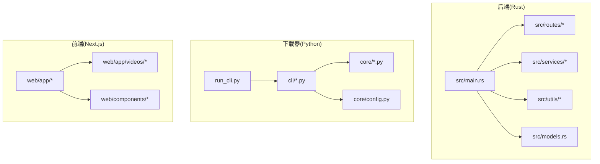
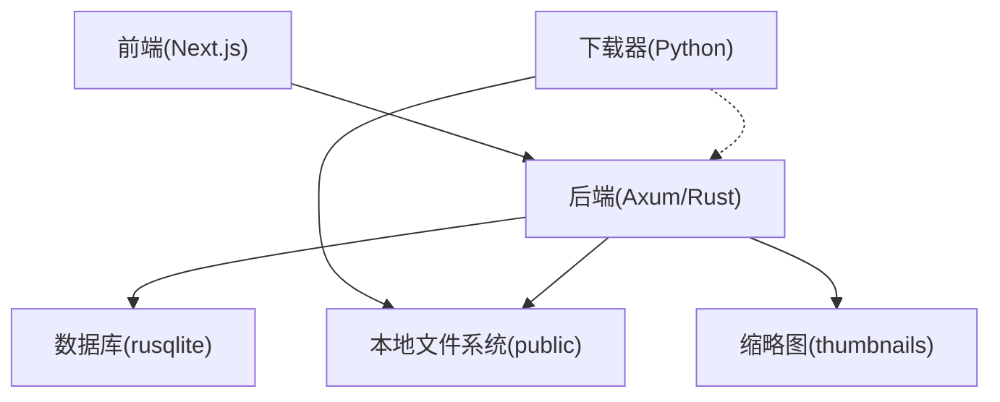
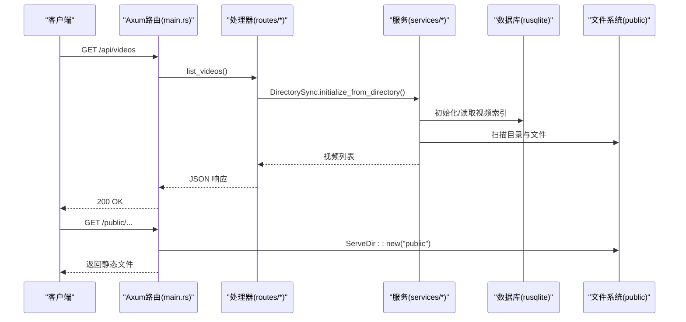
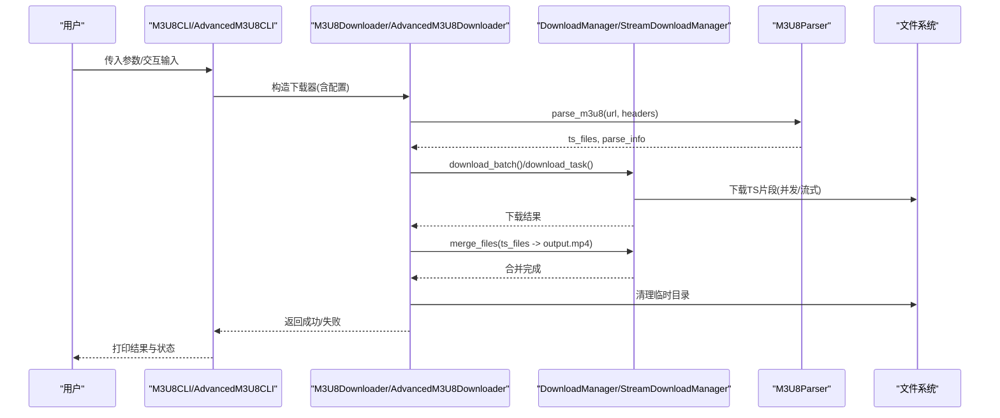
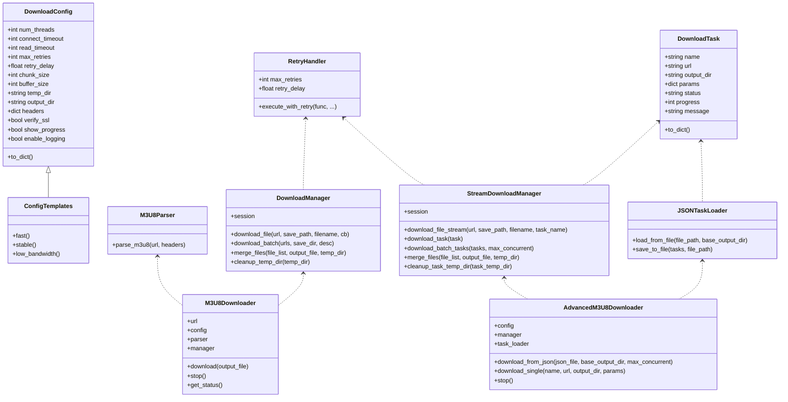
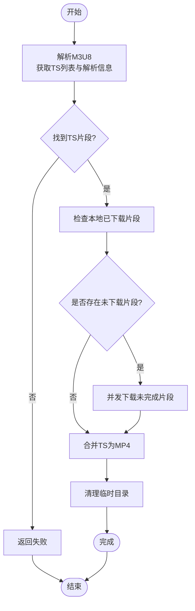
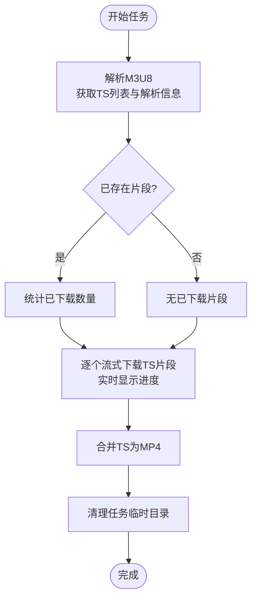
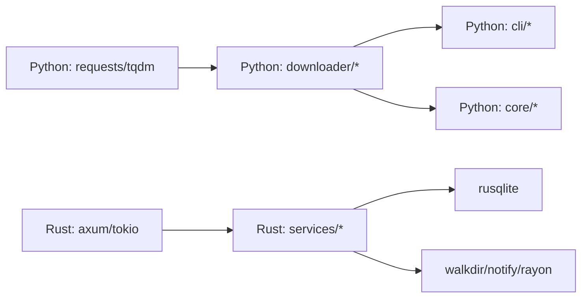

# 示例代码

<cite>
**本文引用的文件**
- [README.md](file://README.md)
- [QUICKSTART.md](file://app/downloader/QUICKSTART.md)
- [pyproject.toml](file://app/downloader/pyproject.toml)
- [requirements.txt](file://app/downloader/requirements.txt)
- [Cargo.toml](file://app/server/Cargo.toml)
- [main.rs](file://app/server/src/main.rs)
- [models.rs](file://app/server/src/models.rs)
- [routes/mod.rs](file://app/server/src/routes/mod.rs)
- [services/mod.rs](file://app/server/src/services/mod.rs)
- [utils/mod.rs](file://app/server/src/utils/mod.rs)
- [cli.py](file://app/downloader/cli/cli.py)
- [advanced_cli.py](file://app/downloader/cli/advanced_cli.py)
- [downloader.py](file://app/downloader/core/downloader.py)
- [advanced_downloader.py](file://app/downloader/core/advanced_downloader.py)
- [config.py](file://app/downloader/core/config.py)
- [run_cli.py](file://app/downloader/run_cli.py)
</cite>

## 目录
1. [引言](#引言)
2. [项目结构](#项目结构)
3. [核心组件](#核心组件)
4. [架构总览](#架构总览)
5. [详细组件分析](#详细组件分析)
6. [依赖关系分析](#依赖关系分析)
7. [性能考量](#性能考量)
8. [故障排查指南](#故障排查指南)
9. [结论](#结论)
10. [附录](#附录)

## 引言
本项目是一个“视频文件服务器”，包含三部分：
- Rust + Axum 后端：提供视频列表、详情、静态文件服务、数据库与文件监听等能力；
- Python M3U8 下载模块：提供命令行与编程接口，支持多线程、断点续传、JSON批量下载；
- Next.js 前端：用于演示与交互（本仓库未包含前端实现细节，但提供了页面与组件骨架）。

本示例文档聚焦于“示例代码”的呈现与说明，帮助读者快速理解各模块的职责、调用方式与典型用法。

## 项目结构
整体采用多语言分层组织：
- app/server：Rust 后端，负责 API、静态文件、数据库与文件监听；
- app/downloader：Python 下载模块，包含 CLI、核心下载器、配置与工具；
- app/web：Next.js 前端（页面与组件骨架）。

图表来源
- [main.rs](file://app/server/src/main.rs#L1-L111)
- [routes/mod.rs](file://app/server/src/routes/mod.rs#L1-L6)
- [services/mod.rs](file://app/server/src/services/mod.rs#L1-L6)
- [utils/mod.rs](file://app/server/src/utils/mod.rs#L1-L14)
- [models.rs](file://app/server/src/models.rs#L1-L32)
- [cli.py](file://app/downloader/cli/cli.py#L1-L292)
- [advanced_cli.py](file://app/downloader/cli/advanced_cli.py#L1-L373)
- [downloader.py](file://app/downloader/core/downloader.py#L1-L501)
- [advanced_downloader.py](file://app/downloader/core/advanced_downloader.py#L1-L586)
- [config.py](file://app/downloader/core/config.py#L1-L114)
- [run_cli.py](file://app/downloader/run_cli.py#L1-L25)

章节来源
- [README.md](file://README.md#L253-L317)
- [main.rs](file://app/server/src/main.rs#L72-L110)
- [pyproject.toml](file://app/downloader/pyproject.toml#L1-L17)
- [requirements.txt](file://app/downloader/requirements.txt#L1-L3)

## 核心组件
- Rust 后端
  - 路由与中间件：CORS、静态文件服务、API 路由；
  - 数据模型：VideoInfo、VideoList；
  - 服务层：数据库管理、目录同步、文件监听、缩略图初始化；
  - 工具层：通用工具、时长计算、日志、M3U8 检测与合并、缩略图生成。
- Python 下载器
  - CLI：基础 CLI 与高级 CLI，支持交互、参数解析、模板配置；
  - 核心下载器：基础下载器与高级下载器，支持批量、流式、JSON 任务；
  - 配置：DownloadConfig、ConfigTemplates；
  - 工具：重试、进度、日志、校验与 URL 处理。

章节来源
- [models.rs](file://app/server/src/models.rs#L1-L32)
- [cli.py](file://app/downloader/cli/cli.py#L1-L292)
- [advanced_cli.py](file://app/downloader/cli/advanced_cli.py#L1-L373)
- [downloader.py](file://app/downloader/core/downloader.py#L1-L501)
- [advanced_downloader.py](file://app/downloader/core/advanced_downloader.py#L1-L586)
- [config.py](file://app/downloader/core/config.py#L1-L114)

## 架构总览
后端通过 Axum 提供 REST API 与静态文件服务；前端通过 Next.js 页面访问后端 API；下载器作为独立模块，既可通过命令行使用，也可通过编程接口集成到其他流程。

图表来源
- [main.rs](file://app/server/src/main.rs#L72-L110)
- [models.rs](file://app/server/src/models.rs#L1-L32)
- [Cargo.toml](file://app/server/Cargo.toml#L1-L23)
- [downloader.py](file://app/downloader/core/downloader.py#L379-L501)
- [advanced_downloader.py](file://app/downloader/core/advanced_downloader.py#L524-L586)

## 详细组件分析

### Rust 后端：路由与服务
- 路由
  - GET /api/videos：列出视频列表；
  - GET /api/videos/*path：获取指定路径的视频详情；
  - GET /api/sync：手动同步数据库；
  - GET /api/watcher/start | stop | status：文件监听器控制；
  - GET /public/*path：静态文件服务；
  - GET /thumbnails/*path：缩略图服务。
- 服务
  - 数据库：VideoDbManager、DirectorySync、VideoDao；
  - 文件系统：目录扫描、类型识别、元数据提取；
  - 文件监听：FileWatcher；
  - 工具：日志、M3U8 检测与合并、缩略图生成、时长计算。

图表来源
- [main.rs](file://app/server/src/main.rs#L72-L110)
- [routes/mod.rs](file://app/server/src/routes/mod.rs#L1-L6)
- [services/mod.rs](file://app/server/src/services/mod.rs#L1-L6)
- [Cargo.toml](file://app/server/Cargo.toml#L1-L23)

章节来源
- [main.rs](file://app/server/src/main.rs#L72-L110)
- [routes/mod.rs](file://app/server/src/routes/mod.rs#L1-L6)
- [services/mod.rs](file://app/server/src/services/mod.rs#L1-L6)
- [utils/mod.rs](file://app/server/src/utils/mod.rs#L1-L14)

### Python 下载器：CLI 与核心流程
- 基础 CLI
  - 参数解析：URL、输出、线程数、配置模板、超时、请求头、功能开关、交互模式；
  - 交互模式：引导输入 URL、配置模板、输出文件名，确认后执行下载；
  - 执行下载：构造 M3U8Downloader，解析 M3U8，批量下载 TS，合并为 MP4。
- 高级 CLI
  - 支持 JSON 配置文件，批量下载，控制最大并发；
  - 交互模式：单个下载、批量下载、创建 JSON 配置；
  - 执行下载：AdvancedM3U8Downloader，StreamDownloadManager，逐个下载 TS，合并为 MP4。
- 核心下载器
  - DownloadManager：线程池并发下载、断点续传、进度统计、日志、信号处理；
  - M3U8Downloader：解析 M3U8、下载未完成片段、合并、清理临时目录；
  - StreamDownloadManager：流式下载，逐个下载并实时显示进度；
  - AdvancedM3U8Downloader：批量任务管理、JSON 任务加载与保存。
- 配置
  - DownloadConfig：线程数、超时、重试、块大小、缓冲区、路径、请求头、SSL 校验、进度与日志；
  - ConfigTemplates：fast/stable/low_bandwidth 三种预设。

图表来源
- [cli.py](file://app/downloader/cli/cli.py#L1-L292)
- [advanced_cli.py](file://app/downloader/cli/advanced_cli.py#L1-L373)
- [downloader.py](file://app/downloader/core/downloader.py#L379-L501)
- [advanced_downloader.py](file://app/downloader/core/advanced_downloader.py#L432-L586)
- [config.py](file://app/downloader/core/config.py#L1-L114)

章节来源
- [cli.py](file://app/downloader/cli/cli.py#L1-L292)
- [advanced_cli.py](file://app/downloader/cli/advanced_cli.py#L1-L373)
- [downloader.py](file://app/downloader/core/downloader.py#L1-L501)
- [advanced_downloader.py](file://app/downloader/core/advanced_downloader.py#L1-L586)
- [config.py](file://app/downloader/core/config.py#L1-L114)

### Python 下载器：类关系图

图表来源
- [config.py](file://app/downloader/core/config.py#L1-L114)
- [downloader.py](file://app/downloader/core/downloader.py#L1-L501)
- [advanced_downloader.py](file://app/downloader/core/advanced_downloader.py#L1-L586)

章节来源
- [config.py](file://app/downloader/core/config.py#L1-L114)
- [downloader.py](file://app/downloader/core/downloader.py#L1-L501)
- [advanced_downloader.py](file://app/downloader/core/advanced_downloader.py#L1-L586)

### Python 下载器：算法流程（基础下载）

图表来源
- [downloader.py](file://app/downloader/core/downloader.py#L379-L501)

章节来源
- [downloader.py](file://app/downloader/core/downloader.py#L379-L501)

### Python 下载器：算法流程（高级流式下载）

图表来源
- [advanced_downloader.py](file://app/downloader/core/advanced_downloader.py#L432-L586)

章节来源
- [advanced_downloader.py](file://app/downloader/core/advanced_downloader.py#L432-L586)

## 依赖关系分析
- Python 下载器
  - 依赖 requests、tqdm；
  - CLI 通过相对导入访问 core 模块；
  - run_cli.py 通过 sys.path.insert 解决路径问题。
- Rust 后端
  - 依赖 axum、tokio、tower-http、serde、rusqlite、walkdir、notify、rayon 等；
  - 通过 env DATA_SOURCE_DIR 指定数据源目录，默认 public。

图表来源
- [requirements.txt](file://app/downloader/requirements.txt#L1-L3)
- [pyproject.toml](file://app/downloader/pyproject.toml#L1-L17)
- [Cargo.toml](file://app/server/Cargo.toml#L1-L23)

章节来源
- [requirements.txt](file://app/downloader/requirements.txt#L1-L3)
- [pyproject.toml](file://app/downloader/pyproject.toml#L1-L17)
- [Cargo.toml](file://app/server/Cargo.toml#L1-L23)

## 性能考量
- 并发与线程
  - 默认线程数为 CPU 核心数的倍数，可通过配置模板或参数调整；
  - 高级下载器支持最大并发任务数控制，避免资源争用。
- 超时与重试
  - 连接与读取超时可配置，指数退避重试降低瞬时失败影响；
  - SSL 校验可关闭（仅在受信任环境下使用）。
- I/O 与缓冲
  - 分块下载与写入缓冲减少内存占用；
  - 合并阶段使用缓冲区读取，避免大文件内存压力。
- 前端与后端
  - 后端使用异步 Tokio，支持高并发；
  - 静态文件服务通过 ServeDir 提供高效访问；
  - 缩略图与元数据可按需生成，减少重复计算。

章节来源
- [config.py](file://app/downloader/core/config.py#L1-L114)
- [downloader.py](file://app/downloader/core/downloader.py#L1-L501)
- [advanced_downloader.py](file://app/downloader/core/advanced_downloader.py#L1-L586)
- [main.rs](file://app/server/src/main.rs#L72-L110)
- [Cargo.toml](file://app/server/Cargo.toml#L1-L23)

## 故障排查指南
- Python 下载器
  - 模块导入错误：确保从 app 目录运行或使用 run_cli.py；
  - URL 校验失败：确认 URL 格式正确，必要时使用交互模式；
  - 进度与日志：可通过配置禁用进度或开启日志；
  - 中断与清理：支持 Ctrl+C 中断，下载器会清理临时目录。
- Rust 后端
  - 端口占用：默认 3003，可修改；
  - CORS：默认允许所有来源；
  - 数据库初始化：首次启动会尝试从 public 目录初始化；
  - 文件监听：默认不启动，可通过 /api/watcher/start 启动。

章节来源
- [run_cli.py](file://app/downloader/run_cli.py#L1-L25)
- [cli.py](file://app/downloader/cli/cli.py#L1-L292)
- [advanced_cli.py](file://app/downloader/cli/advanced_cli.py#L1-L373)
- [main.rs](file://app/server/src/main.rs#L72-L110)

## 结论
本项目通过 Rust 后端提供高性能视频服务，结合 Python 下载器实现 M3U8 视频的多线程、断点续传与批量下载能力。CLI 与编程接口清晰易用，配置模板覆盖不同网络与性能需求。前后端分离的设计便于扩展与维护。

## 附录
- 快速开始与命令示例参见下载器使用指南；
- 后端 API 与静态文件访问参见项目根 README；
- 前端页面与组件参见 web 目录结构与说明。

章节来源
- [QUICKSTART.md](file://app/downloader/QUICKSTART.md#L1-L290)
- [README.md](file://README.md#L102-L165)