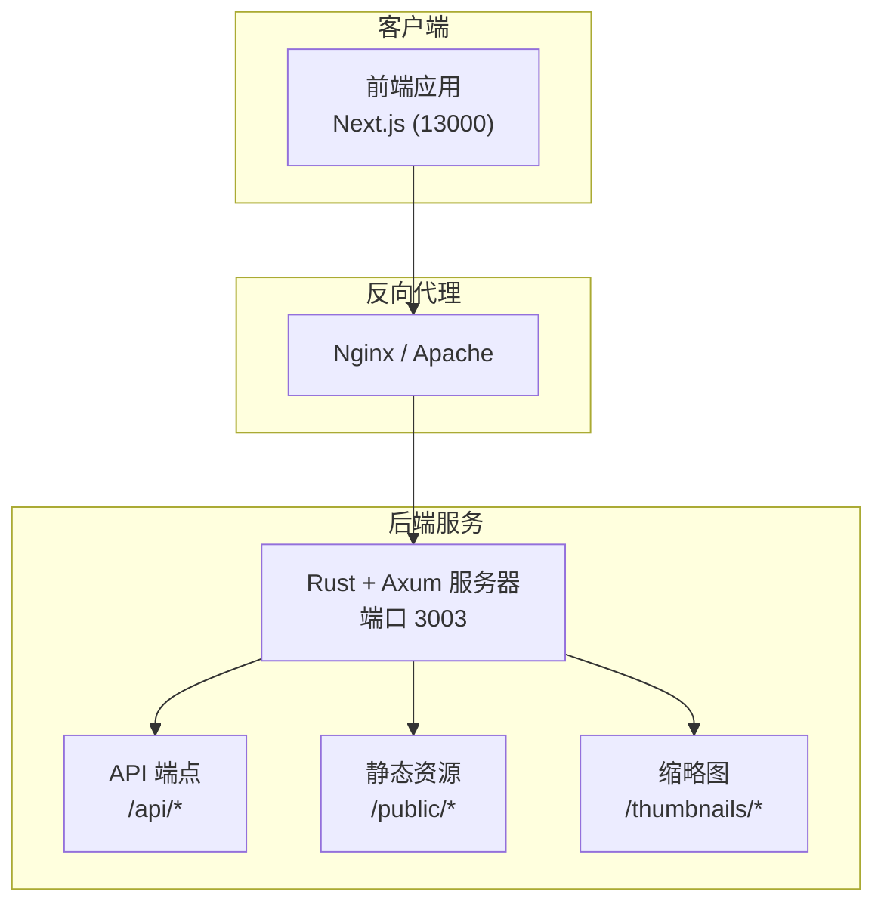
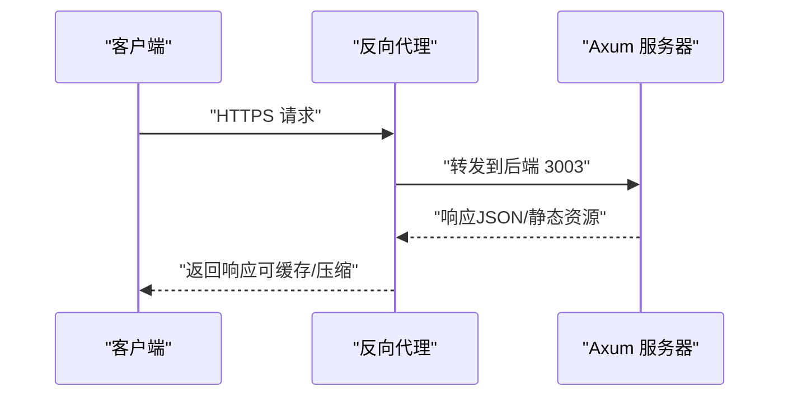
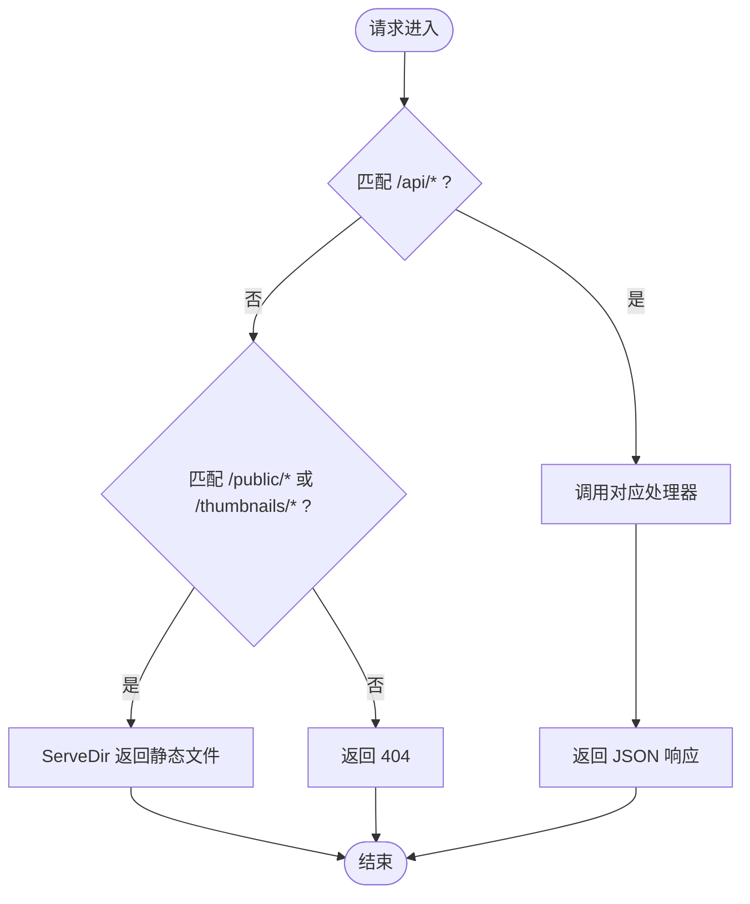
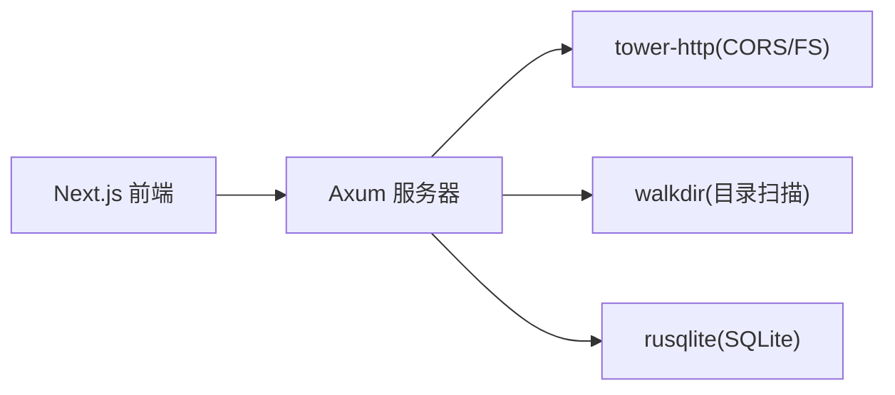

# 反向代理配置

<cite>
**本文引用的文件**
- [README.md](file://README.md)
- [Cargo.toml](file://app/server/Cargo.toml)
- [main.rs](file://app/server/src/main.rs)
- [video_handlers.rs](file://app/server/src/routes/video_handlers.rs)
- [models.rs](file://app/server/src/models.rs)
- [connection.rs](file://app/server/src/services/db/connection.rs)
- [common.rs](file://app/server/src/utils/common.rs)
- [next.config.ts](file://app/web/next.config.ts)
- [package.json](file://app/web/package.json)
</cite>

## 目录
1. [简介](#简介)
2. [项目结构](#项目结构)
3. [核心组件](#核心组件)
4. [架构总览](#架构总览)
5. [详细组件分析](#详细组件分析)
6. [依赖关系分析](#依赖关系分析)
7. [性能考量](#性能考量)
8. [故障排查指南](#故障排查指南)
9. [结论](#结论)
10. [附录](#附录)

## 简介
本指南面向在生产环境中部署视频文件服务器的运维与开发人员，围绕反向代理（Nginx/Apache）的配置展开，覆盖以下主题：
- Nginx 与 Apache 的反向代理配置要点
- 负载均衡与健康检查
- SSL/TLS 与证书管理
- 静态资源缓存策略
- WebSocket 代理与长连接处理
- HTTPS 配置示例与证书管理
- 安全配置最佳实践（CORS、头部安全）
- 性能优化（连接池、超时、并发）

该仓库中的 Rust 服务器通过 Axum 提供 REST API 与静态资源服务，前端使用 Next.js。反向代理将外部请求转发至服务器，同时负责 TLS 终止、缓存与安全加固。

## 项目结构
- 后端（Rust + Axum）：提供视频列表、详情查询、手动同步、文件监听控制端点；静态资源通过 /public 与 /thumbnails 暴露。
- 前端（Next.js）：本地开发端口为 13000，通过远程图片源指向后端服务。
- 关键端口：
  - 后端服务默认监听 3003（可通过代码修改）
  - 前端开发端口 13000（用于本地联调）

图表来源
- [main.rs](file://app/server/src/main.rs#L72-L90)
- [video_handlers.rs](file://app/server/src/routes/video_handlers.rs#L14-L28)
- [next.config.ts](file://app/web/next.config.ts#L8-L17)

章节来源
- [README.md](file://README.md#L129-L164)
- [main.rs](file://app/server/src/main.rs#L72-L90)
- [next.config.ts](file://app/web/next.config.ts#L8-L17)

## 核心组件
- 服务器监听与路由
  - 监听地址与端口：默认 0.0.0.0:3003（可在代码中修改）
  - 路由定义：/api/videos、/api/videos/*path、/api/sync、/api/watcher/*、/public/*、/thumbnails/*
- CORS 中间件：默认允许所有来源、GET/POST/OPTIONS、通配符头
- 静态文件服务：ServeDir 挂载数据源目录与缩略图目录
- 前端配置：remotePatterns 指向后端服务，便于图片直连

章节来源
- [main.rs](file://app/server/src/main.rs#L92-L110)
- [main.rs](file://app/server/src/main.rs#L72-L90)
- [Cargo.toml](file://app/server/Cargo.toml#L9-L9)
- [next.config.ts](file://app/web/next.config.ts#L8-L17)

## 架构总览
反向代理作为统一入口，负责：
- TLS 终止与证书管理
- 请求转发至后端 Axum 服务
- 静态资源缓存与压缩
- 负载均衡与健康检查
- 安全加固（CORS、头部安全、速率限制）

图表来源
- [main.rs](file://app/server/src/main.rs#L72-L90)
- [README.md](file://README.md#L129-L164)

## 详细组件分析

### API 与静态资源路由
- API 端点
  - GET /api/videos：列出根目录视频
  - GET /api/videos/*path：获取指定路径详情（含子文件）
  - GET /api/sync：手动同步数据库
  - GET /api/watcher/start | /api/watcher/stop | /api/watcher/status：文件监听控制
- 静态资源
  - /public/*：数据源目录下的视频与字幕等
  - /thumbnails/*：缩略图目录

图表来源
- [main.rs](file://app/server/src/main.rs#L72-L90)
- [video_handlers.rs](file://app/server/src/routes/video_handlers.rs#L14-L28)
- [video_handlers.rs](file://app/server/src/routes/video_handlers.rs#L30-L70)

章节来源
- [main.rs](file://app/server/src/main.rs#L72-L90)
- [video_handlers.rs](file://app/server/src/routes/video_handlers.rs#L14-L28)
- [video_handlers.rs](file://app/server/src/routes/video_handlers.rs#L30-L70)

### CORS 与安全头部
- CORS：默认允许所有来源、GET/POST/OPTIONS、通配符头
- 前端 Next.js 配置中保留了 headers 钩子，可用于按需注入 CORS 与安全头部
- 建议在反向代理层集中配置 CORS 与安全头部，避免前后端重复

章节来源
- [main.rs](file://app/server/src/main.rs#L62-L71)
- [next.config.ts](file://app/web/next.config.ts#L18-L35)

### 数据模型与静态资源
- VideoInfo/VideoList：用于 API 响应结构
- 静态资源类型：MP4、M3U8、TS、VTT、SRT、图片等
- 建议在反向代理层对静态资源启用缓存与压缩

章节来源
- [models.rs](file://app/server/src/models.rs#L1-L32)
- [common.rs](file://app/server/src/utils/common.rs#L67-L94)

### 数据库与索引
- 视频表结构与索引：path、parent_path
- 迁移逻辑：兼容旧版本字段并重建索引

章节来源
- [connection.rs](file://app/server/src/services/db/connection.rs#L12-L42)
- [connection.rs](file://app/server/src/services/db/connection.rs#L49-L122)

## 依赖关系分析
- 服务器依赖
  - axum、tokio：异步 Web 框架与运行时
  - tower-http：CORS、静态文件服务
  - walkdir：目录扫描
  - rusqlite：SQLite 数据库
- 前端依赖
  - next：框架
  - hls.js：HLS 播放

图表来源
- [Cargo.toml](file://app/server/Cargo.toml#L7-L23)
- [package.json](file://app/web/package.json#L49-L62)

章节来源
- [Cargo.toml](file://app/server/Cargo.toml#L7-L23)
- [package.json](file://app/web/package.json#L49-L62)

## 性能考量
- 并发与超时
  - 后端默认监听 3003，建议在反向代理层设置合理的上游超时与连接池上限
  - 对静态资源启用 gzip/br 压缩与缓存
- 静态资源缓存策略
  - /public/* 与 /thumbnails/* 可设置较长缓存（ETag/Last-Modified）
  - 对 index.m3u8 与 TS 片段设置短缓存或禁止缓存
- 负载均衡
  - 多实例部署时，建议使用健康检查与会话亲和（如需）
- HLS 与大文件
  - 对 MP4/HLS 流媒体建议开启旁路缓存（CDN/边缘缓存）与限速

[本节为通用性能建议，不直接分析具体文件]

## 故障排查指南
- 服务器启动失败
  - 检查端口占用与 public 目录权限
- CORS 问题
  - 若前端跨域失败，确认反向代理已注入正确的 CORS 头
- 静态资源 404
  - 确认 /public 与 /thumbnails 的挂载路径与数据源目录一致
- HLS 播放异常
  - 检查 m3u8 与 ts 是否在同一目录，片段路径是否正确

章节来源
- [README.md](file://README.md#L483-L500)
- [main.rs](file://app/server/src/main.rs#L72-L90)

## 结论
通过在反向代理层集中处理 TLS、缓存、CORS 与负载均衡，可显著提升视频服务的安全性与性能。结合本仓库提供的 API 与静态资源结构，可快速搭建生产级反向代理配置，满足视频列表、详情查询与流媒体播放等场景。

[本节为总结性内容，不直接分析具体文件]

## 附录

### 反向代理配置要点清单
- Nginx/Apache
  - 上游指向后端 3003
  - TLS 终止与证书管理（Let’s Encrypt/自签）
  - 静态资源缓存与压缩
  - 负载均衡与健康检查
- CORS
  - 在反向代理层集中配置，避免前后端重复
- WebSocket 与长连接
  - 代理需支持升级协议（如 HTTP/2/1.1 Upgrade）
  - 合理设置超时与心跳
- HTTPS 与证书
  - 自动续期与回退策略
  - 强制 HTTPS 重定向
- 安全头部
  - Content-Security-Policy、Strict-Transport-Security、X-Frame-Options 等
- 性能优化
  - 连接池、超时、并发限制、旁路缓存（CDN/边缘缓存）

[本节为通用配置建议，不直接分析具体文件]