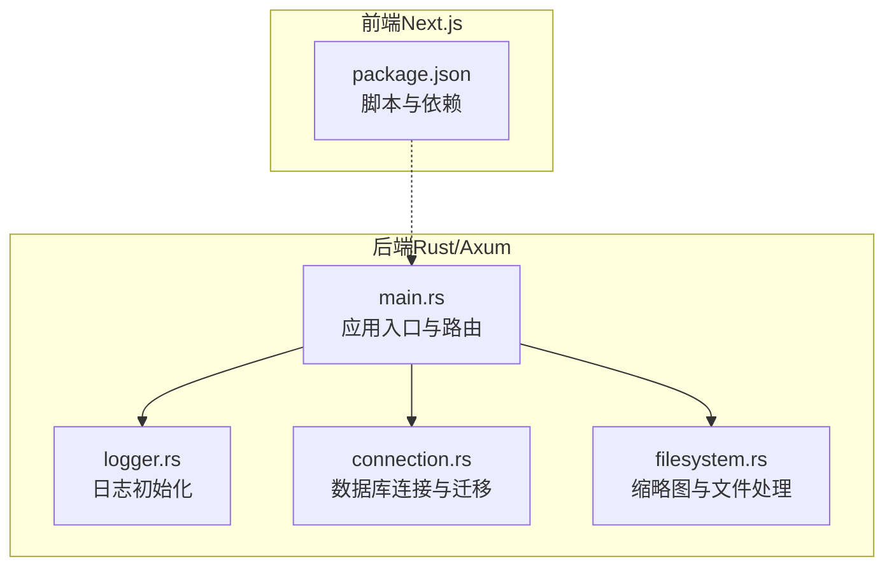
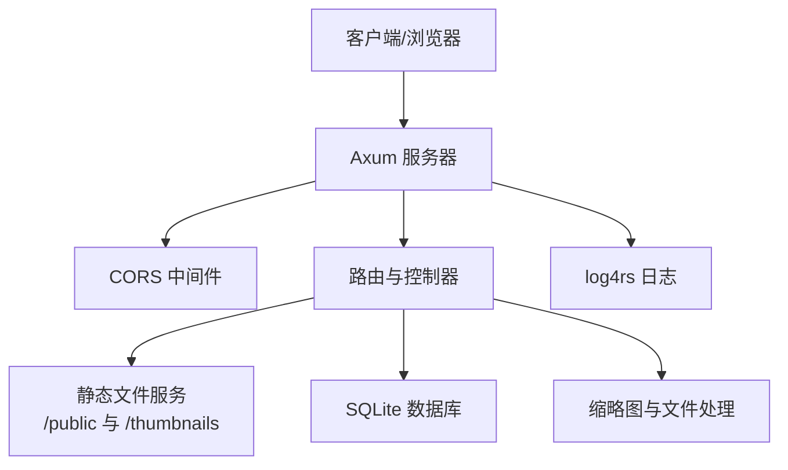
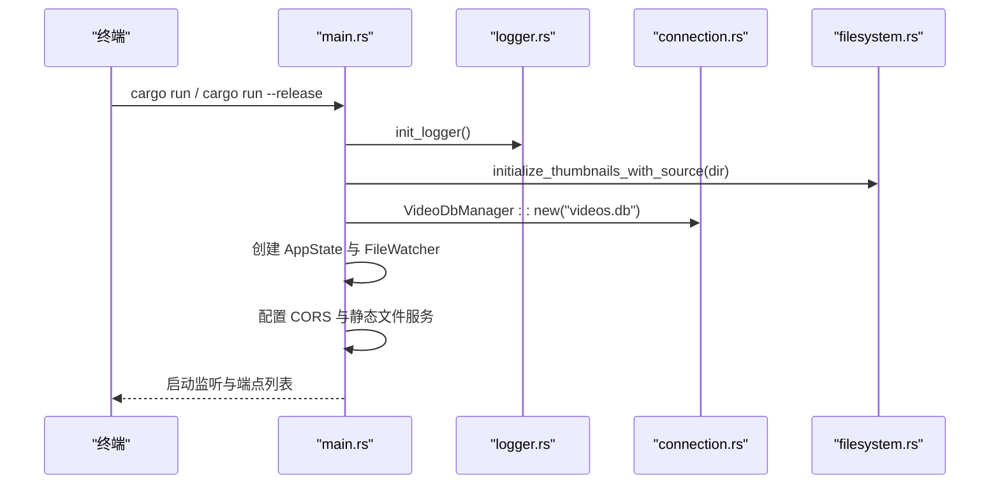
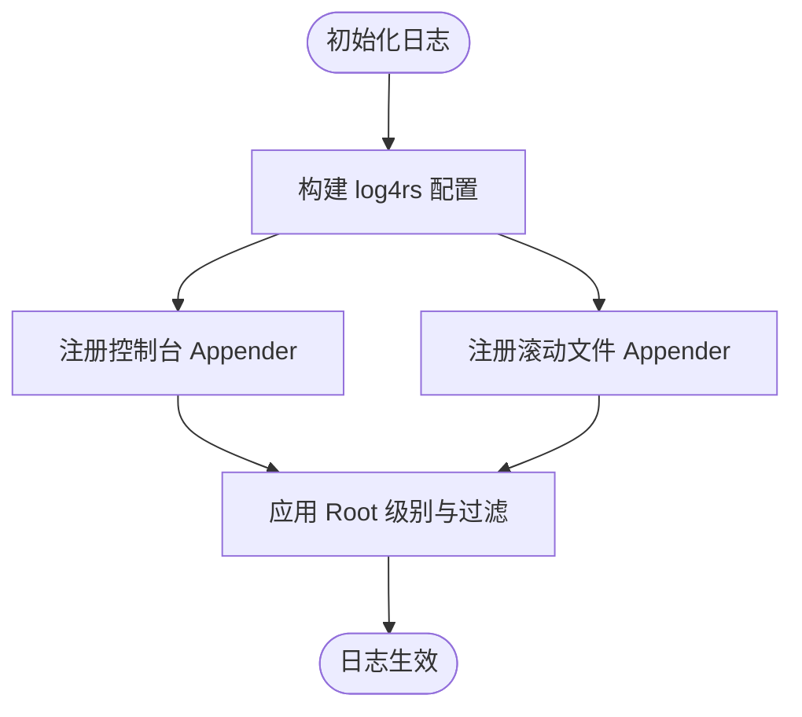
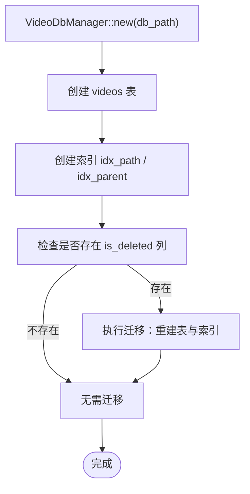
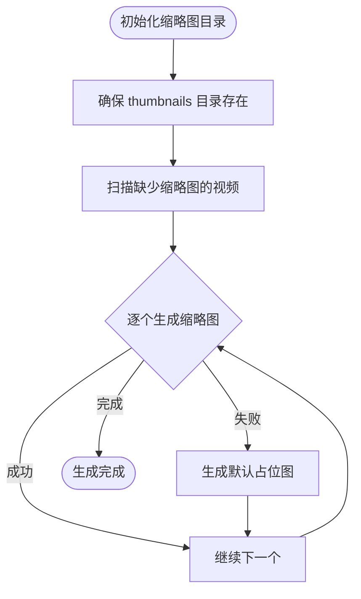
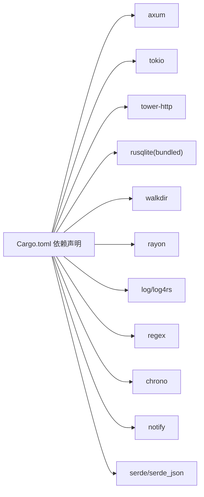

# 构建与部署

<cite>
**本文引用的文件**
- [Cargo.toml](file://app/server/Cargo.toml)
- [main.rs](file://app/server/src/main.rs)
- [logger.rs](file://app/server/src/utils/logger.rs)
- [connection.rs](file://app/server/src/services/db/connection.rs)
- [filesystem.rs](file://app/server/src/services/filesystem.rs)
- [README.md（服务器）](file://app/server/README.md)
- [README.md（项目总览）](file://README.md)
- [package.json（前端）](file://app/web/package.json)
</cite>

## 目录
1. [简介](#简介)
2. [项目结构](#项目结构)
3. [核心组件](#核心组件)
4. [架构总览](#架构总览)
5. [详细组件分析](#详细组件分析)
6. [依赖关系分析](#依赖关系分析)
7. [性能与优化](#性能与优化)
8. [部署指南（平台差异）](#部署指南平台差异)
9. [进程管理与日志](#进程管理与日志)
10. [容器化与 Docker 部署](#容器化与-docker-部署)
11. [故障排查](#故障排查)
12. [结论](#结论)

## 简介
本指南面向“视频文件服务器”项目，覆盖从开发到生产的全流程构建与部署实践，包括：
- 开发模式与生产模式的构建与运行
- 发布版本的编译优化与性能调优
- Windows、Linux、macOS 平台的部署步骤与注意事项
- 进程管理、日志输出、后台运行策略
- Dockerfile 编写与容器化部署方案

## 项目结构
该项目采用前后端分离架构：
- 后端：Rust + Axum 异步 Web 服务，负责视频目录扫描、数据库管理、静态文件服务与 API 路由
- 前端：Next.js（React）应用，提供媒体库浏览与播放界面
- 日志：基于 log4rs 的滚动日志与控制台输出
- 数据库：SQLite（rusqlite），用于视频元数据持久化

图表来源
- [main.rs](file://app/server/src/main.rs#L1-L111)
- [logger.rs](file://app/server/src/utils/logger.rs#L1-L100)
- [connection.rs](file://app/server/src/services/db/connection.rs#L1-L122)
- [filesystem.rs](file://app/server/src/services/filesystem.rs#L1-L121)
- [package.json（前端）](file://app/web/package.json#L1-L74)

章节来源
- [Cargo.toml](file://app/server/Cargo.toml#L1-L23)
- [main.rs](file://app/server/src/main.rs#L1-L111)
- [logger.rs](file://app/server/src/utils/logger.rs#L1-L100)
- [connection.rs](file://app/server/src/services/db/connection.rs#L1-L122)
- [filesystem.rs](file://app/server/src/services/filesystem.rs#L1-L121)
- [README.md（服务器）](file://app/server/README.md#L1-L288)
- [README.md（项目总览）](file://README.md#L1-L513)
- [package.json（前端）](file://app/web/package.json#L1-L74)

## 核心组件
- 应用入口与路由
  - 初始化日志、数据库、文件监听器与共享状态
  - 配置 CORS、静态文件服务与 API 路由
- 日志系统
  - 控制台彩色输出与按大小滚动的文件日志
- 数据库管理
  - SQLite 表结构与索引、迁移逻辑
- 文件系统与缩略图
  - 基于 ffmpeg 的缩略图生成与默认占位图回退
- 前端构建与运行
  - Next.js 脚本与依赖，用于本地开发与生产打包

章节来源
- [main.rs](file://app/server/src/main.rs#L1-L111)
- [logger.rs](file://app/server/src/utils/logger.rs#L1-L100)
- [connection.rs](file://app/server/src/services/db/connection.rs#L1-L122)
- [filesystem.rs](file://app/server/src/services/filesystem.rs#L1-L121)
- [package.json（前端）](file://app/web/package.json#L1-L74)

## 架构总览
后端以 Axum 为核心，通过 tokio 异步运行时提供高性能服务；日志系统同时输出到控制台与滚动文件；数据库负责视频元数据持久化；文件系统模块负责缩略图生成与媒体文件访问。

图表来源
- [main.rs](file://app/server/src/main.rs#L60-L111)
- [logger.rs](file://app/server/src/utils/logger.rs#L65-L99)
- [connection.rs](file://app/server/src/services/db/connection.rs#L1-L122)
- [filesystem.rs](file://app/server/src/services/filesystem.rs#L1-L121)

## 详细组件分析

### 组件A：应用启动与路由
- 初始化日志、数据源目录、数据库与文件监听器
- 配置 CORS、静态文件服务与 API 路由
- 输出可用端点与状态信息

图表来源
- [main.rs](file://app/server/src/main.rs#L27-L111)
- [logger.rs](file://app/server/src/utils/logger.rs#L65-L99)
- [connection.rs](file://app/server/src/services/db/connection.rs#L1-L47)
- [filesystem.rs](file://app/server/src/services/filesystem.rs#L1-L47)

章节来源
- [main.rs](file://app/server/src/main.rs#L27-L111)

### 组件B：日志系统
- 控制台彩色输出与文件滚动日志
- 按大小触发滚动与固定窗口轮转

图表来源
- [logger.rs](file://app/server/src/utils/logger.rs#L65-L99)

章节来源
- [logger.rs](file://app/server/src/utils/logger.rs#L1-L100)

### 组件C：数据库连接与迁移
- 创建视频表与索引
- 检测并迁移旧版本的 is_deleted 列

图表来源
- [connection.rs](file://app/server/src/services/db/connection.rs#L1-L122)

章节来源
- [connection.rs](file://app/server/src/services/db/connection.rs#L1-L122)

### 组件D：缩略图生成与文件处理
- 初始化缩略图目录
- 扫描缺失缩略图的视频并生成
- 降级为默认占位图

图表来源
- [filesystem.rs](file://app/server/src/services/filesystem.rs#L1-L121)

章节来源
- [filesystem.rs](file://app/server/src/services/filesystem.rs#L1-L121)

## 依赖关系分析
- 后端依赖
  - Web 框架与运行时：axum、tokio
  - HTTP 中间件：tower-http（含 fs、trace、cors）
  - 数据库：rusqlite（bundled）
  - 文件系统与并发：walkdir、rayon
  - 日志：log、log4rs、nu-ansi-term
  - 其他：regex、chrono、notify、anyhow、serde 系列
- 前端依赖
  - Next.js、React、TailwindCSS、Hls.js 等

图表来源
- [Cargo.toml](file://app/server/Cargo.toml#L1-L23)

章节来源
- [Cargo.toml](file://app/server/Cargo.toml#L1-L23)

## 性能与优化
- 构建优化
  - 使用 release 模式编译与运行，获得更佳的 CPU 密集型性能
  - 合理利用 tokio 的多核异步能力
- I/O 与并发
  - rayon 并行处理缩略图生成
  - tower-http 的静态文件服务与 CORS
- 数据库
  - 为 path 与 parent_path 建立索引，加速查询
- 日志
  - 滚动日志避免单文件过大，便于运维与审计

章节来源
- [main.rs](file://app/server/src/main.rs#L60-L111)
- [filesystem.rs](file://app/server/src/services/filesystem.rs#L1-L121)
- [connection.rs](file://app/server/src/services/db/connection.rs#L36-L42)
- [logger.rs](file://app/server/src/utils/logger.rs#L65-L99)

## 部署指南（平台差异）

### Windows
- 环境准备
  - 安装 Rust 工具链与 Git
  - 安装 ffmpeg（用于缩略图生成）
- 构建与运行
  - 开发模式：在 app/server 目录执行 cargo run
  - 生产模式：先 cargo build --release，再 cargo run --release
- 端口与权限
  - 默认监听 0.0.0.0:3003（可在 main.rs 修改）
  - 确保 public 与 thumbnails 目录存在且具备读取权限
- 后台运行
  - 使用任务计划程序或 Windows 服务包装器
  - 将输出重定向至 server.log

章节来源
- [README.md（项目总览）](file://README.md#L36-L127)
- [main.rs](file://app/server/src/main.rs#L92-L111)

### Linux
- 环境准备
  - 安装 Rust、Git、ffmpeg
- 构建与运行
  - 开发：cargo run
  - 生产：cargo build --release && cargo run --release
- 后台运行
  - nohup cargo run --release > server.log 2>&1 &
  - 或使用 systemd 单元文件托管
- 权限与目录
  - public 与 thumbnails 目录需具备读取权限

章节来源
- [README.md（项目总览）](file://README.md#L103-L127)
- [main.rs](file://app/server/src/main.rs#L92-L111)

### macOS
- 环境准备
  - 使用 Homebrew 安装 rust、git、ffmpeg
- 构建与运行
  - 开发：cargo run
  - 生产：cargo build --release && cargo run --release
- 后台运行
  - nohup cargo run --release > server.log 2>&1 &
  - 或使用 launchd 管理

章节来源
- [README.md（项目总览）](file://README.md#L103-L127)
- [main.rs](file://app/server/src/main.rs#L92-L111)

## 进程管理与日志
- 进程管理
  - Linux/macOS：nohup + 后台进程 + 重定向
  - Windows：任务计划程序或服务包装器
- 日志
  - 控制台彩色输出与滚动文件日志（按大小轮转）
  - 日志目录：logs（相对路径）

章节来源
- [logger.rs](file://app/server/src/utils/logger.rs#L65-L99)
- [README.md（项目总览）](file://README.md#L120-L127)

## 容器化与 Docker 部署
说明：仓库未提供 Dockerfile，以下为通用编写指南与最佳实践，便于在生产环境快速落地。

- 基础镜像选择
  - 使用精简的基础镜像（如 Debian/Alpine），减少攻击面
- 多阶段构建
  - 第一阶段：编译 release 二进制
  - 第二阶段：仅拷贝二进制与必要运行时文件
- 安全与权限
  - 以非 root 用户运行
  - 仅挂载 public 与 thumbnails 目录为卷
- 健康检查
  - 对 /api/videos 发起探测，确认服务可用
- 环境变量
  - 通过环境变量控制 DATA_SOURCE_DIR、端口等
- 日志
  - 将日志输出到标准输出，由容器编排系统收集

提示：本节为通用指导，不对应具体源文件。

## 故障排查
- 启动失败
  - 端口被占用：修改 main.rs 中的 SocketAddr 端口
  - public 目录缺失：确保 public 与 thumbnails 目录存在且可读
- 缩略图生成失败
  - ffmpeg 未安装或不可执行：安装 ffmpeg 并确保 PATH 正确
  - 权限不足：检查 thumbnails 目录写权限
- 数据库异常
  - 迁移失败：查看日志，确认 is_deleted 列存在与否
- 性能问题
  - 使用 release 模式运行
  - 适当增加系统内存与磁盘 I/O 能力

章节来源
- [README.md（项目总览）](file://README.md#L483-L513)
- [filesystem.rs](file://app/server/src/services/filesystem.rs#L49-L121)
- [connection.rs](file://app/server/src/services/db/connection.rs#L50-L122)
- [main.rs](file://app/server/src/main.rs#L92-L111)

## 结论
本指南提供了从开发到生产的完整构建与部署路径，涵盖多平台部署、进程管理、日志输出与后台运行策略，并给出了容器化部署的通用方案。建议在生产环境中优先使用 release 模式、合理配置日志与健康检查，并通过容器编排系统实现高可用与弹性伸缩。