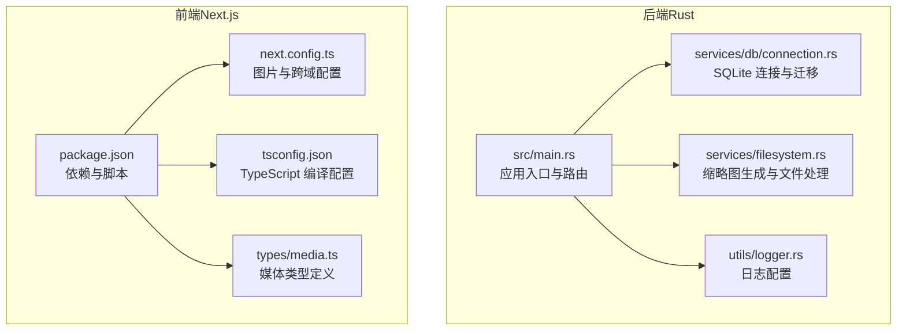
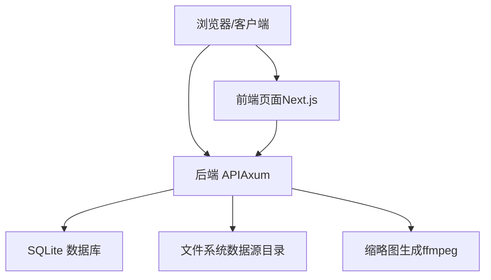

# 环境配置

<cite>
**本文引用的文件**
- [README.md](file://README.md)
- [Cargo.toml](file://app/server/Cargo.toml)
- [main.rs](file://app/server/src/main.rs)
- [logger.rs](file://app/server/src/utils/logger.rs)
- [connection.rs](file://app/server/src/services/db/connection.rs)
- [filesystem.rs](file://app/server/src/services/filesystem.rs)
- [package.json](file://app/web/package.json)
- [next.config.ts](file://app/web/next.config.ts)
- [.gitignore（服务器）](file://app/server/.gitignore)
- [.gitignore（前端）](file://app/web/.gitignore)
- [tsconfig.json](file://app/web/tsconfig.json)
- [media.ts](file://app/web/types/media.ts)
</cite>

## 目录
1. [简介](#简介)
2. [项目结构](#项目结构)
3. [核心组件](#核心组件)
4. [架构总览](#架构总览)
5. [详细组件分析](#详细组件分析)
6. [依赖关系分析](#依赖关系分析)
7. [性能注意事项](#性能注意事项)
8. [故障排查指南](#故障排查指南)
9. [结论](#结论)
10. [附录](#附录)

## 简介
本指南面向开发与生产环境的环境准备与配置，覆盖操作系统兼容性、硬件建议、Rust 工具链与 Node.js 环境安装、项目依赖安装、关键环境变量与配置项说明，以及常见问题排查与解决方案。目标是帮助你在本地快速搭建并稳定运行该视频文件服务器。

## 项目结构
该项目采用前后端分离架构：
- 后端（Rust + Axum）：位于 app/server，提供 REST API、静态文件服务、缩略图生成与数据库管理。
- 前端（Next.js + TypeScript）：位于 app/web，提供媒体库浏览与播放界面。

图表来源
- [main.rs](file://app/server/src/main.rs#L1-L111)
- [connection.rs](file://app/server/src/services/db/connection.rs#L1-L122)
- [filesystem.rs](file://app/server/src/services/filesystem.rs#L1-L121)
- [logger.rs](file://app/server/src/utils/logger.rs#L1-L100)
- [package.json](file://app/web/package.json#L1-L74)
- [next.config.ts](file://app/web/next.config.ts#L1-L39)
- [tsconfig.json](file://app/web/tsconfig.json#L1-L42)
- [media.ts](file://app/web/types/media.ts#L1-L20)

章节来源
- [README.md](file://README.md#L252-L303)

## 核心组件
- 后端运行时与端口绑定：后端默认监听 0.0.0.0:3003（可在主程序中修改），并提供 CORS 允许所有来源。
- 数据库：内置 SQLite，首次运行自动创建表与索引，并执行迁移逻辑。
- 日志：使用 log4rs 输出到控制台与滚动文件，日志目录与文件在运行时创建。
- 缩略图：根据数据源目录中的视频生成缩略图，依赖 ffmpeg 命令行工具。
- 前端开发端口：前端 Next.js 默认监听 13000（可在 package.json scripts 中修改）。

章节来源
- [main.rs](file://app/server/src/main.rs#L92-L110)
- [connection.rs](file://app/server/src/services/db/connection.rs#L1-L48)
- [logger.rs](file://app/server/src/utils/logger.rs#L65-L99)
- [filesystem.rs](file://app/server/src/services/filesystem.rs#L49-L78)
- [package.json](file://app/web/package.json#L1-L10)

## 架构总览
后端通过 Axum 提供 API 与静态文件服务；前端通过 Next.js 提供页面与交互；两者通过 CORS 协议互通。数据库与日志、缩略图生成均在后端侧完成。

图表来源
- [main.rs](file://app/server/src/main.rs#L72-L90)
- [connection.rs](file://app/server/src/services/db/connection.rs#L1-L48)
- [filesystem.rs](file://app/server/src/services/filesystem.rs#L49-L78)
- [next.config.ts](file://app/web/next.config.ts#L1-L39)

## 详细组件分析

### 后端运行与端口配置
- 默认监听地址与端口：后端在主程序中绑定到 0.0.0.0:3003，可通过修改 SocketAddr 的端口实现变更。
- CORS：默认允许所有来源、方法与头部，便于前端直连调试。
- 静态文件服务：/public 与 /thumbnails 前缀分别指向数据源目录与缩略图目录。

章节来源
- [main.rs](file://app/server/src/main.rs#L92-L110)

### 数据库初始化与迁移
- 初始化：首次运行自动创建 videos 表与索引；若检测到旧版数据库（含 is_deleted 列），执行迁移流程重建表并恢复索引。
- 索引：对 path 与 parent_path 建立索引，提升查询性能。

章节来源
- [connection.rs](file://app/server/src/services/db/connection.rs#L1-L48)
- [connection.rs](file://app/server/src/services/db/connection.rs#L50-L122)

### 日志系统
- 控制台与文件双通道输出，按大小滚动策略写入日志文件，彩色输出便于区分级别。
- 日志目录与文件在运行时自动创建。

章节来源
- [logger.rs](file://app/server/src/utils/logger.rs#L65-L99)

### 缩略图生成与依赖
- 生成策略：遍历数据源目录中缺少对应缩略图的视频，调用 ffmpeg 截取首帧生成 jpg；失败时回退生成默认 SVG 图标并通过 ffmpeg 转换。
- 依赖工具：ffmpeg（需系统已安装并可从 PATH 访问）。

章节来源
- [filesystem.rs](file://app/server/src/services/filesystem.rs#L1-L47)
- [filesystem.rs](file://app/server/src/services/filesystem.rs#L49-L78)
- [filesystem.rs](file://app/server/src/services/filesystem.rs#L80-L121)

### 前端开发与构建
- 开发端口：默认 13000（可在 scripts.dev 修改）。
- 图片访问：next.config.ts 中配置了允许访问的远程图片源（可按需调整）。
- TypeScript：严格模式与现代模块解析，配合 Next.js 生态。

章节来源
- [package.json](file://app/web/package.json#L1-L10)
- [next.config.ts](file://app/web/next.config.ts#L1-L39)
- [tsconfig.json](file://app/web/tsconfig.json#L1-L42)

### 关键环境变量与配置项
- 数据源目录（DATA_SOURCE_DIR）：后端从环境变量读取，未设置时默认 public。该目录用于存放视频与子目录，同时作为 /public 前缀的静态文件根。
- 服务器端口：后端默认 3003（可在主程序中修改）。
- 前端端口：默认 13000（可在 package.json scripts 中修改）。
- CORS：默认允许所有来源、方法与头部（可在主程序中调整）。
- 日志与缓存：运行时创建 logs、thumbnails、videos.db 等文件与目录（参见各 .gitignore）。

章节来源
- [main.rs](file://app/server/src/main.rs#L31-L37)
- [main.rs](file://app/server/src/main.rs#L92-L110)
- [.gitignore（服务器）](file://app/server/.gitignore#L1-L5)
- [.gitignore（前端）](file://app/web/.gitignore#L1-L42)

## 依赖关系分析

### Rust 后端依赖
- 运行时与 Web：axum、tokio（full）、tower-http（fs、trace、cors）、tower。
- 序列化与数据：serde、serde_json。
- 文件系统与扫描：walkdir、notify。
- 数据库：rusqlite（bundled）。
- 时间与日志：chrono、log、log4rs、nu-ansi-term。
- 并发与错误处理：anyhow、rayon。

章节来源
- [Cargo.toml](file://app/server/Cargo.toml#L1-L23)

### 前端依赖要点
- 框架与 UI：next、react、react-dom、@radix-ui/react-* 等。
- 媒体播放：hls.js。
- 样式与工具：tailwindcss、clsx、lucide-react 等。
- TypeScript：严格模式与现代模块解析。

章节来源
- [package.json](file://app/web/package.json#L1-L74)
- [tsconfig.json](file://app/web/tsconfig.json#L1-L42)
- [media.ts](file://app/web/types/media.ts#L1-L20)

## 性能注意事项
- 使用发布模式运行后端以获得更优性能（cargo run --release）。
- 合理规划数据源目录规模，避免过多小文件导致扫描与索引压力。
- 对大量视频场景，建议结合 CDN 加速静态资源访问。
- 缩略图生成依赖 ffmpeg，建议在专用节点上预生成以减少在线生成开销。

[本节为通用建议，不直接分析具体文件]

## 故障排查指南

### 后端常见问题
- 端口占用
  - 现象：启动时报端口冲突。
  - 处理：修改后端监听端口或释放占用端口。
  - 参考：[main.rs](file://app/server/src/main.rs#L92-L110)
- 数据库初始化失败
  - 现象：数据库文件不可写或权限不足。
  - 处理：确认当前工作目录可写，检查文件权限。
  - 参考：[connection.rs](file://app/server/src/services/db/connection.rs#L1-L48)
- 缩略图生成失败
  - 现象：ffmpeg 未安装或不在 PATH。
  - 处理：安装 ffmpeg 并确保命令可用。
  - 参考：[filesystem.rs](file://app/server/src/services/filesystem.rs#L49-L78)
- 日志未输出或目录不存在
  - 现象：logs 目录缺失。
  - 处理：以管理员权限运行或手动创建 logs 目录。
  - 参考：[logger.rs](file://app/server/src/utils/logger.rs#L65-L99)

### 前端常见问题
- 开发端口被占用
  - 现象：启动前端时报端口冲突。
  - 处理：修改 package.json scripts.dev 中的端口。
  - 参考：[package.json](file://app/web/package.json#L1-L10)
- 图片跨域访问失败
  - 现象：浏览器提示跨域错误。
  - 处理：在 next.config.ts 中配置允许的 remotePatterns。
  - 参考：[next.config.ts](file://app/web/next.config.ts#L1-L39)

### 通用排查清单
- 确认 DATA_SOURCE_DIR 指向的数据源目录存在且可读。
- 确认 ffmpeg 已正确安装并可从命令行调用。
- 确认日志与缓存目录（logs、thumbnails、videos.db）具备写权限。
- 确认防火墙未阻断后端端口（默认 3003）。

章节来源
- [main.rs](file://app/server/src/main.rs#L31-L37)
- [filesystem.rs](file://app/server/src/services/filesystem.rs#L49-L78)
- [logger.rs](file://app/server/src/utils/logger.rs#L65-L99)
- [package.json](file://app/web/package.json#L1-L10)
- [next.config.ts](file://app/web/next.config.ts#L1-L39)

## 结论
通过遵循本指南，你可以在主流操作系统上完成 Rust 与 Node.js 环境的安装与配置，正确设置数据源目录与端口，顺利启动后端与前端服务，并在出现常见问题时快速定位与解决。生产环境建议使用发布模式运行后端，并结合 CDN 与合理的目录规划提升整体性能与稳定性。

[本节为总结性内容，不直接分析具体文件]

## 附录

### 系统要求与兼容性
- 操作系统：Windows 10/11、Linux（Ubuntu 20.04+）、macOS 10.15+。
- 内存：建议 2GB 以上可用内存。
- 存储：至少 100MB 可用磁盘空间（用于编译与日志）。

章节来源
- [README.md](file://README.md#L36-L42)

### Rust 工具链安装与验证
- 安装方式：官方安装脚本或独立安装程序。
- 验证命令：rustc --version、cargo --version。

章节来源
- [README.md](file://README.md#L52-L68)

### Node.js 与前端依赖安装
- 安装方式：使用包管理器安装依赖（如 pnpm、npm、yarn）。
- 开发与构建：scripts.dev、build、start 等脚本已在 package.json 中定义。

章节来源
- [package.json](file://app/web/package.json#L1-L10)

### 环境变量与配置项一览
- DATA_SOURCE_DIR：数据源目录（默认 public）。
- 后端端口：默认 3003（可在主程序中修改）。
- 前端端口：默认 13000（可在 package.json scripts 中修改）。
- CORS：默认允许所有来源、方法与头部（可在主程序中调整）。

章节来源
- [main.rs](file://app/server/src/main.rs#L31-L37)
- [main.rs](file://app/server/src/main.rs#L92-L110)
- [package.json](file://app/web/package.json#L1-L10)