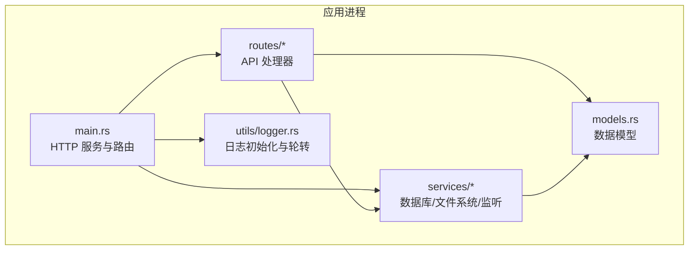
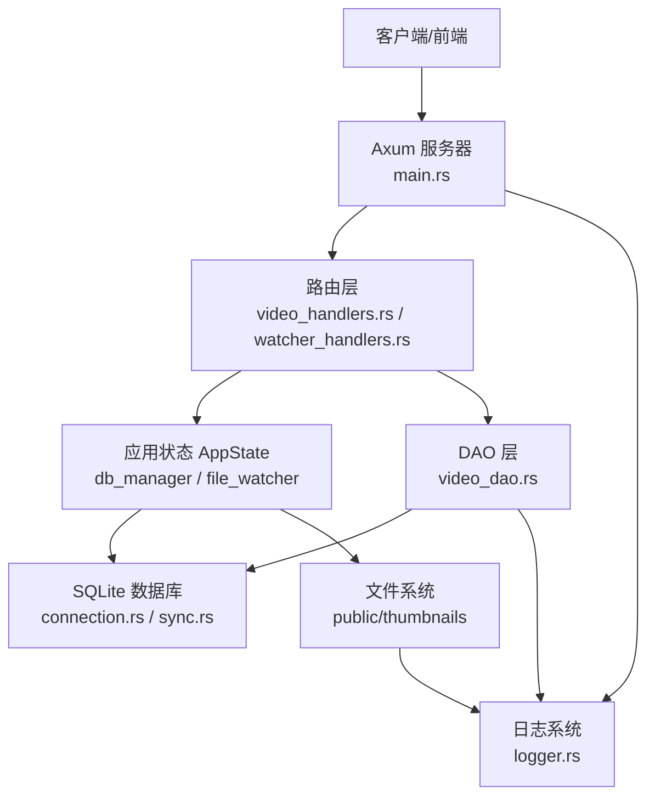
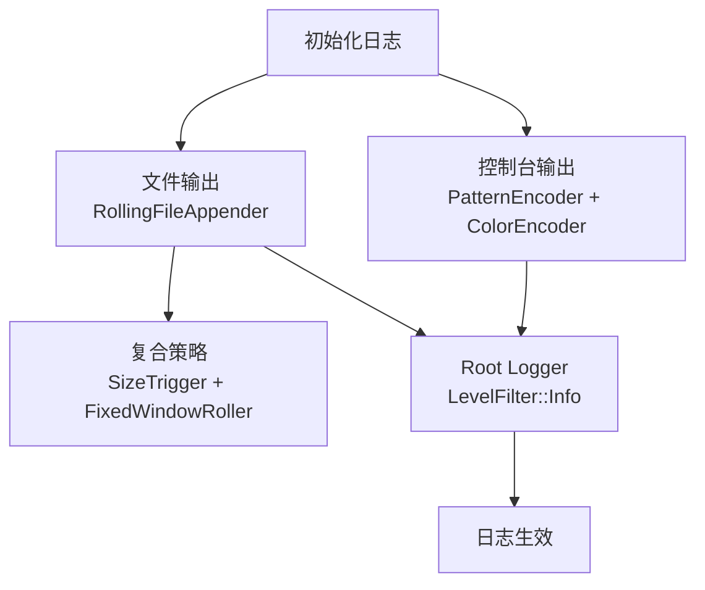
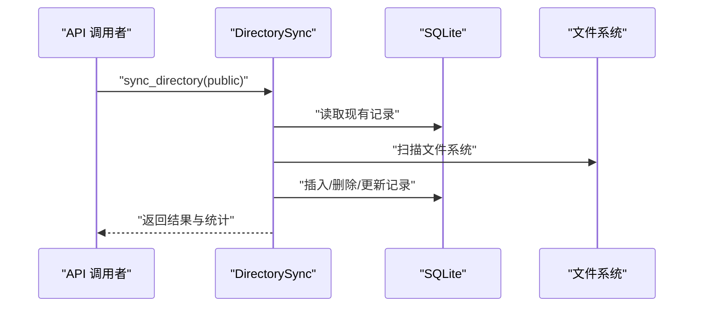
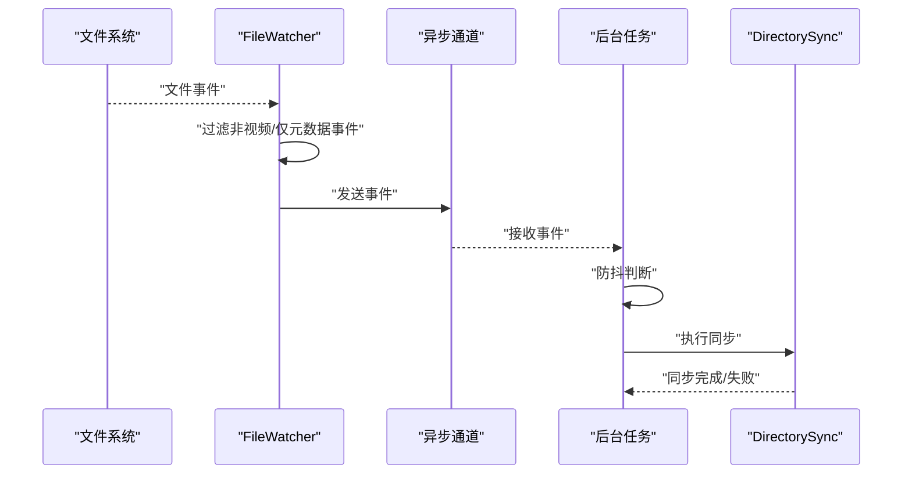
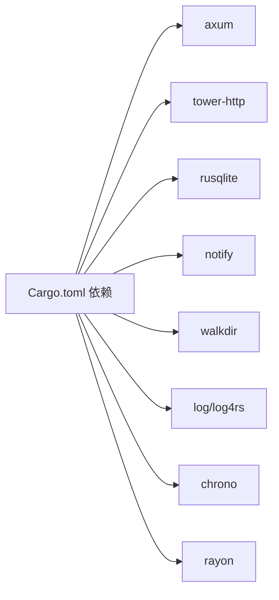

# 监控与告警

<cite>
**本文引用的文件**
- [app/server/src/main.rs](file://app/server/src/main.rs)
- [app/server/src/utils/logger.rs](file://app/server/src/utils/logger.rs)
- [app/server/src/services/db/connection.rs](file://app/server/src/services/db/connection.rs)
- [app/server/src/services/db/sync.rs](file://app/server/src/services/db/sync.rs)
- [app/server/src/services/db/watcher.rs](file://app/server/src/services/db/watcher.rs)
- [app/server/src/services/db/video_dao.rs](file://app/server/src/services/db/video_dao.rs)
- [app/server/src/routes/mod.rs](file://app/server/src/routes/mod.rs)
- [app/server/src/routes/video_handlers.rs](file://app/server/src/routes/video_handlers.rs)
- [app/server/src/routes/watcher_handlers.rs](file://app/server/src/routes/watcher_handlers.rs)
- [app/server/src/models.rs](file://app/server/src/models.rs)
- [app/server/Cargo.toml](file://app/server/Cargo.toml)
</cite>

## 目录
1. [简介](#简介)
2. [项目结构](#项目结构)
3. [核心组件](#核心组件)
4. [架构总览](#架构总览)
5. [详细组件分析](#详细组件分析)
6. [依赖关系分析](#依赖关系分析)
7. [性能考虑](#性能考虑)
8. [故障排查指南](#故障排查指南)
9. [结论](#结论)
10. [附录](#附录)

## 简介
本指南面向运维与开发团队，围绕该视频应用的监控与告警需求，提供一套可落地的配置方案。内容涵盖：
- 应用性能监控指标的采集与分析（CPU、内存、网络使用情况）
- 日志收集与分析策略（结构化日志格式、日志轮转）
- 健康检查接口的配置与使用
- 告警规则设置（阈值配置、通知渠道集成）
- 故障恢复策略与应急响应流程
- 监控仪表板搭建与可视化配置

当前代码库已具备基础日志能力与文件监听自动同步机制，本文在此基础上补充监控与告警最佳实践。

## 项目结构
后端采用 Rust + Axum，主要模块如下：
- 入口与路由：main.rs 定义 HTTP 服务、CORS、静态资源与 API 路由
- 业务层：数据库连接、目录同步、文件监听、DAO 查询
- 工具层：日志初始化与轮转
- 模型层：视频信息结构体序列化

图表来源
- [app/server/src/main.rs](file://app/server/src/main.rs#L1-L111)
- [app/server/src/routes/mod.rs](file://app/server/src/routes/mod.rs#L1-L6)
- [app/server/src/services/db/mod.rs](file://app/server/src/services/db/mod.rs#L1-L15)
- [app/server/src/utils/logger.rs](file://app/server/src/utils/logger.rs#L1-L100)
- [app/server/src/models.rs](file://app/server/src/models.rs#L1-L32)

章节来源
- [app/server/src/main.rs](file://app/server/src/main.rs#L1-L111)
- [app/server/src/routes/mod.rs](file://app/server/src/routes/mod.rs#L1-L6)
- [app/server/src/services/db/mod.rs](file://app/server/src/services/db/mod.rs#L1-L15)
- [app/server/src/utils/logger.rs](file://app/server/src/utils/logger.rs#L1-L100)
- [app/server/src/models.rs](file://app/server/src/models.rs#L1-L32)

## 核心组件
- 应用状态与生命周期
  - 共享状态包含数据库管理器与文件监听器，便于路由处理器与后台任务访问
  - 启动时初始化日志、缩略图目录、数据库，并按需进行首次同步
- 路由与健康检查
  - 提供视频列表、详情、手动同步、文件监听启停与状态查询等接口
  - 健康检查建议：对外暴露 /health 接口返回服务可用性状态
- 数据库与同步
  - SQLite 连接管理与迁移；双向同步实现文件系统与数据库一致性
- 文件监听
  - 基于文件系统事件的自动同步，带防抖与内容变更过滤
- 日志
  - 控制台彩色输出与滚动文件输出，支持大小触发与固定窗口轮转

章节来源
- [app/server/src/main.rs](file://app/server/src/main.rs#L21-L110)
- [app/server/src/routes/video_handlers.rs](file://app/server/src/routes/video_handlers.rs#L1-L104)
- [app/server/src/routes/watcher_handlers.rs](file://app/server/src/routes/watcher_handlers.rs#L1-L84)
- [app/server/src/services/db/connection.rs](file://app/server/src/services/db/connection.rs#L1-L122)
- [app/server/src/services/db/sync.rs](file://app/server/src/services/db/sync.rs#L1-L172)
- [app/server/src/services/db/watcher.rs](file://app/server/src/services/db/watcher.rs#L1-L182)
- [app/server/src/utils/logger.rs](file://app/server/src/utils/logger.rs#L1-L100)

## 架构总览
下图展示从客户端到后端服务、数据库与文件系统的交互路径，以及日志与监控的落点。

图表来源
- [app/server/src/main.rs](file://app/server/src/main.rs#L60-L110)
- [app/server/src/routes/video_handlers.rs](file://app/server/src/routes/video_handlers.rs#L1-L104)
- [app/server/src/routes/watcher_handlers.rs](file://app/server/src/routes/watcher_handlers.rs#L1-L84)
- [app/server/src/services/db/video_dao.rs](file://app/server/src/services/db/video_dao.rs#L1-L146)
- [app/server/src/services/db/connection.rs](file://app/server/src/services/db/connection.rs#L1-L122)
- [app/server/src/utils/logger.rs](file://app/server/src/utils/logger.rs#L1-L100)

## 详细组件分析

### 日志系统与轮转
- 结构化日志格式
  - 当前实现为文本格式，包含级别、时间、目标与消息
  - 建议引入 JSON 格式以便集中采集与检索
- 日志轮转
  - 已实现基于大小触发与固定窗口的滚动策略
  - 建议增加时间维度（如每日）与压缩策略，降低磁盘占用
- 输出介质
  - 同时输出到控制台与文件，便于开发调试与生产留存

图表来源
- [app/server/src/utils/logger.rs](file://app/server/src/utils/logger.rs#L1-L100)

章节来源
- [app/server/src/utils/logger.rs](file://app/server/src/utils/logger.rs#L1-L100)

### 数据库与目录同步
- 双向同步流程
  - 读取数据库现有记录，扫描文件系统，对比差异并执行新增/变更/删除
  - 支持增量与全量模式，记录耗时与统计信息
- 性能与可观测性
  - 关键步骤均记录耗时，便于定位瓶颈
  - 建议在同步前后记录指标（新增/变更/删除计数）

图表来源
- [app/server/src/services/db/sync.rs](file://app/server/src/services/db/sync.rs#L80-L172)
- [app/server/src/services/db/connection.rs](file://app/server/src/services/db/connection.rs#L1-L122)

章节来源
- [app/server/src/services/db/sync.rs](file://app/server/src/services/db/sync.rs#L1-L172)
- [app/server/src/services/db/connection.rs](file://app/server/src/services/db/connection.rs#L1-L122)

### 文件监听与自动同步
- 事件捕获与过滤
  - 使用文件系统事件库捕获创建/修改/删除事件
  - 过滤非视频相关路径与仅元数据变更事件
- 防抖与批处理
  - 通过时间间隔防抖，避免频繁同步
  - 异步通道传递事件，后台任务统一执行同步
- 生命周期管理
  - 提供启动/停止接口与状态查询，便于运维控制

图表来源
- [app/server/src/services/db/watcher.rs](file://app/server/src/services/db/watcher.rs#L1-L182)
- [app/server/src/services/db/sync.rs](file://app/server/src/services/db/sync.rs#L80-L172)

章节来源
- [app/server/src/services/db/watcher.rs](file://app/server/src/services/db/watcher.rs#L1-L182)
- [app/server/src/routes/watcher_handlers.rs](file://app/server/src/routes/watcher_handlers.rs#L1-L84)

### 路由与健康检查
- 现有接口
  - 视频列表、详情、手动同步、文件监听启停与状态查询
- 健康检查建议
  - 新增 /health 接口，返回服务可用性（数据库连通性、关键目录可读写、监听器状态等）
  - 建议结合外部探针（Prometheus、Grafana、APM）进行持续监控

章节来源
- [app/server/src/main.rs](file://app/server/src/main.rs#L72-L110)
- [app/server/src/routes/video_handlers.rs](file://app/server/src/routes/video_handlers.rs#L1-L104)
- [app/server/src/routes/watcher_handlers.rs](file://app/server/src/routes/watcher_handlers.rs#L1-L84)

## 依赖关系分析
- 外部依赖
  - Web 框架与中间件：Axum、tower-http（CORS、追踪）
  - 数据库：rusqlite（含捆绑特性）
  - 文件系统与事件：notify、walkdir
  - 日志：log、log4rs、chrono、nu-ansi-term
  - 并行：rayon
- 内部模块耦合
  - 路由依赖 AppState，间接访问数据库与监听器
  - DAO 依赖数据库连接与查询语句
  - 监听器依赖同步器，形成闭环

图表来源
- [app/server/Cargo.toml](file://app/server/Cargo.toml#L1-L23)

章节来源
- [app/server/Cargo.toml](file://app/server/Cargo.toml#L1-L23)

## 性能考虑
- 目录扫描与并行
  - 使用并行迭代器处理缩略图生成，减少等待时间
  - 建议对大目录启用分页查询与批量写入，避免一次性加载过多数据
- 同步策略
  - 增量同步优先，避免全量扫描带来的开销
  - 防抖窗口可根据文件变更频率调整
- 数据库
  - 已建立必要索引；建议定期分析统计信息并评估查询计划
- 日志
  - 控制台输出在高并发下可能成为瓶颈，建议生产环境仅保留文件输出或降级级别

章节来源
- [app/server/src/services/db/sync.rs](file://app/server/src/services/db/sync.rs#L1-L172)
- [app/server/src/services/db/watcher.rs](file://app/server/src/services/db/watcher.rs#L1-L182)
- [app/server/src/utils/logger.rs](file://app/server/src/utils/logger.rs#L1-L100)

## 故障排查指南
- 常见问题定位
  - 数据库初始化失败：检查数据库文件权限与路径
  - 监听器启动失败：确认监控目录存在且可读；查看事件库初始化错误
  - 缩略图生成失败：检查 ffmpeg 是否安装与可用
- 日志定位
  - 使用日志轮转文件定位错误堆栈与耗时信息
  - 关注同步过程中的“扫描错误”“处理错误”等统计
- 快速恢复
  - 停止监听器后手动执行一次同步，确保数据库与文件系统一致
  - 如数据库损坏，可备份后重建并重新初始化

章节来源
- [app/server/src/services/db/connection.rs](file://app/server/src/services/db/connection.rs#L1-L122)
- [app/server/src/services/db/watcher.rs](file://app/server/src/services/db/watcher.rs#L1-L182)
- [app/server/src/services/db/sync.rs](file://app/server/src/services/db/sync.rs#L1-L172)
- [app/server/src/utils/logger.rs](file://app/server/src/utils/logger.rs#L1-L100)

## 结论
本项目已具备日志与文件监听的基础能力，建议在此基础上：
- 引入结构化日志与集中采集
- 增设健康检查与关键指标导出
- 设定告警阈值与通知渠道
- 搭建监控仪表板并制定应急流程

## 附录

### 监控与告警配置清单
- 指标采集
  - CPU/内存/网络：通过系统监控工具采集应用进程指标
  - 应用指标：同步耗时、新增/变更/删除计数、监听器状态
- 日志策略
  - 结构化日志（JSON），统一字段（时间、级别、模块、消息、标签）
  - 轮转：大小触发 + 时间触发，保留周期视合规要求而定
- 健康检查
  - /health 返回服务可用性与依赖项状态
- 告警规则
  - 阈值：同步耗时超过 X 毫秒、错误率超过 Y%、监听器停止、日志 ERROR/WARN 比例异常
  - 通知：邮件/IM/Webhook，分级告警（预警/严重）
- 仪表板
  - 展示：吞吐、延迟、错误率、同步统计、监听器状态、日志趋势

### API 一览（便于对接监控）
- GET /api/videos：视频列表
- GET /api/videos/*path：视频详情（含子节点）
- GET /api/sync：手动同步
- GET /api/watcher/start：启动监听器
- GET /api/watcher/stop：停止监听器
- GET /api/watcher/status：监听器状态

章节来源
- [app/server/src/main.rs](file://app/server/src/main.rs#L72-L110)
- [app/server/src/routes/video_handlers.rs](file://app/server/src/routes/video_handlers.rs#L1-L104)
- [app/server/src/routes/watcher_handlers.rs](file://app/server/src/routes/watcher_handlers.rs#L1-L84)