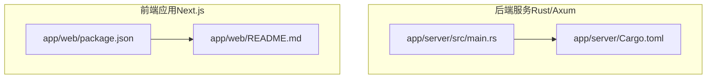
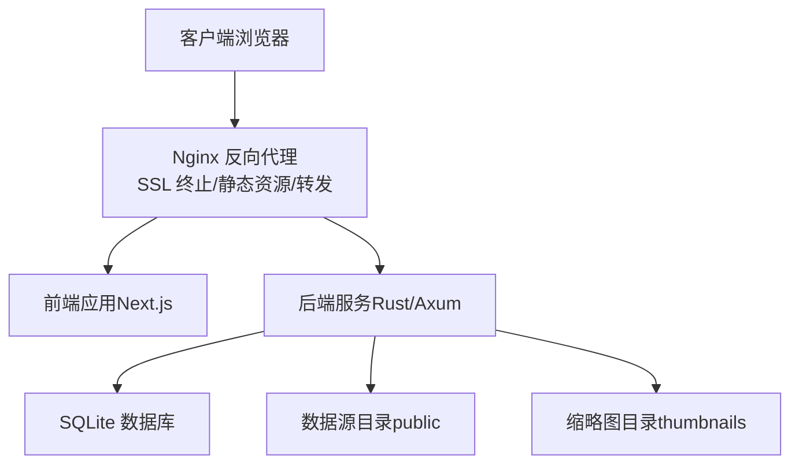
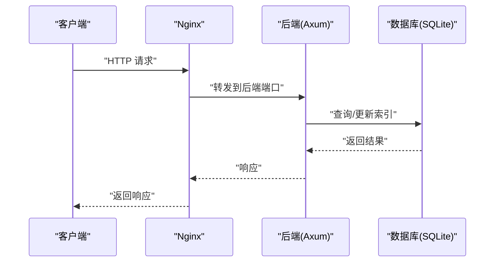
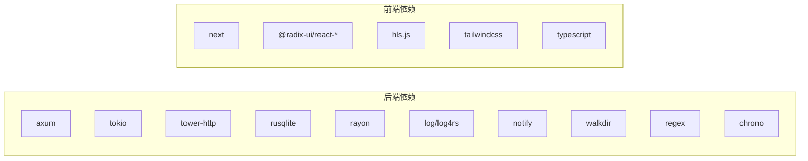

# 部署指南

<cite>
**本文引用的文件**
- [app/server/Cargo.toml](file://app/server/Cargo.toml)
- [app/server/src/main.rs](file://app/server/src/main.rs)
- [app/server/README.md](file://app/server/README.md)
- [app/web/package.json](file://app/web/package.json)
- [app/web/README.md](file://app/web/README.md)
</cite>

## 目录
1. [简介](#简介)
2. [项目结构](#项目结构)
3. [核心组件](#核心组件)
4. [架构总览](#架构总览)
5. [详细组件分析](#详细组件分析)
6. [依赖关系分析](#依赖关系分析)
7. [性能考虑](#性能考虑)
8. [故障排查指南](#故障排查指南)
9. [结论](#结论)
10. [附录](#附录)

## 简介
本部署指南面向开发与生产环境，围绕 Rust 后端服务与 Next.js 前端应用，提供从环境变量、依赖管理到容器化与 Kubernetes 部署、Nginx 反向代理与 SSL 证书、CI/CD 流水线、监控告警、日志收集、故障恢复与安全加固、性能调优的完整实践建议。文档同时结合仓库现有配置文件，确保建议与实际代码一致。

## 项目结构
该仓库采用前后端分离结构：
- 后端（Rust/Axum）：位于 app/server，提供视频目录扫描、数据库管理、文件监听与静态资源服务。
- 前端（Next.js 16/Tailwind）：位于 app/web，提供媒体库与播放器界面，与后端 API 协作。

图表来源
- [app/server/src/main.rs](file://app/server/src/main.rs#L1-L111)
- [app/server/Cargo.toml](file://app/server/Cargo.toml#L1-L23)
- [app/web/package.json](file://app/web/package.json#L1-L74)
- [app/web/README.md](file://app/web/README.md#L1-L158)

章节来源
- [app/server/src/main.rs](file://app/server/src/main.rs#L1-L111)
- [app/server/Cargo.toml](file://app/server/Cargo.toml#L1-L23)
- [app/web/package.json](file://app/web/package.json#L1-L74)
- [app/web/README.md](file://app/web/README.md#L1-L158)

## 核心组件
- 后端服务（Axum/Tokio）
  - 监听地址与端口：默认绑定到所有网络接口与固定端口。
  - 路由与中间件：提供 REST API、CORS 中间件、静态文件服务（公开视频与缩略图）。
  - 环境变量：数据源目录（用于扫描视频）、日志初始化。
  - 数据库：SQLite（rusqlite），用于视频索引与元数据存储。
  - 文件监听：文件变更触发自动同步（可手动启停）。
- 前端应用（Next.js）
  - 开发端口：默认 13000；生产构建与启动命令已定义。
  - 媒体播放：根据后端返回的类型自动选择原生播放或 HLS.js。

章节来源
- [app/server/src/main.rs](file://app/server/src/main.rs#L21-L111)
- [app/server/Cargo.toml](file://app/server/Cargo.toml#L1-L23)
- [app/web/package.json](file://app/web/package.json#L1-L20)

## 架构总览
下图展示了典型的部署拓扑：Nginx 作为反向代理与入口网关，负责 SSL 终止、静态资源与后端 API 转发；后端服务提供视频目录扫描与静态文件；前端应用通过 Next.js 构建产物对外提供媒体库与播放器界面。

图表来源
- [app/server/src/main.rs](file://app/server/src/main.rs#L72-L111)
- [app/server/README.md](file://app/server/README.md#L1-L120)

## 详细组件分析

### 后端服务（Rust/Axum）部署要点
- 端口与监听
  - 默认监听地址为所有网络接口与固定端口，便于容器与集群暴露。
- 环境变量
  - DATA_SOURCE_DIR：视频扫描的数据源根目录，默认值“public”。
- 静态资源
  - 对外提供 /public 与 /thumbnails 两条静态路径，分别映射至数据源目录与缩略图目录。
- CORS
  - 默认允许所有来源、GET/POST/OPTIONS 方法与任意请求头，便于前端跨域访问。
- 日志
  - 启动时初始化日志，建议在生产环境配置更精细的日志级别与输出目标。
- 数据库
  - 使用 SQLite 文件（默认数据库文件名），建议在持久卷中挂载以避免重启丢失。
- 文件监听
  - 提供启停与状态查询端点，适合在生产中按需启用自动同步。

图表来源
- [app/server/src/main.rs](file://app/server/src/main.rs#L72-L111)

章节来源
- [app/server/src/main.rs](file://app/server/src/main.rs#L21-L111)
- [app/server/README.md](file://app/server/README.md#L1-L120)

### 前端应用（Next.js）部署要点
- 开发与生产
  - 开发端口：13000；生产构建与启动命令已定义。
- 媒体播放
  - 根据后端返回的类型自动选择原生播放或 HLS.js，确保浏览器兼容性。
- 静态资源
  - Next.js 构建产物可由 Nginx 直接提供静态文件服务，减少后端压力。

章节来源
- [app/web/package.json](file://app/web/package.json#L1-L20)
- [app/web/README.md](file://app/web/README.md#L1-L120)

### Docker 容器化部署方案
- 镜像分层建议
  - 基础镜像：精简 Linux 发行版（如 alpine 或 distroless）。
  - 前端：使用 Nginx 镜像提供静态文件服务，或在容器内运行 Next.js 生产服务。
  - 后端：将编译后的二进制复制入只读文件系统，挂载数据卷用于数据库文件与数据源目录。
- 容器编排
  - 使用 Compose 将后端、数据库（SQLite 文件）、Nginx 与前端组合。
  - 为 SQLite 文件与数据源目录配置持久卷。
- 端口暴露
  - Nginx 暴露 80/443；后端服务内部暴露固定端口，由 Nginx 转发。
- 健康检查
  - 在 Nginx 层进行健康检查（如对 /api/videos 的探测），后端可提供轻量健康端点。

[本节为通用容器化建议，不直接分析具体文件，故无章节来源]

### Kubernetes 集群部署策略
- 工作负载
  - Deployment：后端服务与前端应用各一个，使用滚动更新策略。
  - Job/CronJob：用于一次性初始化或周期性任务（如索引重建）。
- 服务与 Ingress
  - Service：ClusterIP 暴露后端；Ingress 控制器暴露 80/443。
  - TLS：通过 Ingress 注解或证书管理器（如 cert-manager）自动签发与续期。
- 存储
  - PersistentVolume：挂载 SQLite 文件与数据源目录，确保高可用与备份。
- 配置
  - ConfigMap：存放非敏感配置（如日志级别、扫描深度等）。
  - Secret：存放敏感信息（如第三方服务密钥）。
- 网络策略
  - 限制 Ingress 到 80/443；后端之间最小权限通信。

[本节为通用 K8s 建议，不直接分析具体文件，故无章节来源]

### Nginx 反向代理与 SSL 证书
- 反向代理
  - 将 /api/* 转发至后端服务；将 /public/* 与 /thumbnails/* 直接由 Nginx 提供静态文件（或交由后端处理）。
  - 设置合理的超时、缓冲与压缩策略。
- SSL 证书
  - 使用 Let’s Encrypt（cert-manager）自动签发与续期；或在边缘网关（如 Traefik/Nginx Plus）集中管理。
  - 强制 HTTPS 重定向与 HSTS。
- 安全头部
  - 添加安全相关响应头（如 X-Content-Type-Options、X-Frame-Options、Referrer-Policy 等）。

[本节为通用 Nginx 建议，不直接分析具体文件，故无章节来源]

### CI/CD 流水线与自动化部署
- 构建阶段
  - 后端：拉取依赖、编译二进制、生成测试报告。
  - 前端：安装依赖、构建静态资源、运行 Lint 与测试。
- 容器镜像
  - 构建多阶段镜像，产出最小化运行镜像；推送至镜像仓库。
- 部署阶段
  - 使用 GitOps（如 Argo CD/Flux）或 Helm/Kustomize 部署至集群。
  - 分环境（dev/staging/prod）隔离，灰度发布策略。
- 质量门禁
  - 代码扫描、单元测试、集成测试、安全扫描（SAST/DAST）。
- 回滚策略
  - 基于版本标签与蓝绿/金丝雀回滚。

[本节为通用 CI/CD 建议，不直接分析具体文件，故无章节来源]

### 监控告警、日志与故障恢复
- 监控
  - 指标：CPU/内存、请求速率/延迟、错误率、健康检查失败数、磁盘空间。
  - 告警：阈值告警、趋势告警、SLI/SLO 告警。
- 日志
  - 结构化日志（JSON）；日志采集（如 Fluent Bit）与集中存储（如 Loki/Elasticsearch）。
  - 关键日志：启动日志、错误日志、慢查询/慢响应、文件监听异常。
- 故障恢复
  - 自愈：Pod 重启、副本扩缩容、存储故障切换。
  - 备份：数据库文件与数据源目录定期备份；回滚到最近稳定版本。

[本节为通用运维建议，不直接分析具体文件，故无章节来源]

### 安全加固与合规
- 最小权限
  - 容器以非 root 用户运行；只读根文件系统；最小化依赖。
- 网络
  - Ingress/TLS 加固；限制入站流量；启用 WAF（如 Nginx 企业版或外部 WAF）。
- 配置
  - 禁用不必要的中间件与端点；敏感配置放入 Secret；禁用调试输出。
- 合规
  - 数据保护（GDPR/CCPA）与审计日志；定期漏洞扫描与渗透测试。

[本节为通用安全建议，不直接分析具体文件，故无章节来源]

## 依赖关系分析
- 后端依赖
  - Web 框架与运行时：Axum、Tokio。
  - HTTP 中间件：tower-http（静态文件、CORS、追踪）。
  - 数据与并发：rusqlite、rayon。
  - 工具与日志：log/log4rs、notify、walkdir、regex、chrono。
- 前端依赖
  - 框架与 UI：Next.js、Radix UI、Tailwind。
  - 媒体播放：hls.js；浏览器原生支持。
  - 构建与类型：TypeScript、PostCSS、TailwindCSS。

图表来源
- [app/server/Cargo.toml](file://app/server/Cargo.toml#L1-L23)
- [app/web/package.json](file://app/web/package.json#L1-L74)

章节来源
- [app/server/Cargo.toml](file://app/server/Cargo.toml#L1-L23)
- [app/web/package.json](file://app/web/package.json#L1-L74)

## 性能考虑
- 目录扫描与并发
  - 使用 rayon 提升并发处理能力；合理控制扫描深度与并发度。
- 静态资源
  - 前端构建产物由 Nginx 提供，减少后端 I/O 压力；开启 gzip/br 压缩与缓存。
- 数据库
  - SQLite 适合中小规模；若数据量大，建议迁移到关系型数据库并引入连接池与索引优化。
- 文件监听
  - 在生产中按需启用文件监听，避免频繁 I/O；对热点目录增加缓存。
- CDN
  - 将静态视频与缩略图接入 CDN，降低边缘延迟与带宽成本。

[本节为通用性能建议，不直接分析具体文件，故无章节来源]

## 故障排查指南
- 启动与端口
  - 确认监听地址与端口未被占用；检查防火墙与安全组规则。
- 数据源目录
  - 确认 DATA_SOURCE_DIR 存在且具备读取权限；缩略图目录与数据库文件可写。
- CORS 与跨域
  - 若出现跨域问题，检查浏览器开发者工具 Network 面板与后端日志。
- 日志定位
  - 启动日志包含可用端点列表与初始化状态；关注数据库初始化与文件监听状态。
- 健康检查
  - 对 /api/videos 进行探测，确认后端存活与依赖可用。

章节来源
- [app/server/src/main.rs](file://app/server/src/main.rs#L31-L111)
- [app/server/README.md](file://app/server/README.md#L120-L200)

## 结论
本指南提供了从开发到生产的完整部署路径：明确环境变量与依赖管理、容器化与 K8s 部署、Nginx 反向代理与 SSL、CI/CD 流水线、监控告警与日志、故障恢复与安全加固、性能调优建议。结合仓库现有配置，可快速落地并持续演进。

## 附录
- 端口与路径
  - 后端默认监听：所有网络接口与固定端口；静态资源：/public 与 /thumbnails。
- 关键环境变量
  - DATA_SOURCE_DIR：数据源根目录（默认“public”）。
- API 端点参考
  - /api/videos、/api/videos/*path、/api/sync、/api/watcher/start、/api/watcher/stop、/api/watcher/status。

章节来源
- [app/server/src/main.rs](file://app/server/src/main.rs#L72-L111)
- [app/server/README.md](file://app/server/README.md#L1-L120)