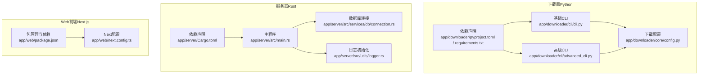
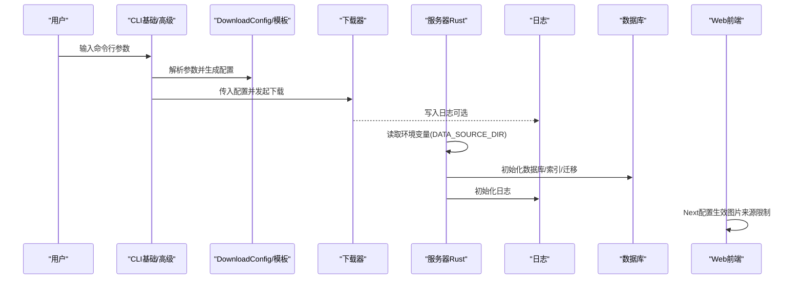
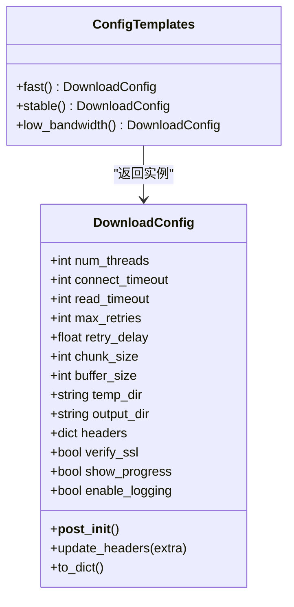
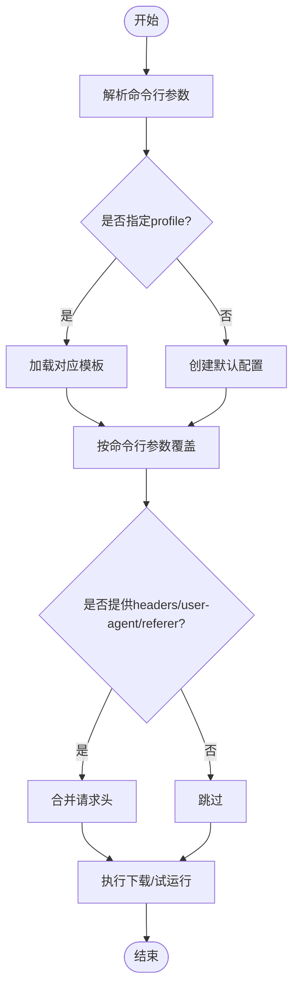
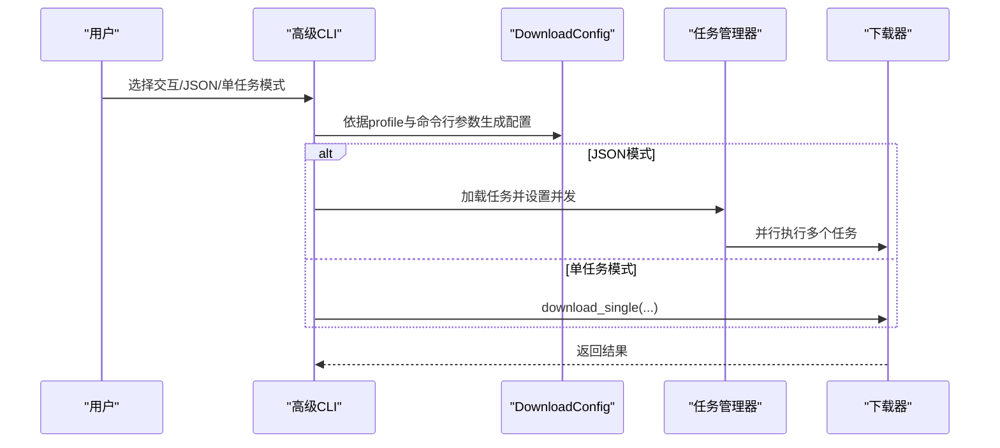
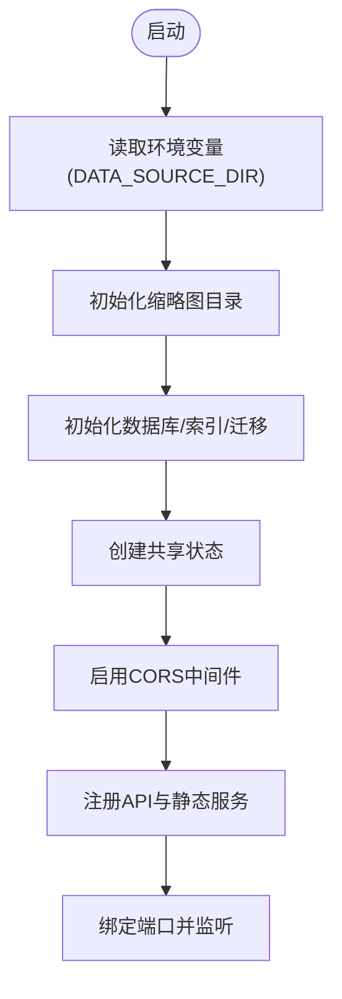
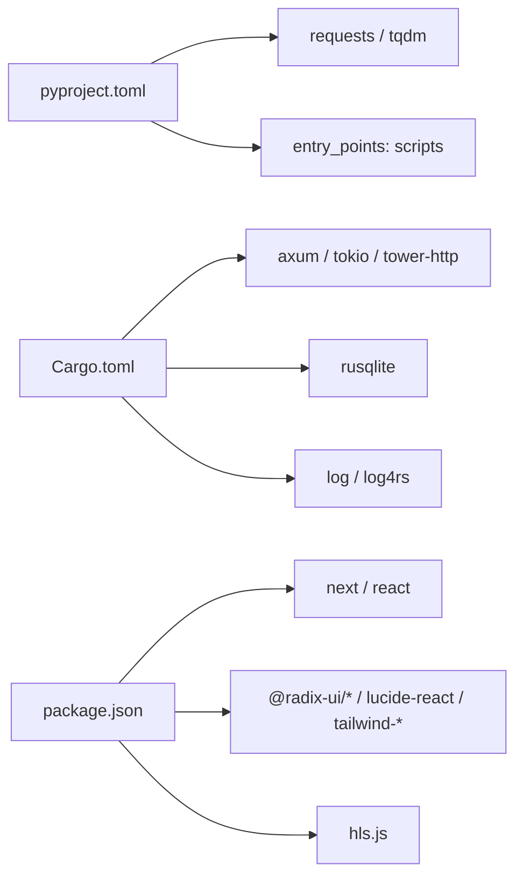

# 配置系统

<cite>
**本文引用的文件**
- [app/downloader/core/config.py](file://app/downloader/core/config.py)
- [app/downloader/cli/cli.py](file://app/downloader/cli/cli.py)
- [app/downloader/cli/advanced_cli.py](file://app/downloader/cli/advanced_cli.py)
- [app/downloader/pyproject.toml](file://app/downloader/pyproject.toml)
- [app/downloader/requirements.txt](file://app/downloader/requirements.txt)
- [app/server/src/main.rs](file://app/server/src/main.rs)
- [app/server/Cargo.toml](file://app/server/Cargo.toml)
- [app/server/src/services/db/connection.rs](file://app/server/src/services/db/connection.rs)
- [app/server/src/utils/logger.rs](file://app/server/src/utils/logger.rs)
- [app/web/package.json](file://app/web/package.json)
- [app/web/next.config.ts](file://app/web/next.config.ts)
</cite>

## 目录
1. [简介](#简介)
2. [项目结构](#项目结构)
3. [核心组件](#核心组件)
4. [架构总览](#架构总览)
5. [详细组件分析](#详细组件分析)
6. [依赖分析](#依赖分析)
7. [性能考虑](#性能考虑)
8. [故障排查指南](#故障排查指南)
9. [结论](#结论)
10. [附录](#附录)

## 简介
本文件系统性梳理“视频项目”的配置体系，覆盖下载器配置、命令行参数解析与应用、服务器端环境变量与日志配置、Web前端构建与运行配置等。文档以“可读性强、循序渐进”为目标，既面向开发者也便于非技术读者理解。

## 项目结构
项目由三层组成：
- 下载器（Python）：负责M3U8解析、分片下载、合并与输出；通过命令行工具提供基础与高级两种模式。
- 服务器（Rust）：提供HTTP API、文件监听、数据库管理与静态资源服务；通过环境变量控制数据源目录。
- Web前端（Next.js）：提供媒体库浏览与播放界面；通过构建配置限制图片来源与注入运行脚本。

图表来源
- [app/downloader/core/config.py](file://app/downloader/core/config.py#L1-L114)
- [app/downloader/cli/cli.py](file://app/downloader/cli/cli.py#L1-L292)
- [app/downloader/cli/advanced_cli.py](file://app/downloader/cli/advanced_cli.py#L1-L373)
- [app/downloader/pyproject.toml](file://app/downloader/pyproject.toml#L1-L17)
- [app/downloader/requirements.txt](file://app/downloader/requirements.txt#L1-L3)
- [app/server/src/main.rs](file://app/server/src/main.rs#L1-L111)
- [app/server/src/services/db/connection.rs](file://app/server/src/services/db/connection.rs#L1-L122)
- [app/server/src/utils/logger.rs](file://app/server/src/utils/logger.rs#L1-L100)
- [app/server/Cargo.toml](file://app/server/Cargo.toml#L1-L23)
- [app/web/package.json](file://app/web/package.json#L1-L74)
- [app/web/next.config.ts](file://app/web/next.config.ts#L1-L39)

章节来源
- [app/downloader/core/config.py](file://app/downloader/core/config.py#L1-L114)
- [app/downloader/cli/cli.py](file://app/downloader/cli/cli.py#L1-L292)
- [app/downloader/cli/advanced_cli.py](file://app/downloader/cli/advanced_cli.py#L1-L373)
- [app/server/src/main.rs](file://app/server/src/main.rs#L1-L111)
- [app/server/src/services/db/connection.rs](file://app/server/src/services/db/connection.rs#L1-L122)
- [app/server/src/utils/logger.rs](file://app/server/src/utils/logger.rs#L1-L100)
- [app/web/package.json](file://app/web/package.json#L1-L74)
- [app/web/next.config.ts](file://app/web/next.config.ts#L1-L39)

## 核心组件
- 下载器配置模型与模板
  - DownloadConfig：集中定义线程数、超时、重试、块大小、缓冲区、路径、请求头、SSL校验、进度与日志开关等。
  - ConfigTemplates：提供fast/stable/low_bandwidth三套预设模板，便于快速切换性能与稳定性平衡。
- CLI参数到配置的映射
  - 基础CLI与高级CLI均支持从命令行参数覆盖默认配置，并解析请求头、User-Agent、Referer等。
- 服务器端配置
  - 环境变量：DATA_SOURCE_DIR用于指定数据源目录，决定静态资源公开路径与数据库初始化目录。
  - 日志：通过init_logger初始化控制台彩色输出与滚动文件日志。
  - 数据库：初始化videos表及索引，兼容旧版本迁移。
- Web前端配置
  - package.json：定义开发/生产脚本与依赖。
  - next.config.ts：限制图片远程来源，便于本地联调。

章节来源
- [app/downloader/core/config.py](file://app/downloader/core/config.py#L1-L114)
- [app/downloader/cli/cli.py](file://app/downloader/cli/cli.py#L69-L137)
- [app/downloader/cli/advanced_cli.py](file://app/downloader/cli/advanced_cli.py#L73-L104)
- [app/server/src/main.rs](file://app/server/src/main.rs#L27-L47)
- [app/server/src/utils/logger.rs](file://app/server/src/utils/logger.rs#L65-L99)
- [app/server/src/services/db/connection.rs](file://app/server/src/services/db/connection.rs#L1-L47)
- [app/web/package.json](file://app/web/package.json#L1-L74)
- [app/web/next.config.ts](file://app/web/next.config.ts#L1-L39)

## 架构总览
下图展示“配置系统”的跨层协作关系：CLI将用户输入映射为DownloadConfig；下载器按配置执行；服务器通过环境变量与日志配置支撑运行；Web前端通过Next配置约束网络访问。

图表来源
- [app/downloader/cli/cli.py](file://app/downloader/cli/cli.py#L240-L292)
- [app/downloader/cli/advanced_cli.py](file://app/downloader/cli/advanced_cli.py#L310-L373)
- [app/downloader/core/config.py](file://app/downloader/core/config.py#L1-L114)
- [app/server/src/main.rs](file://app/server/src/main.rs#L27-L47)
- [app/server/src/utils/logger.rs](file://app/server/src/utils/logger.rs#L65-L99)
- [app/server/src/services/db/connection.rs](file://app/server/src/services/db/connection.rs#L1-L47)
- [app/web/next.config.ts](file://app/web/next.config.ts#L1-L39)

## 详细组件分析

### 下载器配置模型与模板
- DownloadConfig字段族
  - 并发与I/O：num_threads、chunk_size、buffer_size、temp_dir、output_dir
  - 超时与重试：connect_timeout、read_timeout、max_retries、retry_delay
  - 请求与安全：headers、verify_ssl
  - 运行时行为：show_progress、enable_logging
- 预设模板
  - fast：高并发、较短超时与较少重试，适合高速网络
  - stable：折中并发与重试策略，兼顾稳定性
  - low_bandwidth：较低并发与较长重试间隔，降低带宽占用
- 生命周期钩子
  - __post_init__：自动推导线程数、确保目录存在

图表来源
- [app/downloader/core/config.py](file://app/downloader/core/config.py#L12-L114)

章节来源
- [app/downloader/core/config.py](file://app/downloader/core/config.py#L12-L114)

### 基础CLI参数到配置映射
- 参数覆盖顺序
  - profile优先选择模板，随后逐项覆盖命令行参数
  - 支持headers、user-agent、referer、no-ssl-verify、no-progress、no-logging、dry-run等
- 交互流程
  - 交互模式引导用户输入URL、选择配置模板、确认输出文件名
  - 非交互模式直接解析参数并执行下载

图表来源
- [app/downloader/cli/cli.py](file://app/downloader/cli/cli.py#L24-L68)
- [app/downloader/cli/cli.py](file://app/downloader/cli/cli.py#L69-L137)
- [app/downloader/cli/cli.py](file://app/downloader/cli/cli.py#L138-L239)
- [app/downloader/cli/cli.py](file://app/downloader/cli/cli.py#L240-L292)

章节来源
- [app/downloader/cli/cli.py](file://app/downloader/cli/cli.py#L24-L68)
- [app/downloader/cli/cli.py](file://app/downloader/cli/cli.py#L69-L137)
- [app/downloader/cli/cli.py](file://app/downloader/cli/cli.py#L138-L239)
- [app/downloader/cli/cli.py](file://app/downloader/cli/cli.py#L240-L292)

### 高级CLI参数到配置映射
- 扩展能力
  - 支持JSON任务文件批量下载、最大并发数、输出目录等
  - 提供交互式创建JSON配置文件的能力
- 参数覆盖逻辑与基础CLI一致，但增加JSON模式分支

图表来源
- [app/downloader/cli/advanced_cli.py](file://app/downloader/cli/advanced_cli.py#L22-L71)
- [app/downloader/cli/advanced_cli.py](file://app/downloader/cli/advanced_cli.py#L73-L104)
- [app/downloader/cli/advanced_cli.py](file://app/downloader/cli/advanced_cli.py#L174-L225)
- [app/downloader/cli/advanced_cli.py](file://app/downloader/cli/advanced_cli.py#L310-L373)

章节来源
- [app/downloader/cli/advanced_cli.py](file://app/downloader/cli/advanced_cli.py#L22-L71)
- [app/downloader/cli/advanced_cli.py](file://app/downloader/cli/advanced_cli.py#L73-L104)
- [app/downloader/cli/advanced_cli.py](file://app/downloader/cli/advanced_cli.py#L174-L225)
- [app/downloader/cli/advanced_cli.py](file://app/downloader/cli/advanced_cli.py#L310-L373)

### 服务器端配置与运行
- 环境变量
  - DATA_SOURCE_DIR：决定静态资源公开目录与数据库初始化目录
- 日志
  - 控制台彩色输出 + 滚动文件日志，按级别过滤
- 数据库
  - 初始化videos表与索引；对旧版本进行迁移，保证向后兼容

图表来源
- [app/server/src/main.rs](file://app/server/src/main.rs#L27-L47)
- [app/server/src/main.rs](file://app/server/src/main.rs#L49-L91)
- [app/server/src/main.rs](file://app/server/src/main.rs#L92-L111)
- [app/server/src/utils/logger.rs](file://app/server/src/utils/logger.rs#L65-L99)
- [app/server/src/services/db/connection.rs](file://app/server/src/services/db/connection.rs#L1-L47)
- [app/server/src/services/db/connection.rs](file://app/server/src/services/db/connection.rs#L50-L122)

章节来源
- [app/server/src/main.rs](file://app/server/src/main.rs#L27-L47)
- [app/server/src/main.rs](file://app/server/src/main.rs#L49-L91)
- [app/server/src/main.rs](file://app/server/src/main.rs#L92-L111)
- [app/server/src/utils/logger.rs](file://app/server/src/utils/logger.rs#L65-L99)
- [app/server/src/services/db/connection.rs](file://app/server/src/services/db/connection.rs#L1-L47)
- [app/server/src/services/db/connection.rs](file://app/server/src/services/db/connection.rs#L50-L122)

### Web前端配置
- package.json
  - 定义开发端口、构建与启动脚本，声明Next.js与UI组件等依赖
- next.config.ts
  - 限制remotePatterns仅允许特定主机与端口，避免跨域风险
  - 可扩展headers以满足API跨域需求（当前注释）

章节来源
- [app/web/package.json](file://app/web/package.json#L1-L74)
- [app/web/next.config.ts](file://app/web/next.config.ts#L1-L39)

## 依赖分析
- 下载器
  - 依赖requests与tqdm，分别用于HTTP请求与进度显示
  - CLI通过entry_points暴露命令行入口
- 服务器
  - 依赖axum/tokio/tower-http等构建异步HTTP服务，rusqlite管理SQLite，log/log4rs提供日志
- Web前端
  - Next.js 16、Tailwind、Radix UI、HLS.js等

图表来源
- [app/downloader/pyproject.toml](file://app/downloader/pyproject.toml#L1-L17)
- [app/downloader/requirements.txt](file://app/downloader/requirements.txt#L1-L3)
- [app/server/Cargo.toml](file://app/server/Cargo.toml#L1-L23)
- [app/web/package.json](file://app/web/package.json#L1-L74)

章节来源
- [app/downloader/pyproject.toml](file://app/downloader/pyproject.toml#L1-L17)
- [app/downloader/requirements.txt](file://app/downloader/requirements.txt#L1-L3)
- [app/server/Cargo.toml](file://app/server/Cargo.toml#L1-L23)
- [app/web/package.json](file://app/web/package.json#L1-L74)

## 性能考虑
- 下载器
  - 线程数与块大小：根据CPU核数与网络状况调整；fast模板提升并发，low_bandwidth模板降低带宽占用
  - 超时与重试：合理设置connect_timeout/read_timeout与max_retries，避免长时间阻塞
  - 缓冲区：增大buffer_size可减少磁盘写入次数，但需权衡内存占用
- 服务器
  - 数据库索引：idx_path与idx_parent提升查询效率
  - 日志滚动：避免日志过大影响IO性能
- Web前端
  - 限制remotePatterns减少跨域请求与潜在风险
  - 使用HLS.js优化播放体验

[本节为通用建议，无需具体文件引用]

## 故障排查指南
- 下载器
  - 若下载失败，检查headers（User-Agent/Referer）、verify_ssl、超时与重试参数
  - 使用dry-run模式验证配置是否符合预期
- 服务器
  - 确认DATA_SOURCE_DIR是否正确设置，否则静态资源与数据库初始化目录会异常
  - 查看日志文件与控制台输出，定位错误级别信息
  - 如数据库报错，关注迁移日志，确认是否为旧版本schema导致
- Web前端
  - 若图片无法加载，检查next.config.ts中的remotePatterns配置
  - 开发端口冲突时修改package.json中的dev脚本端口

章节来源
- [app/downloader/cli/cli.py](file://app/downloader/cli/cli.py#L272-L278)
- [app/server/src/main.rs](file://app/server/src/main.rs#L27-L47)
- [app/server/src/utils/logger.rs](file://app/server/src/utils/logger.rs#L65-L99)
- [app/server/src/services/db/connection.rs](file://app/server/src/services/db/connection.rs#L50-L122)
- [app/web/next.config.ts](file://app/web/next.config.ts#L1-L39)

## 结论
本项目的配置系统贯穿下载器、服务器与Web前端三层：通过DownloadConfig与模板实现灵活的下载参数组合；通过CLI将用户意图转化为可执行配置；通过服务器环境变量与日志配置保障运行稳定性；通过Web前端配置约束网络访问与播放体验。整体设计清晰、层次分明，便于扩展与维护。

[本节为总结性内容，无需具体文件引用]

## 附录
- 关键配置项速览
  - 下载器：num_threads、connect_timeout、read_timeout、max_retries、retry_delay、chunk_size、buffer_size、temp_dir、output_dir、headers、verify_ssl、show_progress、enable_logging
  - 服务器：DATA_SOURCE_DIR、日志级别与输出、数据库表结构与索引
  - Web：开发端口、remotePatterns、HLS.js集成

[本节为概览性内容，无需具体文件引用]