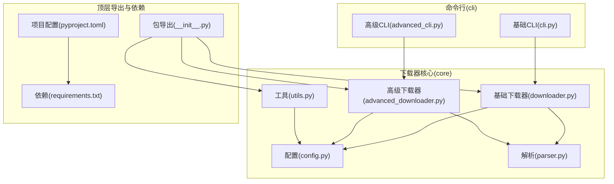
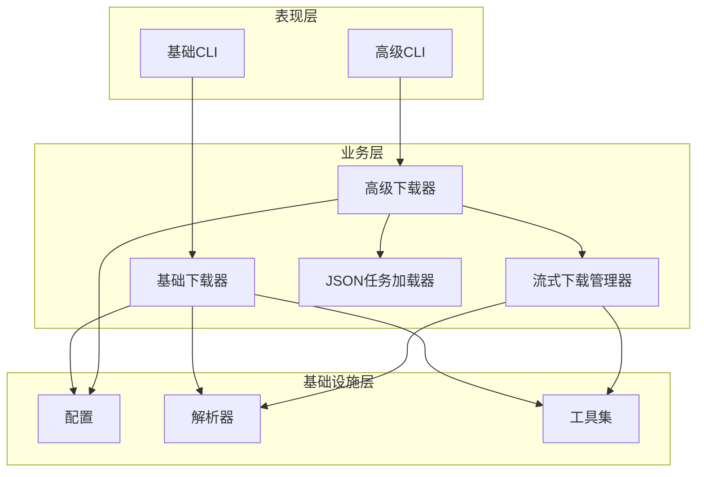
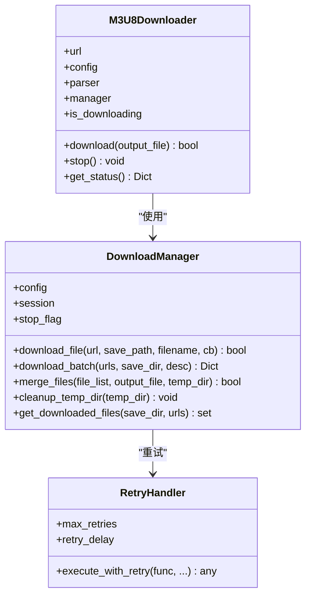
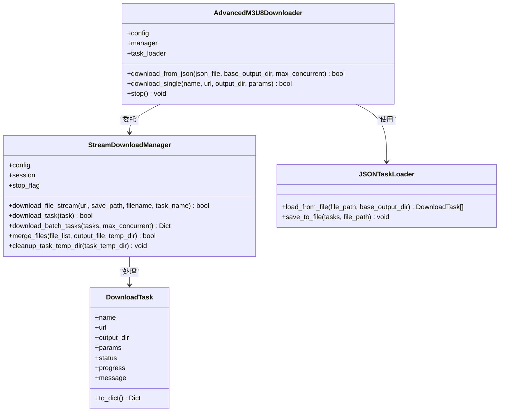
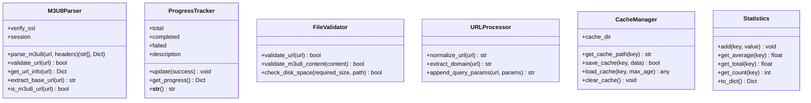
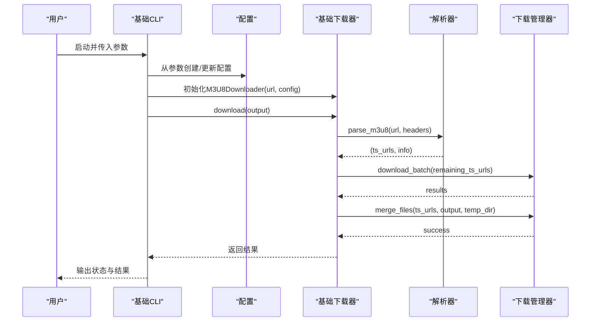
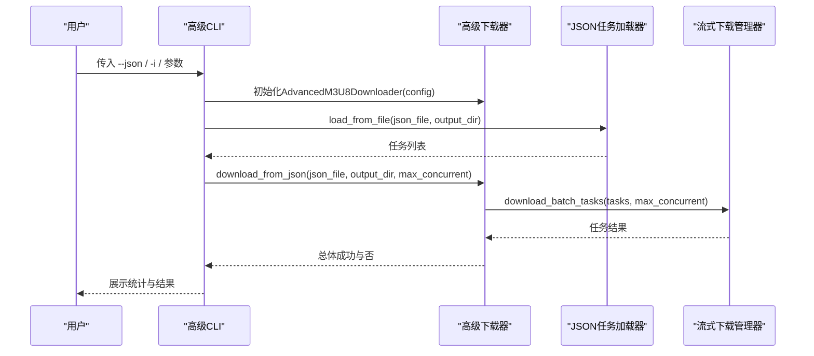
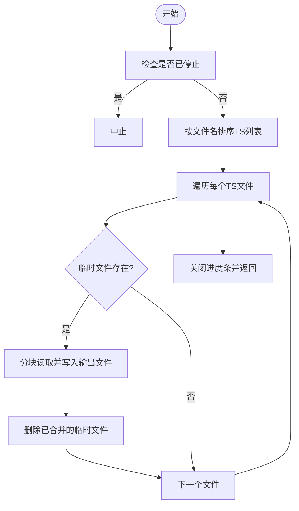
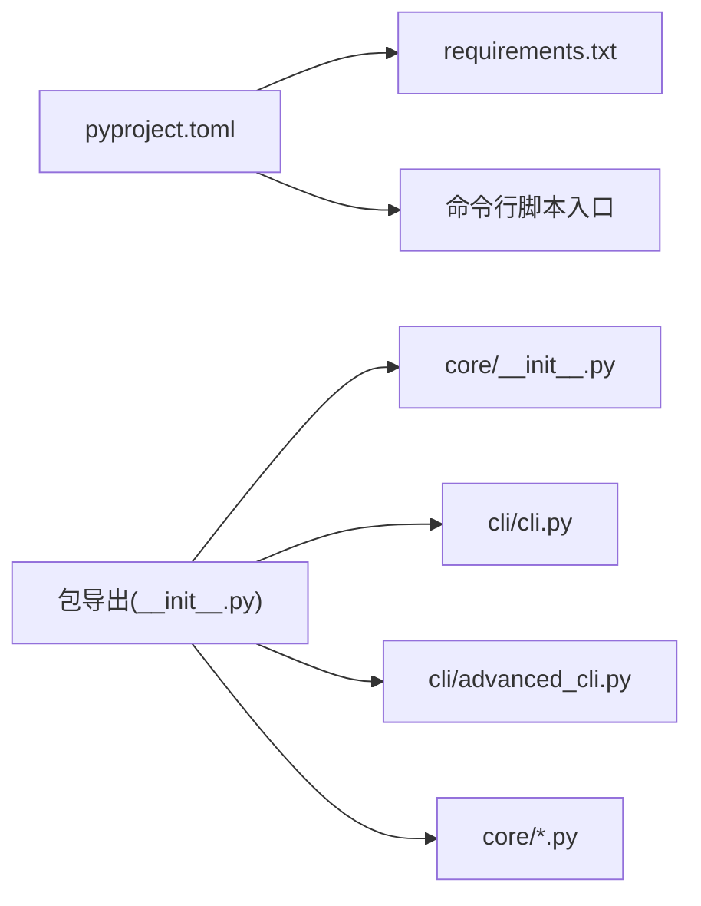

# M3U8视频下载器模块

<cite>
**本文引用的文件**
- [app/downloader/__init__.py](file://app/downloader/__init__.py)
- [app/downloader/core/__init__.py](file://app/downloader/core/__init__.py)
- [app/downloader/core/downloader.py](file://app/downloader/core/downloader.py)
- [app/downloader/core/parser.py](file://app/downloader/core/parser.py)
- [app/downloader/core/config.py](file://app/downloader/core/config.py)
- [app/downloader/core/utils.py](file://app/downloader/core/utils.py)
- [app/downloader/core/advanced_downloader.py](file://app/downloader/core/advanced_downloader.py)
- [app/downloader/cli/cli.py](file://app/downloader/cli/cli.py)
- [app/downloader/cli/advanced_cli.py](file://app/downloader/cli/advanced_cli.py)
- [app/downloader/pyproject.toml](file://app/downloader/pyproject.toml)
- [app/downloader/requirements.txt](file://app/downloader/requirements.txt)
- [app/downloader/examples/example_usage.py](file://app/downloader/examples/example_usage.py)
- [app/downloader/tests/test_basic.py](file://app/downloader/tests/test_basic.py)
- [app/downloader/tests/test_advanced.py](file://app/downloader/tests/test_advanced.py)
- [README.md](file://README.md)
</cite>

## 目录
1. [引言](#引言)
2. [项目结构](#项目结构)
3. [核心组件](#核心组件)
4. [架构总览](#架构总览)
5. [详细组件分析](#详细组件分析)
6. [依赖关系分析](#依赖关系分析)
7. [性能考量](#性能考量)
8. [故障排查指南](#故障排查指南)
9. [结论](#结论)
10. [附录](#附录)

## 引言
本文件面向“M3U8视频下载器模块”，系统化梳理其代码结构、模块职责、数据流与处理逻辑，帮助开发者与使用者快速理解与高效使用该模块。该模块提供基础与高级两种下载能力：基础版支持多线程批量下载、断点续传、错误重试与合并；高级版新增流式下载、实时进度、JSON任务批量、并发任务调度与自动清理等特性。模块同时提供命令行工具，支持交互式与非交互式使用。

## 项目结构
- 核心模块位于 app/downloader/core，包含配置、解析、下载器、高级下载器与工具函数。
- 命令行工具位于 app/downloader/cli，提供基础与高级CLI。
- 示例与测试分别位于 app/downloader/examples 与 app/downloader/tests。
- 顶层导出与依赖声明位于 app/downloader/__init__.py、pyproject.toml 与 requirements.txt。

图表来源
- [app/downloader/core/config.py](file://app/downloader/core/config.py#L1-L114)
- [app/downloader/core/parser.py](file://app/downloader/core/parser.py#L1-L159)
- [app/downloader/core/downloader.py](file://app/downloader/core/downloader.py#L1-L501)
- [app/downloader/core/advanced_downloader.py](file://app/downloader/core/advanced_downloader.py#L1-L576)
- [app/downloader/core/utils.py](file://app/downloader/core/utils.py#L1-L290)
- [app/downloader/cli/cli.py](file://app/downloader/cli/cli.py#L1-L292)
- [app/downloader/cli/advanced_cli.py](file://app/downloader/cli/advanced_cli.py#L1-L373)
- [app/downloader/__init__.py](file://app/downloader/__init__.py#L1-L49)
- [app/downloader/pyproject.toml](file://app/downloader/pyproject.toml#L1-L17)
- [app/downloader/requirements.txt](file://app/downloader/requirements.txt#L1-L3)

章节来源
- [app/downloader/__init__.py](file://app/downloader/__init__.py#L1-L49)
- [app/downloader/core/__init__.py](file://app/downloader/core/__init__.py#L1-L51)
- [app/downloader/pyproject.toml](file://app/downloader/pyproject.toml#L1-L17)
- [app/downloader/requirements.txt](file://app/downloader/requirements.txt#L1-L3)

## 核心组件
- 配置模块 DownloadConfig：集中管理线程数、超时、重试、块大小、缓冲区、路径、请求头、SSL校验、进度与日志开关等参数，并提供模板 ConfigTemplates（fast/stable/low_bandwidth）。
- 解析模块 M3U8Parser：解析M3U8内容，提取TS文件URL列表与分辨率/带宽等元信息，支持URL合法性与M3U8格式校验。
- 基础下载器 M3U8Downloader：封装主流程，解析M3U8、批量下载TS、合并输出MP4、清理临时目录、状态记录与中断控制。
- 高级下载器 AdvancedM3U8Downloader：支持JSON任务加载、并发任务调度、流式下载与实时进度、自动清理任务临时目录。
- 工具模块 utils：提供进度跟踪、URL/文件校验、缓存管理、统计、格式化与交互辅助等通用能力。
- CLI：提供基础CLI与高级CLI，支持命令行参数解析、交互模式、Dry-run、模板配置与批量任务执行。

章节来源
- [app/downloader/core/config.py](file://app/downloader/core/config.py#L1-L114)
- [app/downloader/core/parser.py](file://app/downloader/core/parser.py#L1-L159)
- [app/downloader/core/downloader.py](file://app/downloader/core/downloader.py#L1-L501)
- [app/downloader/core/advanced_downloader.py](file://app/downloader/core/advanced_downloader.py#L1-L576)
- [app/downloader/core/utils.py](file://app/downloader/core/utils.py#L1-L290)
- [app/downloader/cli/cli.py](file://app/downloader/cli/cli.py#L1-L292)
- [app/downloader/cli/advanced_cli.py](file://app/downloader/cli/advanced_cli.py#L1-L373)

## 架构总览
整体架构分为三层：
- 表现层：CLI（基础CLI与高级CLI）
- 业务层：基础下载器与高级下载器
- 数据与基础设施层：配置、解析、工具与网络请求

图表来源
- [app/downloader/cli/cli.py](file://app/downloader/cli/cli.py#L1-L292)
- [app/downloader/cli/advanced_cli.py](file://app/downloader/cli/advanced_cli.py#L1-L373)
- [app/downloader/core/downloader.py](file://app/downloader/core/downloader.py#L1-L501)
- [app/downloader/core/advanced_downloader.py](file://app/downloader/core/advanced_downloader.py#L1-L576)
- [app/downloader/core/config.py](file://app/downloader/core/config.py#L1-L114)
- [app/downloader/core/parser.py](file://app/downloader/core/parser.py#L1-L159)
- [app/downloader/core/utils.py](file://app/downloader/core/utils.py#L1-L290)

## 详细组件分析

### 基础下载器与管理器
- DownloadManager：封装会话、SSL校验、请求头、重试策略、信号处理、批量下载、进度统计、TS文件合并与临时目录清理。
- M3U8Downloader：串联解析、下载、合并与清理，提供状态查询与中断控制。

图表来源
- [app/downloader/core/downloader.py](file://app/downloader/core/downloader.py#L1-L501)

章节来源
- [app/downloader/core/downloader.py](file://app/downloader/core/downloader.py#L1-L501)

### 高级下载器与流式管理器
- StreamDownloadManager：支持逐个TS流式下载、实时进度显示、任务级临时目录、批量任务并发控制与清理。
- AdvancedM3U8Downloader：封装JSON任务加载、并发调度与结果统计。
- JSONTaskLoader：从JSON文件加载任务，支持相对路径解析与保存。

图表来源
- [app/downloader/core/advanced_downloader.py](file://app/downloader/core/advanced_downloader.py#L1-L576)

章节来源
- [app/downloader/core/advanced_downloader.py](file://app/downloader/core/advanced_downloader.py#L1-L576)

### 解析器与工具
- M3U8Parser：解析M3U8内容，提取TS列表与分辨率/带宽信息，提供URL合法性与M3U8格式校验。
- utils：进度跟踪、URL/文件校验、缓存、统计、格式化与交互辅助。

图表来源
- [app/downloader/core/parser.py](file://app/downloader/core/parser.py#L1-L159)
- [app/downloader/core/utils.py](file://app/downloader/core/utils.py#L1-L290)

章节来源
- [app/downloader/core/parser.py](file://app/downloader/core/parser.py#L1-L159)
- [app/downloader/core/utils.py](file://app/downloader/core/utils.py#L1-L290)

### 命令行工作流（基础CLI）

图表来源
- [app/downloader/cli/cli.py](file://app/downloader/cli/cli.py#L1-L292)
- [app/downloader/core/downloader.py](file://app/downloader/core/downloader.py#L1-L501)
- [app/downloader/core/parser.py](file://app/downloader/core/parser.py#L1-L159)

章节来源
- [app/downloader/cli/cli.py](file://app/downloader/cli/cli.py#L1-L292)
- [app/downloader/core/downloader.py](file://app/downloader/core/downloader.py#L1-L501)

### 高级CLI批量下载流程

图表来源
- [app/downloader/cli/advanced_cli.py](file://app/downloader/cli/advanced_cli.py#L1-L373)
- [app/downloader/core/advanced_downloader.py](file://app/downloader/core/advanced_downloader.py#L1-L576)

章节来源
- [app/downloader/cli/advanced_cli.py](file://app/downloader/cli/advanced_cli.py#L1-L373)
- [app/downloader/core/advanced_downloader.py](file://app/downloader/core/advanced_downloader.py#L1-L576)

### 合并流程（基础下载器）

图表来源
- [app/downloader/core/downloader.py](file://app/downloader/core/downloader.py#L291-L359)

章节来源
- [app/downloader/core/downloader.py](file://app/downloader/core/downloader.py#L291-L359)

## 依赖关系分析
- Python依赖：requests、tqdm，通过 requirements.txt 与 pyproject.toml 声明。
- 包导出：通过 app/downloader/__init__.py 与 core/__init__.py 统一导出核心类与工具，便于外部按需导入。
- CLI入口：pyproject.toml 定义命令行脚本入口，分别指向基础与高级CLI主函数。

图表来源
- [app/downloader/pyproject.toml](file://app/downloader/pyproject.toml#L1-L17)
- [app/downloader/requirements.txt](file://app/downloader/requirements.txt#L1-L3)
- [app/downloader/__init__.py](file://app/downloader/__init__.py#L1-L49)
- [app/downloader/core/__init__.py](file://app/downloader/core/__init__.py#L1-L51)

章节来源
- [app/downloader/pyproject.toml](file://app/downloader/pyproject.toml#L1-L17)
- [app/downloader/requirements.txt](file://app/downloader/requirements.txt#L1-L3)
- [app/downloader/__init__.py](file://app/downloader/__init__.py#L1-L49)
- [app/downloader/core/__init__.py](file://app/downloader/core/__init__.py#L1-L51)

## 性能考量
- 线程与并发：DownloadConfig 默认线程数为CPU核数的倍数，可通过模板或参数调整；高级CLI支持最大并发任务数控制。
- 超时与重试：合理设置连接与读取超时，结合指数退避重试降低网络抖动影响。
- 分块与缓冲：TS分块下载与合并缓冲减少内存峰值，适合大文件处理。
- 进度与日志：启用进度与日志有助于监控与定位问题，但过多日志会带来I/O开销。
- SSL与请求头：根据目标站点要求开启/关闭SSL校验与自定义请求头，避免握手失败或被拦截。

## 故障排查指南
- URL无效或格式不符：使用 FileValidator.validate_url 与 URLProcessor.normalize_url 进行校验与标准化。
- 解析失败：确认M3U8内容以 EXT-M3U 开头且包含TS或子M3U8片段；必要时检查Referer/UA等请求头。
- 下载中断：支持SIGINT/SIGTERM信号，调用 stop() 或在CLI中Ctrl+C中断；检查磁盘空间与网络连通性。
- 合并失败：检查临时目录与输出目录权限，确认TS文件完整性；查看日志文件 download.log。
- 重试与超时：适当提高重试次数与延长超时，避免因瞬时网络波动导致失败。
- 高级模式批量任务：关注并发数与任务状态统计，必要时降低并发以缓解带宽压力。

章节来源
- [app/downloader/core/utils.py](file://app/downloader/core/utils.py#L1-L290)
- [app/downloader/core/parser.py](file://app/downloader/core/parser.py#L1-L159)
- [app/downloader/core/downloader.py](file://app/downloader/core/downloader.py#L1-L501)
- [app/downloader/core/advanced_downloader.py](file://app/downloader/core/advanced_downloader.py#L1-L576)
- [app/downloader/cli/cli.py](file://app/downloader/cli/cli.py#L1-L292)
- [app/downloader/cli/advanced_cli.py](file://app/downloader/cli/advanced_cli.py#L1-L373)

## 结论
该M3U8下载器模块以清晰的分层设计实现了从解析、下载、合并到CLI交互的完整链路。基础版强调稳定性与易用性，高级版强化了并发、流式与批量能力。通过配置模板与工具集，用户可针对不同网络与设备环境灵活调优。建议在生产环境中结合日志与监控，合理设置并发与重试策略，确保下载的可靠性与性能。

## 附录
- 使用示例与编程接口参见示例脚本与测试脚本，便于快速上手与集成。
- 项目总说明文档提供了更广泛的上下文与使用指引。

章节来源
- [app/downloader/examples/example_usage.py](file://app/downloader/examples/example_usage.py#L1-L176)
- [app/downloader/tests/test_basic.py](file://app/downloader/tests/test_basic.py#L1-L260)
- [app/downloader/tests/test_advanced.py](file://app/downloader/tests/test_advanced.py#L1-L262)
- [README.md](file://README.md#L372-L474)