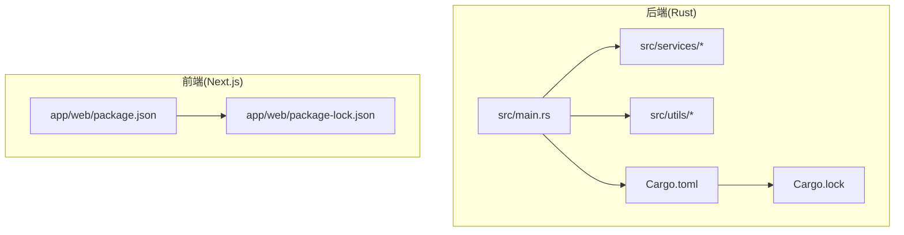
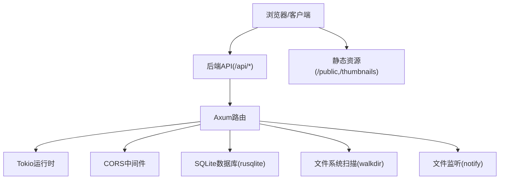
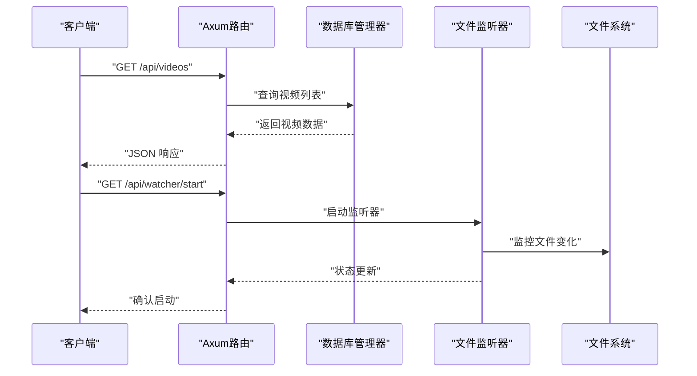
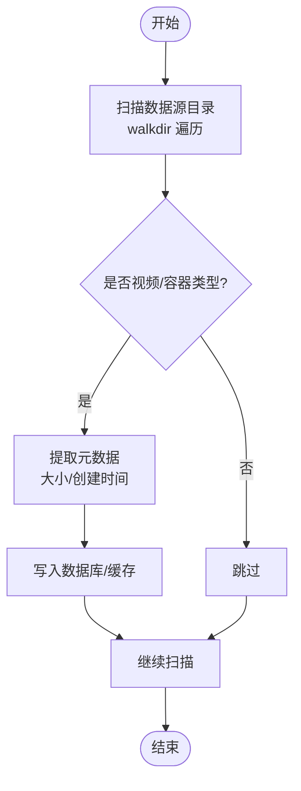
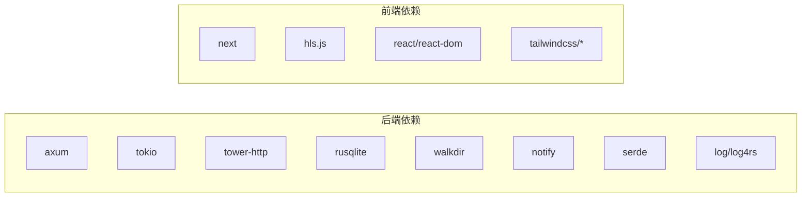

# 安装指南

<cite>
**本文引用的文件**
- [README.md](file://README.md)
- [app/server/README.md](file://app/server/README.md)
- [app/server/Cargo.toml](file://app/server/Cargo.toml)
- [app/server/Cargo.lock](file://app/server/Cargo.lock)
- [app/server/src/main.rs](file://app/server/src/main.rs)
- [app/server/src/utils/common.rs](file://app/server/src/utils/common.rs)
- [app/server/src/services/mod.rs](file://app/server/src/services/mod.rs)
- [app/server/src/services/db/mod.rs](file://app/server/src/services/db/mod.rs)
- [app/web/package.json](file://app/web/package.json)
- [app/web/package-lock.json](file://app/web/package-lock.json)
</cite>

## 目录
1. [引言](#引言)
2. [项目结构](#项目结构)
3. [核心组件](#核心组件)
4. [架构总览](#架构总览)
5. [详细组件分析](#详细组件分析)
6. [依赖分析](#依赖分析)
7. [性能考虑](#性能考虑)
8. [故障排除指南](#故障排除指南)
9. [结论](#结论)
10. [附录](#附录)

## 引言
本指南面向希望在本地或生产环境中安装并运行“视频文件服务器”的用户，覆盖系统要求、软件依赖安装、项目克隆与构建、环境配置、开发与生产模式差异、常见问题排查等内容。项目由 Rust 后端（Axum/Tokio）与 Next.js 前端组成，提供视频文件的自动发现、RESTful API、静态文件服务与跨域支持。

## 项目结构
- 后端（Rust）位于 app/server，负责 API 路由、静态文件服务、数据库与文件监听。
- 前端（Next.js）位于 app/web，提供媒体播放与媒体库展示。
- 顶层 README 提供总体安装与使用说明；后端 README 提供 API 与运行方式细节。

图表来源
- [app/server/src/main.rs](file://app/server/src/main.rs#L1-L111)
- [app/server/Cargo.toml](file://app/server/Cargo.toml#L1-L23)
- [app/server/Cargo.lock](file://app/server/Cargo.lock#L1-L120)
- [app/web/package.json](file://app/web/package.json#L1-L74)
- [app/web/package-lock.json](file://app/web/package-lock.json#L1-L120)

章节来源
- [README.md](file://README.md#L1-L120)
- [app/server/README.md](file://app/server/README.md#L1-L60)

## 核心组件
- 后端服务
  - 路由与中间件：CORS、静态文件服务、API 路由。
  - 数据库与同步：SQLite（rusqlite）与目录扫描同步。
  - 文件监听：自动同步新增/变更文件。
  - 日志：log/log4rs。
- 前端播放器
  - 自动识别媒体类型（MP4/HLS/音频），按类型选择播放策略。
  - HLS 播放：浏览器原生或 hls.js 动态加载。
  - 响应式 UI 与播放控制。

章节来源
- [app/server/src/main.rs](file://app/server/src/main.rs#L1-L111)
- [app/server/Cargo.toml](file://app/server/Cargo.toml#L1-L23)
- [app/web/package.json](file://app/web/package.json#L1-L74)

## 架构总览
后端通过 Axum 提供 RESTful API 与静态文件服务，前端通过 Next.js 提供播放器与媒体库界面。两者通过本地回环地址通信。

图表来源
- [app/server/src/main.rs](file://app/server/src/main.rs#L60-L111)
- [app/server/Cargo.toml](file://app/server/Cargo.toml#L1-L23)

## 详细组件分析

### 后端服务组件
- 应用状态与共享资源：数据库管理器、文件监听器以 Arc<Mutex<...>> 形式注入。
- 路由与静态服务：
  - /api/videos：列出视频与目录。
  - /api/videos/*path：获取指定路径详情（含子文件）。
  - /api/sync：手动触发数据库同步。
  - /api/watcher/*：文件监听器启停与状态查询。
  - /public/*：数据源目录静态文件服务。
  - /thumbnails/*：缩略图目录静态文件服务。
- CORS：允许所有来源与常用方法/头部。
- 端口：默认 3003（可在源码中修改）。

图表来源
- [app/server/src/main.rs](file://app/server/src/main.rs#L60-L111)

章节来源
- [app/server/src/main.rs](file://app/server/src/main.rs#L1-L111)

### 数据与文件处理
- 目录扫描：walkdir 遍历，限制最大深度，过滤视频/容器类型（mp4/m3u8/ts/vtt/srt 等）。
- 文件大小格式化、创建时间提取（含时区转换）。
- 缩略图初始化：根据数据源目录初始化缩略图目录结构。

图表来源
- [app/server/src/utils/common.rs](file://app/server/src/utils/common.rs#L1-L146)

章节来源
- [app/server/src/utils/common.rs](file://app/server/src/utils/common.rs#L1-L146)

### 前端播放器组件
- 自动类型识别：根据后端返回的 type 字段选择原生 HTML5 或 hls.js。
- 播放控制：播放/暂停、进度拖动、音量、全屏、下载。
- 与后端 API 集成：拉取视频列表与详情，渲染媒体库与播放器。

章节来源
- [app/web/package.json](file://app/web/package.json#L1-L74)

## 依赖分析
- 后端依赖（关键）
  - axum、tokio：高性能异步 Web 框架与运行时。
  - tower-http：静态文件服务、CORS、追踪。
  - rusqlite：SQLite 数据库。
  - walkdir、notify：目录遍历与文件监听。
  - serde、log/log4rs：序列化与日志。
- 前端依赖（关键）
  - next：React 框架。
  - hls.js：HLS 播放。
  - react、react-dom：UI 基础。
  - tailwindcss 系列：样式工具。

图表来源
- [app/server/Cargo.toml](file://app/server/Cargo.toml#L1-L23)
- [app/web/package.json](file://app/web/package.json#L1-L74)

章节来源
- [app/server/Cargo.toml](file://app/server/Cargo.toml#L1-L23)
- [app/server/Cargo.lock](file://app/server/Cargo.lock#L1-L120)
- [app/web/package.json](file://app/web/package.json#L1-L74)
- [app/web/package-lock.json](file://app/web/package-lock.json#L1-L120)

## 性能考虑
- 使用 release 构建以获得更优性能。
- 目录扫描深度与过滤策略已内置，避免不必要的 IO。
- 文件监听可按需启用，减少频繁全量扫描。
- 静态文件服务由 Tower-HTTP 提供，适合小规模到中等规模部署。

章节来源
- [README.md](file://README.md#L100-L140)
- [app/server/src/main.rs](file://app/server/src/main.rs#L60-L111)

## 故障排除指南
- 服务器启动失败
  - 检查端口是否被占用；默认监听 0.0.0.0:3003（可在源码中修改）。
  - 确认 public 目录存在且具备读取权限。
- 修改服务器端口
  - 在后端主程序中修改绑定地址端口后重新编译。
- 支持的视频格式
  - MP4、M3U8、TS、VTT、SRT；HLS 流媒体目录会被识别为 hls_directory。
- 添加视频文件
  - 将文件放入 public 目录，服务器会自动扫描；也可手动触发同步。
- HLS 流媒体使用
  - 将 m3u8 与 ts 文件置于同一目录，服务器识别为 HLS 目录。
- 提升性能
  - 使用 release 模式运行；可结合 CDN 加速静态文件。

章节来源
- [README.md](file://README.md#L480-L513)
- [app/server/README.md](file://app/server/README.md#L230-L288)
- [app/server/src/main.rs](file://app/server/src/main.rs#L90-L111)

## 结论
通过本指南，您可以在 Windows、Linux、macOS 上完成 Rust 与 Node.js 工具链安装、项目克隆、依赖安装与构建，并根据开发/生产模式选择合适的运行方式。若遇到问题，可依据故障排除章节定位并解决。

## 附录

### 系统要求与软件依赖
- 操作系统
  - Windows 10/11、Linux(Ubuntu 20.04+)、macOS 10.15+
- 软件依赖
  - Rust 工具链（rustc、cargo）≥ 1.70.0
  - Git
  - Node.js（用于前端 Next.js 项目）
  - 终端：PowerShell（Windows）、Bash/Terminal（Linux/macOS）

章节来源
- [README.md](file://README.md#L36-L68)

### 安装与配置步骤（按平台）
- Windows
  - 安装 Rust：使用官方安装脚本或下载安装程序。
  - 安装 Git 与 Node.js。
  - 打开终端，进入项目根目录，执行后端构建与运行。
- Linux
  - 使用包管理器安装 Rust、Git、Node.js。
  - 在终端中执行后端构建与运行。
- macOS
  - 使用包管理器或官方安装脚本安装 Rust、Git、Node.js。
  - 在终端中执行后端构建与运行。

章节来源
- [README.md](file://README.md#L50-L120)

### 项目克隆与依赖安装
- 克隆项目
  - 进入项目目录后，使用 Git 克隆仓库。
- 安装后端依赖
  - 进入 app/server，执行构建命令（开发/发布模式可选）。
- 安装前端依赖
  - 进入 app/web，安装 Node.js 依赖（使用包管理器）。

章节来源
- [README.md](file://README.md#L69-L120)
- [app/web/package.json](file://app/web/package.json#L1-L20)

### 环境配置
- 默认配置
  - 服务器端口：3003（可在源码中修改）。
  - 视频目录：public（可通过环境变量 DATA_SOURCE_DIR 指定）。
  - CORS：默认允许所有来源。
- 可选配置
  - 数据源目录：通过环境变量 DATA_SOURCE_DIR 指定。
  - 缩略图目录：自动初始化与 public 目录关联。

章节来源
- [app/server/src/main.rs](file://app/server/src/main.rs#L20-L40)
- [app/server/src/main.rs](file://app/server/src/main.rs#L80-L111)

### 开发模式与生产模式
- 开发模式
  - 后端：在 app/server 目录执行运行命令，适合调试与热迭代。
- 生产模式
  - 后端：先构建 release，再运行 release 版本，适合上线部署。
  - 前端：在 app/web 目录执行构建与启动命令，生成静态产物并运行。

章节来源
- [README.md](file://README.md#L100-L140)
- [app/web/package.json](file://app/web/package.json#L1-L20)

### 访问服务与 API
- 访问地址
  - 本地默认监听 0.0.0.0:3003。
- API
  - 获取视频列表：GET /api/videos
  - 获取视频详情：GET /api/videos/{path}
  - 手动同步：GET /api/sync
  - 文件监听器：GET /api/watcher/start、/api/watcher/stop、/api/watcher/status
- 静态文件
  - /public/{filename}：直接访问视频与字幕等文件
  - /thumbnails/{filename}：访问缩略图

章节来源
- [app/server/README.md](file://app/server/README.md#L140-L200)
- [app/server/src/main.rs](file://app/server/src/main.rs#L60-L111)