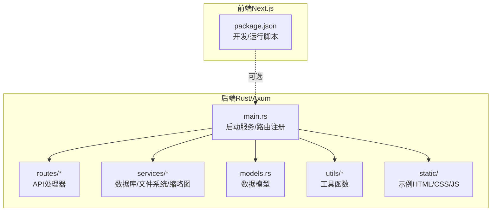
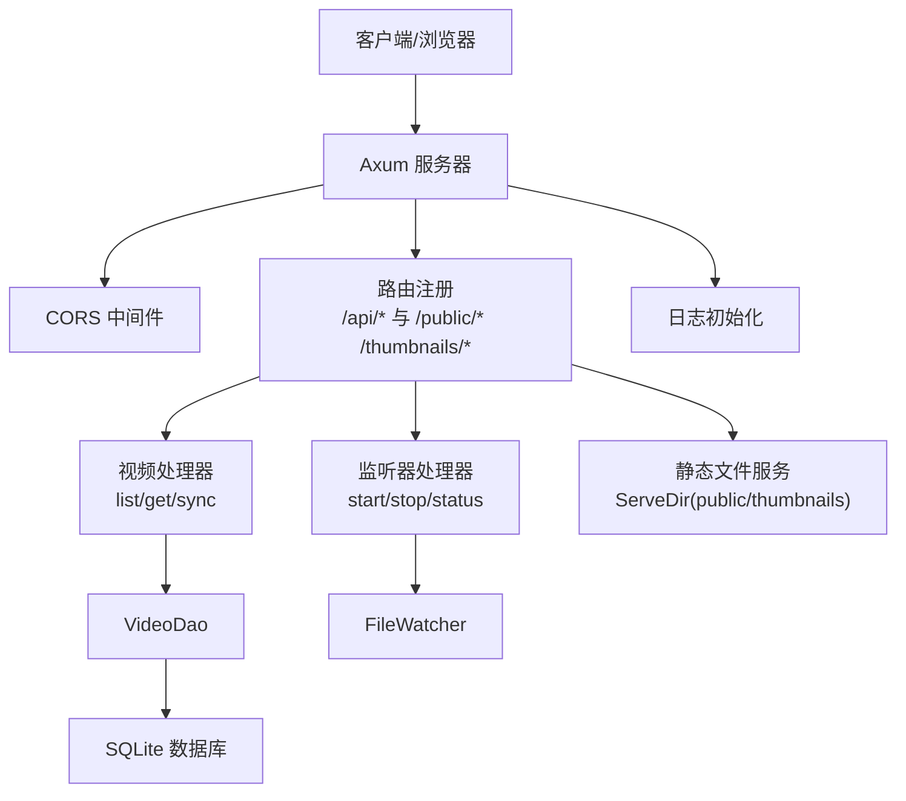
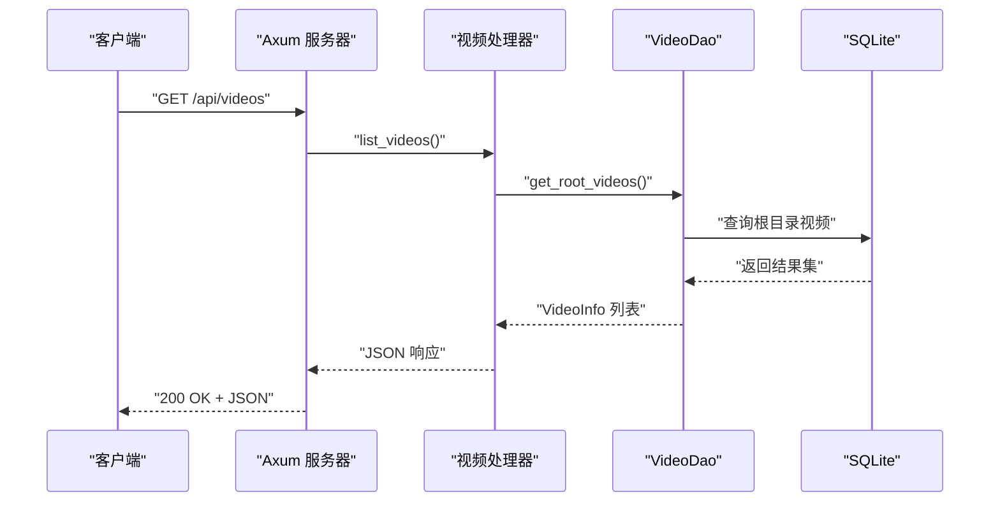
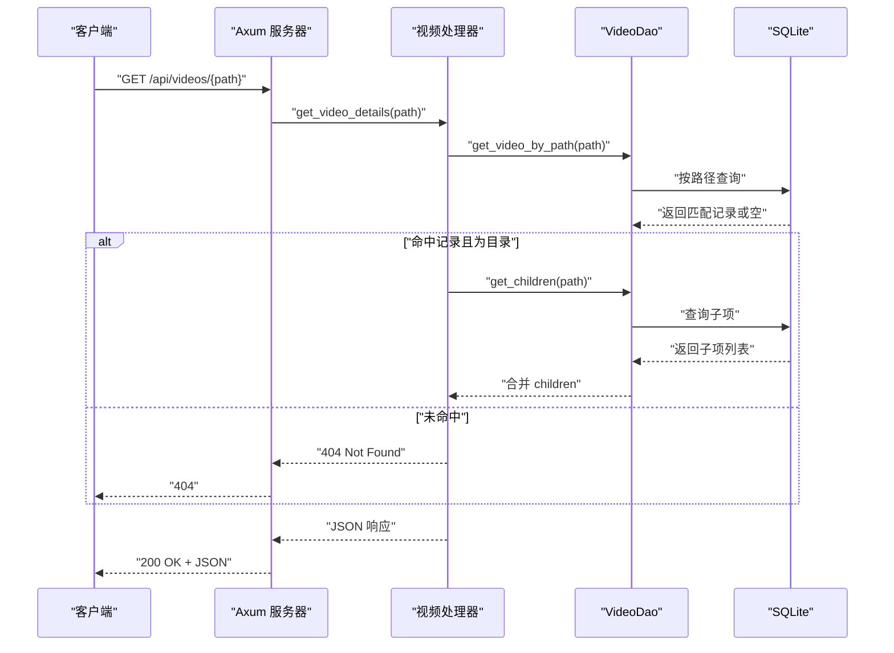
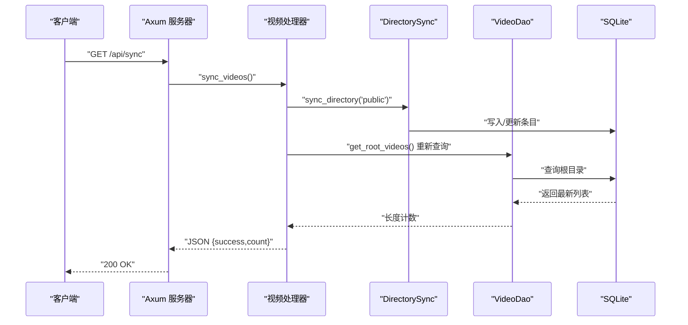
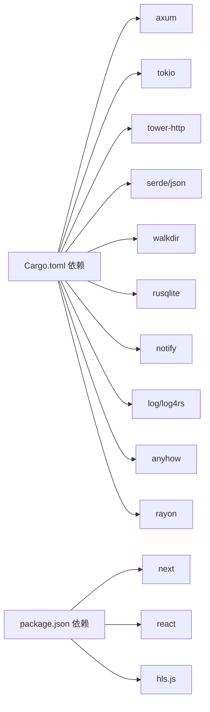

# 快速开始

<cite>
**本文引用的文件**
- [app/server/Cargo.toml](file://app/server/Cargo.toml)
- [app/server/src/main.rs](file://app/server/src/main.rs)
- [app/server/src/routes/mod.rs](file://app/server/src/routes/mod.rs)
- [app/server/src/routes/video_handlers.rs](file://app/server/src/routes/video_handlers.rs)
- [app/server/src/routes/watcher_handlers.rs](file://app/server/src/routes/watcher_handlers.rs)
- [app/server/src/services/mod.rs](file://app/server/src/services/mod.rs)
- [app/server/src/services/db/connection.rs](file://app/server/src/services/db/connection.rs)
- [app/server/src/services/db/video_dao.rs](file://app/server/src/services/db/video_dao.rs)
- [app/server/src/utils/mod.rs](file://app/server/src/utils/mod.rs)
- [app/server/src/models.rs](file://app/server/src/models.rs)
- [app/server/static/index.html](file://app/server/static/index.html)
- [app/web/package.json](file://app/web/package.json)
- [README.md（项目总说明）](file://README.md)
- [README.md（服务器说明）](file://app/server/README.md)
</cite>

## 目录
1. [简介](#简介)
2. [项目结构](#项目结构)
3. [核心组件](#核心组件)
4. [架构总览](#架构总览)
5. [详细组件分析](#详细组件分析)
6. [依赖关系分析](#依赖关系分析)
7. [性能注意事项](#性能注意事项)
8. [故障排除指南](#故障排除指南)
9. [结论](#结论)
10. [附录](#附录)

## 简介
本指南面向首次使用者，帮助你在最短时间内启动视频文件服务器，体验核心能力：列出视频、查看详情、播放静态视频文件，并验证安装成功。你将获得最短路径的命令行步骤、预期输出说明，以及添加第一个视频文件进行测试的操作指引。

## 项目结构
- 后端（Rust + Axum）位于 app/server，提供 REST API 与静态文件服务。
- 前端（Next.js）位于 app/web，提供媒体库与播放器界面（可选）。
- 服务器默认监听地址与端口在后端代码中定义；静态页面示例位于 app/server/static。

图表来源
- [app/server/src/main.rs](file://app/server/src/main.rs#L1-L111)
- [app/server/src/routes/mod.rs](file://app/server/src/routes/mod.rs#L1-L6)
- [app/server/src/services/mod.rs](file://app/server/src/services/mod.rs#L1-L6)
- [app/server/src/models.rs](file://app/server/src/models.rs#L1-L32)
- [app/server/src/utils/mod.rs](file://app/server/src/utils/mod.rs#L1-L14)
- [app/server/static/index.html](file://app/server/static/index.html#L1-L26)
- [app/web/package.json](file://app/web/package.json#L1-L74)

章节来源
- [README.md（项目总说明）](file://README.md#L1-L120)
- [README.md（服务器说明）](file://app/server/README.md#L1-L120)

## 核心组件
- 服务器入口与路由
  - 启动入口：在主程序中初始化日志、数据库、文件监听器，创建统一状态并注册路由。
  - 路由要点：提供视频列表、视频详情、手动同步、文件监听器启停与状态查询；同时提供静态文件服务（public 与 thumbnails）。
- 数据层
  - 数据库：使用 SQLite，表结构包含视频元数据字段；提供索引优化查询。
  - DAO：封装根目录查询、子项查询、按路径查询等。
- 工具与服务
  - 缩略图初始化：根据数据源目录初始化缩略图目录。
  - 日志：统一初始化日志。
- 前端（可选）
  - Next.js 项目提供媒体库与播放器界面，便于浏览与播放。

章节来源
- [app/server/src/main.rs](file://app/server/src/main.rs#L1-L111)
- [app/server/src/routes/video_handlers.rs](file://app/server/src/routes/video_handlers.rs#L1-L104)
- [app/server/src/routes/watcher_handlers.rs](file://app/server/src/routes/watcher_handlers.rs#L1-L84)
- [app/server/src/services/db/connection.rs](file://app/server/src/services/db/connection.rs#L1-L122)
- [app/server/src/services/db/video_dao.rs](file://app/server/src/services/db/video_dao.rs#L1-L146)
- [app/server/src/utils/mod.rs](file://app/server/src/utils/mod.rs#L1-L14)
- [app/server/static/index.html](file://app/server/static/index.html#L1-L26)
- [app/web/package.json](file://app/web/package.json#L1-L74)

## 架构总览
后端采用 Axum + Tokio 的异步架构，通过 CORS 中间件开放跨域访问，提供 REST API 与静态文件服务。应用状态包含数据库管理器与文件监听器，供各路由处理器共享使用。

图表来源
- [app/server/src/main.rs](file://app/server/src/main.rs#L1-L111)
- [app/server/src/routes/video_handlers.rs](file://app/server/src/routes/video_handlers.rs#L1-L104)
- [app/server/src/routes/watcher_handlers.rs](file://app/server/src/routes/watcher_handlers.rs#L1-L84)
- [app/server/src/services/db/video_dao.rs](file://app/server/src/services/db/video_dao.rs#L1-L146)
- [app/server/src/services/db/connection.rs](file://app/server/src/services/db/connection.rs#L1-L122)

## 详细组件分析

### 启动与验证（最短路径）
- 步骤
  1) 进入后端目录并构建/运行
     - 在 app/server 目录执行构建或运行命令。
  2) 访问 API 列表
     - 使用 curl 或浏览器访问视频列表接口。
  3) 验证静态文件服务
     - 访问静态页面示例，确认静态资源可访问。
- 预期输出
  - 控制台打印监听地址与可用 API 列表。
  - API 返回视频列表 JSON（包含 name、path、type、size、created_at 等字段）。
  - 浏览器加载静态页面，样式与脚本正常。

章节来源
- [README.md（服务器说明）](file://app/server/README.md#L138-L160)
- [app/server/src/main.rs](file://app/server/src/main.rs#L92-L111)
- [app/server/static/index.html](file://app/server/static/index.html#L1-L26)

### API 调用（最短路径）
- 获取视频列表
  - 方法与路径：GET /api/videos
  - 输出：包含 videos 数组，每项包含 name、path、type、size、created_at 等字段。
- 获取视频详情
  - 方法与路径：GET /api/videos/{path}
  - 输出：指定路径的视频信息，若为目录则包含 children（最多递归两层）。
- 手动同步数据库
  - 方法与路径：GET /api/sync
  - 输出：返回同步成功与当前计数。
- 文件监听器控制
  - 启动：GET /api/watcher/start
  - 停止：GET /api/watcher/stop
  - 状态：GET /api/watcher/status
- 静态文件访问
  - MP4/TS/M3U8/VTT/SRT 等文件通过 /public/{filename} 访问。
  - 缩略图通过 /thumbnails/{...} 访问。

章节来源
- [README.md（服务器说明）](file://app/server/README.md#L32-L118)
- [app/server/src/routes/video_handlers.rs](file://app/server/src/routes/video_handlers.rs#L1-L104)
- [app/server/src/routes/watcher_handlers.rs](file://app/server/src/routes/watcher_handlers.rs#L1-L84)

### 静态文件访问（最短路径）
- 访问示例
  - 静态页面：/static/index.html
  - 视频文件：/public/{filename}
  - 缩略图：/thumbnails/{...}
- 验证方法
  - 浏览器打开静态页面，确认样式与脚本加载。
  - 直接下载或播放 /public 下的视频文件，确认可访问。

章节来源
- [README.md（服务器说明）](file://app/server/README.md#L95-L118)
- [app/server/src/main.rs](file://app/server/src/main.rs#L80-L90)
- [app/server/static/index.html](file://app/server/static/index.html#L1-L26)

### 添加第一个视频文件进行测试
- 步骤
  1) 在服务器项目中创建 public 目录（若不存在）。
  2) 将一个 MP4 视频文件放入 public 目录。
  3) 重启或手动同步数据库，使新文件被收录。
  4) 访问 /api/videos，确认新视频出现在列表中。
  5) 通过 /public/{filename} 直接播放或下载该视频。
- 注意
  - 若启用文件监听器，新增文件会被自动收录；否则需手动同步。

章节来源
- [README.md（项目总说明）](file://README.md#L256-L304)
- [README.md（服务器说明）](file://app/server/README.md#L138-L160)
- [app/server/src/routes/video_handlers.rs](file://app/server/src/routes/video_handlers.rs#L72-L104)

### 关键流程时序图（API 调用）

#### 获取视频列表

图表来源
- [app/server/src/routes/video_handlers.rs](file://app/server/src/routes/video_handlers.rs#L1-L28)
- [app/server/src/services/db/video_dao.rs](file://app/server/src/services/db/video_dao.rs#L51-L79)

#### 获取视频详情

图表来源
- [app/server/src/routes/video_handlers.rs](file://app/server/src/routes/video_handlers.rs#L30-L70)
- [app/server/src/services/db/video_dao.rs](file://app/server/src/services/db/video_dao.rs#L121-L146)

#### 手动同步数据库

图表来源
- [app/server/src/routes/video_handlers.rs](file://app/server/src/routes/video_handlers.rs#L72-L104)
- [app/server/src/services/db/video_dao.rs](file://app/server/src/services/db/video_dao.rs#L51-L79)

## 依赖关系分析
- 后端依赖
  - 框架与运行时：axum、tokio
  - 中间件与工具：tower-http（含 fs、cors）、serde、serde_json、walkdir、rusqlite、notify、log/log4rs、anyhow、rayon
- 前端依赖
  - Next.js、React、Tailwind、Radix UI、Hls.js 等，用于播放 HLS 与构建界面。

图表来源
- [app/server/Cargo.toml](file://app/server/Cargo.toml#L1-L23)
- [app/web/package.json](file://app/web/package.json#L1-L74)

章节来源
- [app/server/Cargo.toml](file://app/server/Cargo.toml#L1-L23)
- [app/web/package.json](file://app/web/package.json#L1-L74)

## 性能注意事项
- 使用发布模式运行以获得更佳性能：cargo run --release
- 静态文件服务由 ServeDir 提供，适合小规模到中等规模的静态资源分发。
- 数据库查询使用索引优化，建议避免一次性查询超大规模目录。
- 若视频数量较多，可考虑分页或缓存策略（扩展建议）。

章节来源
- [README.md（项目总说明）](file://README.md#L483-L514)
- [app/server/src/services/db/connection.rs](file://app/server/src/services/db/connection.rs#L36-L42)

## 故障排除指南
- 服务器启动失败
  - 检查端口是否被占用；确认 public 目录存在且具备读取权限。
- 无法访问 API 或静态文件
  - 确认服务已在 0.0.0.0:3000（或代码中定义的地址）监听。
  - 浏览器访问 /static/index.html 验证静态服务。
- 视频未出现在列表中
  - 手动触发同步：GET /api/sync；或启动文件监听器：GET /api/watcher/start。
- HLS 播放异常
  - 确认 m3u8 与 ts 文件在同一目录；使用支持 HLS 的播放器或 hls.js。
- CORS 相关问题
  - 服务器已内置 CORS 中间件，允许所有来源与常用方法；如需限制，可在代码中调整。

章节来源
- [README.md（项目总说明）](file://README.md#L483-L514)
- [README.md（服务器说明）](file://app/server/README.md#L138-L160)
- [app/server/src/main.rs](file://app/server/src/main.rs#L62-L71)

## 结论
通过上述最短路径，你可以在几分钟内完成服务启动、API 验证与静态文件访问，并成功添加第一个视频进行测试。建议后续逐步探索文件监听器、缩略图生成、HLS 下载等高级功能，以满足更复杂的媒体管理需求。

## 附录

### 最短路径清单
- 启动服务
  - 在 app/server 目录执行构建或运行命令。
- 访问 API
  - GET /api/videos 获取视频列表。
  - GET /api/videos/{path} 获取视频详情。
  - GET /api/sync 手动同步数据库。
  - GET /api/watcher/start/stop/status 控制监听器。
- 访问静态文件
  - /public/{filename} 直接播放或下载。
  - /static/index.html 验证静态服务。
- 添加第一个视频
  - 将 MP4 文件放入 public 目录，刷新或同步后即可在列表中看到。

章节来源
- [README.md（服务器说明）](file://app/server/README.md#L138-L160)
- [app/server/src/main.rs](file://app/server/src/main.rs#L80-L111)