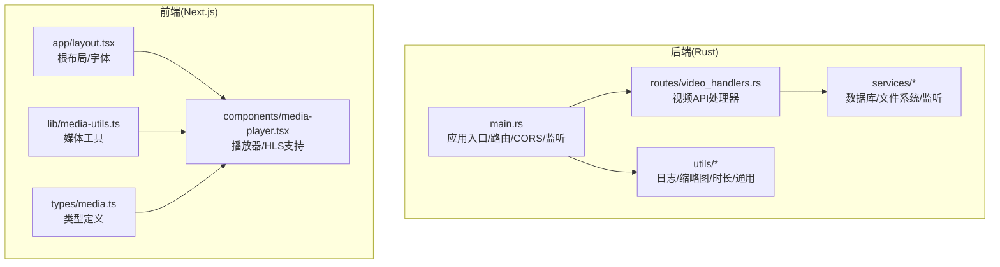
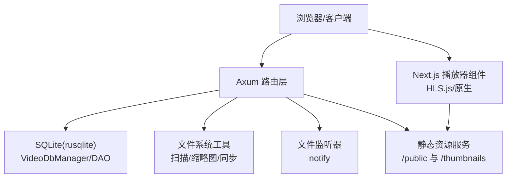
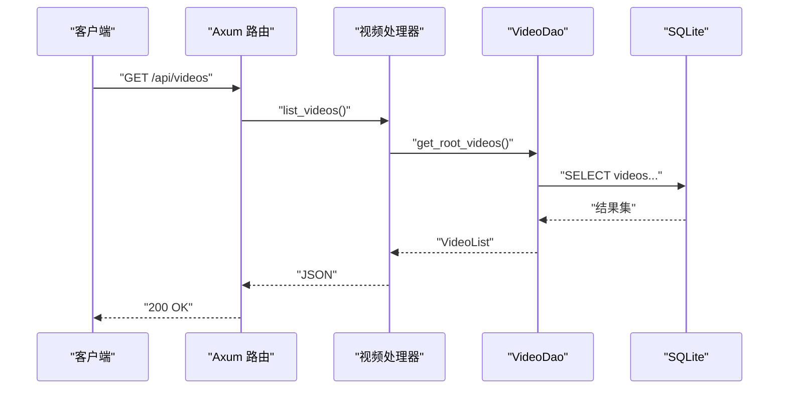
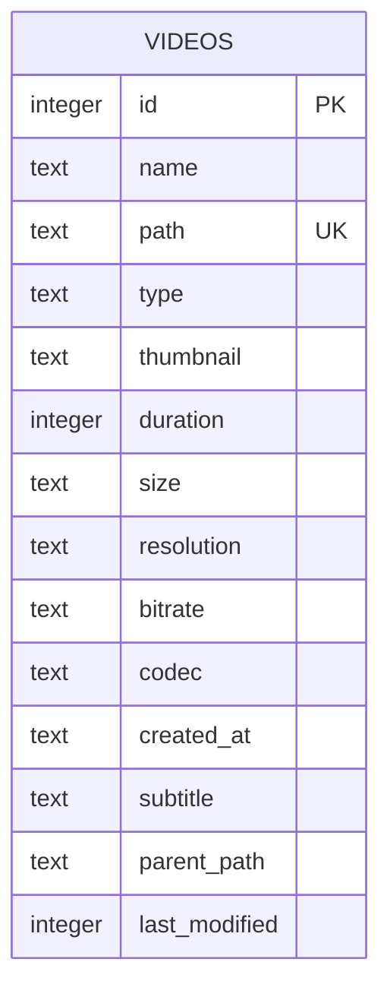
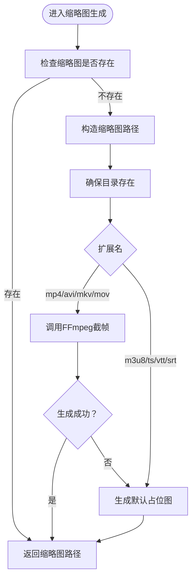
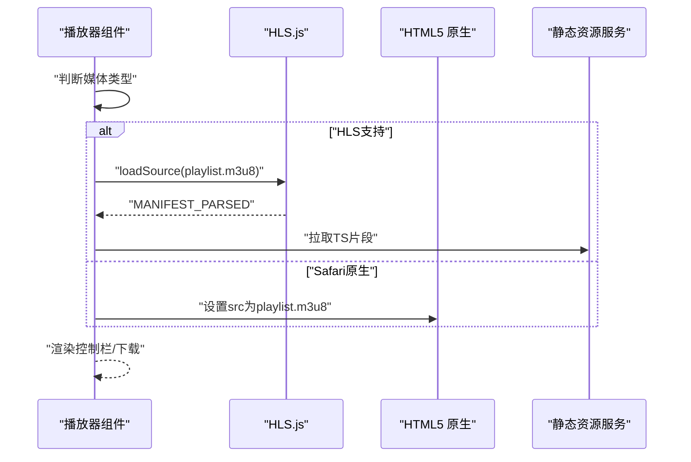
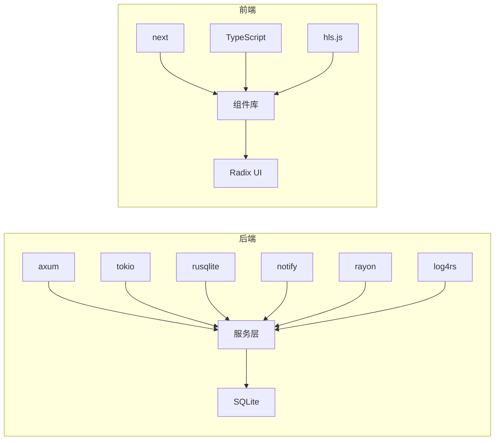

# 技术栈

<cite>
**本文引用的文件**
- [app/server/Cargo.toml](file://app/server/Cargo.toml)
- [app/server/src/main.rs](file://app/server/src/main.rs)
- [app/server/src/models.rs](file://app/server/src/models.rs)
- [app/server/src/routes/video_handlers.rs](file://app/server/src/routes/video_handlers.rs)
- [app/server/src/services/db/connection.rs](file://app/server/src/services/db/connection.rs)
- [app/server/src/services/mod.rs](file://app/server/src/services/mod.rs)
- [app/server/src/utils/logger.rs](file://app/server/src/utils/logger.rs)
- [app/server/src/services/filesystem.rs](file://app/server/src/services/filesystem.rs)
- [app/server/src/utils/thumbnail.rs](file://app/server/src/utils/thumbnail.rs)
- [app/web/package.json](file://app/web/package.json)
- [app/web/next.config.ts](file://app/web/next.config.ts)
- [app/web/app/layout.tsx](file://app/web/app/layout.tsx)
- [app/web/lib/media-utils.ts](file://app/web/lib/media-utils.ts)
- [app/web/types/media.ts](file://app/web/types/media.ts)
- [app/web/components/media-player.tsx](file://app/web/components/media-player.tsx)
</cite>

## 目录
1. [简介](#简介)
2. [项目结构](#项目结构)
3. [核心组件](#核心组件)
4. [架构总览](#架构总览)
5. [详细组件分析](#详细组件分析)
6. [依赖关系分析](#依赖关系分析)
7. [性能考量](#性能考量)
8. [故障排查指南](#故障排查指南)
9. [结论](#结论)
10. [附录](#附录)

## 简介
本项目采用前后端分离架构：后端使用 Rust + Axum + Tokio 提供高性能异步 HTTP 服务与文件系统扫描、数据库管理、缩略图生成与文件监听能力；前端使用 Next.js 16 + React 19 + TypeScript 构建现代化媒体库与播放器界面，并通过 HLS.js 支持 HLS 流媒体播放。数据库采用 SQLite（rusqlite），通过迁移机制兼容历史版本；日志系统采用 log4rs；多媒体处理通过 FFmpeg 命令行工具生成缩略图与默认占位图。

## 项目结构
- 后端（Rust/Axum/Tokio）
  - 顶层入口负责应用状态、路由注册、CORS、静态文件服务与监听绑定
  - 路由模块提供视频列表、详情、手动同步与文件监听控制接口
  - 服务模块包含数据库连接、DAO、目录同步、文件监听与文件系统工具
  - 工具模块包含日志、时长格式化、缩略图生成等
- 前端（Next.js/React/TypeScript）
  - 应用布局与字体配置
  - 页面与组件：媒体库、播放器、移动端播放器、列表项
  - 工具函数：媒体类型判断、时长/文件大小格式化、路径归一化
  - 类型定义：媒体项与响应结构

**图表来源**
- [app/server/src/main.rs](file://app/server/src/main.rs#L1-L111)
- [app/server/src/routes/video_handlers.rs](file://app/server/src/routes/video_handlers.rs#L1-L104)
- [app/server/src/services/mod.rs](file://app/server/src/services/mod.rs#L1-L6)
- [app/web/app/layout.tsx](file://app/web/app/layout.tsx#L1-L35)
- [app/web/components/media-player.tsx](file://app/web/components/media-player.tsx#L1-L322)
- [app/web/lib/media-utils.ts](file://app/web/lib/media-utils.ts#L1-L43)
- [app/web/types/media.ts](file://app/web/types/media.ts#L1-L20)

**章节来源**
- [app/server/src/main.rs](file://app/server/src/main.rs#L1-L111)
- [app/web/app/layout.tsx](file://app/web/app/layout.tsx#L1-L35)

## 核心组件
- 后端框架与运行时
  - Rust 语言与 2024 版本，保证新语法与生态支持
  - Tokio 1.x（full 特性）提供异步运行时
  - Axum 0.7 实现高性能 HTTP 路由与请求处理
  - Tower/Tower-http 提供中间件能力（CORS、FS、追踪）
- 数据存储与访问
  - rusqlite 0.31（bundled）用于 SQLite 操作
  - 自定义迁移逻辑兼容旧版本字段
  - DAO 层封装查询与树形结构
- 文件系统与多媒体
  - walkdir 2.5 递归遍历目录
  - notify 6.1 文件变更监听
  - rayon 1.11 并行处理缩略图生成
  - FFmpeg 命令行生成缩略图与默认占位图
- 日志与工具
  - log/log4rs 0.4.29/1.4.0 彩色控制台与滚动文件日志
  - chrono 0.4.42 时间格式化
  - regex 1.12.2 正则匹配
- 前端框架与生态
  - Next.js 16.0.10、React 19.2.0、TypeScript ^5
  - Radix UI 组件体系、TailwindCSS、Sonner、Zod、HLS.js 1.6.15
  - 自定义媒体工具与类型定义

**章节来源**
- [app/server/Cargo.toml](file://app/server/Cargo.toml#L1-L23)
- [app/server/src/services/db/connection.rs](file://app/server/src/services/db/connection.rs#L1-L122)
- [app/server/src/utils/logger.rs](file://app/server/src/utils/logger.rs#L1-L100)
- [app/server/src/services/filesystem.rs](file://app/server/src/services/filesystem.rs#L1-L121)
- [app/web/package.json](file://app/web/package.json#L1-L74)
- [app/web/components/media-player.tsx](file://app/web/components/media-player.tsx#L1-L322)

## 架构总览
后端通过 Axum 暴露 REST 风格 API，结合 Tower-http 的 ServeDir 提供静态资源服务；数据库负责视频元数据持久化；文件系统工具负责扫描、生成缩略图与目录同步；文件监听器在后台自动感知文件变化；前端 Next.js 提供页面与播放器组件，按类型动态选择 HTML5 原生或 HLS.js 播放。

**图表来源**
- [app/server/src/main.rs](file://app/server/src/main.rs#L62-L90)
- [app/server/src/services/db/connection.rs](file://app/server/src/services/db/connection.rs#L1-L48)
- [app/server/src/services/filesystem.rs](file://app/server/src/services/filesystem.rs#L1-L47)
- [app/server/src/utils/thumbnail.rs](file://app/server/src/utils/thumbnail.rs#L1-L99)
- [app/web/components/media-player.tsx](file://app/web/components/media-player.tsx#L45-L81)

## 详细组件分析

### 后端应用入口与路由
- 应用状态 AppState 包含数据库管理器与文件监听器的共享句柄
- 默认监听 0.0.0.0:3003，启用 CORS 允许所有来源
- 注册 API：
  - GET /api/videos：列出根视频
  - GET /api/videos/*path：获取指定路径详情（含子项）
  - GET /api/sync：手动同步数据库
  - GET /api/watcher/start/stop/status：文件监听器控制
- 静态服务：
  - /public 对应数据源目录
  - /thumbnails 对应缩略图目录

**图表来源**
- [app/server/src/main.rs](file://app/server/src/main.rs#L72-L90)
- [app/server/src/routes/video_handlers.rs](file://app/server/src/routes/video_handlers.rs#L1-L28)
- [app/server/src/services/db/connection.rs](file://app/server/src/services/db/connection.rs#L1-L48)

**章节来源**
- [app/server/src/main.rs](file://app/server/src/main.rs#L21-L111)
- [app/server/src/routes/video_handlers.rs](file://app/server/src/routes/video_handlers.rs#L1-L104)

### 数据库设计与迁移
- 表结构（videos）包含：
  - 主键与唯一路径索引
  - 基础元数据：名称、类型、大小、时长、分辨率、比特率、编码、字幕、创建时间
  - 目录树相关：父路径、最后修改时间
- 迁移策略：
  - 检测旧列 is_deleted 是否存在
  - 若存在则重建表并迁移数据，随后重建索引
  - 无旧列则直接提示已是最新版本

**图表来源**
- [app/server/src/services/db/connection.rs](file://app/server/src/services/db/connection.rs#L12-L48)

**章节来源**
- [app/server/src/services/db/connection.rs](file://app/server/src/services/db/connection.rs#L1-L122)

### 文件系统与缩略图生成
- 初始化缩略图目录与批量生成：
  - 并行扫描缺少缩略图的文件
  - 依据扩展名选择不同策略：视频调用 FFmpeg 截帧；HLS 目录读取 playlist.m3u8 第一个 ts 生成；其他类型生成默认 SVG 占位图
- 默认缩略图回退：
  - FFmpeg 失败时生成带文字的 SVG，再转为 JPG

**图表来源**
- [app/server/src/utils/thumbnail.rs](file://app/server/src/utils/thumbnail.rs#L1-L99)
- [app/server/src/services/filesystem.rs](file://app/server/src/services/filesystem.rs#L49-L121)

**章节来源**
- [app/server/src/utils/thumbnail.rs](file://app/server/src/utils/thumbnail.rs#L1-L99)
- [app/server/src/services/filesystem.rs](file://app/server/src/services/filesystem.rs#L1-L121)

### 日志系统与运行时
- 日志配置：
  - 控制台彩色输出（log4rs encoder + nu-ansi-term）
  - 滚动文件日志（大小触发 + 固定窗口轮转）
  - 时间戳与级别格式化
- 运行时：
  - Tokio 主线程启动，绑定 0.0.0.0:3003
  - 环境变量 DATA_SOURCE_DIR 指定数据源目录，默认 public

**章节来源**
- [app/server/src/utils/logger.rs](file://app/server/src/utils/logger.rs#L1-L100)
- [app/server/src/main.rs](file://app/server/src/main.rs#L27-L40)

### 前端播放器与媒体工具
- 播放器组件：
  - 自动识别类型：video/audio/hls_directory/hls/m3u8
  - HLS：优先使用 HLS.js，若不支持则回退 Safari 原生
  - 控制栏：播放/暂停、音量、进度、全屏、下载
- 媒体工具：
  - getMediaType：根据类型字符串判断 video/audio/hls
  - formatDuration/formatFileSize：人性化展示
  - normalizeMediaPath：将后端路径转换为前端 URL
- 类型定义：
  - MediaItem/MediaResponse 与 MediaType

**图表来源**
- [app/web/components/media-player.tsx](file://app/web/components/media-player.tsx#L45-L81)
- [app/web/lib/media-utils.ts](file://app/web/lib/media-utils.ts#L1-L43)

**章节来源**
- [app/web/components/media-player.tsx](file://app/web/components/media-player.tsx#L1-L322)
- [app/web/lib/media-utils.ts](file://app/web/lib/media-utils.ts#L1-L43)
- [app/web/types/media.ts](file://app/web/types/media.ts#L1-L20)

## 依赖关系分析
- 后端依赖
  - axum/tokio/tower-http/rusqlite/notify/rayon/log4rs 等构成核心运行与数据层
  - 通过 services/mod.rs 暴露 DAO/同步/监听等能力
- 前端依赖
  - Next.js 生态 + Radix UI + TailwindCSS + Zod + HLS.js
  - 通过 next.config.ts 配置图片远程模式与可选的跨域头

**图表来源**
- [app/server/Cargo.toml](file://app/server/Cargo.toml#L6-L23)
- [app/server/src/services/mod.rs](file://app/server/src/services/mod.rs#L1-L6)
- [app/web/package.json](file://app/web/package.json#L12-L62)

**章节来源**
- [app/server/Cargo.toml](file://app/server/Cargo.toml#L1-L23)
- [app/web/package.json](file://app/web/package.json#L1-L74)

## 性能考量
- 异步与并发
  - Tokio 全特性运行时提升并发吞吐
  - rayon 并行处理缩略图生成，显著缩短首次扫描耗时
- I/O 优化
  - SQLite 索引（path、parent_path）加速查询
  - ServeDir 直接提供静态文件，减少应用层开销
- 媒体处理
  - FFmpeg 截帧与默认占位图生成，避免运行时计算成本
- 前端体验
  - HLS.js 按需加载，Safari 原生回退，降低首屏等待

[本节为通用性能建议，不直接分析具体文件]

## 故障排查指南
- 启动与监听
  - 端口占用：确认 3003 未被占用；或调整监听地址
  - 环境变量：DATA_SOURCE_DIR 未设置时默认 public
- 数据库
  - 迁移失败：检查旧表是否残留 is_deleted；清理后重启
  - 查询异常：查看日志中数据库错误信息
- 缩略图
  - FFmpeg 未安装或不可执行：安装 FFmpeg 并加入 PATH；或检查默认占位图生成逻辑
  - 权限不足：确保 thumbnails/public 目录可写
- 播放器
  - HLS 不支持：确认浏览器支持情况或切换到原生支持
  - 跨域问题：后端已启用 CORS，前端 next.config.ts 可按需补充 headers
- 日志
  - 查看 logs/ 目录滚动日志文件，定位错误堆栈

**章节来源**
- [app/server/src/main.rs](file://app/server/src/main.rs#L27-L40)
- [app/server/src/utils/logger.rs](file://app/server/src/utils/logger.rs#L65-L99)
- [app/server/src/services/filesystem.rs](file://app/server/src/services/filesystem.rs#L49-L78)
- [app/web/next.config.ts](file://app/web/next.config.ts#L1-L39)

## 结论
该技术栈在性能、可维护性与开发体验之间取得平衡：后端以 Rust + Axum + Tokio 构建高并发服务，SQLite 简化部署，FFmpeg 提供可靠的多媒体处理；前端以 Next.js 为基础，配合 HLS.js 实现流畅的媒体播放体验。通过日志与迁移机制保障运行稳定性与演进能力。

[本节为总结性内容，不直接分析具体文件]

## 附录

### 版本与配置要点
- 后端
  - Rust: 2024 edition
  - Tokio: full 特性
  - Axum: 0.7
  - Tower-http: fs、trace、cors
  - rusqlite: bundled
  - notify: 文件监听
  - rayon: 并行处理
  - log4rs: 彩色控制台 + 滚动文件
- 前端
  - Next.js: 16.0.10
  - React/ReactDOM: 19.2.0
  - TypeScript: ^5
  - HLS.js: 1.6.15
  - TailwindCSS: ^4.1.9
  - Radix UI: 组件库
- 运行时
  - DATA_SOURCE_DIR：数据源目录，默认 public
  - 监听地址：0.0.0.0:3003
  - CORS：允许所有来源与方法

**章节来源**
- [app/server/Cargo.toml](file://app/server/Cargo.toml#L1-L23)
- [app/server/src/main.rs](file://app/server/src/main.rs#L27-L40)
- [app/web/package.json](file://app/web/package.json#L1-L74)
- [app/web/next.config.ts](file://app/web/next.config.ts#L1-L39)