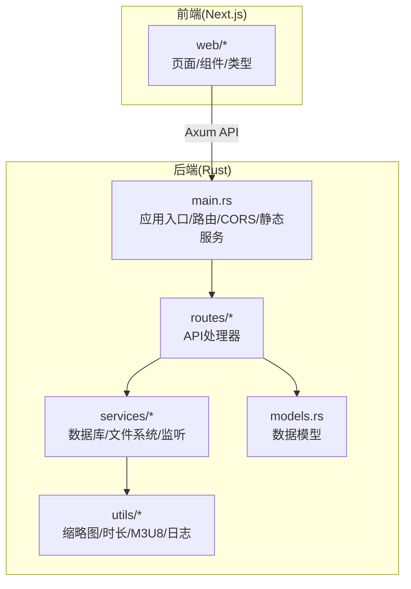
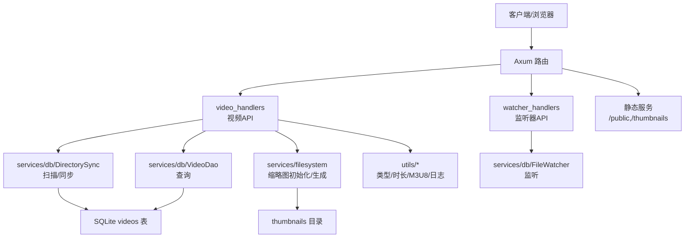
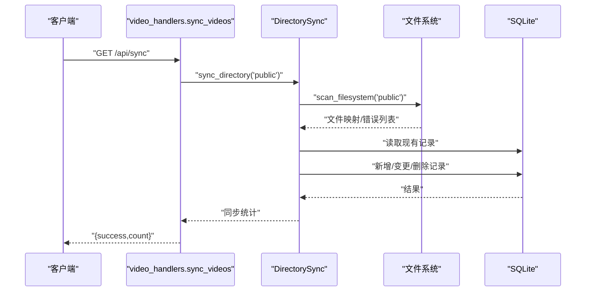
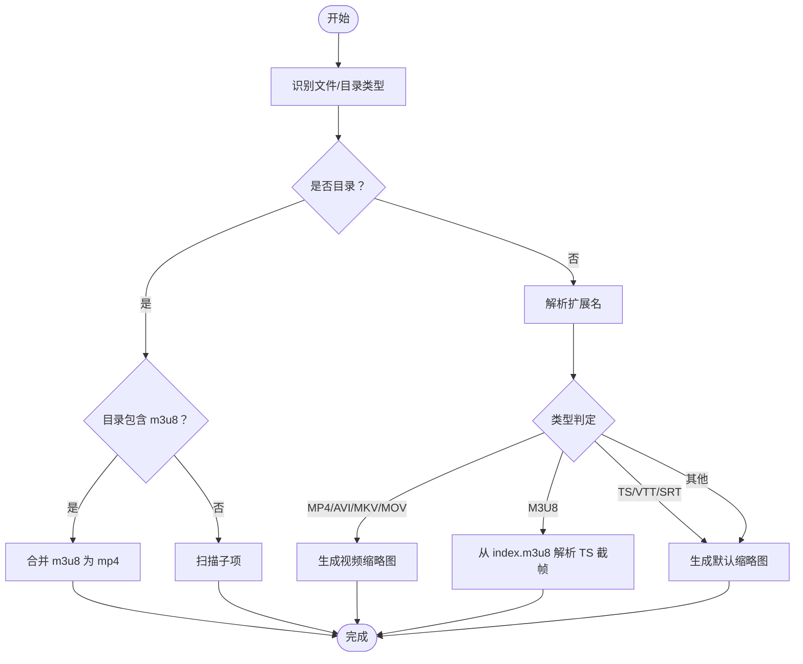
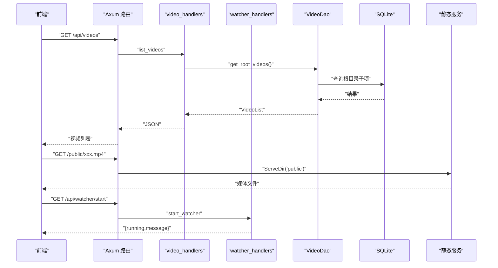
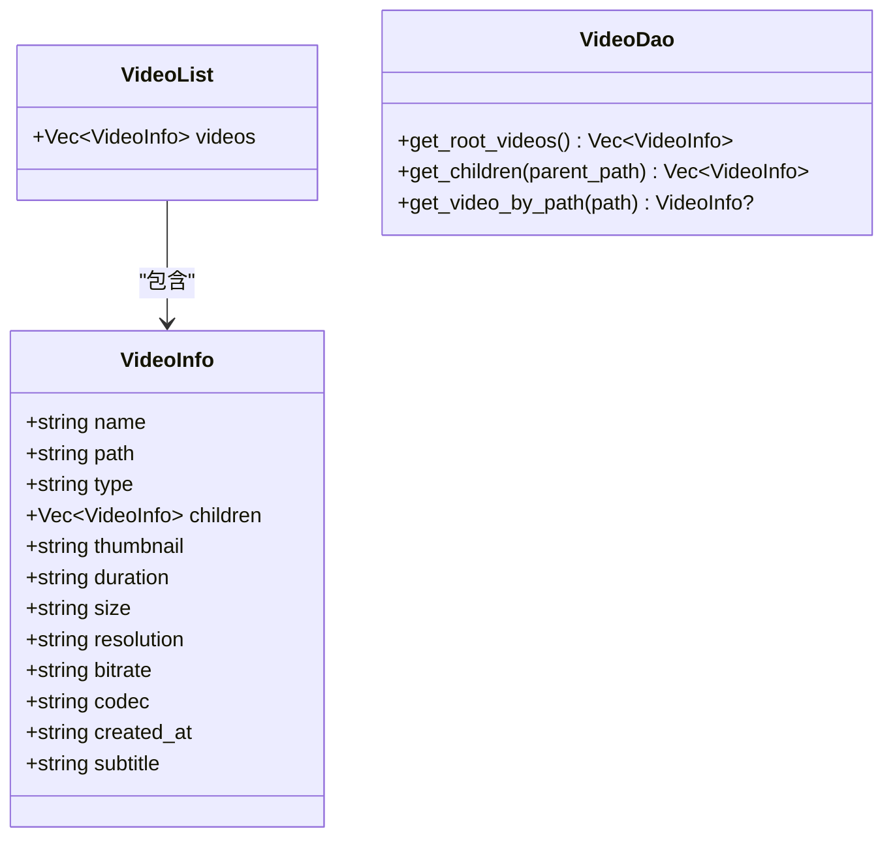
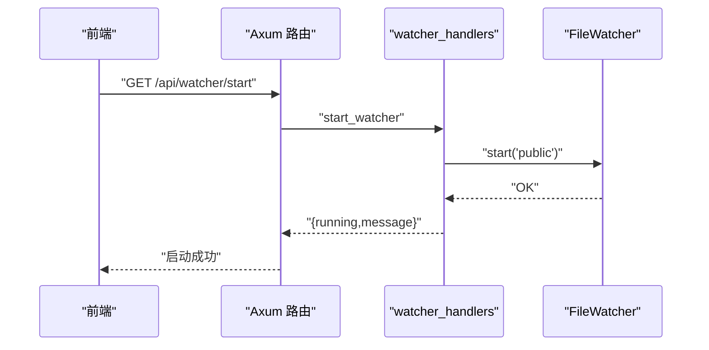
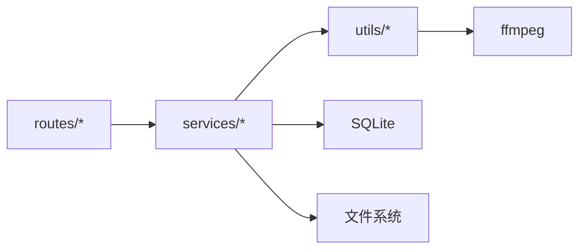

# 核心功能

<cite>
**本文引用的文件**
- [app/server/src/main.rs](file://app/server/src/main.rs)
- [app/server/src/models.rs](file://app/server/src/models.rs)
- [app/server/src/routes/mod.rs](file://app/server/src/routes/mod.rs)
- [app/server/src/routes/video_handlers.rs](file://app/server/src/routes/video_handlers.rs)
- [app/server/src/routes/watcher_handlers.rs](file://app/server/src/routes/watcher_handlers.rs)
- [app/server/src/services/mod.rs](file://app/server/src/services/mod.rs)
- [app/server/src/services/db/mod.rs](file://app/server/src/services/db/mod.rs)
- [app/server/src/services/db/connection.rs](file://app/server/src/services/db/connection.rs)
- [app/server/src/services/db/video_dao.rs](file://app/server/src/services/db/video_dao.rs)
- [app/server/src/services/db/sync.rs](file://app/server/src/services/db/sync.rs)
- [app/server/src/services/db/tree.rs](file://app/server/src/services/db/tree.rs)
- [app/server/src/services/db/schema.rs](file://app/server/src/services/db/schema.rs)
- [app/server/src/services/db/watcher.rs](file://app/server/src/services/db/watcher.rs)
- [app/server/src/services/filesystem.rs](file://app/server/src/services/filesystem.rs)
- [app/server/src/utils/mod.rs](file://app/server/src/utils/mod.rs)
- [app/server/src/utils/common.rs](file://app/server/src/utils/common.rs)
- [app/server/src/utils/duration.rs](file://app/server/src/utils/duration.rs)
- [app/server/src/utils/logger.rs](file://app/server/src/utils/logger.rs)
- [app/server/src/utils/m3u8.rs](file://app/server/src/utils/m3u8.rs)
- [app/server/src/utils/thumbnail.rs](file://app/server/src/utils/thumbnail.rs)
</cite>

## 目录
1. [简介](#简介)
2. [项目结构](#项目结构)
3. [核心组件](#核心组件)
4. [架构总览](#架构总览)
5. [详细组件分析](#详细组件分析)
6. [依赖关系分析](#依赖关系分析)
7. [性能考量](#性能考量)
8. [故障排查指南](#故障排查指南)
9. [结论](#结论)
10. [附录](#附录)

## 简介
本项目是一个基于 Rust 的视频文件服务器，提供自动视频发现、多格式支持、智能目录识别、RESTful API 接口与静态文件服务。其核心目标是：
- 自动扫描数据源目录，建立本地数据库索引，支持增量/全量双向同步；
- 智能识别视频与容器格式（如 MP4、M3U8/HLS、TS、字幕与图片），并生成缩略图；
- 通过 RESTful API 提供视频列表、详情查询、手动同步与文件监听器启停控制；
- 通过静态服务对外提供媒体资源与缩略图访问。

## 项目结构
后端采用 Rust + Axum，数据库使用 SQLite；前端为 Next.js 应用，二者通过 API 交互。核心目录组织如下：
- app/server：Rust 后端服务
  - src/main.rs：应用入口、路由注册、CORS、静态文件服务、应用状态
  - src/routes：HTTP 路由处理器
  - src/services：业务服务层（数据库、文件系统、文件监听）
  - src/utils：通用工具（缩略图、时长、M3U8 处理、日志等）
  - src/models.rs：API 返回模型
- app/web：前端 Next.js 应用（页面、组件、类型定义）

图表来源
- [app/server/src/main.rs](file://app/server/src/main.rs#L72-L90)
- [app/server/src/routes/mod.rs](file://app/server/src/routes/mod.rs#L1-L6)
- [app/server/src/services/mod.rs](file://app/server/src/services/mod.rs#L1-L6)
- [app/server/src/utils/mod.rs](file://app/server/src/utils/mod.rs#L1-L14)
- [app/server/src/models.rs](file://app/server/src/models.rs#L1-L32)

章节来源
- [app/server/src/main.rs](file://app/server/src/main.rs#L21-L110)
- [app/server/src/routes/mod.rs](file://app/server/src/routes/mod.rs#L1-L6)
- [app/server/src/services/mod.rs](file://app/server/src/services/mod.rs#L1-L6)
- [app/server/src/utils/mod.rs](file://app/server/src/utils/mod.rs#L1-L14)
- [app/server/src/models.rs](file://app/server/src/models.rs#L1-L32)

## 核心组件
- 应用状态与生命周期
  - 统一状态 AppState 持有数据库管理器与文件监听器的共享句柄，便于路由处理器安全访问。
  - 启动流程：初始化日志、根据环境变量确定数据源目录、初始化缩略图目录、建立数据库、从数据源目录初始化/同步、创建文件监听器、注册路由与静态服务、启动 HTTP 服务。
- RESTful API
  - GET /api/videos：列出根目录（public）下的视频与目录
  - GET /api/videos/*path：按路径查询详情，若为目录或 M3U8 则返回子项
  - GET /api/sync：手动触发数据库与文件系统双向同步
  - GET /api/watcher/start | /api/watcher/stop | /api/watcher/status：文件监听器启停与状态查询
- 静态文件服务
  - /public/*：数据源目录下的媒体资源
  - /thumbnails/*：缩略图目录下的预览图
- 数据库与 DAO
  - SQLite 表 videos：存储视频/目录/字幕/图片等元数据，含索引优化
  - VideoDao：提供根目录查询、父子关系查询、按路径查询等
- 文件系统与缩略图
  - initialize_thumbnails_with_source：批量生成缩略图
  - generate_video_thumbnail/generate_default_thumbnail：基于 ffmpeg 生成缩略图
- 自动发现与同步
  - DirectorySync：扫描文件系统，构建文件映射，执行双向同步（新增/变更/删除）
  - is_video_or_container：智能识别视频/容器/字幕/图片等类型
  - has_m3u8_file/check_m3u8_file/merge_m3u8_to_mp4：HLS 目录识别与合并
- 工具与日志
  - format_size/get_created_at/get_systemtime_created：格式化与时间处理
  - get_m3u8_duration/get_video_duration：时长获取
  - 日志初始化与输出

章节来源
- [app/server/src/main.rs](file://app/server/src/main.rs#L21-L110)
- [app/server/src/routes/video_handlers.rs](file://app/server/src/routes/video_handlers.rs#L1-L104)
- [app/server/src/routes/watcher_handlers.rs](file://app/server/src/routes/watcher_handlers.rs#L1-L84)
- [app/server/src/services/db/connection.rs](file://app/server/src/services/db/connection.rs#L1-L122)
- [app/server/src/services/db/video_dao.rs](file://app/server/src/services/db/video_dao.rs#L1-L146)
- [app/server/src/services/db/sync.rs](file://app/server/src/services/db/sync.rs#L1-L413)
- [app/server/src/services/filesystem.rs](file://app/server/src/services/filesystem.rs#L1-L121)
- [app/server/src/utils/common.rs](file://app/server/src/utils/common.rs#L1-L146)
- [app/server/src/utils/m3u8.rs](file://app/server/src/utils/m3u8.rs#L1-L148)
- [app/server/src/utils/thumbnail.rs](file://app/server/src/utils/thumbnail.rs#L1-L99)
- [app/server/src/utils/duration.rs](file://app/server/src/utils/duration.rs)
- [app/server/src/utils/logger.rs](file://app/server/src/utils/logger.rs)

## 架构总览
后端以 Axum 为核心，通过路由处理器调用服务层，服务层封装数据库与文件系统操作，并借助工具模块完成类型识别、缩略图生成与 HLS 处理。前端通过标准 HTTP 请求访问后端 API。

图表来源
- [app/server/src/main.rs](file://app/server/src/main.rs#L72-L90)
- [app/server/src/routes/video_handlers.rs](file://app/server/src/routes/video_handlers.rs#L1-L104)
- [app/server/src/routes/watcher_handlers.rs](file://app/server/src/routes/watcher_handlers.rs#L1-L84)
- [app/server/src/services/db/sync.rs](file://app/server/src/services/db/sync.rs#L1-L413)
- [app/server/src/services/db/video_dao.rs](file://app/server/src/services/db/video_dao.rs#L1-L146)
- [app/server/src/services/filesystem.rs](file://app/server/src/services/filesystem.rs#L1-L121)
- [app/server/src/utils/m3u8.rs](file://app/server/src/utils/m3u8.rs#L1-L148)

## 详细组件分析

### 自动视频发现与双向同步（DirectorySync）
- 扫描策略
  - 使用 WalkDir 递归遍历数据源目录，结合 is_video_or_container 过滤非媒体文件，避免冗余处理。
  - 对于包含 m3u8 的目录，优先识别为 HLS 容器，调用 merge_m3u8_to_mp4 合并为 mp4 并删除原始目录，确保对外暴露统一的 MP4 资源路径。
- 双向同步
  - 从数据库读取现有记录，构建路径到记录的映射；
  - 对比文件系统映射，分别处理新增、变更（硬删除旧记录再插入新记录）、删除（硬删除）；
  - 记录扫描与处理过程中的耗时与错误，便于诊断。
- 关键流程（序列图）

图表来源
- [app/server/src/routes/video_handlers.rs](file://app/server/src/routes/video_handlers.rs#L72-L104)
- [app/server/src/services/db/sync.rs](file://app/server/src/services/db/sync.rs#L81-L172)

章节来源
- [app/server/src/services/db/sync.rs](file://app/server/src/services/db/sync.rs#L1-L413)
- [app/server/src/utils/common.rs](file://app/server/src/utils/common.rs#L67-L94)
- [app/server/src/utils/m3u8.rs](file://app/server/src/utils/m3u8.rs#L43-L128)

### 多格式支持与智能目录识别
- 类型识别
  - is_video_or_container：当为目录时检查是否包含 m3u8 或视频文件；当为文件时判断扩展名是否为 mp4/m3u8/ts/vtt/srt/jpg/png/gif。
  - process_file_or_directory：根据扩展名映射到具体类型（MP4、M3U8、TS、字幕、图片、未知），并对 ts 文件在同目录存在 m3u8 时跳过。
- HLS 流媒体处理
  - has_m3u8_file：快速判断目录内是否存在 m3u8；
  - check_m3u8_file：定位目录内的 m3u8 文件；
  - merge_m3u8_to_mp4：使用 ffmpeg 将 m3u8 合并为 mp4，删除原目录，返回新路径。
- 缩略图生成
  - get_ensure_thumbnail：确保缩略图存在，不存在则按类型生成（视频使用 ffmpeg 截帧，M3U8 从 index.m3u8 解析首个 TS 截帧，其他类型生成默认图标）。

图表来源
- [app/server/src/utils/common.rs](file://app/server/src/utils/common.rs#L67-L94)
- [app/server/src/utils/m3u8.rs](file://app/server/src/utils/m3u8.rs#L1-L148)
- [app/server/src/utils/thumbnail.rs](file://app/server/src/utils/thumbnail.rs#L1-L99)

章节来源
- [app/server/src/utils/common.rs](file://app/server/src/utils/common.rs#L1-L146)
- [app/server/src/utils/m3u8.rs](file://app/server/src/utils/m3u8.rs#L1-L148)
- [app/server/src/utils/thumbnail.rs](file://app/server/src/utils/thumbnail.rs#L1-L99)

### RESTful API 设计与静态文件服务
- API 列表
  - GET /api/videos：返回根目录视频与目录树
  - GET /api/videos/*path：返回指定路径详情，目录/目录型 M3U8 返回子项
  - GET /api/sync：手动同步并返回统计
  - GET /api/watcher/start | /api/watcher/stop | /api/watcher/status：监听器启停与状态
- 静态服务
  - /public/*：直接提供数据源目录下的媒体资源
  - /thumbnails/*：提供缩略图目录下的预览图
- CORS
  - 允许所有来源、方法与头部，便于前后端联调与跨域访问

图表来源
- [app/server/src/main.rs](file://app/server/src/main.rs#L72-L90)
- [app/server/src/routes/video_handlers.rs](file://app/server/src/routes/video_handlers.rs#L1-L104)
- [app/server/src/routes/watcher_handlers.rs](file://app/server/src/routes/watcher_handlers.rs#L1-L84)
- [app/server/src/services/db/video_dao.rs](file://app/server/src/services/db/video_dao.rs#L51-L119)

章节来源
- [app/server/src/main.rs](file://app/server/src/main.rs#L72-L110)
- [app/server/src/routes/video_handlers.rs](file://app/server/src/routes/video_handlers.rs#L1-L104)
- [app/server/src/routes/watcher_handlers.rs](file://app/server/src/routes/watcher_handlers.rs#L1-L84)
- [app/server/src/services/db/video_dao.rs](file://app/server/src/services/db/video_dao.rs#L1-L146)

### 数据模型与树形结构
- VideoInfo：统一的返回模型，包含名称、路径、类型、可选的子项、缩略图、时长、大小、分辨率、码率、编解码器、创建时间、字幕等。
- VideoList：包装视频数组。
- DAO 查询
  - get_root_videos：按父路径查询根目录子项；
  - get_children：目录/目录型 M3U8 返回子项，M3U8 文件型返回空；
  - get_video_by_path：按路径精确查询。

图表来源
- [app/server/src/models.rs](file://app/server/src/models.rs#L1-L32)
- [app/server/src/services/db/video_dao.rs](file://app/server/src/services/db/video_dao.rs#L51-L145)

章节来源
- [app/server/src/models.rs](file://app/server/src/models.rs#L1-L32)
- [app/server/src/services/db/video_dao.rs](file://app/server/src/services/db/video_dao.rs#L1-L146)

### 文件监听器与自动同步
- FileWatcher：封装监听器启停与状态查询，配合路由处理器对外暴露控制端点。
- 启动方式
  - 默认不自动运行，需调用 /api/watcher/start 启动；
  - 启动后监听数据源目录变化，触发同步流程，保持数据库与文件系统一致。

图表来源
- [app/server/src/routes/watcher_handlers.rs](file://app/server/src/routes/watcher_handlers.rs#L1-L84)
- [app/server/src/main.rs](file://app/server/src/main.rs#L52-L56)

章节来源
- [app/server/src/routes/watcher_handlers.rs](file://app/server/src/routes/watcher_handlers.rs#L1-L84)
- [app/server/src/main.rs](file://app/server/src/main.rs#L52-L56)

## 依赖关系分析
- 组件耦合
  - 路由处理器仅依赖服务层接口，降低对具体实现的耦合；
  - 服务层内部通过 DAO 访问数据库，通过工具模块完成类型识别与媒体处理；
  - 静态服务与业务逻辑解耦，通过独立 ServeDir 提供资源访问。
- 外部依赖
  - ffmpeg：用于缩略图截帧与 HLS 合并；
  - rusqlite：SQLite 访问；
  - walkdir：递归扫描；
  - rayon：并行生成缩略图；
  - tokio/axum：异步运行时与 Web 框架。

图表来源
- [app/server/src/routes/mod.rs](file://app/server/src/routes/mod.rs#L1-L6)
- [app/server/src/services/mod.rs](file://app/server/src/services/mod.rs#L1-L6)
- [app/server/src/utils/mod.rs](file://app/server/src/utils/mod.rs#L1-L14)

章节来源
- [app/server/src/routes/mod.rs](file://app/server/src/routes/mod.rs#L1-L6)
- [app/server/src/services/mod.rs](file://app/server/src/services/mod.rs#L1-L6)
- [app/server/src/utils/mod.rs](file://app/server/src/utils/mod.rs#L1-L14)

## 性能考量
- 扫描与过滤
  - 使用 is_video_or_container 与 has_m3u8_file 快速过滤，减少无效 IO；
  - scan_filesystem 仅扫描一层以定位候选，随后按需深入处理。
- 并行处理
  - initialize_thumbnails_with_source 使用并行迭代器生成缩略图，显著提升批量初始化效率。
- 数据库优化
  - videos 表建立 path 与 parent_path 索引，加速查询；
  - 双向同步按需硬删除与插入，避免全量覆盖。
- I/O 与外部进程
  - ffmpeg 调用为耗时操作，建议在后台任务或异步队列中执行，避免阻塞主请求线程；
  - 对 HLS 合并与缩略图生成增加超时与重试策略更佳。

[本节为通用指导，不直接分析具体文件]

## 故障排查指南
- 启动阶段
  - 确认 DATA_SOURCE_DIR 环境变量正确，否则默认使用 public；
  - 检查数据库初始化日志与迁移提示，确认索引创建成功。
- API 访问
  - /api/videos 404：数据库中无该路径记录，先执行 /api/sync 初始化；
  - /api/sync 500：检查文件系统权限与 ffmpeg 是否可用。
- 监听器
  - /api/watcher/start 失败：查看监听器错误日志，确认监听目录存在且可读；
  - /api/watcher/status 显示未运行：确认是否已调用启动端点。
- 静态资源
  - /public/* 404：确认文件存在于数据源目录且被正确识别；
  - /thumbnails/* 404：确认缩略图生成成功，ffmpeg 可用。

章节来源
- [app/server/src/main.rs](file://app/server/src/main.rs#L31-L47)
- [app/server/src/routes/video_handlers.rs](file://app/server/src/routes/video_handlers.rs#L72-L104)
- [app/server/src/routes/watcher_handlers.rs](file://app/server/src/routes/watcher_handlers.rs#L19-L41)
- [app/server/src/services/filesystem.rs](file://app/server/src/services/filesystem.rs#L49-L78)

## 结论
本项目通过“自动发现 + 双向同步 + 智能识别 + 缩略图 + 静态服务”的组合，实现了开箱即用的视频媒体库。其 RESTful API 清晰简洁，易于前端集成；HLS 合并与类型识别保证了多格式兼容；文件监听器与手动同步满足不同运维场景。建议在生产环境进一步完善监控、限流与重试策略，并考虑将耗时任务异步化以提升稳定性与吞吐。

[本节为总结性内容，不直接分析具体文件]

## 附录
- 使用示例（步骤说明）
  - 初始化：首次启动后调用 /api/sync 完成数据库初始化；
  - 列表浏览：GET /api/videos 获取根目录树；
  - 详情查询：GET /api/videos/{相对路径} 获取详情与子项；
  - 资源访问：通过 /public/{路径} 与 /thumbnails/{路径} 获取媒体与缩略图；
  - 自动同步：调用 /api/watcher/start 启动监听器，或 /api/sync 手动同步。
- 最佳实践
  - 将媒体文件集中放置于数据源目录，避免混杂非媒体文件；
  - HLS 内容建议保留 m3u8 目录以便自动合并为 MP4；
  - 保证 ffmpeg 可用并具备足够磁盘空间生成缩略图；
  - 生产部署开启 CORS 与鉴权，限制敏感操作端点。

[本节为概念性内容，不直接分析具体文件]