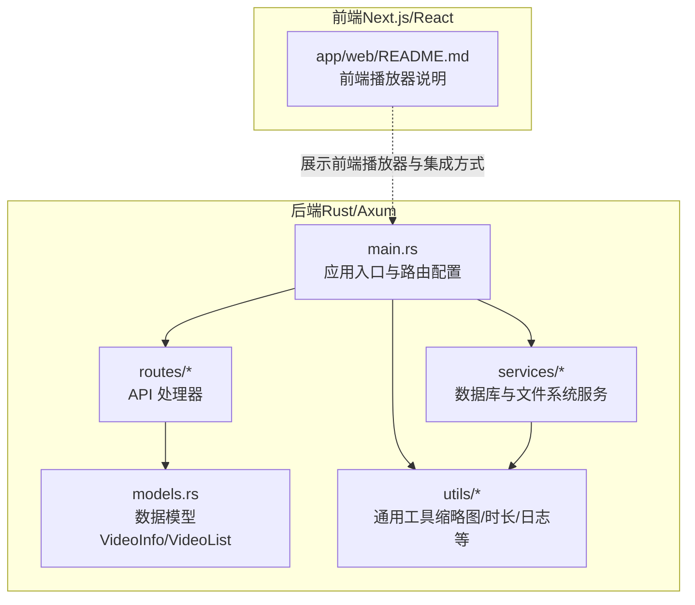
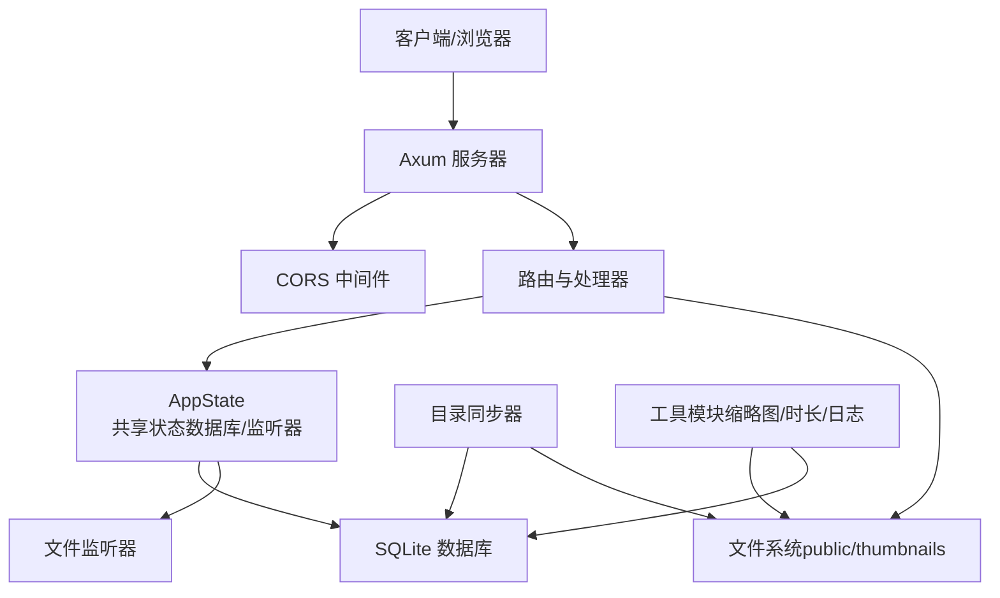
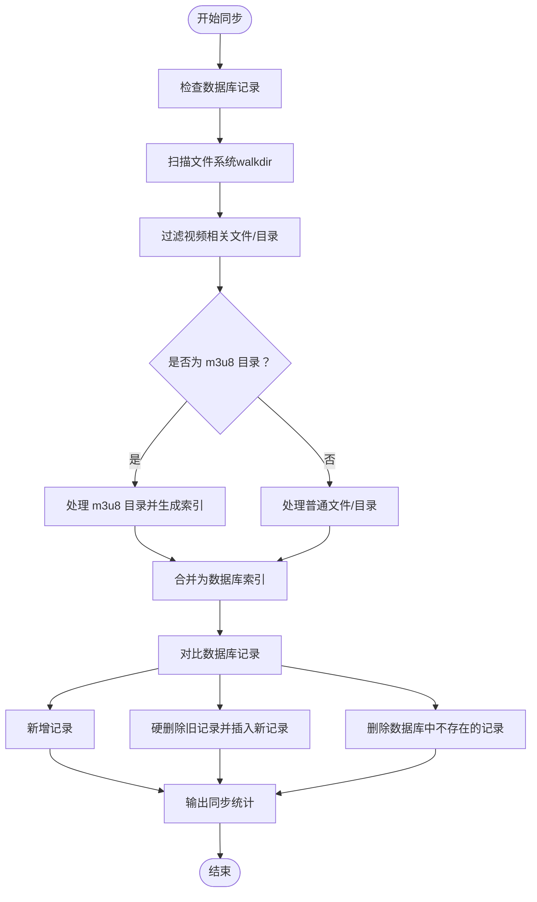
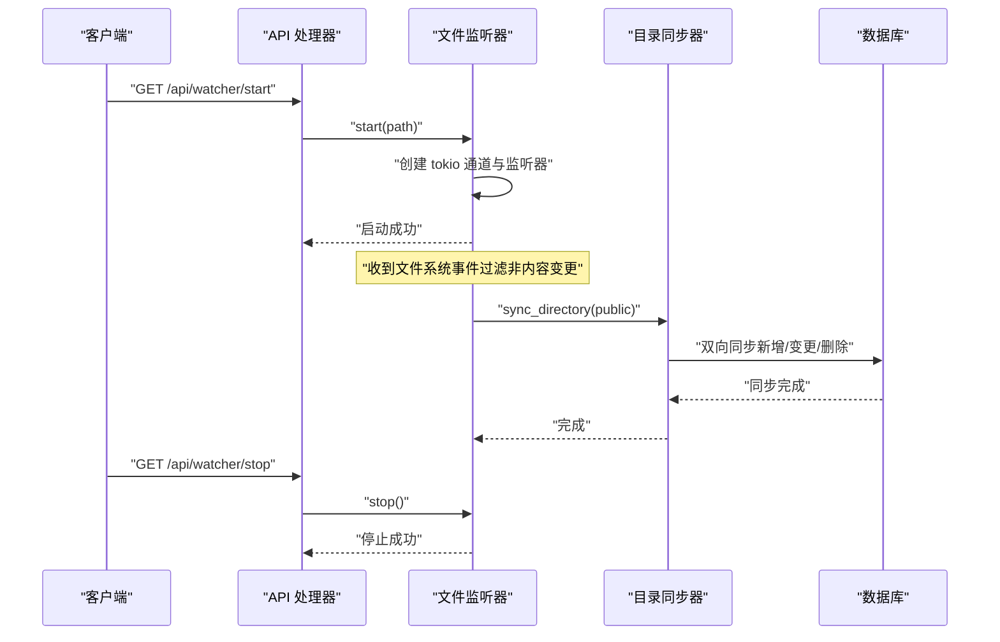
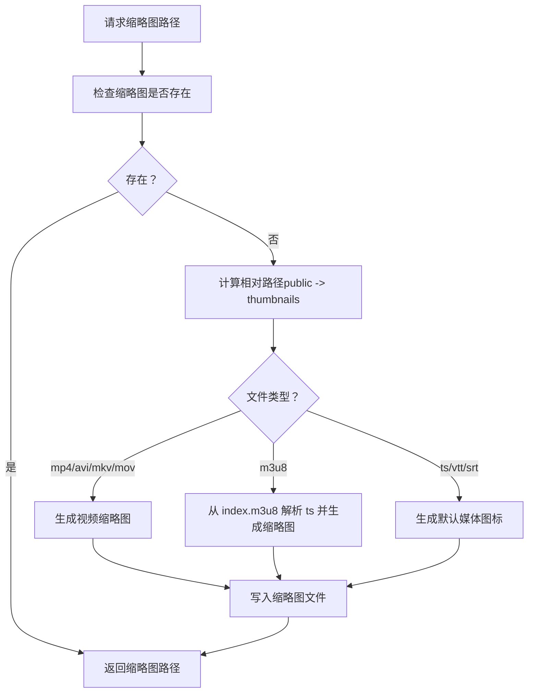
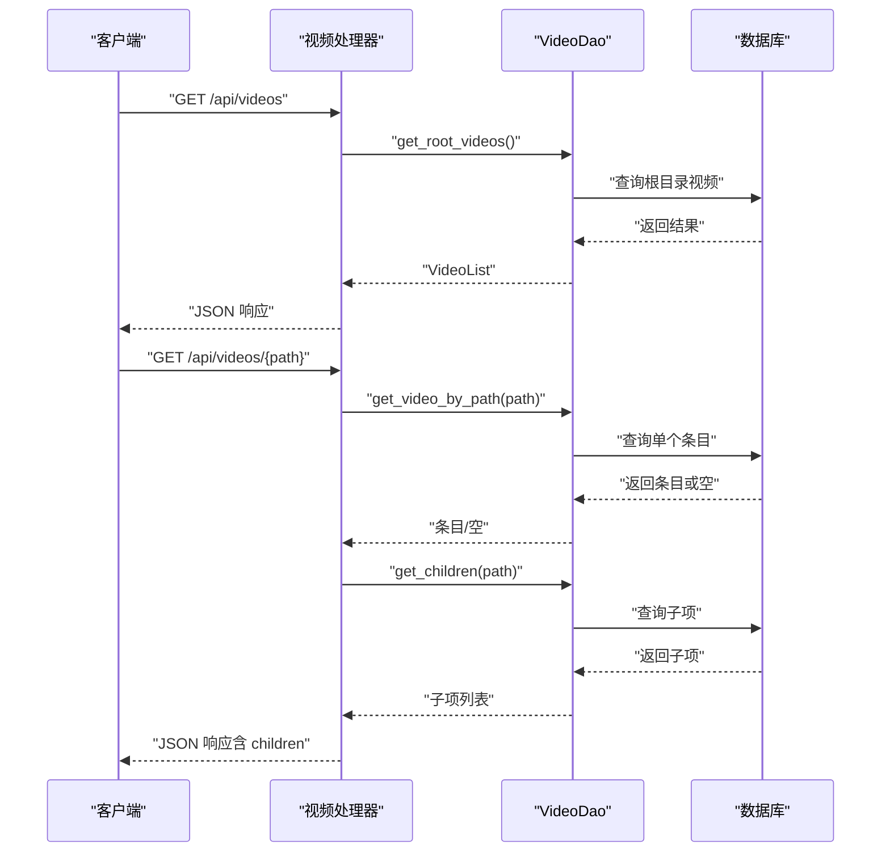
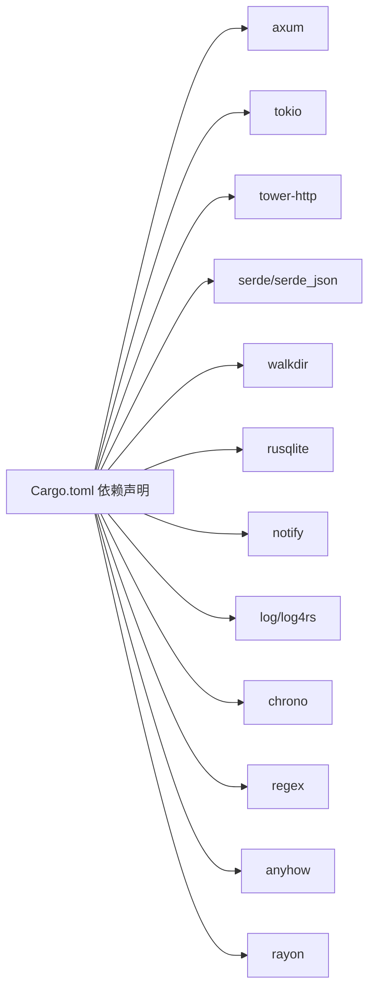

# 项目介绍

<cite>
**本文引用的文件**
- [README.md](file://README.md)
- [app/server/README.md](file://app/server/README.md)
- [app/web/README.md](file://app/web/README.md)
- [app/server/Cargo.toml](file://app/server/Cargo.toml)
- [app/server/src/main.rs](file://app/server/src/main.rs)
- [app/server/src/models.rs](file://app/server/src/models.rs)
- [app/server/src/routes/mod.rs](file://app/server/src/routes/mod.rs)
- [app/server/src/routes/video_handlers.rs](file://app/server/src/routes/video_handlers.rs)
- [app/server/src/services/mod.rs](file://app/server/src/services/mod.rs)
- [app/server/src/services/db/sync.rs](file://app/server/src/services/db/sync.rs)
- [app/server/src/services/db/watcher.rs](file://app/server/src/services/db/watcher.rs)
- [app/server/src/utils/common.rs](file://app/server/src/utils/common.rs)
- [app/server/src/utils/thumbnail.rs](file://app/server/src/utils/thumbnail.rs)
</cite>

## 目录
1. [引言](#引言)
2. [项目结构](#项目结构)
3. [核心组件](#核心组件)
4. [架构总览](#架构总览)
5. [详细组件分析](#详细组件分析)
6. [依赖关系分析](#依赖关系分析)
7. [性能考量](#性能考量)
8. [故障排查指南](#故障排查指南)
9. [结论](#结论)
10. [附录](#附录)

## 引言
本项目是一个基于 Rust 语言与 Axum 框架构建的高性能视频文件服务器，旨在为个人视频库管理与在线视频播放提供开箱即用的解决方案。其核心价值主张包括：
- 自动视频发现与智能目录识别：自动扫描指定目录，识别 MP4、HLS（m3u8/ts）、字幕（vtt/srt）等多格式资源，并按类型与层级组织。
- 高性能与类型安全：依托 Axum/Tokio 的异步并发模型与 Rust 的类型系统与内存安全，提供低延迟、高吞吐的服务体验。
- 丰富的元数据与静态资源服务：提供文件大小、创建时间、缩略图等元数据，并通过统一的静态文件服务路径直接访问媒体资源。
- 易于扩展与维护：模块化设计，职责清晰，便于后续集成视频分析、转码、分页、搜索、权限控制等功能。

应用场景涵盖：
- 个人视频库管理：集中存放 MP4/HLS/字幕文件，通过 API 查询与浏览。
- 在线视频播放服务：结合前端播放器，支持原生 HTML5 与 HLS.js 的流媒体播放。
- 媒体资源服务：为上层应用或网站提供统一的媒体资源访问入口。

与传统视频服务器方案相比，本项目的优势在于：
- 更强的类型安全与内存安全：Rust 编译期检查减少运行时错误，降低系统风险。
- 更高的并发性能：Axum/Tokio 异步非阻塞模型，适合高并发静态文件与 API 请求。
- 更低的运维成本：无需复杂配置即可启动，内置 CORS、日志与文件监听等实用功能。

## 项目结构
项目采用“前后端分离”的双工程布局：
- 后端（Rust/Axum）：负责视频扫描、数据库同步、API 提供与静态文件服务。
- 前端（Next.js/React）：提供媒体库与播放器界面，自动适配视频/音频/HLS 播放。

图表来源
- [app/server/src/main.rs](file://app/server/src/main.rs#L1-L111)
- [app/server/src/models.rs](file://app/server/src/models.rs#L1-L32)
- [app/server/src/routes/mod.rs](file://app/server/src/routes/mod.rs#L1-L6)
- [app/server/src/services/mod.rs](file://app/server/src/services/mod.rs#L1-L6)
- [app/server/src/utils/mod.rs](file://app/server/src/utils/mod.rs#L1-L14)
- [app/web/README.md](file://app/web/README.md#L1-L158)

章节来源
- [README.md](file://README.md#L1-L120)
- [app/server/README.md](file://app/server/README.md#L1-L120)
- [app/web/README.md](file://app/web/README.md#L1-L80)

## 核心组件
- 应用入口与状态
  - 应用入口负责初始化日志、缩略图目录、数据库与文件监听器，构建统一的应用状态（AppState），并注册路由与 CORS 中间件。
  - 关键路径参考：[应用入口与路由配置](file://app/server/src/main.rs#L1-L111)

- 数据模型
  - VideoInfo/VideoList：用于序列化 API 响应，包含名称、路径、类型、子项、缩略图、时长、大小、分辨率、比特率、编码、创建时间、字幕等字段。
  - 关键路径参考：[数据模型定义](file://app/server/src/models.rs#L1-L32)

- 路由与处理器
  - 视频相关 API：列出视频、获取详情、手动同步数据库。
  - 文件监听器控制：启动、停止、查询状态。
  - 关键路径参考：
    - [路由导出与聚合](file://app/server/src/routes/mod.rs#L1-L6)
    - [视频处理器](file://app/server/src/routes/video_handlers.rs#L1-L104)

- 服务层
  - 数据库与文件系统：目录同步（双向同步）、文件监听器（基于 notify 与 tokio）、缩略图初始化与生成。
  - 关键路径参考：
    - [服务导出与聚合](file://app/server/src/services/mod.rs#L1-L6)
    - [目录同步器](file://app/server/src/services/db/sync.rs#L1-L413)
    - [文件监听器](file://app/server/src/services/db/watcher.rs#L1-L182)

- 工具与通用逻辑
  - 文件大小格式化、创建时间解析、视频/容器识别、缩略图生成与确保、HLS 时长与合并辅助等。
  - 关键路径参考：
    - [通用工具导出](file://app/server/src/utils/mod.rs#L1-L14)
    - [通用工具实现](file://app/server/src/utils/common.rs#L1-L146)
    - [缩略图工具](file://app/server/src/utils/thumbnail.rs#L1-L99)

章节来源
- [app/server/src/main.rs](file://app/server/src/main.rs#L1-L111)
- [app/server/src/models.rs](file://app/server/src/models.rs#L1-L32)
- [app/server/src/routes/mod.rs](file://app/server/src/routes/mod.rs#L1-L6)
- [app/server/src/routes/video_handlers.rs](file://app/server/src/routes/video_handlers.rs#L1-L104)
- [app/server/src/services/mod.rs](file://app/server/src/services/mod.rs#L1-L6)
- [app/server/src/services/db/sync.rs](file://app/server/src/services/db/sync.rs#L1-L413)
- [app/server/src/services/db/watcher.rs](file://app/server/src/services/db/watcher.rs#L1-L182)
- [app/server/src/utils/common.rs](file://app/server/src/utils/common.rs#L1-L146)
- [app/server/src/utils/thumbnail.rs](file://app/server/src/utils/thumbnail.rs#L1-L99)

## 架构总览
系统采用“异步 Web 服务 + 数据库 + 文件系统 + 前端播放器”的整体架构。后端通过 Axum 提供 RESTful API 与静态文件服务，内部通过数据库维护媒体索引，借助文件监听器实现自动同步；前端通过 API 获取媒体列表与详情，自动选择合适的播放器进行播放。

图表来源
- [app/server/src/main.rs](file://app/server/src/main.rs#L1-L111)
- [app/server/src/routes/video_handlers.rs](file://app/server/src/routes/video_handlers.rs#L1-L104)
- [app/server/src/services/db/sync.rs](file://app/server/src/services/db/sync.rs#L1-L413)
- [app/server/src/services/db/watcher.rs](file://app/server/src/services/db/watcher.rs#L1-L182)
- [app/server/src/utils/thumbnail.rs](file://app/server/src/utils/thumbnail.rs#L1-L99)

## 详细组件分析

### 组件A：目录同步器（DirectorySync）
职责与流程
- 负责将文件系统中的视频资源同步至数据库，支持双向同步（文件系统 -> 数据库 + 数据库 -> 文件系统）。
- 扫描策略：使用 walkdir 递归扫描，过滤非视频相关文件，特殊处理 m3u8 目录与 ts 文件。
- 变更处理：对比数据库记录与文件系统，新增、变更（硬删除旧记录再插入新记录）、删除三类操作。
- 性能与可观测性：记录各阶段耗时，输出同步统计，便于诊断与优化。

图表来源
- [app/server/src/services/db/sync.rs](file://app/server/src/services/db/sync.rs#L1-L413)
- [app/server/src/utils/common.rs](file://app/server/src/utils/common.rs#L1-L146)

章节来源
- [app/server/src/services/db/sync.rs](file://app/server/src/services/db/sync.rs#L1-L413)
- [app/server/src/utils/common.rs](file://app/server/src/utils/common.rs#L1-L146)

### 组件B：文件监听器（FileWatcher）
职责与流程
- 基于 notify 与 tokio 实现文件系统事件监听，过滤非内容变更事件，对视频相关路径进行监控。
- 采用异步通道接收事件，加入 5 秒防抖，避免频繁同步导致的性能抖动。
- 提供启动/停止/状态查询接口，配合 API 控制端点使用。

图表来源
- [app/server/src/services/db/watcher.rs](file://app/server/src/services/db/watcher.rs#L1-L182)
- [app/server/src/services/db/sync.rs](file://app/server/src/services/db/sync.rs#L1-L413)
- [app/server/src/routes/video_handlers.rs](file://app/server/src/routes/video_handlers.rs#L72-L104)

章节来源
- [app/server/src/services/db/watcher.rs](file://app/server/src/services/db/watcher.rs#L1-L182)
- [app/server/src/routes/video_handlers.rs](file://app/server/src/routes/video_handlers.rs#L72-L104)

### 组件C：缩略图生成与确保（Thumbnail）
职责与流程
- 确保 public 下的媒体文件具备对应的缩略图，若不存在则按类型生成：
  - 视频文件（mp4/avi/mkv/mov）：生成视频帧缩略图。
  - HLS 目录（m3u8）：尝试从 index.m3u8 中定位首个 ts 片段生成缩略图，否则回退为默认图标。
  - 其他类型（ts/vtt/srt）：使用默认媒体图标。
- 生成前会创建缩略图目录层级，保证访问路径一致。

图表来源
- [app/server/src/utils/thumbnail.rs](file://app/server/src/utils/thumbnail.rs#L1-L99)

章节来源
- [app/server/src/utils/thumbnail.rs](file://app/server/src/utils/thumbnail.rs#L1-L99)

### 组件D：API 工作流（视频列表与详情）
职责与流程
- 列表接口：从数据库查询第一层视频与目录，返回 VideoList。
- 详情接口：根据路径查询数据库，若为目录则补充子项（最多递归两层），否则返回未找到。
- 同步接口：触发一次目录同步，返回成功信息与当前计数。

图表来源
- [app/server/src/routes/video_handlers.rs](file://app/server/src/routes/video_handlers.rs#L1-L104)
- [app/server/src/models.rs](file://app/server/src/models.rs#L1-L32)

章节来源
- [app/server/src/routes/video_handlers.rs](file://app/server/src/routes/video_handlers.rs#L1-L104)
- [app/server/src/models.rs](file://app/server/src/models.rs#L1-L32)

## 依赖关系分析
后端依赖主要集中在异步运行时、HTTP 框架、数据库与文件系统工具上，形成清晰的分层依赖：

图表来源
- [app/server/Cargo.toml](file://app/server/Cargo.toml#L1-L23)

章节来源
- [app/server/Cargo.toml](file://app/server/Cargo.toml#L1-L23)

## 性能考量
- 异步并发与非阻塞 IO：Axum 与 Tokio 提供高效的事件循环与任务调度，适合高并发静态文件与 API 请求。
- 目录扫描与过滤：使用 walkdir 递归扫描并提前过滤非视频相关文件，减少无效处理。
- 双向同步与增量策略：数据库已有记录时执行增量同步，避免全量重建带来的性能损耗。
- 防抖与批处理：文件监听器对事件进行防抖与异步处理，降低频繁同步对系统的影响。
- 缩略图懒生成：仅在首次访问时生成缩略图并缓存，减少冷启动开销。
- CORS 与静态服务：tower-http 提供高效静态文件服务与跨域支持，减少额外中间件开销。

## 故障排查指南
常见问题与定位建议：
- 服务器启动失败
  - 检查端口占用与权限，确认 public 目录存在且可读。
  - 参考路径：[运行与访问说明](file://README.md#L120-L200)

- API 返回 404 或无数据
  - 确认数据库已完成初始化或手动触发同步。
  - 参考路径：[视频列表与详情 API](file://app/server/src/routes/video_handlers.rs#L1-L104)

- HLS 播放异常
  - 确认 m3u8 与 ts 文件完整，且目录结构符合预期。
  - 参考路径：[目录同步器（m3u8 处理）](file://app/server/src/services/db/sync.rs#L265-L296)

- 缩略图缺失
  - 确认缩略图目录存在且权限正确，等待懒生成或手动触发缩略图生成逻辑。
  - 参考路径：[缩略图生成与确保](file://app/server/src/utils/thumbnail.rs#L1-L99)

- 文件监听器未生效
  - 检查监听器状态与路径有效性，确认事件类型为内容变更。
  - 参考路径：[文件监听器实现](file://app/server/src/services/db/watcher.rs#L1-L182)

章节来源
- [README.md](file://README.md#L120-L200)
- [app/server/src/routes/video_handlers.rs](file://app/server/src/routes/video_handlers.rs#L1-L104)
- [app/server/src/services/db/sync.rs](file://app/server/src/services/db/sync.rs#L265-L296)
- [app/server/src/utils/thumbnail.rs](file://app/server/src/utils/thumbnail.rs#L1-L99)
- [app/server/src/services/db/watcher.rs](file://app/server/src/services/db/watcher.rs#L1-L182)

## 结论
本项目以 Rust 与 Axum 为核心，构建了高性能、类型安全、易于扩展的视频文件服务器。通过自动扫描、数据库索引、文件监听与静态资源服务，满足个人视频库管理与在线播放的多样化需求。未来可进一步集成视频分析、转码、分页、搜索、权限控制与缓存机制，持续提升性能与用户体验。

## 附录
- 前端播放器与集成
  - 前端项目提供自动类型识别与播放器选择，支持 MP4/WebM/Ogg 视频、MP3/WAV/AAC/FLAC/Ogg 音频与 HLS 流媒体。
  - 参考路径：[前端播放器说明](file://app/web/README.md#L1-L158)

- API 与静态资源访问
  - API 列表、详情、同步与监听控制端点；静态资源通过 /public 与 /thumbnails 访问。
  - 参考路径：[后端 API 说明](file://app/server/README.md#L1-L160)