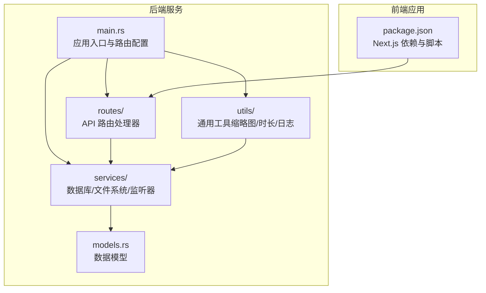
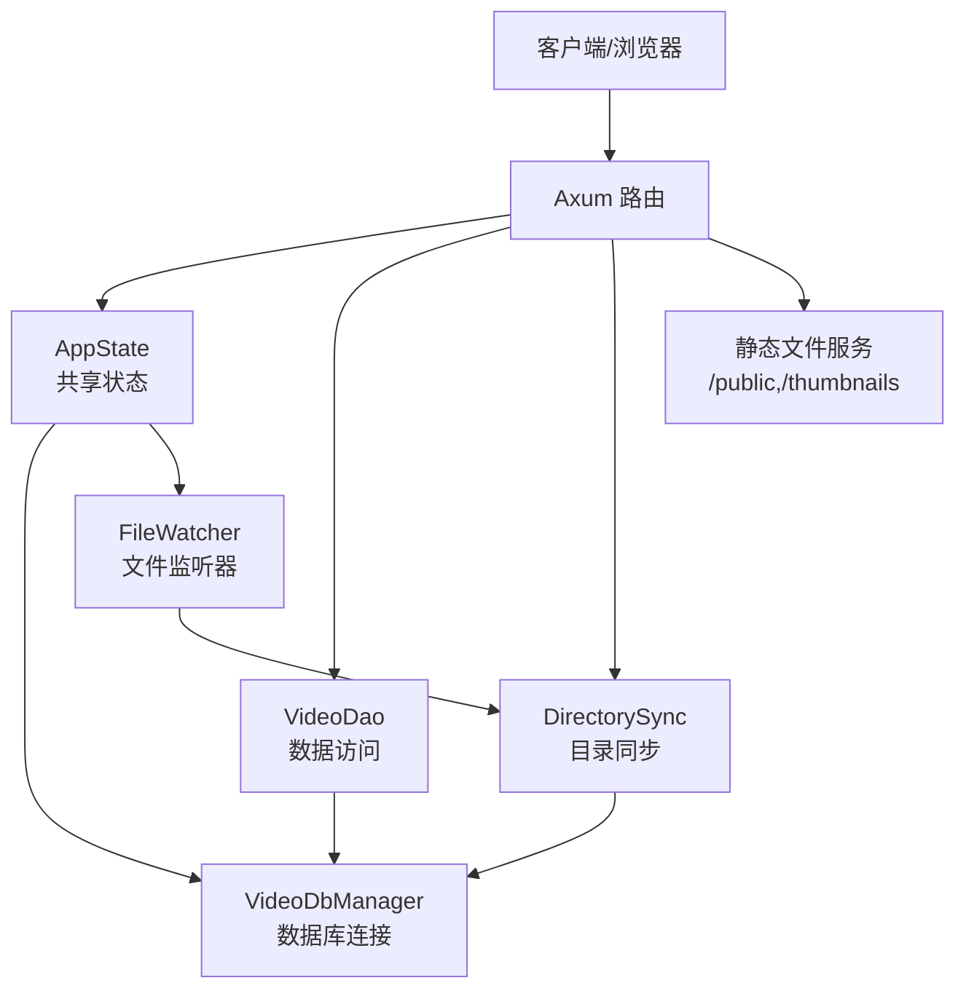
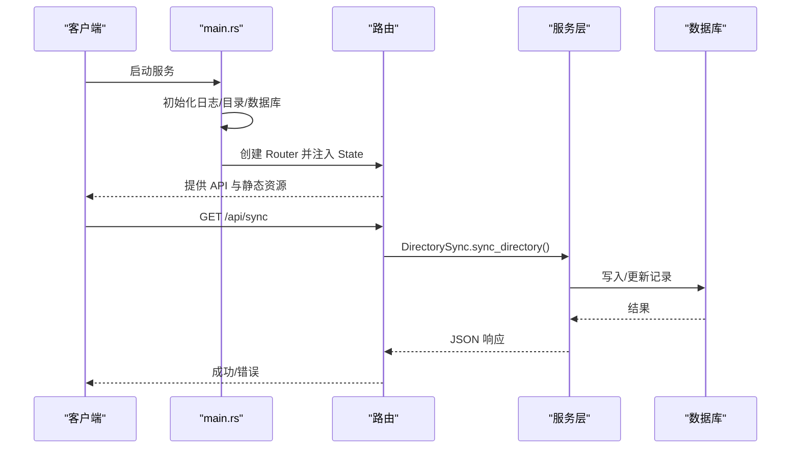
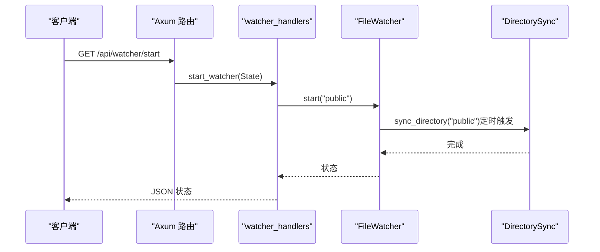
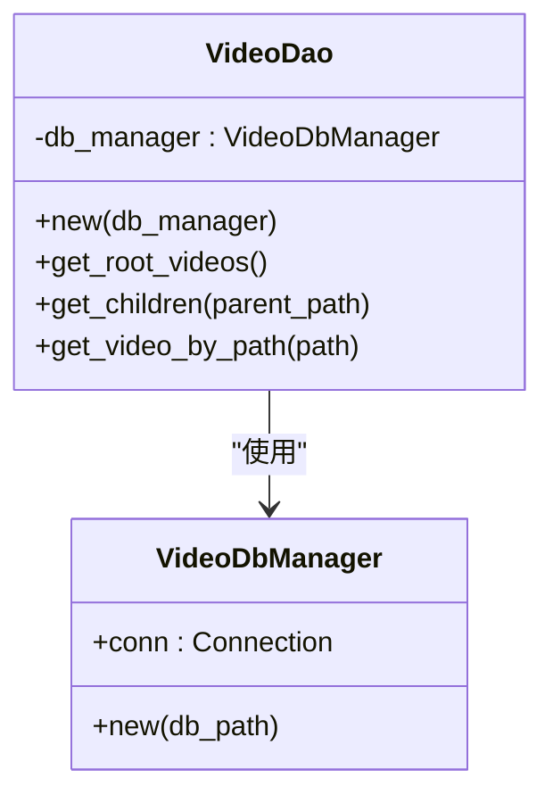
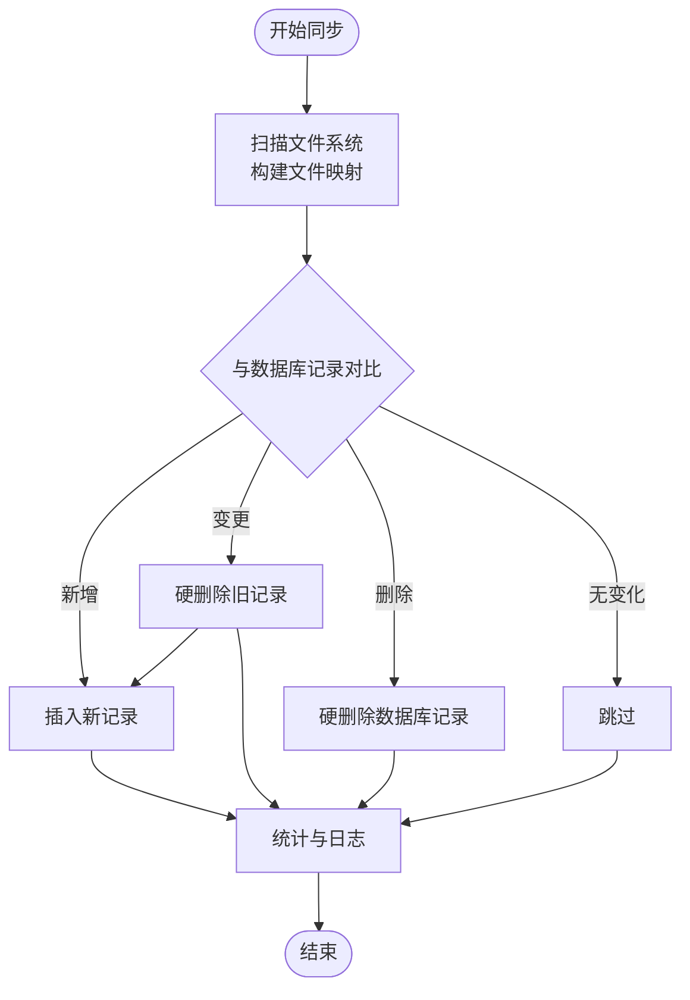
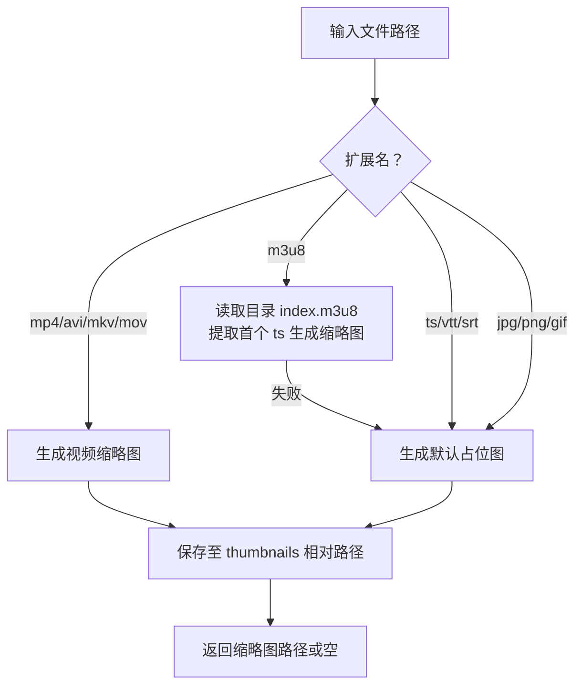
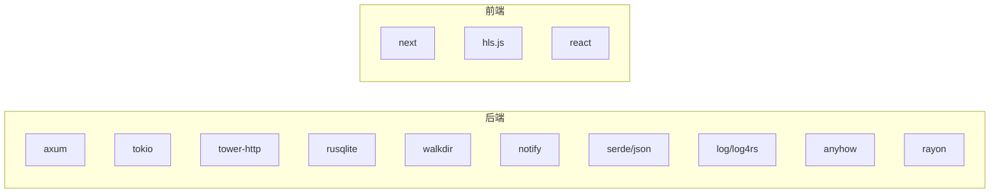

# 项目概述

<cite>
**本文引用的文件**
- [app/server/Cargo.toml](file://app/server/Cargo.toml)
- [app/server/src/main.rs](file://app/server/src/main.rs)
- [app/server/src/models.rs](file://app/server/src/models.rs)
- [app/server/src/routes/mod.rs](file://app/server/src/routes/mod.rs)
- [app/server/src/routes/video_handlers.rs](file://app/server/src/routes/video_handlers.rs)
- [app/server/src/routes/watcher_handlers.rs](file://app/server/src/routes/watcher_handlers.rs)
- [app/server/src/services/mod.rs](file://app/server/src/services/mod.rs)
- [app/server/src/services/db/mod.rs](file://app/server/src/services/db/mod.rs)
- [app/server/src/services/db/connection.rs](file://app/server/src/services/db/connection.rs)
- [app/server/src/services/db/video_dao.rs](file://app/server/src/services/db/video_dao.rs)
- [app/server/src/services/db/sync.rs](file://app/server/src/services/db/sync.rs)
- [app/server/src/services/db/watcher.rs](file://app/server/src/services/db/watcher.rs)
- [app/server/src/utils/thumbnail.rs](file://app/server/src/utils/thumbnail.rs)
- [app/web/package.json](file://app/web/package.json)
</cite>

## 目录
1. [简介](#简介)
2. [项目结构](#项目结构)
3. [核心组件](#核心组件)
4. [架构总览](#架构总览)
5. [详细组件分析](#详细组件分析)
6. [依赖分析](#依赖分析)
7. [性能考虑](#性能考虑)
8. [故障排查指南](#故障排查指南)
9. [结论](#结论)
10. [附录](#附录)

## 简介
本项目是一个基于 Rust 与 Axum 的高性能视频文件服务器，提供视频资源的目录浏览、元数据检索、缩略图生成、实时文件监听与自动同步能力。其核心价值在于：
- 高性能与高并发：依托 Tokio 异步运行时与 Axum 轻量 Web 框架，结合 Tower 中间件生态，实现低延迟与高吞吐。
- 数据一致性与可维护性：采用 SQLite 存储视频元数据，配合双向同步与文件监听，确保数据库与文件系统保持一致。
- 易用性与可扩展性：提供简洁的 REST API 与静态资源服务，前端采用 Next.js，便于快速集成媒体播放与展示。

技术特色与应用场景：
- 支持多种视频容器与流式分片（如 MP4、M3U8/TS），并能对 HLS 目录进行合并与元数据提取。
- 自动缩略图生成与缓存，提升媒体库加载效率。
- 文件监听与定时去抖，避免频繁同步带来的性能损耗。
- CORS 已启用，便于前后端分离部署与跨域访问。

## 项目结构
后端采用模块化组织，按职责划分为路由、服务、工具与模型；前端使用 Next.js，提供媒体库与播放页面。

图表来源
- [app/server/src/main.rs](file://app/server/src/main.rs#L1-L111)
- [app/server/src/routes/mod.rs](file://app/server/src/routes/mod.rs#L1-L6)
- [app/server/src/services/mod.rs](file://app/server/src/services/mod.rs#L1-L6)
- [app/server/src/utils/thumbnail.rs](file://app/server/src/utils/thumbnail.rs#L1-L99)
- [app/server/src/models.rs](file://app/server/src/models.rs#L1-L32)
- [app/web/package.json](file://app/web/package.json#L1-L74)

章节来源
- [app/server/src/main.rs](file://app/server/src/main.rs#L1-L111)
- [app/server/src/routes/mod.rs](file://app/server/src/routes/mod.rs#L1-L6)
- [app/server/src/services/mod.rs](file://app/server/src/services/mod.rs#L1-L6)
- [app/server/src/utils/thumbnail.rs](file://app/server/src/utils/thumbnail.rs#L1-L99)
- [app/server/src/models.rs](file://app/server/src/models.rs#L1-L32)
- [app/web/package.json](file://app/web/package.json#L1-L74)

## 核心组件
- 应用状态与入口
  - 统一状态包含数据库管理器与文件监听器，通过 Arc+Mutex 在异步环境中共享。
  - 启动时初始化日志、缩略图目录、SQLite 数据库与初始同步，随后创建路由并绑定监听地址。
- 路由层
  - 提供视频列表、详情查询、手动同步、文件监听启停与状态查询等 API。
  - 静态文件服务挂载 public 与 thumbnails 目录，支持直接访问媒体与缩略图。
- 服务层
  - 数据库：连接管理、表结构与索引、迁移逻辑。
  - DAO：封装查询根目录、子项、按路径查询等。
  - 同步器：双向同步（文件系统↔数据库）、m3u8 目录处理、去抖与批量写入。
  - 监听器：基于 notify 的文件系统事件监听，过滤非内容变更，定时触发同步。
- 工具层
  - 缩略图：根据文件类型生成/缓存缩略图，支持默认占位图。
  - 时长与元数据：对 MP4/HLS 等提取时长、大小、创建时间等。
- 模型层
  - VideoInfo/VideoList：统一的视频/目录数据结构，支持嵌套子项与可选元数据字段。

章节来源
- [app/server/src/main.rs](file://app/server/src/main.rs#L1-L111)
- [app/server/src/routes/video_handlers.rs](file://app/server/src/routes/video_handlers.rs#L1-L104)
- [app/server/src/routes/watcher_handlers.rs](file://app/server/src/routes/watcher_handlers.rs#L1-L84)
- [app/server/src/services/db/connection.rs](file://app/server/src/services/db/connection.rs#L1-L122)
- [app/server/src/services/db/video_dao.rs](file://app/server/src/services/db/video_dao.rs#L1-L146)
- [app/server/src/services/db/sync.rs](file://app/server/src/services/db/sync.rs#L1-L413)
- [app/server/src/services/db/watcher.rs](file://app/server/src/services/db/watcher.rs#L1-L182)
- [app/server/src/utils/thumbnail.rs](file://app/server/src/utils/thumbnail.rs#L1-L99)
- [app/server/src/models.rs](file://app/server/src/models.rs#L1-L32)

## 架构总览
后端以 Axum Router 为核心，通过 State 注入应用状态，路由处理器调用服务层完成数据库查询与文件系统扫描；Tower 中间件提供 CORS 与静态文件服务；前端 Next.js 通过 API 调用后端接口渲染媒体库与播放页。

图表来源
- [app/server/src/main.rs](file://app/server/src/main.rs#L1-L111)
- [app/server/src/routes/video_handlers.rs](file://app/server/src/routes/video_handlers.rs#L1-L104)
- [app/server/src/routes/watcher_handlers.rs](file://app/server/src/routes/watcher_handlers.rs#L1-L84)
- [app/server/src/services/db/connection.rs](file://app/server/src/services/db/connection.rs#L1-L122)
- [app/server/src/services/db/video_dao.rs](file://app/server/src/services/db/video_dao.rs#L1-L146)
- [app/server/src/services/db/sync.rs](file://app/server/src/services/db/sync.rs#L1-L413)
- [app/server/src/services/db/watcher.rs](file://app/server/src/services/db/watcher.rs#L1-L182)

## 详细组件分析

### 应用入口与状态管理
- 初始化日志、数据源目录、缩略图目录与数据库。
- 构造 AppState 并注入路由，启用 CORS 与静态文件服务。
- 默认不启动文件监听器，需显式调用启动接口。

图表来源
- [app/server/src/main.rs](file://app/server/src/main.rs#L1-L111)
- [app/server/src/routes/video_handlers.rs](file://app/server/src/routes/video_handlers.rs#L72-L104)
- [app/server/src/services/db/sync.rs](file://app/server/src/services/db/sync.rs#L81-L84)

章节来源
- [app/server/src/main.rs](file://app/server/src/main.rs#L1-L111)

### 路由与控制器
- 视频路由
  - GET /api/videos：列出根目录视频/目录。
  - GET /api/videos/*path：按路径返回详情，若为目录/目录型 m3u8 则返回子项。
  - GET /api/sync：手动触发同步并返回计数。
- 监听器路由
  - GET /api/watcher/start：启动监听器（带防抖与状态检查）。
  - GET /api/watcher/stop：停止监听器。
  - GET /api/watcher/status：返回运行状态与提示。

图表来源
- [app/server/src/routes/watcher_handlers.rs](file://app/server/src/routes/watcher_handlers.rs#L1-L84)
- [app/server/src/services/db/watcher.rs](file://app/server/src/services/db/watcher.rs#L1-L182)
- [app/server/src/services/db/sync.rs](file://app/server/src/services/db/sync.rs#L81-L84)

章节来源
- [app/server/src/routes/video_handlers.rs](file://app/server/src/routes/video_handlers.rs#L1-L104)
- [app/server/src/routes/watcher_handlers.rs](file://app/server/src/routes/watcher_handlers.rs#L1-L84)

### 数据库与 DAO
- VideoDbManager
  - 初始化表结构（含唯一索引）与迁移逻辑，兼容旧版本字段。
- VideoDao
  - 查询根目录、按父路径查询子项、按路径查询单条记录。
  - 对 m3u8 类型目录特殊处理：返回空子项，避免重复存储。

图表来源
- [app/server/src/services/db/connection.rs](file://app/server/src/services/db/connection.rs#L1-L122)
- [app/server/src/services/db/video_dao.rs](file://app/server/src/services/db/video_dao.rs#L1-L146)

章节来源
- [app/server/src/services/db/connection.rs](file://app/server/src/services/db/connection.rs#L1-L122)
- [app/server/src/services/db/video_dao.rs](file://app/server/src/services/db/video_dao.rs#L1-L146)

### 目录同步与文件监听
- DirectorySync
  - 双向同步：文件系统 → 数据库（新增/变更/删除），并记录耗时与统计。
  - m3u8 目录处理：定位主索引、合并为 mp4（若需要）、生成时长与缩略图。
  - ts 与 m3u8 关联：同目录下存在 m3u8 时不单独记录 ts。
- FileWatcher
  - 基于 notify 监听文件系统事件，过滤非内容变更，使用 5 秒防抖触发同步。

图表来源
- [app/server/src/services/db/sync.rs](file://app/server/src/services/db/sync.rs#L1-L413)

章节来源
- [app/server/src/services/db/sync.rs](file://app/server/src/services/db/sync.rs#L1-L413)
- [app/server/src/services/db/watcher.rs](file://app/server/src/services/db/watcher.rs#L1-L182)

### 缩略图生成与缓存
- 根据文件类型选择生成策略：
  - 视频容器（如 MP4/AVI/MKV/MOV）：提取帧生成缩略图。
  - M3U8：优先从目录首个 TS 片段生成；否则使用默认占位图。
  - 字幕/图片：使用默认占位图。
- 生成后缓存至 thumbnails 目录，按相对路径映射，避免重复生成。

图表来源
- [app/server/src/utils/thumbnail.rs](file://app/server/src/utils/thumbnail.rs#L1-L99)

章节来源
- [app/server/src/utils/thumbnail.rs](file://app/server/src/utils/thumbnail.rs#L1-L99)

### 数据模型与序列化
- VideoInfo：包含名称、路径、类型、可选子项、缩略图、时长、大小、分辨率、码率、编解码器、创建时间、字幕等。
- VideoList：包装视频数组，用于列表响应。

章节来源
- [app/server/src/models.rs](file://app/server/src/models.rs#L1-L32)

## 依赖分析
- 后端依赖
  - axum/tokio/tower-http：Web 框架、异步运行时与中间件（含 CORS、静态文件）。
  - rusqlite：轻量嵌入式数据库，支持索引与迁移。
  - walkdir/notify：文件系统遍历与事件监听。
  - serde/serde_json：结构化序列化与反序列化。
  - rayon/log/log4rs/anyhow：并行与日志/错误处理。
- 前端依赖
  - Next.js 16、React 19、TailwindCSS、Radix UI、hls.js 等，提供现代化 UI 与 HLS 播放能力。

图表来源
- [app/server/Cargo.toml](file://app/server/Cargo.toml#L1-L23)
- [app/web/package.json](file://app/web/package.json#L1-L74)

章节来源
- [app/server/Cargo.toml](file://app/server/Cargo.toml#L1-L23)
- [app/web/package.json](file://app/web/package.json#L1-L74)

## 性能考虑
- 异步与并发
  - 使用 Tokio 全栈异步，Axum 路由与 Tower 中间件均支持非阻塞 IO。
  - notify 事件通过 mpsc 通道异步传递，避免阻塞主线程。
- 数据库优化
  - 建立 path 与 parent_path 索引，减少查询成本。
  - 迁移逻辑兼容旧表结构，保证演进过程平滑。
- 同步策略
  - 目录扫描与写入采用批量处理，减少事务开销。
  - 文件监听器使用 5 秒防抖，降低频繁同步导致的抖动。
- 缩略图缓存
  - 首次生成后复用，避免重复计算；按相对路径映射，便于清理与一致性维护。

## 故障排查指南
- 启动失败
  - 检查 DATA_SOURCE_DIR 环境变量与 public 目录是否存在。
  - 查看日志输出，确认数据库初始化与索引创建是否成功。
- API 返回错误
  - 数据库错误：查看 VideoDao 查询链路与 SQL 日志。
  - 路径不存在：确认 /api/videos/*path 是否以 public 下相对路径形式传入。
- 同步异常
  - 手动触发 /api/sync 并观察日志统计；检查扫描错误与权限问题。
  - 若数据库已有记录且未强制重新初始化，将执行增量同步。
- 监听器无效
  - 确认 /api/watcher/start 已调用且状态为运行中。
  - 检查文件系统事件是否被过滤（仅内容变更会触发）。
- 缩略图缺失
  - 确认 thumbnails 目录可写；检查对应文件类型是否支持生成。
  - 重新触发同步或手动删除缩略图以强制再生。

章节来源
- [app/server/src/main.rs](file://app/server/src/main.rs#L1-L111)
- [app/server/src/routes/video_handlers.rs](file://app/server/src/routes/video_handlers.rs#L1-L104)
- [app/server/src/routes/watcher_handlers.rs](file://app/server/src/routes/watcher_handlers.rs#L1-L84)
- [app/server/src/services/db/sync.rs](file://app/server/src/services/db/sync.rs#L1-L413)
- [app/server/src/services/db/watcher.rs](file://app/server/src/services/db/watcher.rs#L1-L182)
- [app/server/src/utils/thumbnail.rs](file://app/server/src/utils/thumbnail.rs#L1-L99)

## 结论
本项目以 Rust/Axum 为基础，构建了高性能、可维护、易扩展的视频文件服务器。通过数据库与文件系统的双向同步、文件监听与去抖机制、以及缩略图缓存策略，有效提升了媒体库的可用性与性能。前后端分离设计使前端播放体验与后端服务能力解耦，适合在家庭媒体中心、私有云盘或中小规模视频平台中部署与二次开发。

## 附录
- API 端点概览
  - GET /api/videos：列出根目录视频/目录。
  - GET /api/videos/*path：按路径返回详情（含子项）。
  - GET /api/sync：手动同步数据库。
  - GET /api/watcher/start：启动文件监听器。
  - GET /api/watcher/stop：停止文件监听器。
  - GET /api/watcher/status：查询监听器状态。
  - 静态资源：/public/* 与 /thumbnails/*
- 支持的视频格式与特性
  - 容器：MP4、MKV、AVI、MOV 等常见视频容器。
  - 流式分片：HLS（M3U8/TS），支持目录级合并与时长提取。
  - 字幕：VTT/SRT。
  - 缩略图：自动按类型生成并缓存。
- 部署建议
  - 将 public 目录置于安全可访问位置，合理设置 DATA_SOURCE_DIR。
  - 生产环境建议开启日志级别与健康检查端点。
  - 前端 Next.js 可独立部署于 CDN 或反向代理之后，通过 CORS 与后端交互。