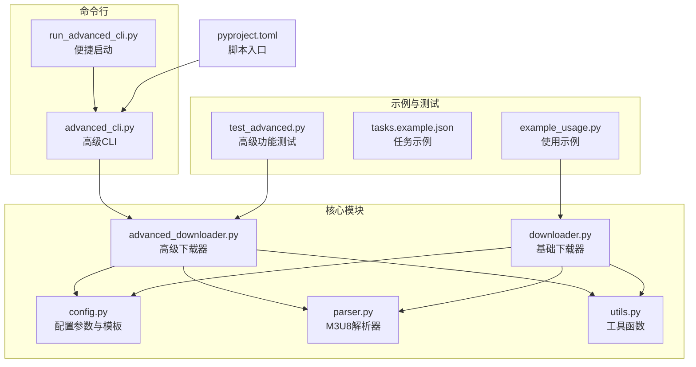
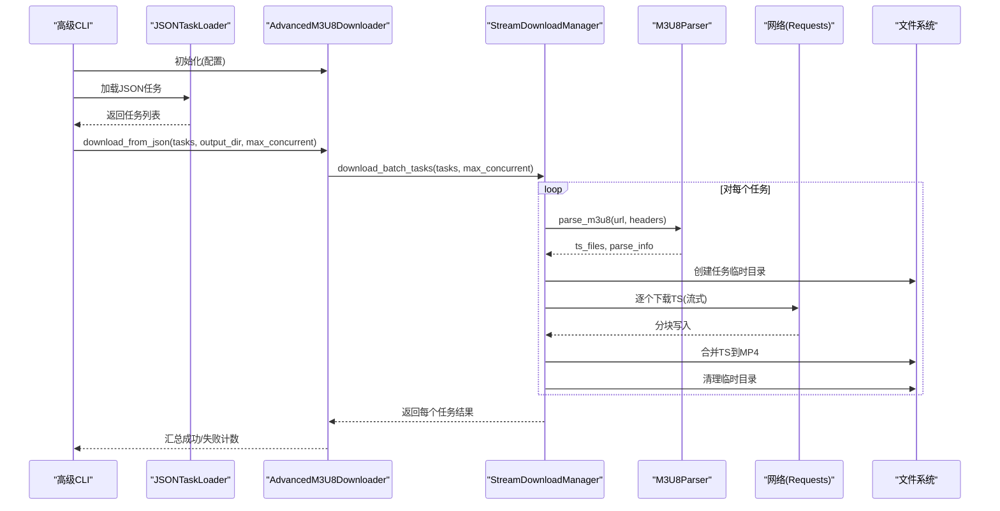
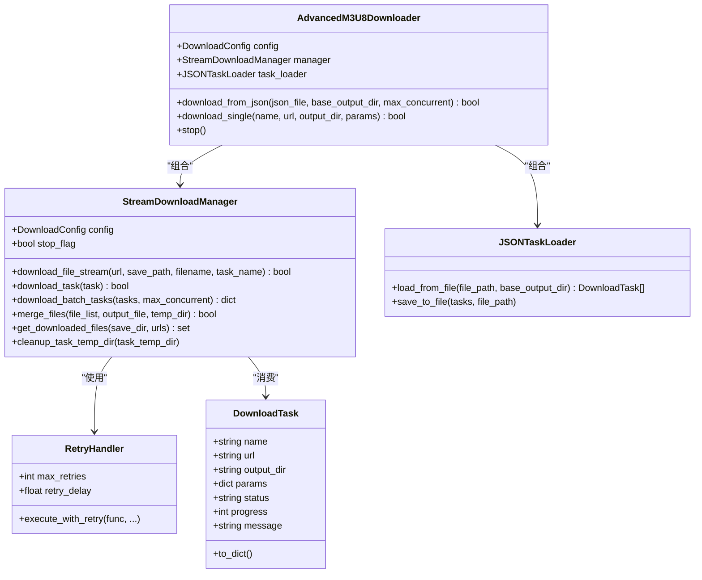
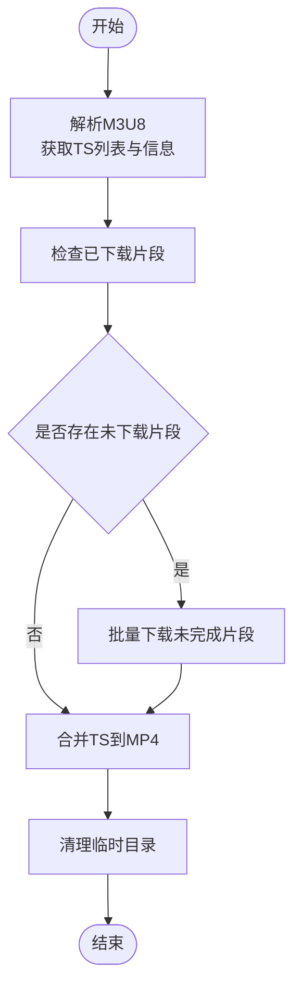
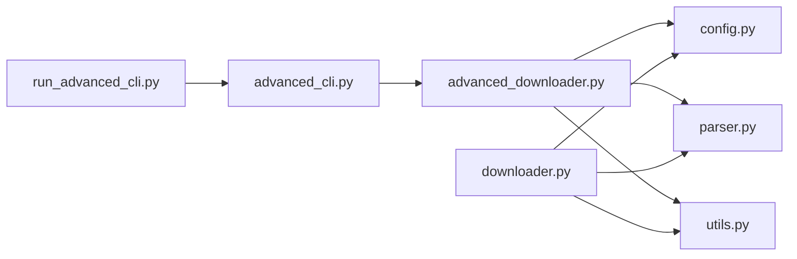

# 高级下载器

<cite>
**本文引用的文件**
- [advanced_downloader.py](file://app/downloader/core/advanced_downloader.py)
- [downloader.py](file://app/downloader/core/downloader.py)
- [config.py](file://app/downloader/core/config.py)
- [parser.py](file://app/downloader/core/parser.py)
- [utils.py](file://app/downloader/core/utils.py)
- [advanced_cli.py](file://app/downloader/cli/advanced_cli.py)
- [run_advanced_cli.py](file://app/downloader/run_advanced_cli.py)
- [pyproject.toml](file://app/downloader/pyproject.toml)
- [QUICKSTART.md](file://app/downloader/QUICKSTART.md)
- [README.md（文档）](file://app/downloader/docs/README.md)
- [example_usage.py](file://app/downloader/examples/example_usage.py)
- [tasks.example.json](file://app/downloader/examples/tasks.example.json)
- [test_advanced.py](file://app/downloader/tests/test_advanced.py)
</cite>

## 目录
1. [简介](#简介)
2. [项目结构](#项目结构)
3. [核心组件](#核心组件)
4. [架构总览](#架构总览)
5. [详细组件分析](#详细组件分析)
6. [依赖关系分析](#依赖关系分析)
7. [性能考量](#性能考量)
8. [故障排查指南](#故障排查指南)
9. [结论](#结论)
10. [附录](#附录)

## 简介
本项目是一个高性能的 M3U8 视频下载器，提供基础版与高级版两种实现：
- 基础版：面向单任务下载，具备多线程、断点续传、错误重试、进度显示与日志记录。
- 高级版：在基础能力之上新增“流式下载”“实时进度”“JSON批量任务”“可控并发任务数”“智能目录结构”“自动清理临时目录”等特性，并配套增强 CLI 与交互模式。

高级版通过“任务级并发 + 文件级串行”的策略，在保证稳定性的同时提升吞吐；并通过 JSON 配置文件支持多任务批处理，满足批量下载场景。

## 项目结构
- app/downloader/core：核心模块（配置、解析、下载器、工具）
- app/downloader/cli：命令行接口（基础 CLI 与高级 CLI）
- app/downloader/examples：示例与任务配置
- app/downloader/tests：测试用例
- app/downloader/docs：文档
- app/downloader/run_advanced_cli.py：便捷启动脚本
- app/downloader/pyproject.toml：包元数据与脚本入口

图表来源
- [advanced_downloader.py](file://app/downloader/core/advanced_downloader.py#L1-L576)
- [downloader.py](file://app/downloader/core/downloader.py#L1-L501)
- [config.py](file://app/downloader/core/config.py#L1-L114)
- [parser.py](file://app/downloader/core/parser.py#L1-L159)
- [utils.py](file://app/downloader/core/utils.py#L1-L290)
- [advanced_cli.py](file://app/downloader/cli/advanced_cli.py#L1-L373)
- [run_advanced_cli.py](file://app/downloader/run_advanced_cli.py#L1-L17)
- [pyproject.toml](file://app/downloader/pyproject.toml#L1-L17)
- [example_usage.py](file://app/downloader/examples/example_usage.py#L1-L176)
- [tasks.example.json](file://app/downloader/examples/tasks.example.json#L1-L31)
- [test_advanced.py](file://app/downloader/tests/test_advanced.py#L1-L262)

章节来源
- [QUICKSTART.md](file://app/downloader/QUICKSTART.md#L1-L290)
- [README.md（文档）](file://app/downloader/docs/README.md#L1-L459)

## 核心组件
- 配置系统（DownloadConfig、ConfigTemplates）：统一管理线程数、超时、重试、缓冲区、目录、请求头、SSL 验证、进度与日志开关等参数，并提供快速/稳定/低带宽三类模板。
- M3U8 解析器（M3U8Parser）：解析 M3U8 内容，提取 TS 片段 URL 列表与分辨率/带宽等元信息。
- 基础下载器（M3U8Downloader、DownloadManager）：负责单任务下载流程（解析 → 下载未完成片段 → 合并 → 清理），支持断点续传、进度显示、日志记录、信号中断。
- 高级下载器（AdvancedM3U8Downloader、StreamDownloadManager、JSONTaskLoader、RetryHandler）：在基础能力上新增“流式下载 + 实时进度 + 任务级并发 + JSON 批量 + 智能目录 + 自动清理”。
- 工具模块（utils.py）：进度跟踪、URL/内容校验、缓存、统计、格式化、横幅与交互辅助。
- CLI（advanced_cli.py、run_advanced_cli.py）：命令行入口与交互模式，支持单任务、批量 JSON、配置模板、并发控制、输出目录等。

章节来源
- [config.py](file://app/downloader/core/config.py#L1-L114)
- [parser.py](file://app/downloader/core/parser.py#L1-L159)
- [downloader.py](file://app/downloader/core/downloader.py#L1-L501)
- [advanced_downloader.py](file://app/downloader/core/advanced_downloader.py#L1-L576)
- [utils.py](file://app/downloader/core/utils.py#L1-L290)
- [advanced_cli.py](file://app/downloader/cli/advanced_cli.py#L1-L373)
- [run_advanced_cli.py](file://app/downloader/run_advanced_cli.py#L1-L17)

## 架构总览
高级下载器采用“任务驱动 + 线程池并发 + 流式下载”的架构：
- 任务层：每个任务对应一个 M3U8，包含名称、URL、输出目录与参数。
- 管理层：高级下载器协调任务加载、并发调度与结果汇总；流式下载管理器负责单任务内的 TS 片段逐个下载与合并。
- 基础设施：配置、解析、重试、工具与日志贯穿各层。

图表来源
- [advanced_cli.py](file://app/downloader/cli/advanced_cli.py#L1-L373)
- [advanced_downloader.py](file://app/downloader/core/advanced_downloader.py#L1-L576)
- [parser.py](file://app/downloader/core/parser.py#L1-L159)

## 详细组件分析

### 高级下载器与流式下载管理器
- DownloadTask：封装任务元信息（名称、URL、输出目录、参数、状态、进度、消息）。
- StreamDownloadManager：
  - 流式下载：逐个下载 TS 片段，边下载边显示百分比与字节数，避免同时并发过多线程。
  - 断点续传：检测本地已存在的片段，跳过重复下载。
  - 合并策略：按文件名排序合并 TS，边读边写，使用缓冲区减少内存占用。
  - 任务并发：使用线程池控制最大并发任务数，支持信号中断取消后续任务。
  - 日志与重试：可选日志记录；内置重试处理器，指数退避。
- JSONTaskLoader：从 JSON 文件加载任务列表，支持相对输出目录解析与保存。
- AdvancedM3U8Downloader：对外提供 download_from_json 与 download_single 接口，协调任务加载与并发执行。

图表来源
- [advanced_downloader.py](file://app/downloader/core/advanced_downloader.py#L1-L576)

章节来源
- [advanced_downloader.py](file://app/downloader/core/advanced_downloader.py#L1-L576)

### 基础下载器与下载管理器
- DownloadManager：通用下载管理器，支持批量下载、进度统计、线程安全的状态更新、临时目录清理与合并。
- M3U8Downloader：单任务主流程（解析 → 下载未完成片段 → 合并 → 清理），提供状态查询与停止能力。

图表来源
- [downloader.py](file://app/downloader/core/downloader.py#L1-L501)

章节来源
- [downloader.py](file://app/downloader/core/downloader.py#L1-L501)

### 配置系统与模板
- DownloadConfig：集中管理下载相关参数，默认线程数为 CPU 核心数的倍数，支持自定义请求头、超时、缓冲区、目录、SSL 验证、进度与日志开关。
- ConfigTemplates：提供 fast/stable/low_bandwidth 三类模板，分别针对高并发、平衡与低带宽场景。

章节来源
- [config.py](file://app/downloader/core/config.py#L1-L114)

### M3U8 解析器
- M3U8Parser：解析 M3U8 内容，提取 TS 文件 URL 列表与分辨率/带宽信息；支持相对路径补全与嵌套 M3U8 的处理；提供 URL 校验与基础信息提取。

章节来源
- [parser.py](file://app/downloader/core/parser.py#L1-L159)

### 工具模块
- ProgressTracker：统计完成/失败/总数量、百分比、速度、耗时与 ETA。
- FileValidator/URLProcessor：URL 校验、M3U8 内容校验、URL 标准化、域名提取、追加查询参数。
- CacheManager/Statistics：简单缓存与统计聚合。
- format_file_size/format_time/print_banner/confirm_action/safe_input：格式化与交互辅助。

章节来源
- [utils.py](file://app/downloader/core/utils.py#L1-L290)

### 命令行接口与运行方式
- advanced_cli.py：支持单任务下载、JSON 批量下载、交互模式、配置模板、并发控制、输出目录等；参数解析与运行逻辑清晰。
- run_advanced_cli.py：便捷启动脚本，解决模块导入路径问题。
- pyproject.toml：注册脚本入口（m3u8-advanced-cli），便于全局调用。
- QUICKSTART.md：详细说明正确的运行方式、命令示例、编程接口、JSON 配置格式与常见问题。

章节来源
- [advanced_cli.py](file://app/downloader/cli/advanced_cli.py#L1-L373)
- [run_advanced_cli.py](file://app/downloader/run_advanced_cli.py#L1-L17)
- [pyproject.toml](file://app/downloader/pyproject.toml#L1-L17)
- [QUICKSTART.md](file://app/downloader/QUICKSTART.md#L1-L290)

## 依赖关系分析
- 模块耦合：
  - advanced_downloader 依赖 config、parser、utils；CLI 依赖 advanced_downloader 与 utils。
  - downloader 与 advanced_downloader 共享 config 与 parser，但高级版引入了更细粒度的任务并发与流式策略。
- 外部依赖：
  - requests：HTTP 请求与 Session 复用。
  - tqdm：进度条显示。
- 可能的循环依赖：未发现直接循环导入；相对导入在 CLI 层通过便捷脚本与运行方式规避。

图表来源
- [advanced_downloader.py](file://app/downloader/core/advanced_downloader.py#L1-L576)
- [downloader.py](file://app/downloader/core/downloader.py#L1-L501)
- [config.py](file://app/downloader/core/config.py#L1-L114)
- [parser.py](file://app/downloader/core/parser.py#L1-L159)
- [utils.py](file://app/downloader/core/utils.py#L1-L290)
- [advanced_cli.py](file://app/downloader/cli/advanced_cli.py#L1-L373)
- [run_advanced_cli.py](file://app/downloader/run_advanced_cli.py#L1-L17)

章节来源
- [advanced_downloader.py](file://app/downloader/core/advanced_downloader.py#L1-L576)
- [downloader.py](file://app/downloader/core/downloader.py#L1-L501)
- [advanced_cli.py](file://app/downloader/cli/advanced_cli.py#L1-L373)
- [run_advanced_cli.py](file://app/downloader/run_advanced_cli.py#L1-L17)

## 性能考量
- 并发策略：
  - 任务级并发：通过线程池控制最大并发任务数，避免资源争用。
  - 文件级串行：每个任务内部 TS 片段逐个下载，降低连接与内存压力。
- I/O 优化：
  - 流式下载与分块写入，避免大文件内存溢出。
  - 合并阶段使用缓冲区读取，逐步写入目标文件并删除临时片段。
- 重试与退避：指数退避策略降低服务器压力，提高成功率。
- 进度与日志：实时进度与日志记录有助于定位瓶颈与异常。

章节来源
- [advanced_downloader.py](file://app/downloader/core/advanced_downloader.py#L1-L576)
- [downloader.py](file://app/downloader/core/downloader.py#L1-L501)

## 故障排查指南
- 运行方式错误：
  - 由于相对导入限制，需从 app 目录运行模块或使用便捷脚本。
  - 参考 QUICKSTART.md 的正确运行方式与错误示例。
- 依赖缺失：
  - 确认安装 requests 与 tqdm。
- SSL 证书问题：
  - 可通过配置禁用 SSL 验证（谨慎使用）。
- 下载中断与恢复：
  - 支持断点续传，重新运行相同命令即可继续。
- 并发过高导致失败：
  - 适当降低 max_concurrent 或使用稳定模板。
- JSON 配置问题：
  - 确认 JSON 结构正确，字段齐全；输出目录可为相对路径，将基于 base_output_dir 解析。

章节来源
- [QUICKSTART.md](file://app/downloader/QUICKSTART.md#L1-L290)
- [advanced_downloader.py](file://app/downloader/core/advanced_downloader.py#L1-L576)
- [downloader.py](file://app/downloader/core/downloader.py#L1-L501)

## 结论
高级下载器在保持基础下载器稳定可靠的基础上，新增了流式下载、实时进度、JSON 批量、可控并发与智能目录等能力，适用于批量、多任务的下载场景。其模块化设计与清晰的职责划分，使得扩展与维护更加容易。建议根据网络环境选择合适的配置模板与并发策略，并结合断点续传机制提升整体可靠性。

## 附录
- 使用示例与编程接口参考：
  - 基础/高级下载器使用示例与配置模板使用方法参见示例脚本与文档。
- JSON 配置示例：
  - tasks.example.json 展示了多任务的基本结构与可选参数。
- 测试覆盖：
  - test_advanced.py 覆盖 JSON 加载、任务对象、流式进度模拟、目录结构与集成测试。

章节来源
- [example_usage.py](file://app/downloader/examples/example_usage.py#L1-L176)
- [tasks.example.json](file://app/downloader/examples/tasks.example.json#L1-L31)
- [test_advanced.py](file://app/downloader/tests/test_advanced.py#L1-L262)
- [README.md（文档）](file://app/downloader/docs/README.md#L1-L459)