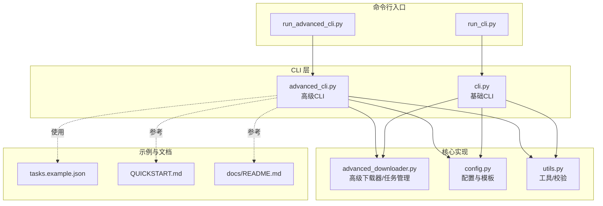
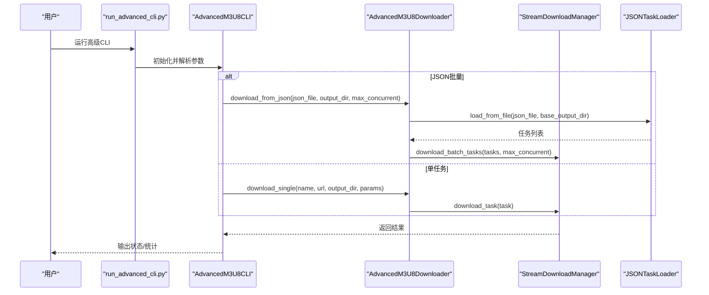
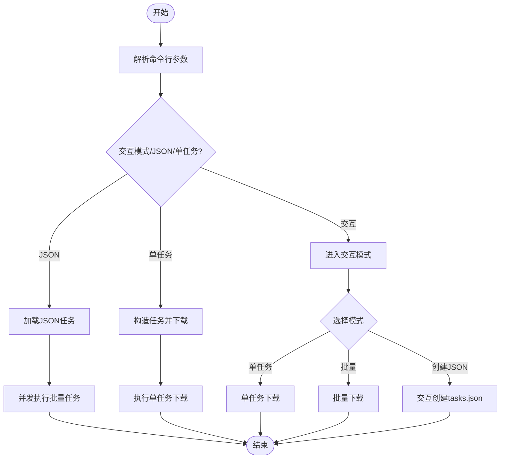
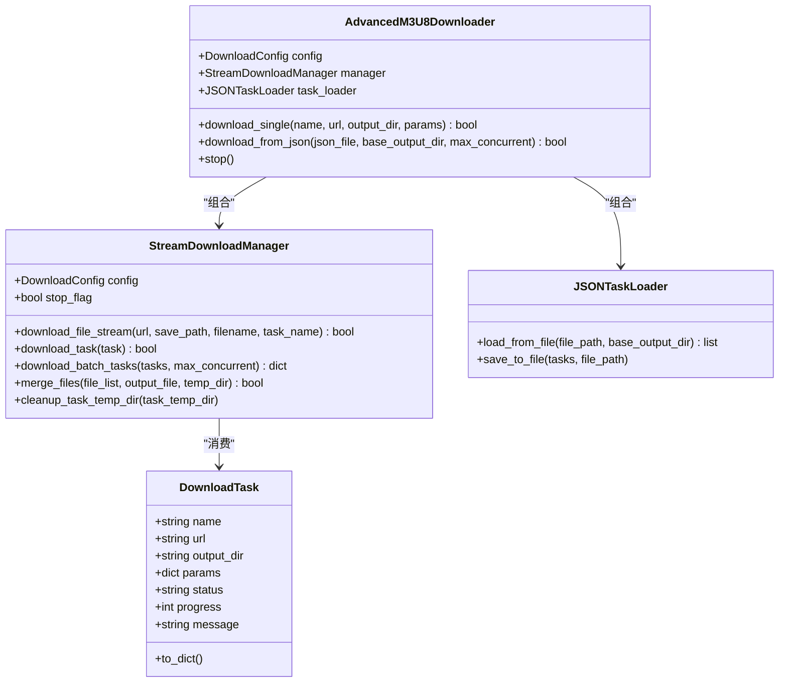
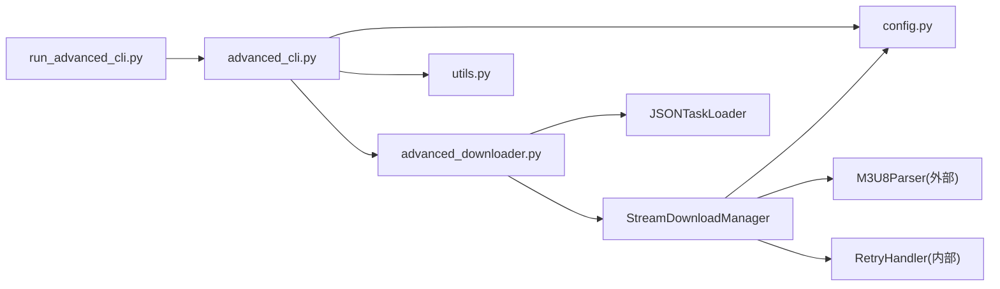

# 高级命令行接口

<cite>
**本文引用的文件**
- [app/downloader/cli/advanced_cli.py](file://app/downloader/cli/advanced_cli.py)
- [app/downloader/run_advanced_cli.py](file://app/downloader/run_advanced_cli.py)
- [app/downloader/cli/cli.py](file://app/downloader/cli/cli.py)
- [app/downloader/run_cli.py](file://app/downloader/run_cli.py)
- [app/downloader/core/advanced_downloader.py](file://app/downloader/core/advanced_downloader.py)
- [app/downloader/core/config.py](file://app/downloader/core/config.py)
- [app/downloader/core/utils.py](file://app/downloader/core/utils.py)
- [app/downloader/examples/tasks.example.json](file://app/downloader/examples/tasks.example.json)
- [app/downloader/QUICKSTART.md](file://app/downloader/QUICKSTART.md)
- [app/downloader/docs/README.md](file://app/downloader/docs/README.md)
- [app/downloader/tests/test_advanced.py](file://app/downloader/tests/test_advanced.py)
- [app/downloader/tests/test_basic.py](file://app/downloader/tests/test_basic.py)
</cite>

## 目录
1. [引言](#引言)
2. [项目结构](#项目结构)
3. [核心组件](#核心组件)
4. [架构总览](#架构总览)
5. [详细组件分析](#详细组件分析)
6. [依赖关系分析](#依赖关系分析)
7. [性能考量](#性能考量)
8. [故障排查指南](#故障排查指南)
9. [结论](#结论)
10. [附录](#附录)

## 引言
本文件聚焦“高级命令行接口”，系统性阐述基于 Python 的 M3U8 下载器的增强 CLI 能力：支持 JSON 配置文件、流式下载、多任务并发管理、交互式创建与执行任务等。文档面向不同技术背景的读者，既提供高层概览，也包含代码级结构与流程图解，帮助快速上手与深入理解。

## 项目结构
- 命令行入口与运行脚本
  - 高级 CLI：app/downloader/cli/advanced_cli.py
  - 高级 CLI 启动脚本：app/downloader/run_advanced_cli.py
  - 基础 CLI：app/downloader/cli/cli.py
  - 基础 CLI 启动脚本：app/downloader/run_cli.py
- 核心实现
  - 高级下载器与任务管理：app/downloader/core/advanced_downloader.py
  - 配置与模板：app/downloader/core/config.py
  - 工具与校验：app/downloader/core/utils.py
- 示例与测试
  - 示例任务 JSON：app/downloader/examples/tasks.example.json
  - 使用指南与快速开始：app/downloader/QUICKSTART.md、app/downloader/docs/README.md
  - 测试用例：app/downloader/tests/test_advanced.py、app/downloader/tests/test_basic.py

图表来源
- [app/downloader/run_advanced_cli.py](file://app/downloader/run_advanced_cli.py#L1-L17)
- [app/downloader/run_cli.py](file://app/downloader/run_cli.py#L1-L25)
- [app/downloader/cli/advanced_cli.py](file://app/downloader/cli/advanced_cli.py#L1-L373)
- [app/downloader/cli/cli.py](file://app/downloader/cli/cli.py#L1-L292)
- [app/downloader/core/advanced_downloader.py](file://app/downloader/core/advanced_downloader.py#L1-L576)
- [app/downloader/core/config.py](file://app/downloader/core/config.py#L1-L114)
- [app/downloader/core/utils.py](file://app/downloader/core/utils.py#L1-L290)
- [app/downloader/examples/tasks.example.json](file://app/downloader/examples/tasks.example.json#L1-L32)
- [app/downloader/QUICKSTART.md](file://app/downloader/QUICKSTART.md#L1-L290)
- [app/downloader/docs/README.md](file://app/downloader/docs/README.md#L1-L459)

章节来源
- [app/downloader/cli/advanced_cli.py](file://app/downloader/cli/advanced_cli.py#L1-L373)
- [app/downloader/run_advanced_cli.py](file://app/downloader/run_advanced_cli.py#L1-L17)
- [app/downloader/cli/cli.py](file://app/downloader/cli/cli.py#L1-L292)
- [app/downloader/run_cli.py](file://app/downloader/run_cli.py#L1-L25)

## 核心组件
- 高级 CLI（AdvancedM3U8CLI）
  - 负责解析命令行参数、创建配置、交互模式、单任务与批量任务执行。
  - 关键方法：parse_arguments、create_config_from_args、interactive_mode、run。
- 高级下载器（AdvancedM3U8Downloader）
  - 组合配置、任务加载器与流式下载管理器，提供单任务与 JSON 批量下载能力。
  - 关键方法：download_single、download_from_json。
- 流式下载管理器（StreamDownloadManager）
  - 对每个任务内的 TS 片段进行逐个流式下载与合并，支持并发任务数控制、重试、日志与信号处理。
- 配置与模板（DownloadConfig、ConfigTemplates）
  - 提供默认配置与快速/稳定/低带宽三套模板；支持动态覆盖参数。
- 工具与校验（utils）
  - URL 标准化与校验、交互确认、进度格式化、横幅打印等。

章节来源
- [app/downloader/cli/advanced_cli.py](file://app/downloader/cli/advanced_cli.py#L1-L373)
- [app/downloader/core/advanced_downloader.py](file://app/downloader/core/advanced_downloader.py#L1-L576)
- [app/downloader/core/config.py](file://app/downloader/core/config.py#L1-L114)
- [app/downloader/core/utils.py](file://app/downloader/core/utils.py#L1-L290)

## 架构总览
高级 CLI 通过参数解析与配置模板生成 DownloadConfig，随后实例化 AdvancedM3U8Downloader。若为 JSON 模式，则加载 tasks.json 为 DownloadTask 列表，交由 StreamDownloadManager 控制并发执行；若为单任务模式，则直接下载单个 M3U8 URL。

图表来源
- [app/downloader/run_advanced_cli.py](file://app/downloader/run_advanced_cli.py#L1-L17)
- [app/downloader/cli/advanced_cli.py](file://app/downloader/cli/advanced_cli.py#L310-L373)
- [app/downloader/core/advanced_downloader.py](file://app/downloader/core/advanced_downloader.py#L522-L576)

## 详细组件分析

### 高级CLI：参数解析与交互流程
- 参数解析
  - 支持 URL、输出文件、线程数、JSON 配置、输出目录、最大并发、配置模板、重试/超时、SSL/进度/日志开关、交互模式等。
- 配置创建
  - 优先选择配置模板（fast/stable/low_bandwidth），再按命令行参数覆盖。
- 交互模式
  - 支持单任务下载、JSON 批量下载、交互式创建 tasks.json。
- 运行流程
  - 若无 URL 且非交互模式，进入交互模式；否则根据参数决定单任务或 JSON 批量。

图表来源
- [app/downloader/cli/advanced_cli.py](file://app/downloader/cli/advanced_cli.py#L22-L127)
- [app/downloader/cli/advanced_cli.py](file://app/downloader/cli/advanced_cli.py#L128-L225)
- [app/downloader/cli/advanced_cli.py](file://app/downloader/cli/advanced_cli.py#L226-L289)
- [app/downloader/cli/advanced_cli.py](file://app/downloader/cli/advanced_cli.py#L310-L373)

章节来源
- [app/downloader/cli/advanced_cli.py](file://app/downloader/cli/advanced_cli.py#L22-L127)
- [app/downloader/cli/advanced_cli.py](file://app/downloader/cli/advanced_cli.py#L128-L225)
- [app/downloader/cli/advanced_cli.py](file://app/downloader/cli/advanced_cli.py#L226-L289)
- [app/downloader/cli/advanced_cli.py](file://app/downloader/cli/advanced_cli.py#L310-L373)

### 高级下载器：任务模型与流式下载
- 任务模型（DownloadTask）
  - 字段：name、url、output_dir、params、status、progress、message。
  - 提供 to_dict 序列化。
- 流式下载管理器（StreamDownloadManager）
  - 逐个下载 TS 片段，实时显示百分比与字节进度；失败自动重试（指数退避）；支持 Ctrl+C 等信号中断。
  - 合并阶段按文件名排序写入，边读边写，降低内存占用。
  - 支持批量任务并发（ThreadPoolExecutor），限制最大并发数。
- JSON 任务加载器（JSONTaskLoader）
  - 从 JSON 文件加载任务列表，支持相对输出目录解析与绝对化。
- 高级下载器（AdvancedM3U8Downloader）
  - 组合上述组件，提供 download_single 与 download_from_json。

图表来源
- [app/downloader/core/advanced_downloader.py](file://app/downloader/core/advanced_downloader.py#L23-L46)
- [app/downloader/core/advanced_downloader.py](file://app/downloader/core/advanced_downloader.py#L47-L282)
- [app/downloader/core/advanced_downloader.py](file://app/downloader/core/advanced_downloader.py#L283-L336)
- [app/downloader/core/advanced_downloader.py](file://app/downloader/core/advanced_downloader.py#L423-L489)
- [app/downloader/core/advanced_downloader.py](file://app/downloader/core/advanced_downloader.py#L514-L576)

章节来源
- [app/downloader/core/advanced_downloader.py](file://app/downloader/core/advanced_downloader.py#L23-L46)
- [app/downloader/core/advanced_downloader.py](file://app/downloader/core/advanced_downloader.py#L47-L282)
- [app/downloader/core/advanced_downloader.py](file://app/downloader/core/advanced_downloader.py#L283-L336)
- [app/downloader/core/advanced_downloader.py](file://app/downloader/core/advanced_downloader.py#L423-L489)
- [app/downloader/core/advanced_downloader.py](file://app/downloader/core/advanced_downloader.py#L514-L576)

### 配置与模板：参数覆盖与默认行为
- DownloadConfig
  - 默认线程数为 CPU 核心数乘以 2；自动创建 temp 与 output 目录；支持覆盖 headers、超时、缓冲区大小、SSL 验证、进度与日志开关。
- ConfigTemplates
  - fast：高并发、较短超时与较低重试延迟；
  - stable：平衡配置；
  - low_bandwidth：低并发与较大块大小，适合弱网。
- CLI 参数覆盖
  - 高级 CLI 与基础 CLI 均支持通过命令行覆盖配置项（线程数、重试、超时、SSL、进度、日志等）。

章节来源
- [app/downloader/core/config.py](file://app/downloader/core/config.py#L1-L114)
- [app/downloader/cli/advanced_cli.py](file://app/downloader/cli/advanced_cli.py#L73-L104)
- [app/downloader/cli/cli.py](file://app/downloader/cli/cli.py#L69-L114)

### 工具与校验：URL/交互/进度
- URLProcessor：标准化 URL、提取域名、追加查询参数。
- FileValidator：URL 格式校验、M3U8 内容格式校验、磁盘空间检查。
- utils：进度跟踪、缓存管理、统计、格式化、横幅打印、确认与安全输入。

章节来源
- [app/downloader/core/utils.py](file://app/downloader/core/utils.py#L1-L290)

### JSON 配置与示例
- tasks.json 结构
  - name、url、output_dir、params（如 quality、language 等）。
- 示例文件
  - app/downloader/examples/tasks.example.json 展示了多任务配置与参数字段。

章节来源
- [app/downloader/examples/tasks.example.json](file://app/downloader/examples/tasks.example.json#L1-L32)
- [app/downloader/core/advanced_downloader.py](file://app/downloader/core/advanced_downloader.py#L423-L489)

### 命令行使用与运行方式
- 正确运行方式
  - 由于模块导入机制限制，需从 app 目录以完整模块路径运行，或使用便捷启动脚本。
- 常用命令
  - 单任务流式下载、JSON 批量下载、指定并发数、使用配置模板、交互模式等。

章节来源
- [app/downloader/QUICKSTART.md](file://app/downloader/QUICKSTART.md#L19-L128)
- [app/downloader/docs/README.md](file://app/downloader/docs/README.md#L308-L365)

## 依赖关系分析
- 模块耦合
  - advanced_cli 依赖 advanced_downloader、config、utils；run_advanced_cli 仅负责路径修正与入口调用。
  - advanced_downloader 内部组合 config、parser（未在本节展开）、utils（未在本节展开）。
- 外部依赖
  - requests、tqdm、argparse、multiprocessing、signal、logging 等。
- 并发与控制
  - ThreadPoolExecutor 控制任务并发；每个任务内部 TS 片段串行下载，避免过多并发导致资源争用。

图表来源
- [app/downloader/cli/advanced_cli.py](file://app/downloader/cli/advanced_cli.py#L1-L373)
- [app/downloader/core/advanced_downloader.py](file://app/downloader/core/advanced_downloader.py#L1-L576)
- [app/downloader/core/config.py](file://app/downloader/core/config.py#L1-L114)
- [app/downloader/core/utils.py](file://app/downloader/core/utils.py#L1-L290)
- [app/downloader/run_advanced_cli.py](file://app/downloader/run_advanced_cli.py#L1-L17)

章节来源
- [app/downloader/cli/advanced_cli.py](file://app/downloader/cli/advanced_cli.py#L1-L373)
- [app/downloader/core/advanced_downloader.py](file://app/downloader/core/advanced_downloader.py#L1-L576)

## 性能考量
- 流式下载与串行片段
  - 每个任务内部 TS 片段逐个下载，避免同时启动过多线程，降低内存峰值与网络拥塞风险。
- 并发控制
  - 任务级并发通过 ThreadPoolExecutor 控制；每个任务内部仍保持串行，兼顾稳定性与吞吐。
- 缓冲与块大小
  - 可通过配置调整 chunk_size 与 buffer_size，平衡内存占用与 I/O 效率。
- 模板选择
  - 快速模式适合高带宽环境；低带宽模式适合弱网；稳定模式为通用推荐。

章节来源
- [app/downloader/core/advanced_downloader.py](file://app/downloader/core/advanced_downloader.py#L96-L169)
- [app/downloader/core/advanced_downloader.py](file://app/downloader/core/advanced_downloader.py#L170-L276)
- [app/downloader/core/advanced_downloader.py](file://app/downloader/core/advanced_downloader.py#L283-L336)
- [app/downloader/core/config.py](file://app/downloader/core/config.py#L1-L114)

## 故障排查指南
- 常见问题
  - 无法在 downloader 目录直接运行模块：需从 app 目录使用完整模块路径，或使用便捷脚本。
  - ModuleNotFoundError: 相关导入超出包边界。
  - 下载失败：启用日志查看 download.log；检查网络与 SSL 配置；必要时禁用 SSL 校验。
  - 下载中断：支持 Ctrl+C 中断，下次运行可断点续传。
- 建议步骤
  - 使用 --dry-run（基础 CLI）或交互模式确认参数与 URL。
  - 使用 --profile 稳定模式作为默认尝试，再根据网络情况调整。
  - 批量下载时合理设置 --max-concurrent，避免资源耗尽。

章节来源
- [app/downloader/QUICKSTART.md](file://app/downloader/QUICKSTART.md#L225-L290)
- [app/downloader/docs/README.md](file://app/downloader/docs/README.md#L430-L459)
- [app/downloader/cli/cli.py](file://app/downloader/cli/cli.py#L240-L292)
- [app/downloader/core/advanced_downloader.py](file://app/downloader/core/advanced_downloader.py#L90-L118)

## 结论
高级命令行接口在基础 CLI 的基础上，新增了 JSON 配置、流式下载、实时进度与可控并发等能力，显著提升了批量下载与复杂场景下的可用性与稳定性。通过清晰的模块划分与合理的并发策略，既能满足高性能需求，又兼顾了易用性与可维护性。

## 附录
- 使用示例与命令参考
  - 参考 QUICKSTART.md 与 docs/README.md 中的命令示例与参数说明。
- 编程接口参考
  - AdvancedM3U8Downloader.download_single 与 download_from_json 的使用方式。
- 测试参考
  - test_advanced.py 与 test_basic.py 展示了模块导入、配置、解析、CLI 行为与集成测试要点。

章节来源
- [app/downloader/QUICKSTART.md](file://app/downloader/QUICKSTART.md#L1-L290)
- [app/downloader/docs/README.md](file://app/downloader/docs/README.md#L1-L459)
- [app/downloader/tests/test_advanced.py](file://app/downloader/tests/test_advanced.py#L1-L262)
- [app/downloader/tests/test_basic.py](file://app/downloader/tests/test_basic.py#L1-L260)